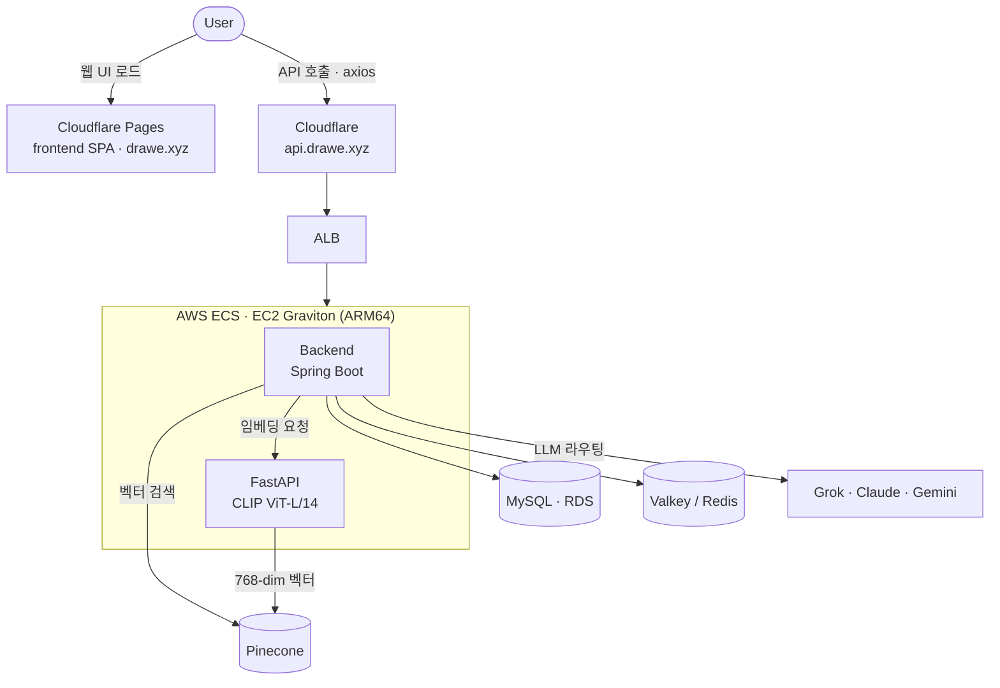
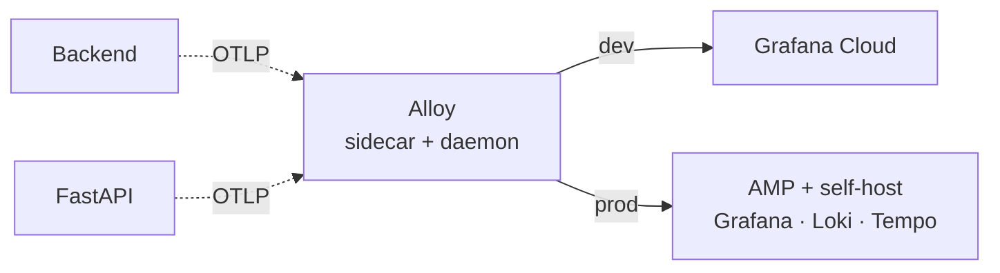

# Drawe

> **AI 기반 레퍼런스 추천 서비스** — 그리고 그 서비스를 구성하는 네 개의 축(backend · fastapi · frontend · infra)을 담은 모노레포.

Drawe 는 사용자의 텍스트/이미지를 **CLIP 임베딩**으로 벡터화하고, **Pinecone** 벡터 검색으로 유사한 레퍼런스를 찾아 추천합니다. 여기에 **LLM**(Grok · Claude · Gemini) 기반 대화/생성 기능이 결합되어, 프로젝트 단위로 레퍼런스를 모으고 태깅·피드백하며 발전시킬 수 있습니다.

이 레포는 원래 `drawe-backend` · `drawe-fastapi` · `drawe-frontend` · `drawe-deploy` 네 개의 폴리레포로 흩어져 있던 것을, **git subtree 로 커밋 히스토리·기여자 그래프를 보존한 채** 하나로 합친 모노레포입니다.

> **상태**: 활발히 개발 중인 팀 프로젝트입니다.
> 인프라·배포·관측성 구성은 운영 경험과 요구사항 변화에 따라 지속적으로 개선되고 있습니다. 자세한 내용은 [`infra/README.md`](infra/README.md) 참고.

---

## 🚀 Quick Start

```bash
# 0. 클론
git clone https://github.com/DraWeTeam/drawe.git
cd drawe

# 1. 백엔드 스택(MySQL · Valkey · backend · fastapi) 기동
cd infra
docker compose -f docker-compose.local.yml up -d

# 2. 프론트엔드 개발 서버
cd ../frontend
npm install && npm run dev      # http://localhost:5173
```

각 서비스 환경변수(LLM·OAuth·Pinecone 키 등)는 해당 디렉터리의 `.env.example` 을 참고하세요. 상세 포트·구성은 아래 [로컬 개발](#-로컬-개발) 참고.

---

## 🗺 한눈에 보기



| 서비스 | 역할 | 핵심 스택 | 배포 |
| --- | --- | --- | --- |
| **frontend** | 사용자 웹 UI (SPA) | React 19 · Vite 8 · React Router 7 · axios | Cloudflare Pages |
| **backend** | 핵심 API · 인증 · LLM 라우팅 · 도메인 로직 | Spring Boot 3.2.4 · Java 17 · JPA · MySQL · Valkey | AWS ECS (EC2, ARM64) |
| **fastapi** | CLIP 임베딩 서버 (텍스트/이미지 → 벡터) | FastAPI · uvicorn · PyTorch · transformers | AWS ECS (EC2, ARM64) |
| **infra** | IaC · 배포 · 관측성 구성 | Terraform · ECS · ALB · RDS · Cloudflare | — |

---

## 📦 레포 구조

```text
drawe/
├── .github/workflows/        # 모노레포 CI/CD (경로 필터 기반)
│   ├── backend-cd.yml         #   backend/** 변경 → 빌드·ECR·ECS 배포
│   ├── backend-ci.yml
│   ├── fastapi-cd.yml         #   fastapi/** 변경 → 배포
│   ├── fastapi-ci.yml
│   └── frontend-ci.yml
├── backend/                  # Spring Boot API 서버
│   └── src/main/java/com/drawe/backend/
│       ├── domain/            # auth · image · project · llm · feedback · search · analytics · onboarding · log
│       └── global/            # 공통 설정·예외·필터 등 cross-cutting
├── fastapi/                  # CLIP 임베딩 서버
├── frontend/                 # React + Vite SPA
└── infra/                    # Terraform (dev/prod) + 관측성 config + 로컬 compose
    ├── terraform-dev/
    ├── terraform-prod/
    ├── configs/               # Alloy · Grafana · Loki · Tempo
    ├── scripts/
    └── docker-compose.local.yml
```

> **모노레포 원칙**
> - `.git` 은 **루트에 하나**만 존재합니다. 서비스별 별도 `.git` 은 없습니다.
> - 버전 관리 단위는 레포 전체(= push 는 루트에서 한 번), **배포 단위는 워크플로의 경로 필터(`paths`)** 로 분리됩니다.
> - 따라서 `frontend/` 만 바꾼 커밋은 backend/fastapi 배포를 발동시키지 않습니다.

---

## 🧱 기술 스택 상세

### Backend (`backend/`)
- **Spring Boot 3.2.4 / Java 17 (Gradle toolchain)**
- Web + WebFlux(FastAPI·Pinecone 호출용 `WebClient`) · Spring Data JPA · Validation
- **Spring Security + OAuth2 Client** (Google 로그인) · **JWT**(jjwt 0.12.6, RefreshToken)
- **MySQL**(JPA) · **Valkey/Redis**(세션·캐시) · **Flyway**(스키마 마이그레이션)
- **springdoc-openapi**(Swagger UI) · **Actuator + Micrometer(Prometheus)**
- 주요 도메인: `User` · `Project` · `Image`/`ImageBlob` · `ImageDraweTag` · `ImageFeedback` · `ChatSession`/`LlmMessage` · `AnalyticsEvent` · `UserPrefTag`

### FastAPI (`fastapi/`)
- **CLIP `openai/clip-vit-large-patch14`** — 텍스트/이미지를 **768차원 벡터**로 변환
- FastAPI + uvicorn · PyTorch + transformers
- 엔드포인트: `POST /embed/text` · `POST /embed/image` · `POST /batch/load`(1,000개 단위 일괄 적재)
- 결과 벡터는 Pinecone 에 저장/검색. 호출자는 backend.

### Frontend (`frontend/`)
- **React 19 · Vite 8 · React Router 7 · axios**
- ESLint + Prettier
- `build:cf` 스크립트가 브랜치별 API 엔드포인트를 자동 선택:
  - `main` 브랜치 → `https://api.drawe.xyz` (prod)
  - 그 외 → `https://api-dev.drawe.xyz` (dev)

---

## 🛠 로컬 개발

전체 백엔드 스택(MySQL · Valkey · backend · fastapi)을 docker-compose 로 띄웁니다.

```bash
cd infra
docker compose -f docker-compose.local.yml up -d
```

| 포트 | 서비스 |
| --- | --- |
| 3306 | MySQL |
| 6379 | Valkey |
| 8080 | Backend (Spring Boot) |
| 8000 | FastAPI |
| 5173 | Frontend (`npm run dev` 로 별도 실행) |

프론트엔드는 별도로:

```bash
cd frontend
npm install
npm run dev        # http://localhost:5173
```

> 환경변수(LLM·OAuth·Pinecone 키 등)는 각 서비스의 `.env.example` 을 참고해 채워주세요.

---

## ⚙️ CI/CD

GitHub Actions 가 **경로 필터 + working-directory** 로 모노레포에 맞춰 배선되어 있습니다.

| 워크플로 | 트리거 경로 | 동작 |
| --- | --- | --- |
| `backend-cd` | `backend/**` | JAR 빌드 → Docker(ARM64) → ECR push → ECS 새 TD 등록·업데이트 (Circuit Breaker 자동 롤백) |
| `fastapi-cd` | `fastapi/**` | 이미지 빌드 → ECR push → ECS 업데이트 |
| `*-ci` | 각 서비스 | 빌드/검증 (PR 기준) |

- **브랜치 → 환경 매핑**: `develop` push → **dev** 자동 배포, `main` push → **prod** 배포(GitHub Environment Required reviewers 통과 후)
- **인증**: AWS 자격증명을 저장하지 않고 **GitHub OIDC** 로 역할을 assume (`id-token: write`)
- **수동 실행**: `workflow_dispatch` 로 environment(dev/prod) 명시 선택 가능. 단 prod 는 OIDC trust 가 `refs/heads/main` 만 허용
- **프론트엔드 배포**: 별도 GitHub Actions CD 가 없습니다. **Cloudflare Pages 가 레포 push 를 감지해 `frontend` 를 빌드/배포**합니다(Root dir `frontend`, `npm run build:cf` → `dist`). `frontend-ci` 는 빌드/린트 검증만 담당.

---

## 🌐 환경 (dev / prod)

dev 와 prod 는 **별도 AWS 계정**으로 운영되며, 구조는 동일하고 관측성 destination 등 일부만 다릅니다.

| 항목 | dev | prod |
| --- | --- | --- |
| AWS 계정 | 분리 운영 | 분리 운영 |
| 운영 시간 | 평일 13:00–18:00 KST (EventBridge on/off) | 24/7 |
| NAT | NAT instance (`t4g.micro`) | fck-nat Multi-AZ (ASG) |
| Redis | EC2 Valkey | ElastiCache |
| 관측성 | Grafana Cloud | AMP + self-host (Grafana/Loki/Tempo) |
| 컴퓨트 | ECS EC2 · Graviton (`t4g.*`, ARM64) | 동일 |

- 컨테이너 이미지는 **ARM64** 빌드 필요 (`docker buildx --platform linux/arm64`)
- 시크릿은 **AWS SSM Parameter Store(SecureString)** 로 관리
- 트래픽: `User → Cloudflare → ALB → ECS(backend / fastapi)`
- 자세한 Terraform 실행법은 [`infra/README.md`](infra/README.md) 참고

---

## 📡 관측성 (Observability)

OpenTelemetry 기반으로 trace · log · metric 을 수집하는 트랙입니다. **Alloy**(daemon + sidecar)가 앱의 OTLP(4317/4318)를 받아 환경별 destination 으로 전달합니다.



**현재 상태**

**✅ 완료 — 수집·라우팅·보안 설계**
- Alloy 수집 파이프라인 (daemon + sidecar 구조, OTLP 수신)
- 환경별 destination 분리 (dev → Grafana Cloud / prod → AMP + self-host)
- 외부 전송 전 **PII redaction** 규칙 (이메일·토큰·LLM 프롬프트 본문 등 삭제/해싱)
- prod self-host config (Tempo / Loki / Grafana datasource)

**🚧 진행 중 — 앱 계측**
- 앱 분산 추적 계측 (Micrometer Tracing bridge-otel + OTLP exporter)
- 로컬 관측성 스택(self-host) 배선

**📋 계획 — 대시보드·알람**
- RED 대시보드 (Rate · Errors · Duration)
- CloudWatch P0 알람 + SNS→Slack 배선
- admin 대시보드 ↔ Grafana/Loki 딥링크(session_id/trace_id)

> 즉 **수집 파이프라인과 라우팅·보안(PII) 설계는 완료**, **앱 계측과 대시보드·알람은 정비 중**인 단계입니다.

---

## 🌿 브랜치 / 기여

- 기본 개발 브랜치는 `develop`, 배포 기준 브랜치는 `main` 입니다.
- 모노레포 전환 이후 **모든 작업은 `DraWeTeam/drawe` 한 곳**에서 진행합니다(옛 폴리레포는 아카이브 대상).
- 변경은 해당 서비스 디렉터리(`backend/`, `fastapi/`, `frontend/`, `infra/`) 안에서 이루어지며, 커밋·push 는 레포 루트에서 합니다.

> **마이그레이션 상태**: 모노레포 통합·CI/CD 재배선·dev 배포 검증은 완료. 프론트 도메인(`drawe.xyz`) 및 prod 컷오버는 베타 종료 시점에 진행 예정입니다.

---

## 📚 관련 문서

- [`backend/README.md`](backend/README.md)
- [`fastapi/README.md`](fastapi/README.md)
- [`frontend/README.md`](frontend/README.md)
- [`infra/README.md`](infra/README.md) — Terraform·환경·배포 상세