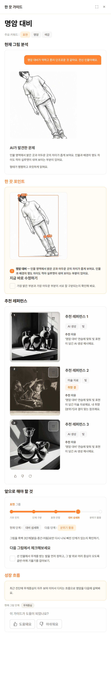
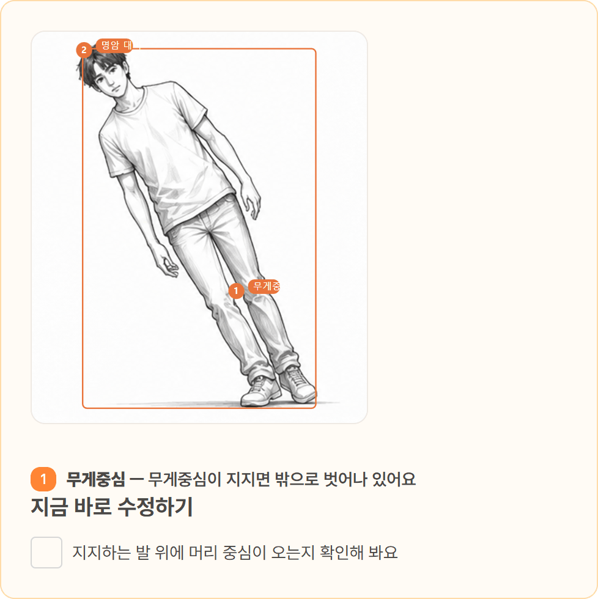
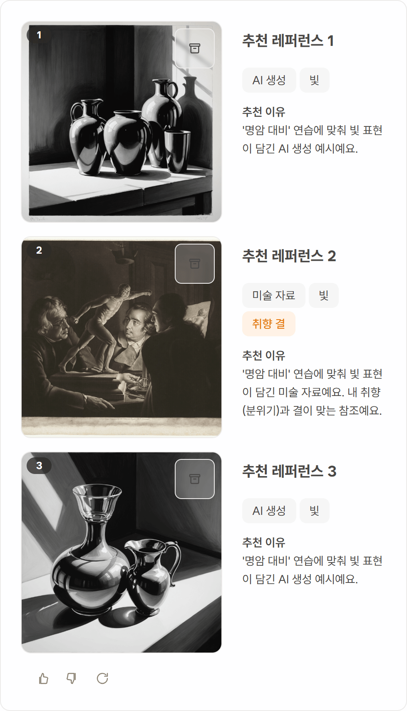
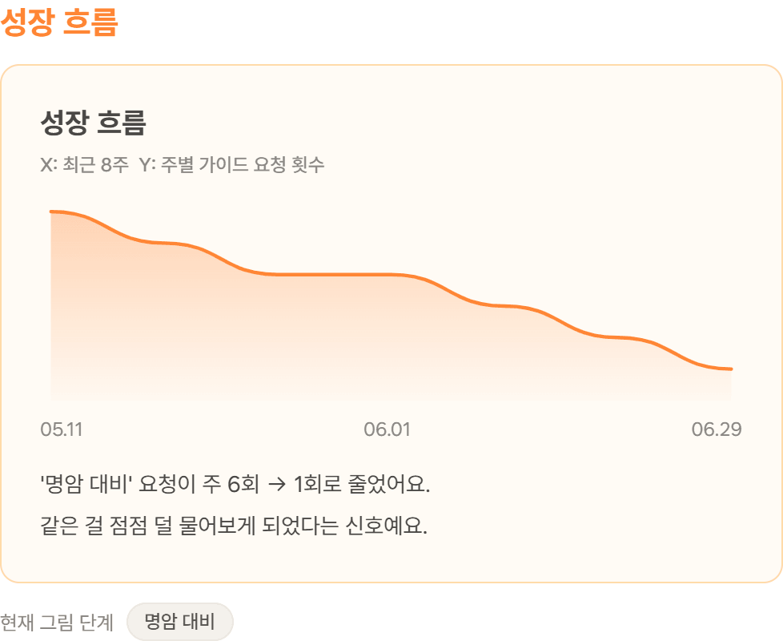
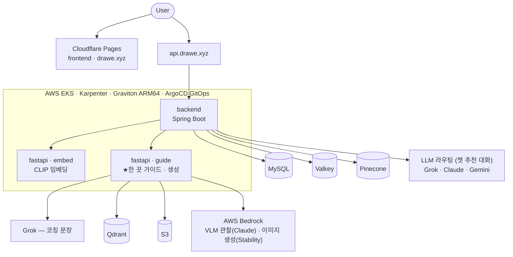

# Drawe

> **그림 레퍼런스 검색 & AI 드로잉 피드백 — 취미 일러스트레이터의 연습 파트너.**
> 그림에만 집중할 수 있도록, 막힘을 함께 풀어드립니다.
> 차별점은 **한 끗 가이드** — 말이 아니라 내 그림 위에서, 근거와 함께 짚어주는 코칭.

## 🎥 Demo

| 한 끗 가이드 | 그림 위 개선 포인트 | 추천 이유·태그 | 성장 기록 |
| --- | --- | --- | --- |
|  |  |  |  |

## 🎯 그림을 그리면서 이런 적 있으신가요?

- **"인체·포즈가 안 잡혀서 한참 헤맸어요."** — 원하는 자세는 머릿속에 있는데,
  어디를 참고해서 어떻게 그려야 할지 모르겠어요.
- **"원하는 분위기의 레퍼런스를 찾기 어려웠어요."** — 수십 장을 검색해도
  내가 그리고 싶은 느낌은 찾기 힘들어요.
- **"막혔을 때 누구에게 물어볼지 모르겠어요."** — 혼자 그리다 보면 어디가
  문제인지조차 알기 어려워요. 강의는 일반론이고 커뮤니티 피드백은 느립니다.

Drawe는 이 단절들을 하나의 여정으로 잇습니다. **한 끗 가이드**가 막힘을 풉니다 —
올린 그림에서 *관찰 가능한 시각 신호*를 추출해, "지금 한 끗을 바꾸면 좋아지는
지점"을 그림 위에서 근거와 함께 짚어줍니다. 레퍼런스 검색·추천·생성이 탐색을
받쳐줍니다 — 나열이 아니라, 그 연습에 맞는 이유와 함께.

## ⭐ 핵심 특징

- **내 그림 위에 ①② 개선 포인트** — 포즈 키포인트 좌표 기반 오버레이로, 말이
  아니라 그림 위에서 짚어줍니다.
- **도와'만' 드립니다** — 대신 그려주지 않습니다. 관찰하지 못한 것은 말하지
  않고(환각 방지 게이트), 실력 점수 평가도 하지 않습니다. 창작의 주인은 언제나
  사용자 — AI는 배움을 돕는 조력자입니다.
- **설명 가능한 추천** — 추천 이유는 LLM의 사후 생성이 아니라 **실제 검색 선정
  근거의 결정론적 조립**. 취향과 결이 맞는 참조에는 그 사실도 함께 표시합니다.
  마음에 안 들면 🔄 — 같은 근거로, 이미 본 것만 제외하고 다시 탐색합니다.
- **측정으로 결정하는 팀** — 모델 전환·기능 반영을 골든셋과 페어드 비교로 검증한
  뒤 적용합니다.
- **성장이 남는 서비스** — 반복 질문이 줄어드는 변화(예: '명암 대비' 요청
  주 6회 → 1회)가 화면에 기록됩니다. 한 그림을 완성하는 도구가 아니라, 그림
  실력의 성장 여정을 함께합니다.

## 🛠 Tech Stack

| 영역 | 기술 |
| --- | --- |
| Backend | Spring Boot · FastAPI |
| AI | CLIP 임베딩 · VLM 관찰(AWS Bedrock Claude) · 이미지 생성(AWS Bedrock Stability) · LLM 코칭(Grok) · Vector Search(Qdrant—가이드 / Pinecone—보드 검색) |
| Frontend | React(Vite) · Cloudflare Pages |
| Infra | AWS EKS(Karpenter·Graviton) · Terraform · ArgoCD GitOps · OpenTelemetry |

## 한 끗 가이드 — 차별점

그림 업로드 + "손가락 비율이 어색해요" 같은 요청 → 아래 구성의 가이드가 생성됩니다.

```text
┌ 한 끗 가이드 ──────────────────────────────────────────────┐
│ 현재 그림 분석    사용자 질문 + 업로드 그림 + AI가 발견한 문제   │
│ 한 끗 포인트      ★내 그림 위에 ①② 번호 마커로 개선 지점 표시   │
│ 지금 바로 수정    당장 실행할 수 있는 체크리스트                │
│ 추천 레퍼런스     참고 3컷 + ★추천 이유 + 태그 뱃지            │
│                  "'손 구조' 연습을 위해 고른 3D 참조예요"      │
│ 앞으로 해야 할 것  5단계 커리큘럼 프로그레스 바(현재/다음 단계)   │
│ 성장 흐름         주별 가이드 요청 추이 — "주 6회 → 1회"        │
└──────────────────────────────────────────────────────────┘
```

**동작 원리 — 코칭 에이전트** — 한 끗 가이드는 단일 프롬프트 호출이 아니라,
[관찰(포즈 키포인트 + VLM) → 관찰 근거 진단 → 개선 우선순위 결정 → 그 연습에
맞는 레퍼런스 검색 → 코칭 제시]를 수행하는 코칭 에이전트 파이프라인입니다. 역할은
분리되어 있습니다 — VLM은 관찰하고, 어떤 지점을 짚을지는 관찰 신호 기반의
결정 로직이 정하고, LLM은 표현합니다. 그래서 동일한 관찰 신호에는 추적 가능한
동일 기준의 근거가 적용됩니다. 사용자의 반응도 루프에 들어옵니다: 추천이 안
맞으면 🔄로 노출분을 제외하고 재탐색하고, 후보가 소진되면 생성으로 전환합니다.
무드·스타일 취향은 진단을 바꾸지 않고, 같은 연습 목적의 후보 중 결이 맞는 것을
우선하는 방식으로 추천을 개인화합니다. 커리큘럼(4그룹×5단계)에서의 위치를
안내하고, 프로젝트 완료 후에는 완성작 갤러리에서 성장 과정을 확인할 수 있습니다.

```text
[여정]  아이디어 → 레퍼런스로 무드 구체화 → 스케치 → 막히면 한 끗 가이드 → 연습 → 완료 → 성장 확인
```

## 레퍼런스 탐색·생성

- **보드 레퍼런스 검색** — 키워드·의도 기반 CLIP 의미 검색으로 원하는 포즈·
  구도·분위기의 레퍼런스를 탐색. 좋아요/싫어요가 다음 검색에 반영됩니다.
- **가이드 추천 레퍼런스** — 진단이 정한 연습 목적으로 고르고, 온보딩 무드
  취향을 랭킹에 반영(연습 목적 적합성이 항상 우선). 추천이 안 맞으면 🔄 재추천
  (같은 근거, 노출분 제외 재탐색). 후보가 소진되면 AI 생성으로 전환하고, 품질
  검수를 통과한 생성물은 코퍼스에 편입됩니다.
- **레퍼런스 즉석 생성** — 원하는 자료가 없으면 프롬프트로 생성(AWS Bedrock).
- **아카이브** — 추천 레퍼런스 담기 · 보드 저장 · 완성작 갤러리.

## 품질과 성능 — 측정으로 결정한다

- **골든셋 검증** — 관찰·진단은 손/인물/얼굴/엣지 골든셋으로 축별 정확도·환각
  방지 게이트를 회귀 검증. 프롬프트를 건드리는 변경은 재평가를 짝으로.
- **모델 전환도 측정으로** — 이미지 생성·VLM 관찰 모두 **AWS Bedrock 전환·운영
  중**. VLM은 골든셋 35장·111콜을 동일 코드에서 백엔드만 바꿔 페어드 비교 —
  정확도 동급 · 레이턴시 2.8× 개선 · 실패 0 확인 후 적용(운영 ~2초/콜, 롤백
  env 한 줄).
- **운영 지표** — 추천 채택률 · 저장률 · 피드백 · 레이턴시(OpenTelemetry)로
  기술 성과와 사용자 가치를 연결.

## 구성



| 폴더 | 역할 | 배포 | 기술 상세 |
| --- | --- | --- | --- |
| **fastapi** | ★한 끗 가이드 파이프라인(관찰·진단·코칭·생성) + CLIP 임베딩 | AWS EKS | [↗](fastapi/README.md) |
| **backend** | 핵심 API · 인증 · LLM 라우팅 · 추천 · 갤러리 집계 | AWS EKS | [↗](backend/README.md) |
| **frontend** | 웹 UI — 작업 공간 · 가이드 상세 · 아카이브 · 완성작 | Cloudflare Pages | [↗](frontend/README.md) |
| **infra** | Terraform IaC · ArgoCD GitOps · 관측성 · 런북 | — | [↗](infra/README.md) |

> AI 파이프라인·품질 검증·모델 전환·EKS 운영의 깊은 내용은 **각 폴더 README**에.
> 아키텍처 전반은 [`docs/SDS/`](docs/SDS/README.md).

## 실행 방법

```bash
git clone https://github.com/DraWeTeam/drawe.git && cd drawe
cd infra && docker compose -f docker-compose.local.yml up -d   # MySQL·Valkey·backend·fastapi·guide
cd ../frontend && cp .env.example .env && npm install && npm run dev   # http://localhost:5173
```

| 포트 | 3306 MySQL · 6379 Valkey · 8080 backend · 8000 embed · 8001 guide · 5173 frontend |
| --- | --- |

> 환경변수는 각 서비스 `.env.example` 참고. AI provider는 배포 env로 분기
> (prod=Bedrock), 시드 데이터는 [`infra/README.md`](infra/README.md) 런북 참고.

## 협업 프로세스

Jira(SCRUM)↔GitHub 이슈 단위 브랜치·PR 리뷰·릴리스 PR. **Figma 와이어프레임+
annotation을 단일 정본**으로 한 화면 개발([스펙 수집본](docs/figma-spec-compendium.md)
· [실측 정합 규칙](docs/figma-parity-rules.md)). 진단(실측)→계획→구현→실렌더·
클릭스루의 검증 게이트. 심사 피드백은 Action Item으로 전환해 기능으로 반영합니다
(예: 재추천 🔄, 로딩·실패 UX, 취향 결 표시).

## 관련 문서

- [`docs/SDS/`](docs/SDS/README.md) — 시스템 설계 문서 · [`docs/figma-spec-compendium.md`](docs/figma-spec-compendium.md) — Figma 스펙 수집본
- [`backend/README.md`](backend/README.md) · [`fastapi/README.md`](fastapi/README.md) · [`frontend/README.md`](frontend/README.md) · [`infra/README.md`](infra/README.md)
