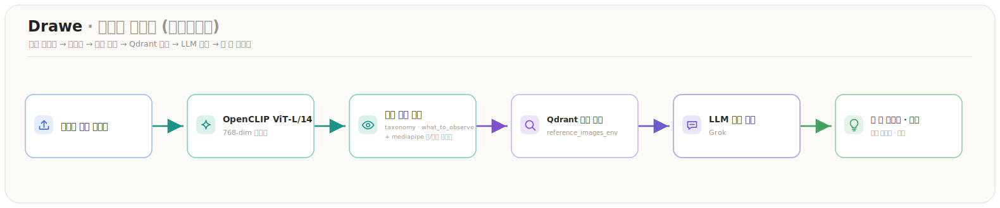
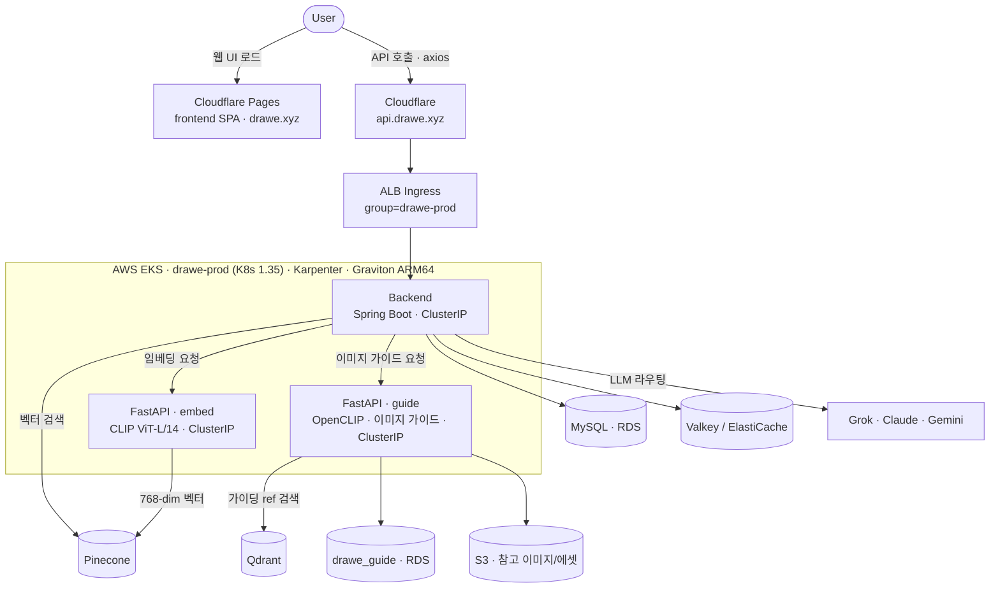

# Drawe

> **AI 기반 드로잉 창작 지원 서비스** — 그리고 그 서비스를 구성하는 네 개의 축(backend · fastapi · frontend · infra)을 담은 모노레포.

---

## 🎯 배경 (왜 만들었나)

드로잉 학습자는 두 지점에서 창작 흐름이 끊깁니다.

1. **레퍼런스 탐색** — 참고 자료를 찾고 정리하느라 그리던 맥락을 놓칩니다.
2. **막힘** — 막상 그리다 막혔을 때 "무엇을 어떻게 고쳐야 하는지" 짚어주는 피드백을 받기 어렵습니다.

Drawe는 **레퍼런스 탐색을 CLIP 기반 검색과 LLM 추천으로 자동화**하고, 한발 더 나아가 사용자가 올린 그림에서
**관찰 가능한 시각 신호**(지평선·시점·명암·무게중심 등)를 바탕으로 개선 포인트를 코칭(이미지 가이드)함으로써,
창작 흐름을 유지하도록 돕는 서비스입니다.

> ⚠️ 이미지 가이드는 **그림의 "실력"을 점수로 평가하지 않습니다.** taxonomy 로 정의된 *관찰 가능한 신호*를 근거로
> "이 축을 이렇게 보면 더 좋아진다"는 **코칭과 연습 과제**를 제시합니다.

## 💡 해결 방식

Drawe 는 자연어 요청을 **의도**에 따라 라우팅하고, 사용자의 텍스트를 **CLIP 임베딩**으로 벡터화해 **Pinecone** 벡터 검색 + **태그 IDF 재정렬**로 의미가 비슷한 레퍼런스를 찾아 추천합니다. 여기에 **LLM**(Grok · Claude · Gemini) 기반 추천·대화를 결합해, 프로젝트 단위로 레퍼런스를 모으고 태깅·피드백하며 발전시킬 수 있습니다.

별도의 **이미지 가이드(한 끗 가이드)** 파이프라인은 그림에서 관찰 가능한 시각 신호를 추출하고, **OpenCLIP** 임베딩으로 **Qdrant** 참고 코퍼스에서 유사 레퍼런스를 찾아, LLM 코칭으로 **개선 포인트·연습 과제·참고 이미지·도식**을 함께 제시합니다.

> 이 레포는 원래 `drawe-backend` · `drawe-fastapi` · `drawe-frontend` · `drawe-deploy` 네 개의 폴리레포였던 것을 하나로 합친 모노레포입니다.

---

## 🔎 AI 레퍼런스 추천 — 어떻게 찾나

> **입력**: "수채화풍 잔잔한 호수 풍경 그려줘" 같은 한국어 채팅 → **출력**: 의도에 맞는 레퍼런스 N컷 + 미술 조언

단순 키워드 매칭이 아니라, 자연어 요청을 **의도**에 따라 라우팅하고 **CLIP 임베딩 + Pinecone 벡터 검색 + 태그 IDF 재정렬**로 의미가 비슷한 레퍼런스를 찾아 LLM이 설명까지 붙여 추천합니다.

### 파이프라인


> 검색이 필요한 의도(NEW_SEARCH)만 검색하고, 이어묻기(KEEP·FOLLOWUP)는 직전 레퍼런스를 재사용합니다. LLM은 태그가 아니라 **실제 이미지 내용 캡션(ai_description)** 에 근거해 설명해 할루시네이션을 줄입니다.

---

## 🎨 이미지 가이드 — 무엇이 나오나

> **입력**: 사용자가 올린 풍경 스케치 → **출력**: 한 끗 포인트 · 추천 연습 · 참고 이미지 · 도식이 담긴 가이드 카드

### 데모 (실제 화면)

| 한 끗 가이드 | 그림 위 개선 포인트 | 추천 이유·태그 | 성장 기록 |
| --- | --- | --- | --- |
|  |  |  |  |

> 실제 로컬 화면 캡처. 가이드 상세는 **① 주제·키워드 → ② 현재 그림 분석 → ③ 한 끗 포인트(번호 개선점) → ④ 추천 레퍼런스(이유·태그) → ⑤ 앞으로 해야 할 것 → ⑥ 성장 흐름**으로 이어집니다.

```text
┌ 가이드 카드 (구성 예시) ─────────────────────────────────┐
│ 한 끗 포인트   지평선을 화면 위/아래 1/3 지점에 두면        │
│               공간 깊이가 더 안정적으로 읽힙니다           │
│ 추천 연습     지평선 높이를 바꿔 같은 풍경을 3번 그려보기    │
│ 도식         [horizon_thirds — 지평선 1/3 배치 도식]     │
│ 참고 이미지    참고1   참고2   참고3                      │
└────────────────────────────────────────────────────────┘
```

### 파이프라인



> 챗 레퍼런스 검색(embed + **Pinecone**)과 가이드 코퍼스(**Qdrant**)는 **분리**되어 섞이지 않습니다.

---

## ✨ 핵심 기능

- **AI 레퍼런스 추천** — 의도 라우팅 → CLIP 임베딩 + Pinecone 벡터 검색 → 태그 IDF re-rank → LLM 합성(ai_description 근거)
- **이미지 가이드(한 끗 가이드)** — 관찰 신호 추출 → OpenCLIP + Qdrant 참고 검색 → LLM 코칭으로 개선 포인트·연습·참고 이미지·도식 제시

## 🗺 아키텍처



> **배포 진화** — 초기엔 ECS(EC2)로 운영했고, ROUND2 에서 **EKS(Karpenter + HPA 2계층 오토스케일 · ArgoCD GitOps 무중단 배포 · LGTM+AMP 셀프호스트 관측)** 로 고도화했습니다. 자세한 전환 배경·구성은 [`infra/README.md`](infra/README.md) 참고.

| 서비스 | 역할 | 핵심 스택 | 배포 | 문서 |
| --- | --- | --- | --- | --- |
| **frontend** | 사용자 웹 UI (SPA) | React 19 · Vite 8 · React Router 7 · axios | Cloudflare Pages | [↗](frontend/README.md) |
| **backend** | 핵심 API · 인증 · LLM 라우팅 · 도메인 로직 | Spring Boot 3.2.4 · Java 17 · JPA · MySQL · Valkey | AWS EKS (Graviton ARM64) | [↗](backend/README.md) |
| **fastapi · embed** | CLIP 임베딩 서버 (텍스트/이미지 → 벡터) | FastAPI · PyTorch · transformers CLIP | AWS EKS (Graviton ARM64) | [↗](fastapi/README.md) |
| **fastapi · guide** | 이미지 가이드 (관찰 신호 → 코칭·참고·도식) | FastAPI · OpenCLIP · Qdrant · MySQL(drawe_guide) · S3 · mediapipe | AWS EKS (Graviton ARM64) | [↗](fastapi/README.md) |
| **infra** | IaC · 배포(GitOps) · 관측성 구성 | Terraform · EKS · Karpenter · ArgoCD · ALB · RDS · Cloudflare | — | [↗](infra/README.md) |

> 각 서비스의 스택·도메인·API 등 **상세는 위 표의 하위 README** 를 참고하세요. 루트 문서는 전체 그림과 공통 운영 흐름만 다룹니다.

---

## 🚀 실행 방법

```bash
# 0. 클론
git clone https://github.com/DraWeTeam/drawe.git
cd drawe

# 1. 백엔드 스택(MySQL · Valkey · backend · fastapi · guide) 기동
cd infra
docker compose -f docker-compose.local.yml up -d

# 2. 프론트엔드 개발 서버
cd ../frontend
cp .env.example .env      # VITE_API_URL=http://localhost:8080
npm install && npm run dev      # http://localhost:5173
```

| 포트 | 서비스 |
| --- | --- |
| 3306 | MySQL |
| 6379 | Valkey |
| 8080 | Backend (Spring Boot) |
| 8000 | FastAPI · embed |
| 8001 | FastAPI · guide (이미지 가이드) |
| 5173 | Frontend (`npm run dev`) |

> 환경변수(LLM·OAuth·Pinecone·Qdrant 키 등)는 각 서비스의 `.env.example` 을 참고해 채워주세요.
> 레퍼런스/온보딩/가이드 시드 데이터가 필요하면 [`infra/README.md`](infra/README.md) 의 로컬 데이터 시드 및 스토어 백필 런북을 참고하세요.

---

## 📦 레포 구조

```text
drawe/
├── .github/workflows/   # 모노레포 CI/CD (경로 필터 기반)
├── backend/             # Spring Boot API 서버
├── fastapi/             # CLIP 임베딩(embed) + 이미지 가이드(guide) 서버
├── frontend/            # React + Vite SPA
└── infra/               # Terraform (dev/prod) + 관측성 config + 로컬 compose + 런북
```

> **모노레포 원칙** — `.git` 은 루트에 하나만 존재하고, 버전 관리 단위는 레포 전체(push 는 루트에서 한 번)입니다. **배포 단위는 워크플로의 경로 필터(`paths`)** 로 분리되므로, `frontend/` 만 바꾼 커밋은 backend/fastapi 배포를 발동시키지 않습니다.

---

## ⚙️ 인프라 · 운영 하이라이트

이 프로젝트의 핵심은 다음 넷입니다. (환경 비교·관측성·Terraform 실행법 등 **상세는 [`infra/README.md`](infra/README.md)**)

- **EKS on Graviton(ARM64) · 2계층 오토스케일** — backend·fastapi(embed·guide)를 ARM64 컨테이너로 **EKS(drawe-prod, K8s 1.35)** 에서 운영. **Karpenter**(노드) + **HPA**(파드) 2계층으로 스케일하며, NodePool 은 **on-demand + spot 혼용** + 다중 인스턴스 패밀리(m6g/m7g/c6g/c7g/r6g)로 비용·가용성을 함께 확보. dev/prod 를 **별도 AWS 계정**으로 분리.
- **ArgoCD GitOps 무중단 배포** — `main` 브랜치를 auto-sync(prune+selfHeal)하여 **롤링 업데이트**로 반영(PDB minAvailable 1 + readiness). 배포 주체는 ArgoCD, CI 는 이미지 빌드·overlay tag bump 까지.
- **GitHub OIDC + IRSA** — AWS 자격증명을 저장하지 않고 OIDC 로 역할 assume(CI), 파드 권한은 **IRSA** 로 최소권한 부여.
- **OpenTelemetry 관측성 (Alloy DaemonSet)** — Alloy 가 OTLP 를 수집해 환경별 destination(dev → Grafana Cloud / prod → **AMP + self-host LGTM**)으로 라우팅. 로그 **Loki(S3)** · 트레이스 **Tempo(S3)** · 메트릭 **AMP**, 외부 전송 전 **PII redaction** 적용.

> **ECS → EKS 전환** — 초기 ECS(EC2 ASG + 서비스 오토스케일) 구성에서, 노드 스케일 반응성·인스턴스 동적 선택(비용)·GitOps 무중단·운영모델 통일을 위해 EKS 로 고도화했습니다.

| 워크플로 | 트리거 경로 | 동작 |
| --- | --- | --- |
| `backend-cd` | `backend/**` | JAR → Docker(ARM64) → ECR → **overlay tag bump → ArgoCD 롤아웃**(롤링 무중단) |
| `fastapi-cd` | `fastapi/**`(embed) | 이미지 빌드 → ECR → overlay tag bump → ArgoCD 동기화 |
| `fastapi-guide-cd` | `fastapi/guide/**` · `fastapi/assets/**` · `Dockerfile.guide` | guide 이미지(ARM64) 빌드 → ECR → ArgoCD 동기화 |
| `qdrant-keepalive` | (cron, 3일) | Qdrant Cloud 무료 클러스터 keep-alive 핑 |
| `*-ci` | 각 서비스 | 빌드/검증 (PR 기준) |

- **브랜치 → 환경**: `develop` → dev 동기화, `main` → prod 배포(Required reviewers 통과 후 ArgoCD sync)
- **무중단**: ArgoCD 롤링 업데이트 + PodDisruptionBudget(minAvailable 1) + readiness probe
- **프론트엔드**: 별도 GitHub Actions CD 없음 — **Cloudflare Pages 가 push 를 감지해 빌드/배포**(`frontend-ci` 는 검증만)

---

## 📚 관련 문서

- [`docs/SDS/`](docs/SDS/README.md) — **시스템 설계 문서(SDS)**: 아키텍처·AI 파이프라인·유스케이스·클래스/시퀀스/상태 다이어그램·데이터 설계
- [`backend/README.md`](backend/README.md) — 스택·도메인·API·실행
- [`fastapi/README.md`](fastapi/README.md) — 임베딩(embed)·이미지 가이드(guide) 엔드포인트·모델
- [`frontend/README.md`](frontend/README.md) — 실행·빌드·배포
- [`infra/README.md`](infra/README.md) — Terraform·환경·배포·관측성 상세 + 설계 의도