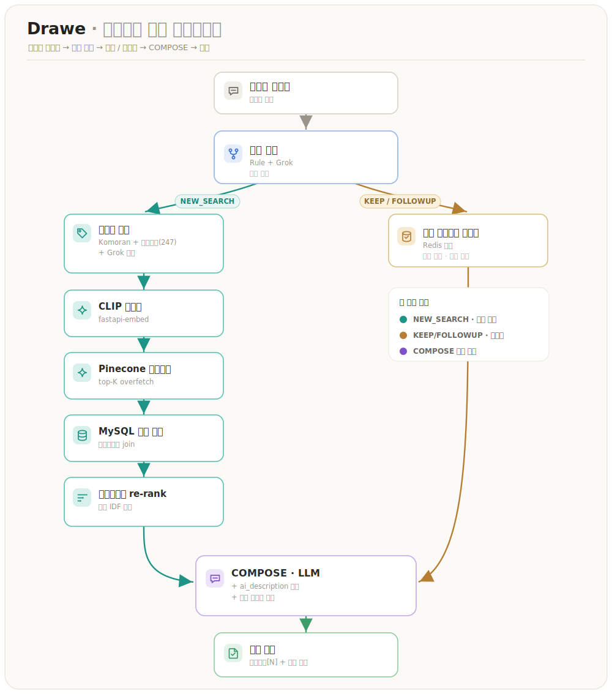

# backend

> Drawe 의 **핵심 API 서버** — 인증 · 도메인 로직 · LLM 라우팅 · 벡터 검색/임베딩 오케스트레이션을 담당하는 Spring Boot 애플리케이션.

프론트엔드의 모든 API 호출을 받고, 임베딩이 필요하면 [`fastapi · embed`](../fastapi/README.md) 를, 이미지 가이드가 필요하면 [`fastapi · guide`](../fastapi/README.md) 를 호출합니다. 벡터 검색은 Pinecone, 대화/생성은 LLM(Grok · Claude · Gemini)으로 라우팅합니다. 모노레포 `backend/` 디렉터리에 위치하며, 배포는 경로 필터(`backend/**`) 기반 `backend-cd` 워크플로가 담당합니다.

## 스택

- **Spring Boot 3.2.4 / Java 17** (Gradle toolchain)
- **Web + WebFlux** — FastAPI(embed·guide)·Pinecone 호출용 `WebClient`
- **Spring Data JPA** · Validation
- **Spring Security + OAuth2 Client** (Google 로그인) · **JWT** (jjwt 0.12.6, RefreshToken)
- **MySQL** (JPA) · **Valkey/Redis** (세션·캐시) · **Flyway** (스키마 마이그레이션)
- **springdoc-openapi** (Swagger UI) · **Actuator + Micrometer** (Prometheus)

## 도메인 구조

```text
src/main/java/com/drawe/backend/
├── domain/      # auth · project · image · search · llm · guide · feedback · analytics · onboarding · admin · log
└── global/      # 공통 설정·예외·필터·client(WebClient) 등 cross-cutting
```

| 도메인 | 역할 | 대표 엔드포인트(prefix) |
| --- | --- | --- |
| **auth** | Google OAuth2 로그인 · JWT · 리프레시 토큰 | `/auth` (login·signup·refresh·logout·check-*) |
| **project** | 프로젝트 CRUD · 레퍼런스 · 핀 | `/projects`, `/projects/{id}/pins` |
| **chat** | 프로젝트별 LLM 대화 세션 | `/projects/{id}/chat` (generate·history·reset) |
| **guide** | **이미지 가이드**(그림 → 코칭) 오케스트레이션 | `/projects/{id}/guide` |
| **image** | 이미지 업로드 · 피드백 | `/images` |
| **search** | 레퍼런스 벡터 검색 | `/search` |
| **onboarding** | 온보딩 태그/시드 | `/onboarding` |
| **analytics / admin** | 이벤트 집계 · 운영 대시보드 | `/admin` |

주요 엔티티: `User` · `Project`/`ProjectReference` · `Image`/`ImageBlob`/`ImageDraweTag`/`ImageFeedback` · `ChatSession`/`LlmMessage` · `Guide`/`GuideFeedback` · `AnalyticsEvent` · `UserPrefTag` · `RefreshToken`

### 이미지 가이드 연동

backend 는 가이드 자체를 생성하지 않고, **fastapi · guide** 서비스를 오케스트레이션합니다.

- `GET  /projects/{projectId}/guide` — 프로젝트의 가이드 이력 조회
- `POST /projects/{projectId}/guide` *(multipart)* — 그림 업로드 → guide 서비스 호출 → 결과 저장·반환
- `POST /projects/{projectId}/guide/{guideId}/feedback` — 가이드 피드백(👍/👎)
- `POST /projects/{projectId}/guide/{guideId}/references/feedback` — 추천 레퍼런스 피드백

> guide 서비스 주소는 `FASTAPI_GUIDE_URL`(내부 Service Connect: `fastapi-guide.drawe-{env}.local:8000`)로 주입됩니다. 브라우저가 참고 이미지에 직접 닿아야 하는 경로는 `FASTAPI_GUIDE_PUBLIC_URL` 로 분리됩니다.

## AI 추천 파이프라인

위 도메인 중 `search` 와 `chat`(llm) 이 함께 만드는 흐름이 레퍼런스 추천 파이프라인입니다. 사용자의 한국어 요청을 **의도**에 따라 라우팅하고, **CLIP 검색 + 태그 IDF re-rank**로 정확도를 높여 레퍼런스와 미술 조언을 생성합니다.



- **의도 분류** — `RulePreRouter`(규칙) 우선 + Grok 분류(`IntentCode`). 검색이 필요한 의도(NEW_SEARCH)만 검색, 나머지(KEEP·FOLLOWUP 등)는 직전 맥락 재사용.
- **키워드 추출** — Komoran 형태소 + **미술 사용자 사전(KO→EN, 247개)** → 사전 미스율이 높으면 **Grok 폴백**. 요청 동사("그려줘") 불용어 처리, "수채화풍" 같은 복합어 보존.
- **검색 + IDF re-rank** — CLIP → Pinecone overfetch → MySQL 메타 결합 → `TagIdfIndex` 가중 재정렬: `score = CLIP + min(cap, scale·ΣIDF(matched tags))`. CLIP을 덮지 않게 cap 튜닝, 점수 가드로 무관 결과 차단.
- **COMPOSE** — 페르소나 + 레퍼런스 컨텍스트(태그 + **ai_description 캡션**) → 스키마 강제 LLM 호출 → **출력 무결성 검사**로 `[N]` 범위 밖 환각 인용 제거.
- **ai_description** — 픽셀을 못 보는 LLM이 태그 추정 대신 **실제 이미지 내용 캡션**으로 설명 → 할루시네이션(없는 디테일 묘사) 완화.
- **핀 / 레퍼런스 주입** — 핀 이미지는 "고정 N" 네임스페이스로 분리, 검색 `[N]`에서 제외하고 1..N 재부여.
- **멀티턴** — Redis 단기메모리(`previousReferences`)로 KEEP/FOLLOWUP 맥락 유지. 대화 초기화 시 DB 메시지 + Redis 동시 정리.

### legacy ↔ live 경로
의도별 게이트로 점진 전환합니다. `workflow.compose.live-intents`(env `WORKFLOW_COMPOSE_LIVE_INTENTS`)에 나열된 의도는 **StepExecutor 워크플로(live)** 로, 나머지는 **직접 합성(legacy)** 로 처리합니다. live 의도는 **COMPOSE로 끝나는 것만 허용**(부팅 시 검증).

> 챗 레퍼런스 검색(embed + **Pinecone**)과 이미지 가이드 코퍼스(**Qdrant**)는 분리되어 섞이지 않습니다.

## 스키마 (Flyway)

기동 시 Flyway 가 `db/migration/V*.sql` 을 순서대로 자동 적용합니다. 현재 `V1__baseline` ~ `V10__guide_feedback` 까지 있으며, 이미지 가이드 관련은 **`V9__guides`**(가이드 본체) · **`V10__guide_feedback`**(피드백) 입니다.

> backend 의 `drawe` DB 와, 가이드 서비스의 `drawe_guide` DB 는 **분리**되어 있습니다. `drawe_guide` 스키마는 fastapi 가이드 서비스의 마이그레이션 러너가 별도로 관리합니다([fastapi/README.md](../fastapi/README.md)).

## 실행 방법

### 권장: docker-compose 스택으로 함께 기동

MySQL · Valkey · backend · fastapi(embed·guide) 를 한 번에 띄우려면 [`infra`](../infra/README.md) 의 로컬 compose 를 사용하세요.

```bash
cd ../infra
docker compose -f docker-compose.local.yml up -d   # backend → http://localhost:8080
```

### 단독 실행 (의존 서비스가 이미 떠 있는 경우)

```bash
cp .env.example .env      # DB·Redis·OAuth·LLM·Pinecone·FastAPI(guide) URL 등 채우기
./gradlew bootRun         # http://localhost:8080
```

> 스키마는 **Flyway** 가 기동 시 자동 적용합니다. 레퍼런스/온보딩 시드가 필요하면 [`infra/README.md`](../infra/README.md) 의 로컬 데이터 시드 참고.

## 환경변수

`.env.example` 을 참고해 채워주세요. 대략 다음 범주가 필요합니다(키 이름은 실제 파일 기준):

- **DB / 캐시**: MySQL 접속 정보, Valkey/Redis 접속 정보
- **인증**: Google OAuth2 client id/secret, JWT 서명 키
- **외부 연동**: `FASTAPI_URL`(embed), `FASTAPI_GUIDE_URL` · `FASTAPI_GUIDE_PUBLIC_URL`(guide), Pinecone API key/host/index, LLM(Grok · Claude · Gemini) API key

## API 문서

springdoc-openapi 가 Swagger UI 를 제공합니다.

```text
http://localhost:8080/swagger-ui/index.html
```

## 관측성

Actuator + Micrometer(Prometheus) 메트릭을 노출하며, OTel Java Agent 로 trace/metric/log 를 Alloy 에 OTLP 전송합니다. 수집·라우팅·PII redaction 구성 상세는 [`infra/README.md`](../infra/README.md) 의 관측성 섹션 참고.

## 배포 (GitOps)

- **타깃**: AWS EKS (EC2, Graviton arm64)
- **트리거**: `backend/**` 변경 → GitHub Actions `backend-cd`
- **흐름**: JAR → Docker(arm64) 빌드 → ECR push(:SHA) → **overlay newTag bump** → **ArgoCD 자동 롤아웃** (무중단: 롤링 + PDB minAvailable 1 + readiness)
- **인증**: GitHub OIDC 로 AWS 역할 assume(자격증명 비저장), 파드 권한은 **IRSA**

자세한 환경(dev/prod) 차이와 배포 정책은 [`infra/README.md`](../infra/README.md) 참고.

## 관련 문서

- [루트 README](../README.md) — 전체 아키텍처·모노레포 원칙
- [`docs/SDS/`](../docs/SDS/README.md) — 시스템 설계 문서(SDS): 아키텍처·AI 파이프라인·유스케이스·클래스/시퀀스/상태 다이어그램·데이터 설계
- [`fastapi/README.md`](../fastapi/README.md) — 임베딩(embed)·이미지 가이드(guide) 서버
- [`infra/README.md`](../infra/README.md) — 배포·환경·관측성
