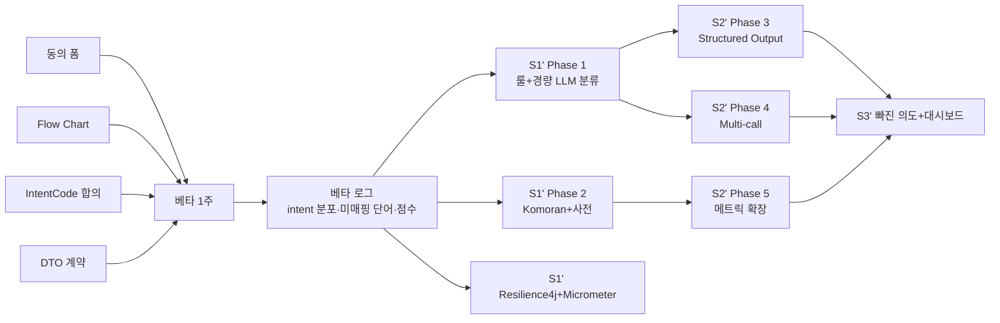

# AI 파이프라인 설계 — 외부 리뷰 종합 결정 기록

> 작성일: 2026-05-26
> 짝 문서:
> - [`AI-feedback-action-plan.md`](./AI-feedback-action-plan.md) — 강사님 피드백 → Phase 1~7 분해
> - [`../architecture/llm-flow.md`](../architecture/llm-flow.md) — As-Is / To-Be Mermaid
>
> 이 문서의 성격: **ADR (Architecture Decision Record)**.
> 외부 AI 4종(Claude Opus 4.7, Gemini Flash, 한국어 리뷰 2건)으로부터 받은 설계 검증 피드백을 종합해, 무엇을 수용하고 무엇을 기각했는지, 그리고 그 근거를 박제한다.
> 이전 plan 문서의 결론을 일부 갱신한다 — 충돌 시 **이 문서가 우선**한다.

---

## 0. 요약 (TL;DR)

| 영역 | 이전 plan | 갱신된 결정 |
|------|-----------|------------|
| **타이밍** | S1부터 룰·사전 동시 착수 | **베타 먼저** — 동의 폼만 갖추고 5명 베타 → 로그 기반으로 Phase 1 설계 |
| **Planner 추상화** | `PlanSpec { steps: [...] }` 런타임 인터프리터 | **정적 전략 맵** — `Map<IntentCode, List<StepType>>` + StepExecutor 빈 주입 |
| **Intent 분류** | 룰 우선 (적중률 70% 목표) | **명확 신호만 룰**, 미술 의도 분류는 **경량 LLM이 주, 룰이 폴백** |
| **009 (N번 참조)** | sub-plan 위임 | **앵커 슬롯으로 분리** — 전처리 단계에서 `[N]` 파싱 → `referencedImages` 슬롯, 의도는 별도 분류 |
| **출력 검증** | ResponseValidator 재호출 루프 | **Structured Output 네이티브 강제** + 결정론적 참조 무결성 검사 |
| **세션** | 시간 기반 + 명시적 + 컨텍스트 변경 | **프로젝트/캔버스 단위가 주(主) 신호** — 시간은 24h+ 유휴 청소용 |
| **골든셋** | 명시되지 않음 | **현 단계에선 배제** — 베타 로그가 골든셋 역할 |

---

## 1. 외부 리뷰 4종 합의·충돌 매트릭스

### 1.1 4개 다 동의한 것 (강한 신호)
- **Structured Output 네이티브 강제** — 백엔드 정규식·재호출은 안티패턴
- **009를 의도가 아니라 파라미터**로 — `(의도, 앵커)` 튜플
- **세션은 시간이 아니라 프로젝트/캔버스 단위**
- **LangGraph는 개념만, Spring AI 미도입** (이미 결정됨)
- **빠진 카테고리 보강 필요** — 도메인 외 질문(000), 사용자 본인 작업물 비평, 복합 의도

### 1.2 충돌한 것 — 본 문서에서 결정

| 쟁점 | Opus / Gemini 입장 | 한국어 리뷰 입장 | **결정** |
|------|-------------------|----------------|----------|
| 골든셋 vs 베타 | 골든셋 먼저 (S0에 라벨링) | 베타 먼저 (실데이터가 입력) | **베타 먼저** — 골든셋 라벨링 인력 부재 |
| Planner 추상화 | 정적 Map 디스패치 | 직접 호출 유지 | **정적 전략 맵** (양쪽 합의 가능한 선) |
| Intent 분류 방식 | 작은 LLM이 더 강건 | 룰 + LLM 폴백 | **하이브리드** — 명확 신호 룰, 미술 의도 LLM |

### 1.3 우리 컨텍스트에서 기각한 것
- **0주차 골든셋 100~200개 라벨링** — 인력 미확보, 실 베타 로그가 더 실증적
- **PlanSpec 런타임 인터프리터** — 9개 중 8개가 정적 시퀀스, 오버엔지니어링
- **자체 MetricsCollector 신설** — Micrometer 도입 검토로 대체 (아래 §4 참조)

---

## 2. 결정 1 — 타이밍: 베타 우선 (골든셋 배제)

### 결정
**S0~S1 = 베타 준비·운영 기간.** 룰/사전 코드 작성은 **베타 종료 후** 시작한다.

### 베타 전 (지금 ~ 1주차) — 코드 동결, 단 하나만 진행
- [ ] **사용자 동의 플로우** (강사님 피드백 #14, 법적/윤리적 필수)
  - Google Form 또는 가입 체크박스
  - 문구 초안: "서비스 품질 개선을 위해 채팅·검색 행동 데이터가 익명화되어 수집·분석되는 데 동의합니다."
  - 강사님 컨펌 필수
  - 미동의 사용자 데이터는 메트릭 집계에서 제외하는 로직 포함
- [ ] **Flow Chart 1차** (Mermaid, 현재 구조 도식화) — 코드 미변경, 안전
- [ ] 이미 완료: `images.source` ENUM 확장, PII 로그 차단

### 베타 중 (1주) — 코드 동결, 관찰만
- 베타 사용자 5명 운영
- 매일 어드민/DBeaver로 로그 관찰
- 변수 통제(코드 미변경)가 데이터 분석의 핵심
- 베타 종료 시점에 아래 쿼리로 실제 분포 확인:
  ```sql
  SELECT event_type, COUNT(*)
  FROM analytics_events
  WHERE event_type IN ('search_executed','search_blocked','decision_keep','decision_skip')
  GROUP BY event_type;
  ```

### 베타 후 — Phase 1 설계 입력 확보
- 어떤 intent가 자주 나오는지 → 룰 만들 우선순위
- 어떤 한글 단어가 검색되는지 → 형태소 사전 시드
- LLM 콜 비용·latency 실측치 → Phase 4 근거

### 근거
- 룰을 추측으로 짜는 비용 > 베타 후 데이터 기반으로 짜는 비용
- 골든셋을 손으로 만들 인력이 없음. 베타 로그가 더 실증적
- 강사님 피드백 #4("정량화")의 출발선이 됨

### 리스크 & 완화
- **리스크**: 베타 사용자가 적어(5명) intent 분포가 편향될 수 있음
- **완화**: Phase 1 룰을 베타 분포 상위 3개에만 먼저 적용. 나머지는 LLM 분류로 두고 운영 중 추가 수집

---

## 3. 결정 2 — Planner 추상화: 정적 전략 맵

### 결정
**`PlanSpec` 런타임 인터프리터를 만들지 않는다.** 대신 다음 구조를 사용한다:

```java
// 1. 의도 → step 시퀀스는 설정으로 정적 정의
Map<IntentCode, List<StepType>> ROUTING = Map.of(
    IntentCode.COMPOSITION,  List.of(StepType.COMPOSE),
    IntentCode.NEW_SEARCH,   List.of(StepType.EXTRACT_KEYWORDS, StepType.SEARCH, StepType.COMPOSE),
    IntentCode.GENERATE,     List.of(StepType.TRANSLATE, StepType.GENERATE_IMAGE),
    // ...
);

// 2. StepExecutor 인터페이스 + 스프링이 자동 주입하는 빈 맵
public interface StepExecutor {
    StepType type();
    StepResult execute(StepContext ctx);
}

@Service
class WorkflowService {
    private final Map<StepType, StepExecutor> executors;  // 스프링 자동 주입

    public ChatResponse run(IntentResult intent, StepContext ctx) {
        for (StepType step : ROUTING.get(intent.code())) {
            ctx = executors.get(step).execute(ctx).intoContext(ctx);
        }
        return ctx.toResponse();
    }
}
```

### 근거
- Intent Code 9개 중 8개가 **완전히 정적인 step 시퀀스**. 동적 플랜 합성이 필요한 케이스는 `009`(앵커) 하나인데, 이건 §6에서 슬롯 분리로 해결
- Opus 리뷰: "9-case 스위치문에 플랜 인터프리터를 씌우는 형태가 됨"
- Gemini 리뷰: "범용 에이전트 엔진을 만들면 인터페이스 설계에만 2주 날린다"
- Spring의 `Map<EnumKey, Bean>` 빈 주입은 정석 전략 패턴 — 디버깅·테스트 쉬움

### 데이터 모델 (record vs 인터페이스 — Opus 답변 수용)
- **PlanSpec / StepResult / StepContext** = `record` (불변 DTO)
- **StepExecutor** = `interface` + 구현 빈 (다형성)
- Java 17+ `sealed interface` + record로 step 타입 봉인, switch 패턴 매칭으로 컴파일 타임 안전성

### 향후 동적화 트리거 (지금은 안 하지만, 언제 다시 볼지)
- 복합 의도(§5)가 베타 로그에서 빈도 ≥ 10% 이상으로 관측되면 재검토
- 그전까지는 정적 맵 유지

---

## 4. 결정 3 — Intent 분류: 하이브리드 (룰 명확 신호 + LLM 주)

### 결정
**Intent 분류를 두 레이어로 나눈다.**

```
사용자 메시지
  ↓
[Pre-route] 결정론적 패턴 매처 (룰)
  ├─ 매치: 명확한 기능 신호 (다음 표)
  └─ 미스: ↓
[Classify] 경량 LLM 분류기 (Grok / Haiku)
  └─ IntentCode 반환
```

### 룰이 잡는 것 (명확한 기능 신호만)
| 신호 | 룰 예시 | 매핑 |
|------|---------|------|
| 새 레퍼런스 요청 | "다른 거", "더 보여줘", "또", "another" | `005 NEW_SEARCH` |
| [N]번 참조 | 정규식 `\[?\d+\]?번` | **앵커 슬롯으로 분리** (§6) |
| 이미지 생성 | "그려줘", "생성해줘", "만들어줘" | `008 GENERATE` |
| 잡담/감사 | "고마워", "ㅋㅋ", "ㅇㅋ" | `007 SKIP` |
| 도메인 외 | 미술 키워드 0개 + 음식/날씨/뉴스 키워드 | `000 OUT_OF_DOMAIN` (신규, §5) |

### LLM이 잡는 것
- 미술 의도 분류 (`001` 구도 / `002` 빛 / `003` 색 / `004` 기법)
- 복합 의도 (§5)
- 본인 작업물 비평 (§5)

### 근거
- Opus 리뷰: "intent 분류에 룰 우선은 정작 병목이 아닌 비용을 해결하려고 복잡도를 떠안는 것일 수 있다. 작은 LLM 콜이 이미 single-call이고 룰보다 강건"
- Opus 리뷰: "키워드 사전(KR→EN)은 결정론적이고 CLIP을 직접 먹이므로 룰 우선이 정당화됨" — **Phase 2 형태소·사전은 룰 우선 유지**
- "빛"→002 룰이 "빛나는 색감"(실제론 003)에도 발화하는 문제 회피
- 강사님 피드백 #1·#3·#5의 정신은 "LLM 의존 *과다* 해소"지 "룰로 전부 대체"는 아님

### 메트릭 (SLO 갱신)
이전 SLO: 룰 적중률 ≥ 70%, 사전 적중률 ≥ 60%, 메인 폴백 ≤ 5%

갱신:
| 지표 | 목표 | 측정 방법 |
|------|------|----------|
| **Intent precision** (룰 매치한 케이스의 정답률) | ≥ 90% | 베타 후 샘플 100건 라벨링 |
| **Intent rule coverage** (명확 신호 룰이 흡수하는 비율) | ≥ 30% | 실시간 메트릭 |
| **경량 LLM 분류 latency** | ≤ 300ms | Micrometer Timer |
| **사전(KR→EN) 적중률** | ≥ 60% | 형태소 추출 명사 중 사전 매핑 성공 |
| **메인 LLM 콜 수 / 세션** | ≤ 3 | 세션별 집계 |

Opus 리뷰 수용: **hit rate와 precision은 다른 지표** — 둘 다 측정.

---

## 5. 결정 4 — Intent Code 보강

### 추가하는 코드
| 신규 Code | 의미 | 도입 근거 |
|-----------|------|----------|
| `000` | 도메인 외 질문 (음식/날씨/잡담 외 비미술) | Gemini: "챗봇 기강 잡기" |
| `010` | **본인 작업물 비평** (사용자 이미지 업로드 + 평가 요청) | Opus: "드로잉 코치의 핵심 루프인데 누락" |
| `011` | 학습 경로 / 커리큘럼 코칭 | Opus: "초보자는 뭐부터 연습?" |
| `012` | 직전 답변 부연·후속 질문 | Opus: "006 KEEP은 레퍼런스 유지지 부연이 아님" |
| `013` | 비교 (두 레퍼런스 / 내 시안 vs 레퍼런스) | Opus 제안 |

### `009` 제거 → 앵커 슬롯
- **`009`를 IntentCode에서 삭제한다.**
- 전처리에서 `\[?\d+\]?번` 결정론적 파싱 → `IntentContext.referencedImages: List<Integer>` 슬롯에 저장
- 앵커가 제거된 문장으로 일반 분류기 실행
- StepExecutor가 `ctx.referencedImages`를 args로 사용

### 복합 의도 처리 정책
"구도도 색감도 봐줘"같은 복합 의도:
- 베타 로그에서 빈도 측정
- 빈도 < 10%: **단일 의도로 처리** — LLM 분류기가 가장 강한 의도 하나 선택
- 빈도 ≥ 10%: `IntentCode` 대신 `Set<IntentCode>` 반환, ROUTING도 합성 처리로 갱신
- 지금은 단일 의도 가정으로 시작

### 갱신된 IntentCode enum (참고)
```java
public enum IntentCode {
    OUT_OF_DOMAIN("000"),    // 신규
    COMPOSITION("001"),
    LIGHTING("002"),
    COLOR("003"),
    TECHNIQUE("004"),
    NEW_SEARCH("005"),
    KEEP("006"),
    SKIP("007"),
    GENERATE("008"),
    // 009 삭제 (앵커 슬롯으로 분리)
    SELF_CRITIQUE("010"),    // 신규
    LEARNING_PATH("011"),    // 신규
    FOLLOWUP("012"),         // 신규
    COMPARE("013");          // 신규
}
```

---

## 6. 결정 5 — 출력 검증: Structured Output 네이티브 강제

### 결정
**ResponseValidator 재호출 루프를 만들지 않는다.** 대신:

1. **구조 강제**: LLM API의 네이티브 JSON 스키마 / Structured Output 모드 사용
   - Anthropic: tool_use로 스키마 강제
   - OpenAI 호환: `response_format: { type: "json_schema" }`
   - Grok: 동일 패턴 지원 시 사용, 미지원이면 system 프롬프트로 스키마 명시
2. **구조 검증**: Jakarta Bean Validation (`@Valid` + record) — 손으로 검증기 짜지 않음
3. **참조 무결성**: **결정론적 코드**로 검사 (재호출 아님)
   - 인용한 이미지 인덱스가 실제 검색된 references 집합에 있는지
   - `no_refs=true`인데 레퍼런스를 인용했는지
   - 위반 시 → 해당 인용만 *제거*하고 응답 통과
4. **최종 폴백**: 깨진 JSON일 때 원본 노출 금지 — "핵심 조언만 평문으로" 결정론적 안전 템플릿

### 근거
- 4개 리뷰 모두 동의한 항목
- Gemini: "2026년 현재, 문자열 파싱 후 재호출은 최악의 악수"
- Opus: "환각 인용은 재호출보다 결정론적 제거가 빠르고 싸고 우아"

---

## 7. 결정 6 — 세션 정책: 프로젝트/캔버스 단위가 주(主) 신호

### 결정
세션 분리 트리거 우선순위:

1. **(주) 프로젝트 컨텍스트 변경** — 사용자가 다른 프로젝트로 전환
2. **(주) 명시적 "새 대화"** — UX 버튼
3. **(부) 24시간+ 유휴** — 진짜 죽은 세션 청소용

### 안 하는 것
- ~~"2시간 비활동 = 새 세션"~~ — 학습자는 그림 하나를 3~4시간 붙잡고 있음
- ~~의미 드리프트 감지~~ — MVP에 과함

### 토큰 비용 관리
세션 종료가 아니라 **최근 N턴 슬라이딩 윈도우**로 처리 (이미 `history trim` 존재).

### 근거
- 4개 리뷰 모두 동의
- Opus: "006 KEEP이 묵은 레퍼런스를 끌고 오는 문제는 시간이 아니라 프로젝트 스코프로 풀린다"

---

## 8. 결정 7 — 도구 / 라이브러리

| 영역 | 채택 | 근거 |
|------|------|------|
| **형태소 분석** | **Komoran** | Java 네이티브, 도메인 사전 추가 용이. Nori는 ES 미사용 시 과함 |
| **메트릭** | **Micrometer + analytics_events 확장** | Opus: "MetricsCollector는 사실상 Micrometer 재발명". Timer/Counter에 intent code·tier 태깅 |
| **외부 API 안정성** | **Resilience4j** | 외부 동기 체인에 타임아웃 전면 적용. **멱등 호출(CLIP/벡터)은 타임아웃+서킷+재시도, 생성계(LLM/Bria)는 타임아웃만**(재시도=중복 생성 비용, 서킷=생성 실패까지 여는 과민). bulkhead 는 Phase 4 재검토. 상세: [`S1-resilience4j-design.md`](./S1-resilience4j-design.md) §4 |
| **검증** | **Jakarta Bean Validation + record** | ResponseValidator 구조 파트 손코딩 회피 |
| **전략 디스패치** | **Spring `Map<EnumKey, Bean>` 자동 주입** | StepExecutor 빈 자동 수집 |
| **비동기/동시성** | **CompletableFuture + bounded executor** (Java 17) / 21 업그레이드 시 가상 스레드 | Phase 4 multi-call에서 외부 API 차단 회피 |
| **Flow Chart** | **Mermaid** | 강사님 #11 "벡터 README" 정신과 일치 |
| **대시보드** | 1차 SQL, 2차 Metabase | Grafana는 시스템 게이지용 |
| **메트릭 저장소** | MySQL → 한참 뒤 컬럼형 (S3+Athena / ClickHouse) | Opus: "메트릭은 이벤트/트레이스 → TSDB 아닌 컬럼형이 다음 목적지" |

### 명시적 기각
- ~~Spring AI 본격 도입~~ — 강사님 #12
- ~~LangGraph 그대로 도입~~ — Python, 스택 불일치. 개념만
- ~~ReAct~~ — 강사님 #3
- ~~SVG 레이어 생성~~ — 강사님 #11
- ~~앱 레벨 부하 분산~~ — 강사님 #10
- ~~자체 MetricsCollector 신설~~ — Micrometer로 대체

---

## 9. 갱신된 스프린트 (이전 plan §8 대체)

> 이전 plan의 S1~S3가 "베타 가정 없이" 작성되어 본 문서로 갱신한다.

### S0 (지금 ~ 베타 시작, 약 1주)
| 작업 | 담당 |
|------|------|
| 사용자 동의 플로우 (강사님 컨펌 포함) | 공동 |
| Flow Chart 1차 (현재 구조 Mermaid) | 공동 |
| Intent Code 신규 enum **합의만** (코드 작성은 베타 후) | 공동 |
| StepType / IntentResult / IntentContext **인터페이스 계약 합의** | 공동 |

**DoD**: 베타 시작 가능 상태. 코드는 As-Is 그대로.

### S-Beta (1주, 코드 동결)
| 작업 | 담당 |
|------|------|
| 베타 5명 운영 | 공동 |
| 어드민/DBeaver 일일 관찰 | 공동 |
| Intent 분포 / 사전 미스 단어 / 검색 점수 분포 수집 | 공동 |

**DoD**: 베타 종료. Phase 1·2 설계 입력 데이터셋 확보.

### S1' (베타 후 ~ +2주) — 핵심 개선 병렬
| 트랙 | 작업 | 담당 |
|------|------|------|
| **A** (결정·오케스트레이션) | Phase 1: 룰 매처(명확 신호만) + 경량 LLM 분류기 + 정적 전략 맵 도입 | A |
| **B** (검색·데이터) | Phase 2: Komoran + art-terms-ko-en.csv (베타 미매핑 단어 시드) + KeywordExtractor 재구현 | B |
| **공통** | Resilience4j 도입 (모든 외부 API 호출에 타임아웃; 멱등 호출은 서킷브레이커·재시도 추가, 생성계는 타임아웃만 — `S1-resilience4j-design.md` §4) | A |
| **공통** | Micrometer 도입 + intent code·tier 태깅 | B |

**병렬 조건**: `IntentResult` / `StepContext` record를 S0에 합의.

**DoD**:
- 룰 명확 신호 적중률 ≥ 30% (메트릭으로 확인)
- 경량 LLM 분류 latency ≤ 300ms
- 사전 적중률 ≥ 60% (베타 로그 기준)
- 외부 API 호출 100%에 타임아웃 적용 (hang·스레드풀 고갈 차단). 멱등 호출(CLIP/벡터)은 추가로 서킷·재시도 통과 — 생성계(LLM/Bria)는 §8 근거로 서킷·재시도 제외

### S2' (+2~+4주) — 출력 규격화 + 검증
| 트랙 | 작업 | 담당 |
|------|------|------|
| A | Phase 3: 페르소나 v2 + Structured Output 네이티브 강제 + 결정론적 참조 무결성 | A |
| A | Phase 4: Multi-call 단계화 (intent → keywords → compose) | A |
| B | Phase 5: 메트릭 확장 (intent precision, rule coverage, 사전 적중률, 토큰 비용) | B |
| B | Phase 6: 세션 정책 — 프로젝트 단위 분리 + 24h 유휴 청소 | B |

**DoD**:
- 응답 구조 위반률 ≤ 1% (네이티브 스키마 강제로)
- 환각 인용 0건 (결정론적 검사)
- intent precision ≥ 90%

### S3' (+4~+6주) — 빠진 의도 코드 채우기 + 대시보드
| 작업 | 담당 |
|------|------|
| `000` OUT_OF_DOMAIN 거절 응답 톤 | A |
| `010` SELF_CRITIQUE — 사용자 이미지 업로드 비평 (멀티모달 입력 경로) | A+B |
| `011`~`013` 도입 (베타 로그에서 빈도 확인된 것만) | A |
| Metabase 대시보드 1차 (강사님께 보고할 수치 set) | B |

---

## 10. 의존성 그래프 (갱신)



---

## 11. 강사님께 재확인할 것 (베타 종료 후)

1. 갱신된 Intent Code 체계 (000, 010~013 포함) — 추가/병합할 게 있는지
2. 베타 데이터 기반 SLO 수치 — Intent precision 90%, 사전 60%, 메인 콜 ≤3/세션이 현실적인지
3. 룰 우선이 아니라 **경량 LLM 분류기 주(主)** 로 바꾼 결정 — 의도 일치 여부
4. Structured Output 네이티브 강제 — 사용 중인 모델(Grok, Claude)의 지원 범위
5. Resilience4j 정책 (타임아웃 N초, 서킷브레이커 임계치) — 운영 기준

---

## 12. 6주 뒤 "후회 후보" 모니터링 항목

Opus가 짚은 후회 후보를 메트릭으로 박제한다 — 분기마다 재검토:

| 후회 후보 | 우리 컨텍스트에서의 변형 | 모니터링 지표 |
|---------|---------------------|--------------|
| 골든셋 부재로 SLO 측정 불가 | 베타 로그에 100% 의존 | 베타 종료 시 라벨링 100건 가능 여부 |
| 정적 맵이 복합 의도에 못 견딤 | `Set<IntentCode>` 필요성 | 베타 후 복합 의도 빈도 |
| 외부 API hang | 동기 체인 장애 전파 | Resilience4j circuit breaker open 횟수 |
| 멀티모달 누락 (010) | 본인 작업물 비평 미구현 | 사용자 요청 빈도 (자유 텍스트 분석) |

---

## 13. 변경 이력
- 2026-05-26 초안 — 외부 리뷰 4종(Claude Opus 4.7, Gemini Flash, 한국어 리뷰 2건) 종합. 이전 plan §8 스프린트 대체.
