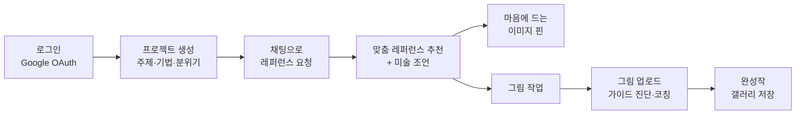
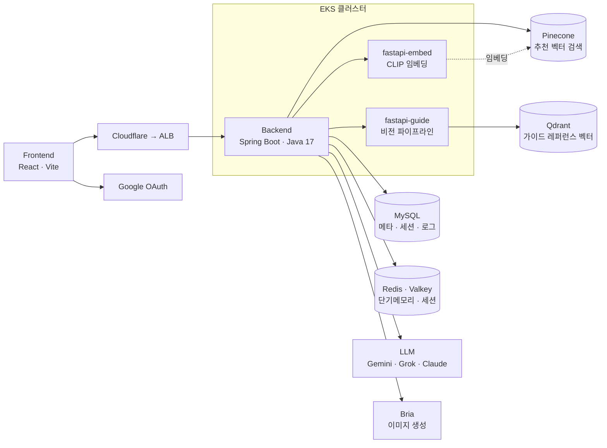
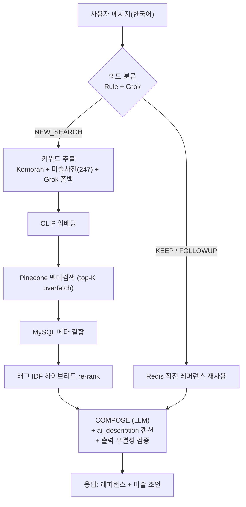

# DraWe — 시스템 설계 문서 (SDS)

> **AI 기반 그림 레퍼런스 추천 · 드로잉 가이드 어시스턴트**
> 자연어로 그리고 싶은 것을 말하면 → 맞춤 레퍼런스를 추천하고, 업로드한 그림을 비전 파이프라인으로 진단·코칭한다.

이 문서는 DraWe의 전체 시스템을 한눈에 조망하는 **개요(인덱스)** 다. 상세 설계는 각 섹션 문서로 연결된다.

---

## 1. 한눈에 보기

| 항목 | 내용 |
|---|---|
| **무엇** | 그림 주제를 자연어로 입력 → 적합한 레퍼런스 추천 + 구도·명암·색감 등 미술 조언 |
| **누구** | 그림을 그리려는 사용자(초보~중급) |
| **핵심 가치** | ① 한국어 자유 요청 → 정확한 레퍼런스 검색 ② 멀티턴 대화로 작업 맥락 유지 ③ 업로드 그림 비전 진단 |
| **차별점** | **태그가 아닌 실제 이미지 내용**(캡션)에 근거한 추천·설명 + **CLIP×태그 IDF 하이브리드 검색** |

### 주요 사용자 여정

## 2. 시스템 아키텍처

> ⚠️ 정식 아키텍처/배포 다이어그램은 **인프라(클라우드) 팀 제공 예정**. 아래는 이해를 돕는 임시본.

- **Backend(Spring Boot)** 가 도메인 로직과 외부 서비스 오케스트레이션을 담당.
- **fastapi-embed / fastapi-guide** 두 AI 서비스가 각각 CLIP 임베딩과 그림 비전 진단을 수행.
- **MySQL(메타) · Pinecone(벡터) 듀얼 스토어** — 검색은 벡터, 상세 메타는 RDB.

## 3. 핵심 — AI 추천 파이프라인 ⭐

- **의도 기반 분기**: 검색이 필요한 의도만 검색, 나머지는 직전 맥락 재사용(멀티턴).
- **하이브리드 검색**: CLIP 유사도에 태그 IDF 가중치를 더해 변별력 보강.
- **할루시네이션 완화**: LLM이 태그가 아닌 **실제 내용 캡션(ai_description)** 에 근거해 설명.

## 4. 기술 스택

| 영역 | 기술 |
|---|---|
| Frontend | React, Vite |
| Backend | Spring Boot 3.2, Java 17, JPA, QueryDSL, Flyway, Resilience4j |
| AI 서비스 | FastAPI, CLIP (ViT-L/14), mediapipe, Gemini VLM |
| 데이터 | MySQL 8, Redis · Valkey, Pinecone |
| 인프라 | EKS, Cloudflare, ALB, GitOps |

## 5. 주요 설계 포인트

1. **키워드 추출 파이프라인** — 형태소 분석(Komoran) + 미술 사용자 사전(93→247 확장) + 사전 미스 시 LLM 폴백. 복합어 보존, 요청 동사 불용어 처리.
2. **태그 IDF 하이브리드 re-rank** — `score = CLIP + min(cap, scale·Σ IDF(matched tags))`. CLIP을 덮지 않게 cap 튜닝.
3. **ai_description 캡션 보강** — 픽셀 없는 LLM에게 실제 내용 문장을 줘 추천·설명 정확도 향상(할루 완화).
4. **레거시 ↔ Live 게이트** — `workflow.compose.live-intents`로 의도별 점진 전환(COMPOSE 종착 의도만 허용, 부팅 검증).
5. **멀티턴 단기메모리** — Redis로 직전 레퍼런스 재사용, 초기화 시 DB+Redis 동시 정리.

## 6. 문서 구성 (SDS 인덱스)

| # | 섹션 | 내용 | 상태 |
|---|---|---|---|
| 1 | [introduction](./introduction/) | 개요·목적·범위 | ⏳ |
| 2 | [glossary](./glossary/) | 용어 정의 | ⏳ |
| 3 | [systemArchitecture](./systemArchitecture/) | 컴포넌트·배포·데이터흐름 | ⏳ |
| 4 | [usecaseAnalysis](./usecaseAnalysis/) | 유스케이스 | ⏳ |
| 5 | [userInterfacePrototype](./userInterfacePrototype/) | UI 목업 | ⏳ |
| 6 | [aiPipelineDesign](./aiPipelineDesign/) | AI 파이프라인 설계 근거 ⭐ | ⏳ |
| 7 | [classDiagram](./classDiagram/) | 도메인별 클래스 다이어그램 | ⏳ |
| 8 | [sequenceDiagram](./sequenceDiagram/) | 기능별 시퀀스 다이어그램 | ⏳ |
| 9 | [stateMachineDiagram](./stateMachineDiagram/) | 상태 전이(의도·세션·프로젝트) | ⏳ |
| 10 | [dataDesign](./dataDesign/) | MySQL · Pinecone 데이터 설계 | ⏳ |
| 11 | [implementationRequirements](./implementationRequirements/) | 기술스택·배포·복원력·보안 | ⏳ |
| 12 | [references](./references/) | 참고 자료 | ⏳ |

## 7. 도메인 모듈 (백엔드)

`auth` · `project` · `image` · `search` · `llm`(chat·workflow·intent·session·output) · `guide` · `gallery` · `onboarding` · `admin` · `analytics`
