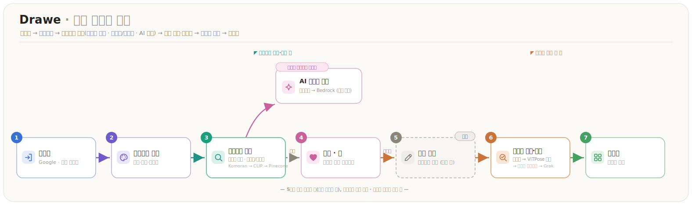
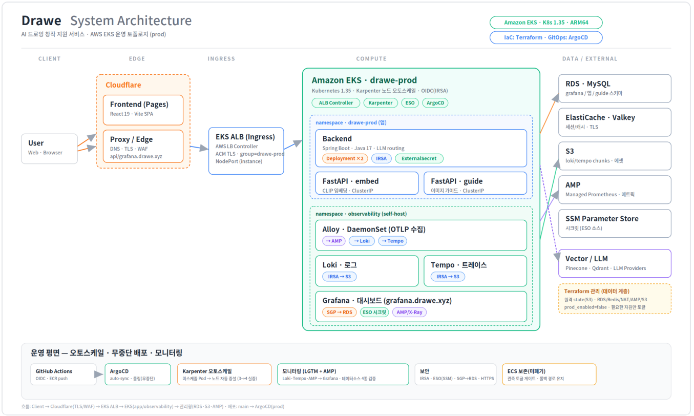
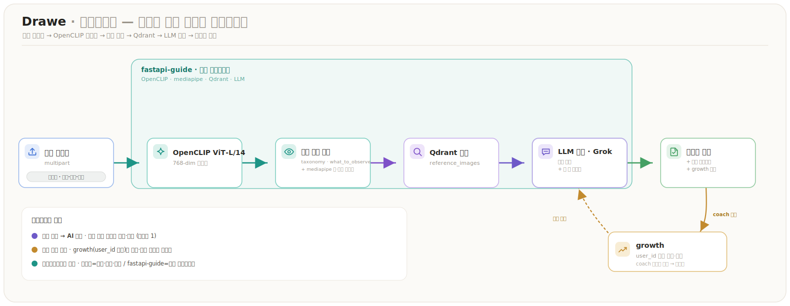

# DraWe — 시스템 설계 문서 (SDS)

> **AI 기반 그림 레퍼런스 추천 · 드로잉 가이드 어시스턴트**
> 자연어로 그리고 싶은 것을 말하면 → 맞춤 레퍼런스를 추천하고, 업로드한 그림을 비전 파이프라인으로 진단·코칭한다.

이 문서는 DraWe의 전체 시스템을 한눈에 조망하는 **개요(인덱스)** 다. 상세 설계는 각 섹션 문서로 연결된다.

---

## 1. 한눈에 보기

| 항목 | 내용 |
|---|---|
| **무엇** | 그림 주제를 자연어로 입력 → 적합한 레퍼런스 추천 + 구도·명암·색감 등 미술 조언 |
| **누구** | 그림을 그리려는 사용자(초보~중급) |
| **핵심 가치** | ① 한국어 자유 요청 → 정확한 레퍼런스 검색 ② 멀티턴 대화로 작업 맥락 유지 ③ 업로드 그림 비전 진단 |
| **차별점** | 단순 이미지 검색을 넘어 — ① **그림 기반 가이드**: 내가 그린 그림을 진단·코칭(검색 도구 → AI 코치) ② **성장 중심 맞춤**: 약점·진척(growth)으로 개인화 ③ **의도 기반 추천**: 자연어 요청의 맥락을 반영해 레퍼런스 추천 |

### 주요 사용자 여정

## 2. 시스템 아키텍처

- **Backend(Spring Boot)** 가 도메인 로직·인증·AI 추천 파이프라인을 오케스트레이션.
- **FastAPI·embed**(CLIP ViT-L/14) → 임베딩 → Pinecone, **FastAPI·guide**(OpenCLIP) → 이미지 가이드(Qdrant·`drawe_guide` RDS·S3).
- 배포: **AWS ECS · EC2 Graviton(ARM64)**.

## 3. 핵심 ① — AI 추천 파이프라인 ⭐

- **의도 기반 분기**: 검색이 필요한 의도만 검색, 나머지는 직전 맥락 재사용(멀티턴).
- **하이브리드 검색**: CLIP 유사도에 태그 IDF 가중치를 더해 변별력 보강.
- **할루시네이션 완화**: LLM이 태그가 아닌 **실제 내용 캡션(ai_description)** 에 근거해 설명.

## 4. 핵심 ② — 이미지 기반 가이드 ⭐

단순 레퍼런스 검색을 넘어, **사용자가 그린 그림을 비전으로 진단·코칭**한다. 백엔드(`GuideService`)는 오케스트레이션만 하고, 실제 비전 분석·코칭은 `fastapi-guide` 서비스가 수행한다(별도 코퍼스 **Qdrant**·`drawe_guide` RDS).

- **검색 도구 → AI 코치**: 내가 그린 그림을 진단·코칭(우리 1번 차별점).
- **성장 중심 맞춤**: `growth`(user_id 단위 진척)로 약점·이력을 반영해 개인화.
- **오케스트레이션 분리**: 백엔드는 권한·멱등·영속만, 비전 파이프라인(OpenCLIP·mediapipe·Qdrant·LLM)은 `fastapi-guide`가 담당. `coach` 모드만 이력으로 저장.

## 5. 기술 스택

| 영역 | 기술 |
|---|---|
| Frontend | React, Vite |
| Backend | Spring Boot 3.2, Java 17, JPA, QueryDSL, Flyway, Resilience4j |
| AI 서비스 | FastAPI, CLIP (ViT-L/14), mediapipe, Gemini VLM |
| 데이터 | MySQL 8, Redis · Valkey, Pinecone |
| 인프라 | AWS ECS (EC2 Graviton ARM64), Cloudflare, ALB, GitHub Actions CI/CD |

## 6. 문서 구성 (SDS 인덱스)

| # | 섹션 | 내용 | 상태 |
|---|---|---|---|
| 1 | [introduction](./introduction.md) | 개요·목적·범위 | ✅ |
| 2 | [systemArchitecture](./systemArchitecture.md) | 컴포넌트·배포·데이터흐름 | ✅ |
| 3 | [usecaseAnalysis](./usecaseAnalysis.md) | 유스케이스 | ✅ |
| 4 | [userInterfacePrototype](./userInterfacePrototype.md) | UI 목업 | ✅ |
| 5 | [aiPipelineDesign](./aiPipelineDesign.md) | AI 파이프라인 설계 근거 ⭐ | ✅ |
| 6 | [classDiagram](./classDiagram.md) | 도메인별 클래스 다이어그램 | ✅ |
| 7 | [sequenceDiagram](./sequenceDiagram.md) | 도메인별 시퀀스 다이어그램 | ✅ |
| 8 | [stateMachineDiagram](./stateMachineDiagram.md) | 전체·도메인 상태 머신 | ✅ |
| 9 | [dataDesign](./dataDesign.md) | MySQL · Redis · Pinecone · Qdrant · S3 | ✅ |
| 10 | [implementationRequirements](./implementationRequirements.md) | 기술스택·배포·복원력·보안 | ✅ |
| 11 | [glossary](./glossary.md) | 용어 정의 | ✅ |
| 12 | [references](./references.md) | 참고 자료 | ✅ |

## 7. 도메인 모듈 (백엔드)

`auth` · `project` · `image` · `search` · `llm`(chat·workflow·intent·session·output) · `guide` · `gallery` · `onboarding` · `admin` · `analytics`
