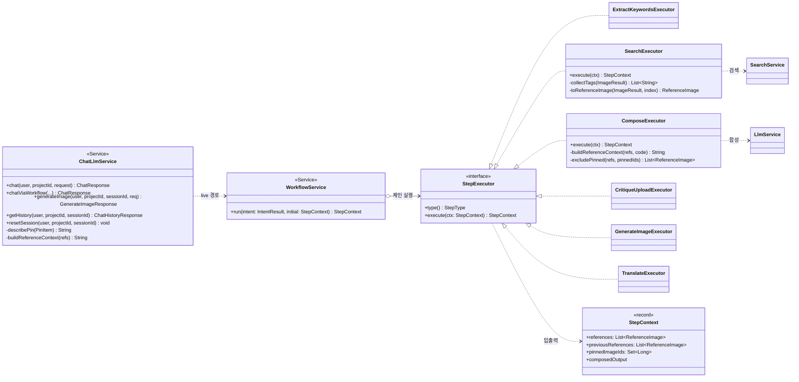
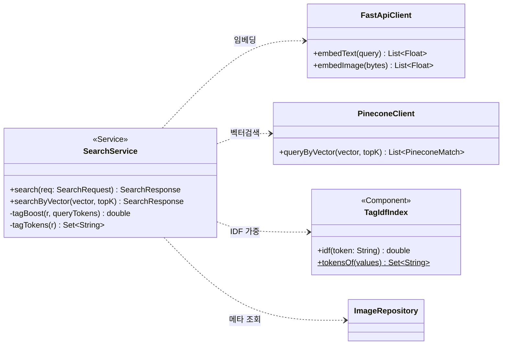
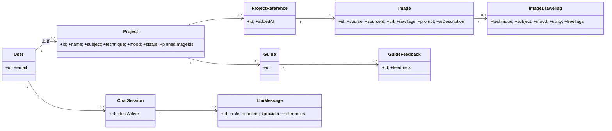

# 7. Class Diagram

## 7.1 AI 추천 파이프라인 (컴포넌트) ⭐
`ChatLlmService`가 오케스트레이션하고, live 경로는 `WorkflowService`가 `StepExecutor` 체인을 실행한다.

| 클래스 | 책임 |
|---|---|
| `ChatLlmService` | 의도 분류·세션·legacy/live 분기, 응답 조립 |
| `WorkflowService` | 의도 라우팅에 따라 StepExecutor 체인 실행 |
| `StepExecutor`(+6 구현) | 단계별 처리(키워드·검색·합성·번역·생성·비평) |
| `StepContext` | 단계 간 전달 컨텍스트(refs·pinnedIds·output) |

## 7.2 검색 컴포넌트

- **IDF re-rank**: `SearchService`가 Pinecone 결과를 `TagIdfIndex.idf()` 로 가중해 재정렬.

## 7.3 도메인 엔티티 모델

| 엔티티 | 설명 |
|---|---|
| `Project` | 그림 작업 단위(주제·기법·분위기·핀목록) |
| `Image` | Unsplash/AI 이미지(+`aiDescription` 캡션) |
| `ImageDraweTag` | 이미지의 GPT 태깅(기법·주제·분위기·freeTags) |
| `ChatSession`·`LlmMessage` | 대화 세션·메시지(role·references) |
| `ProjectReference` | 프로젝트-이미지 N:M 연결(레퍼런스 아카이브) |

> 도메인별 Controller·Service·Repository는 동일한 계층 패턴(Controller → Service → Repository)을 따른다.
