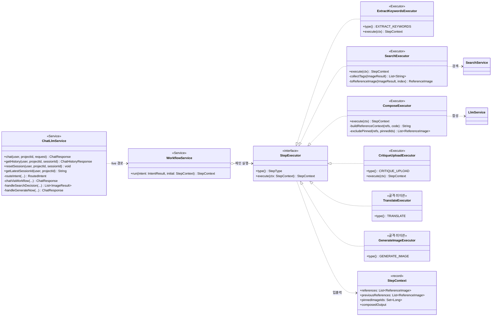
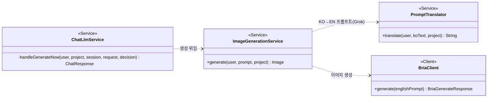
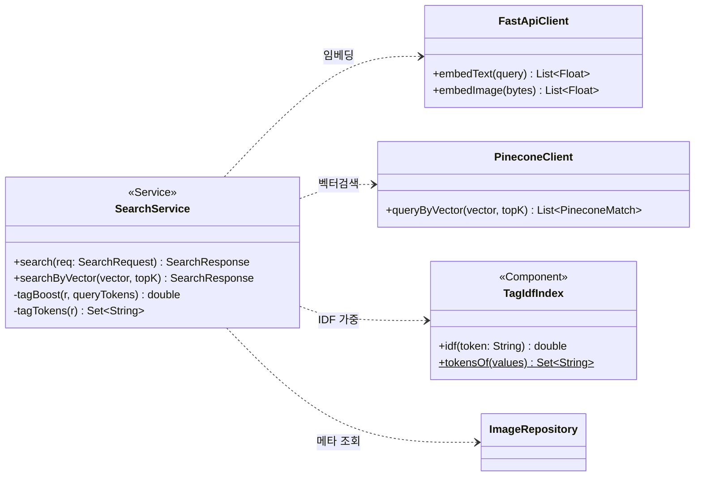
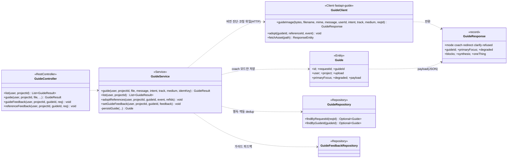
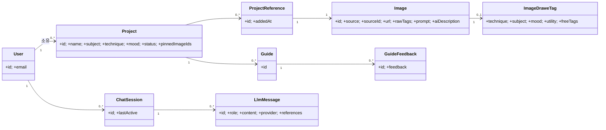

# 7. Class Diagram

## 7.1 AI 추천 파이프라인 (컴포넌트) ⭐
`ChatLlmService`가 오케스트레이션하고, live 경로는 `WorkflowService`가 `StepExecutor` 체인을 실행한다.

| 클래스 | 책임 |
|---|---|
| `ChatLlmService` | 의도 분류·세션·legacy/live 분기, 응답 조립 |
| `WorkflowService` | 의도 라우팅에 따라 StepExecutor 체인 실행 |
| `StepExecutor`(+6 구현) | 단계별 처리(키워드·검색·합성·비평 = 실동작 / 번역·생성 = 골격) |
| `StepContext` | 단계 간 전달 컨텍스트(refs·pinnedIds·output) |

> **골격 표기**: `TranslateExecutor`·`GenerateImageExecutor`는 빈 구현(통과만)이다. GENERATE(이미지 생성)는 live 워크플로가 아니라 legacy `ChatLlmService.handleGenerateNow` 경로로 처리되며, 그 이유와 실제 클래스 구조는 §7.2에 둔다.

## 7.2 AI 이미지 생성 (GENERATE · legacy)
명시적 생성 요청("그려줘")은 의도 분류에서 `GENERATE_NOW`로 갈리며, **live 게이트보다 먼저** `handleGenerateNow`로 단락된다(생성은 COMPOSE로 끝나지 않아 live 미허용 — [aiPipelineDesign §6.2.1·6.9](./aiPipelineDesign.md)). 검색 0건일 때는 자동 생성이 아니라 "AI 생성 제안" 메시지만 내보내고, 사용자가 수락하면 다음 턴이 `GENERATE_NOW`가 된다.

- **트리거**: (A) 명시적 생성 → `GENERATE_NOW` → `handleGenerateNow`. (B) NEW_SEARCH 0건 → `offerGenerate` 플래그(제안 메시지) → 수락 턴이 (A)로.
- **`ImageGenerationService.generate`**(`@Transactional`): `PromptTranslator`(Grok, KO→EN) → `BriaClient`(Bria 호출) → 결과 이미지 S3 업로드(`ImageStorage`) → `ImageRepository` 저장 → `Image` 반환.
- **live 미이관 이유**: COMPOSE 종착 계약 불일치 + User/Project 엔티티 의존(StepContext는 id만) + 부팅 검증이 비-COMPOSE 종착 의도의 live를 차단.

## 7.3 검색 컴포넌트

- **IDF re-rank**: `SearchService`가 Pinecone 결과를 `TagIdfIndex.idf()` 로 가중해 재정렬.

## 7.4 이미지 기반 가이드 (Guide)
사용자가 업로드한 그림을 **비전으로 진단·코칭**하는 두 번째 핵심 기능. 백엔드는 **오케스트레이션만** 하고, 실제 비전 분석·코칭은 `fastapi-guide` 서비스가 수행한다(별도 코퍼스 Qdrant·`drawe_guide` RDS).

- **오케스트레이션 경계**: 백엔드는 업로드 수신·권한·멱등·영속만. 실제 파이프라인(OpenCLIP ViT-L/14 → 관찰 신호·mediapipe 게이트 → Qdrant 검색 → LLM 코칭)은 `fastapi-guide`가 담당. **growth 키 = `user_id`** 로 개인화 진척을 누적.
- **멱등성**: `Idempotency-Key`(없으면 생성) → `findByRequestId` 로 재시도 dedup. 이미 처리된 요청은 저장된 가이드를 재보강만 해서 반환.
- **영속 정책**: `mode=="coach"` 일 때만 `Guide` 저장(redirect/clarify/refused는 히스토리에 안 남김). 업로드 원본은 `ImageBlob` 썸네일로 **선택 저장**(실패해도 코칭은 정상 반환).
- **트랜잭션 경계**: 느린 외부 호출(LLM 코칭)은 **트랜잭션 밖**에서 수행해 DB 커넥션 장시간 점유를 막는다.
- **피드백·채택**: `setGuideFeedback`(👍/👎) → `GuideFeedback` 저장, `adoptReferences`(liked/disliked) → `GuideClient.adopt` 로 추천 레퍼런스 취향 반영.

| 클래스 | 책임 |
|---|---|
| `GuideController` | 업로드·이력·피드백 엔드포인트(`/projects/{id}/guide`) |
| `GuideService` | 권한·멱등·영속 오케스트레이션, coach 모드 저장 |
| `GuideClient` | `fastapi-guide` HTTP 클라이언트(진단·채택·에셋 프록시) |
| `GuideResponse` | 가이드 결과 페이로드(mode·blocks·synthesis·oneThing) |
| `Guide` | 가이드 이력 엔티티(payload JSON·업로드 썸네일) |

## 7.5 도메인 엔티티 모델

| 엔티티 | 설명 |
|---|---|
| `Project` | 그림 작업 단위(주제·기법·분위기·핀목록) |
| `Image` | Unsplash/AI 이미지(+`aiDescription` 캡션) |
| `ImageDraweTag` | 이미지의 GPT 태깅(기법·주제·분위기·freeTags) |
| `ChatSession`·`LlmMessage` | 대화 세션·메시지(role·references) |
| `ProjectReference` | 프로젝트-이미지 N:M 연결(레퍼런스 아카이브) |

> 도메인별 Controller·Service·Repository는 동일한 계층 패턴(Controller → Service → Repository)을 따른다.
