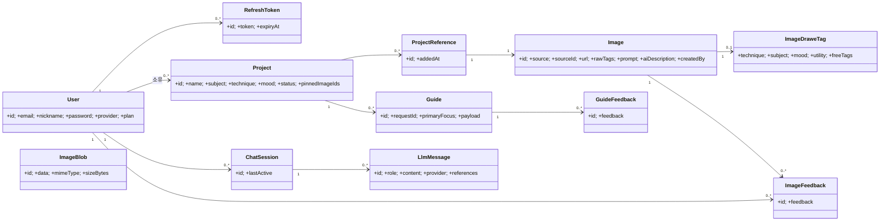

# 6. Class Diagram

도메인별로 클래스 구조를 분리해 정리한다(GameMatch 방식). 각 문서는 **타입까지 명시한 클래스 다이어그램**(의존성·생성자·메서드 시그니처 + DTO)과 **클래스별 정보 표**(구분/Name/Type/Visibility/Description)를 담는다.

> **⭐ = 핵심 기능**. 모든 표준 도메인은 **Controller → Service → Repository** 계층 패턴을 공유한다.

## 6.0 문서 인덱스

| # | 도메인 | 문서 | 비고 |
|---|---|---|---|
| 1 | llm/chat | ⭐ [AI 추천 파이프라인 (Chat)](./classDiagram/chatPipelineClassDiagram.md) | 진입~응답 오케스트레이션 |
| 2 | llm/intent | ⭐ [의도 분류 · 키워드 추출](./classDiagram/intentClassDiagram.md) | Rule+Grok 2단 분류 |
| 3 | llm/core | [세션 · LLM Provider · 출력 무결성](./classDiagram/sessionProviderOutputClassDiagram.md) | 단기메모리·provider·[N] 무결성 |
| 4 | search | [검색](./classDiagram/searchClassDiagram.md) | CLIP·Pinecone·IDF re-rank |
| 5 | image/llm | [AI 이미지 생성 (GENERATE · legacy)](./classDiagram/generateImageClassDiagram.md) | Bedrock 생성 |
| 6 | guide | ⭐ [이미지 기반 가이드](./classDiagram/guideClassDiagram.md) | 그림 진단·코칭 |
| 7 | auth | [인증](./classDiagram/authClassDiagram.md) | 회원가입·로그인·OAuth·토큰 |
| 8 | project | [프로젝트 · 핀](./classDiagram/projectClassDiagram.md) | CRUD·QueryDSL·핀 |
| 9 | image | [이미지 · 피드백 · 저장](./classDiagram/imageClassDiagram.md) | 업로드·서빙·피드백·저장 추상화 |
| 10 | gallery | [갤러리 · 레퍼런스 아카이브](./classDiagram/galleryClassDiagram.md) | 완성작·아카이브(읽기 전용) |

> 핵심 추천 흐름은 1–5번이 함께 구성한다: **의도 분류(2) → 키워드·검색(4) → 세션·provider·무결성(3) → 합성(1)**. 결과가 없으면 생성(5)을 제안한다.

## 6.1 도메인 엔티티 모델 (통합)
도메인을 가로지르는 영속 엔티티의 관계. 각 도메인의 상세 클래스는 위 문서를 참고한다.

| 엔티티 | 설명 |
|---|---|
| `User` | 사용자(`provider` null=이메일·"google"=OAuth, `plan` FREE/PAID) |
| `RefreshToken` | 리프레시 토큰(rotate 대상) |
| `Project` | 그림 작업 단위(주제·기법·분위기·핀목록 JSON) |
| `Image` | Unsplash/AI 이미지(+`aiDescription` 캡션, `createdBy`=AI 생성자) |
| `ImageBlob` | 업로드 원본 바이트(DB 저장 추상화) |
| `ImageDraweTag` | 이미지 태깅(기법·주제·분위기·freeTags) |
| `ImageFeedback` | 이미지 좋아요/싫어요(user+image UNIQUE) |
| `ChatSession`·`LlmMessage` | 대화 세션·메시지(role·provider·references) |
| `ProjectReference` | 프로젝트-이미지 연결(레퍼런스 아카이브) |
| `Guide`·`GuideFeedback` | 가이드 이력·피드백 |
