## Auth Class Diagram

```mermaid
classDiagram
    direction LR

    class AuthController {
        <<Controller>>
        -authService: AuthService
        -emailVerificationService: EmailVerificationService
        -clientId: String
        -redirectUri: String
        +AuthController(authService: AuthService, emailVerificationService: EmailVerificationService)
        +signup(request: SignupRequest): ApiResponse~SignupResponse~
        +login(request: LoginRequest): ApiResponse~AuthResponse~
        +getGoogleLoginUrl(): ApiResponse(Map~String, String~)
        +refresh(request: RefreshTokenRequest): ApiResponse~RefreshTokenResponse~
        +logout(request: RefreshTokenRequest): ApiResponse~Void~
        +logoutAll(authorizationHeader: String): ApiResponse~Void~
        +checkEmail(email: String): ApiResponse~CheckAvailabilityResponse~
        +checkNickname(nickname: String): ApiResponse~CheckAvailabilityResponse~
        +checkPassword(principalDetails: PrincipalDetails, request: PasswordCheckRequest): ApiResponse~Void~
        +agreeTerms(principalDetails: PrincipalDetails, request: AgreeTermsRequest): ApiResponse~Void~
        +sendCode(request: SendCodeRequest): ApiResponse~Void~
        +verifyCode(request: VerifyCodeRequest): ApiResponse~Void~
    }

    class UserController {
        <<Controller>>
        -userService: UserService
        -feedbackService: FeedbackService
        +me(user: PrincipalDetails): ApiResponse~MyProfileResponse~
        +updateProfile(user: PrincipalDetails, request: UpdateNicknameRequest): ApiResponse~MyProfileResponse~
        +changePassword(user: PrincipalDetails, request: ChangePasswordRequest): ApiResponse~Void~
        +withdraw(user: PrincipalDetails): ApiResponse~Void~
        +sendFeedback(user: PrincipalDetails, request: FeedbackRequest): ApiResponse~Void~
    }

    class UserService {
        <<Service>>
        -userRepository: UserRepository
        -refreshTokenService: RefreshTokenService
        -passwordEncoder: PasswordEncoder
        +getProfile(userId: Long): MyProfileResponse
        +updateNickname(userId: Long, request: UpdateNicknameRequest): MyProfileResponse
        +changePassword(userId: Long, request: ChangePasswordRequest): void
        +withdraw(userId: Long): void
        -findActiveUser(userId: Long): User
    }

    class FeedbackService {
        <<Service>>
        -userRepository: UserRepository
        -mailService: MailService
        -inbox: String
        +sendFeedback(userId: Long, request: FeedbackRequest): void
    }

    class AuthService {
        <<Service>>
        -userRepository: UserRepository
        -refreshTokenService: RefreshTokenService
        -passwordEncoder: PasswordEncoder
        -jwtProvider: JwtProvider
        -emailVerificationService: EmailVerificationService
        +AuthService(userRepository: UserRepository, refreshTokenService: RefreshTokenService, passwordEncoder: PasswordEncoder, jwtProvider: JwtProvider, emailVerificationService: EmailVerificationService)
        +signup(request: SignupRequest): SignupResponse
        +agreeTerms(userId: Long): void
        +login(request: LoginRequest): AuthResponse
        +refresh(request: RefreshTokenRequest): RefreshTokenResponse
        +logout(request: RefreshTokenRequest): void
        +logoutAll(authorizationHeader: String): void
        +checkEmail(email: String): CheckAvailabilityResponse
        +checkNickname(nickname: String): CheckAvailabilityResponse
        +checkPassword(userId: Long, request: PasswordCheckRequest): void
        -issueTokens(user: User): AuthResponse
        -extractBearerToken(authorizationHeader: String): String
    }

    class RefreshTokenService {
        <<Service>>
        -refreshTokenRepository: RefreshTokenRepository
        +RefreshTokenService(refreshTokenRepository: RefreshTokenRepository)
        +save(user: User, refreshToken: String, expiryAt: Instant): void
        +findByToken(token: String): RefreshToken
        +findAllByUser(user: User): List~RefreshToken~
        +deleteByToken(token: String): void
        +deleteAllByUser(user: User): void
        +deleteAllByUserId(userId: Long): void
        +rotate(user: User, oldToken: String, newToken: String, newExpiryAt: Instant): void
    }

    class CustomOAuth2UserService {
        <<Service>>
        -userRepository: UserRepository
        +CustomOAuth2UserService(userRepository: UserRepository)
        +loadUser(userRequest: OAuth2UserRequest): OAuth2User
        -maskEmail(email: String): String
    }

    class EmailVerificationService {
        <<Service>>
        -redis: StringRedisTemplate
        -userRepository: UserRepository
        -templateEngine: TemplateEngine
        -mailService: MailService
        +EmailVerificationService(redis: StringRedisTemplate, userRepository: UserRepository, templateEngine: TemplateEngine, mailService: MailService)
        +sendCode(email: String): void
        +verifyCode(email: String, inputCode: String): void
        +assertVerifiedAndConsume(email: String): void
        -normalize(email: String): String
        -codeKey(email: String): String
        -cooldownKey(email: String): String
        -attemptsKey(email: String): String
        -verifiedKey(email: String): String
    }

    class MailService {
        <<Service>>
        -javaMailSender: JavaMailSender
        -from: String
        +MailService(javaMailSender: JavaMailSender)
        +send(subject: String, body: String, to: String): void
        +sendHtml(subject: String, htmlBody: String, to: String): void
    }

    class UserRepository {
        <<Repository>>
        +findByEmail(email: String): Optional~User~
        +existsByEmail(email: String): boolean
        +existsByNickname(nickname: String): boolean
    }

    class RefreshTokenRepository {
        <<Repository>>
        +findByToken(token: String): Optional~RefreshToken~
        +findAllByUser(user: User): List~RefreshToken~
        +deleteByToken(token: String): void
        +deleteAllByUser(user: User): void
        +deleteAllByUserId(userId: Long): void
    }

    class User {
        <<Entity>>
        -id: Long
        -email: String
        -password: String
        -nickname: String
        -picture: String
        -provider: String
        -providerId: String
        -plan: UserPlan
        -createdAt: Instant
        -termsAgreeAt: Instant
        -deletedAt: Instant
        +updateProfile(nickname: String, picture: String): void
        +updateNickname(nickname: String): void
        +changePassword(encodedPassword: String): void
        +withdraw(): void
        +isWithdrawn(): boolean
        +updateOAuthInfo(provider: String, providerId: String): void
        +agreeTerms(): void
    }

    class RefreshToken {
        <<Entity>>
        -id: Long
        -user: User
        -token: String
        -expiryAt: Instant
        +updateToken(token: String, expiryAt: Instant): void
        +isExpired(): boolean
    }

    class JwtProvider {
        <<Component>>
        -key: SecretKey
        -accessTokenExpiration: long
        -refreshTokenExpiration: long
        +JwtProvider(secretKey: String, accessTokenExpiration: long, refreshTokenExpiration: long)
        +createAccessToken(userId: Long, email: String, nickname: String): String
        +createRefreshToken(userId: Long): String
        +getClaims(token: String): Claims
        +getUserIdFromToken(token: String): Long
        +getEmailFromToken(token: String): String
        +getNicknameFromToken(token: String): String
        +validateToken(token: String): boolean
        +getExpiration(token: String): Date
    }

    class JwtAuthenticationFilter {
        <<Filter>>
        -jwtProvider: JwtProvider
        -userRepository: UserRepository
        +JwtAuthenticationFilter(jwtProvider: JwtProvider, userRepository: UserRepository)
        +doFilterInternal(request: HttpServletRequest, response: HttpServletResponse, filterChain: FilterChain): void
        -extractTokenFromRequest(request: HttpServletRequest): String
    }

    class OAuth2SuccessHandler {
        <<Handler>>
        -jwtProvider: JwtProvider
        -refreshTokenService: RefreshTokenService
        -redirectUri: String
        +OAuth2SuccessHandler(jwtProvider: JwtProvider, refreshTokenService: RefreshTokenService)
        +onAuthenticationSuccess(request: HttpServletRequest, response: HttpServletResponse, authentication: Authentication): void
    }

    class PrincipalDetails {
        <<Component>>
        -user: User
        -attributes: Map~String, Object~
        +PrincipalDetails(user: User)
        +PrincipalDetails(user: User, attributes: Map~String, Object~)
        +getAuthorities(): Collection~GrantedAuthority~
        +getPassword(): String
        +getUsername(): String
        +getName(): String
        +getAttributes(): Map~String, Object~
        +isAccountNonLocked(): boolean
        +isAccountNonExpired(): boolean
        +isCredentialsNonExpired(): boolean
        +isEnabled(): boolean
    }

    class OAuthAttributes {
        <<DTO>>
        -attributes: Map~String, Object~
        -email: String
        -nickname: String
        -picture: String
        -provider: String
        -providerId: String
        +OAuthAttributes(attributes: Map~String, Object~, email: String, nickname: String, picture: String, provider: String, providerId: String)
        +ofGoogle(attributes: Map~String, Object~)$ OAuthAttributes
        +getAttributes(): Map~String, Object~
        +getEmail(): String
        +getNickname(): String
        +getPicture(): String
        +getProvider(): String
        +getProviderId(): String
    }

    class SignupRequest {
        <<DTO>>
        -email: String
        -password: String
        -nickname: String
        -agreeTerms: boolean
        -agreePrivacy: boolean
        -agreeAge: boolean
    }

    class SignupResponse {
        <<DTO>>
        -userId: Long
        -email: String
        -nickname: String
    }

    class LoginRequest {
        <<DTO>>
        -email: String
        -password: String
    }

    class AuthResponse {
        <<DTO>>
        -userId: Long
        -accessToken: String
        -refreshToken: String
        -email: String
        -nickname: String
        -provider: String
    }

    class RefreshTokenRequest {
        <<DTO>>
        -refreshToken: String
    }

    class RefreshTokenResponse {
        <<DTO>>
        -accessToken: String
        -refreshToken: String
    }

    class CheckAvailabilityResponse {
        <<DTO>>
        -available: boolean
    }

    class PasswordCheckRequest {
        <<DTO>>
        -password: String
    }

    class AgreeTermsRequest {
        <<DTO>>
        -agreeTerms: boolean
        -agreePrivacy: boolean
        -agreeAge: boolean
    }

    class SendCodeRequest {
        <<DTO>>
        -email: String
    }

    class VerifyCodeRequest {
        <<DTO>>
        -email: String
        -code: String
    }

    class MyProfileResponse {
        <<DTO>>
        -id: Long
        -email: String
        -nickname: String
        -picture: String
        -termsAgreed: boolean
    }

    AuthController ..> AuthService : uses
    AuthController ..> EmailVerificationService : uses
    AuthController ..> SignupRequest : receives
    AuthController ..> LoginRequest : receives
    AuthController ..> RefreshTokenRequest : receives
    AuthController ..> PasswordCheckRequest : receives
    AuthController ..> AgreeTermsRequest : receives
    AuthController ..> SendCodeRequest : receives
    AuthController ..> VerifyCodeRequest : receives
    AuthController ..> PrincipalDetails : uses
    UserController ..> PrincipalDetails : uses
    UserController ..> UserService : uses
    UserController ..> FeedbackService : uses
    UserService ..> UserRepository : uses
    UserService ..> RefreshTokenService : uses
    UserService ..> User : uses
    UserService ..> MyProfileResponse : creates
    FeedbackService ..> UserRepository : uses
    FeedbackService ..> MailService : uses

    AuthService ..> UserRepository : uses
    AuthService ..> RefreshTokenService : uses
    AuthService ..> JwtProvider : uses
    AuthService ..> EmailVerificationService : uses
    AuthService ..> User : uses
    AuthService ..> SignupResponse : creates
    AuthService ..> AuthResponse : creates
    AuthService ..> RefreshTokenResponse : creates
    AuthService ..> CheckAvailabilityResponse : creates

    RefreshTokenService ..> RefreshTokenRepository : uses
    RefreshTokenService ..> RefreshToken : creates

    CustomOAuth2UserService ..> UserRepository : uses
    CustomOAuth2UserService ..> OAuthAttributes : uses
    CustomOAuth2UserService ..> User : uses
    CustomOAuth2UserService ..> PrincipalDetails : creates
    OAuth2UserService~OAuth2UserRequest, OAuth2User~ <|.. CustomOAuth2UserService

    EmailVerificationService ..> UserRepository : uses
    EmailVerificationService ..> MailService : uses

    OAuth2SuccessHandler ..> JwtProvider : uses
    OAuth2SuccessHandler ..> RefreshTokenService : uses
    OAuth2SuccessHandler ..> PrincipalDetails : uses
    OAuth2SuccessHandler ..> User : uses
    AuthenticationSuccessHandler <|.. OAuth2SuccessHandler

    JwtAuthenticationFilter ..> JwtProvider : uses
    JwtAuthenticationFilter ..> UserRepository : uses
    JwtAuthenticationFilter ..> PrincipalDetails : creates

    PrincipalDetails ..> User : uses
    UserDetails <|.. PrincipalDetails
    OAuth2User <|.. PrincipalDetails

    UserRepository ..> User : manages
    RefreshTokenRepository ..> RefreshToken : manages
    RefreshToken ..> User : uses
```

 

## AuthController 클래스 정보

| 구분 | Name | Type | Visibility | Description |
| --- | --- | --- | --- | --- |
| **class** | **AuthController** | - | public | 회원가입/로그인/토큰/이메일 인증 등 인증 관련 REST 엔드포인트를 제공하는 컨트롤러 (Lombok @RequiredArgsConstructor) |
| **Attributes** | authService | AuthService | private | 인증 비즈니스 로직 처리 서비스 |
| **Attributes** | emailVerificationService | EmailVerificationService | private | 이메일 인증번호 발송/검증 서비스 |
| **Attributes** | clientId | String | private | 구글 OAuth2 클라이언트 ID (application.properties 주입) |
| **Attributes** | redirectUri | String | private | 구글 OAuth2 리다이렉트 URI (application.properties 주입) |
| **Operations** | AuthController | - | public | 생성자 (의존성 주입) |
| **Operations** | signup | `ApiResponse<SignupResponse>` | public | 이메일/비밀번호 회원가입 (POST /auth/signup) |
| **Operations** | login | `ApiResponse<AuthResponse>` | public | 이메일/비밀번호 로그인 후 토큰 발급 (POST /auth/login) |
| **Operations** | getGoogleLoginUrl | `ApiResponse<Map<String, String>>` | public | 구글 OAuth2 로그인 URL 생성·반환 (GET /auth/google) |
| **Operations** | refresh | `ApiResponse<RefreshTokenResponse>` | public | 리프레시 토큰으로 액세스/리프레시 토큰 재발급(rotation) (POST /auth/refresh) |
| **Operations** | logout | `ApiResponse<Void>` | public | 해당 리프레시 토큰 삭제로 로그아웃 (POST /auth/logout) |
| **Operations** | logoutAll | `ApiResponse<Void>` | public | 사용자의 모든 리프레시 토큰 삭제로 전체 로그아웃 (POST /auth/logout/all) |
| **Operations** | checkEmail | `ApiResponse<CheckAvailabilityResponse>` | public | 이메일 중복 여부 확인 (GET /auth/check-email) |
| **Operations** | checkNickname | `ApiResponse<CheckAvailabilityResponse>` | public | 닉네임 중복 여부 확인 (GET /auth/check-nickname) |
| **Operations** | checkPassword | `ApiResponse<Void>` | public | 현재 로그인 사용자의 비밀번호 일치 확인 (POST /auth/check-password) |
| **Operations** | agreeTerms | `ApiResponse<Void>` | public | 약관 동의 처리 (POST /auth/agree-terms) |
| **Operations** | sendCode | `ApiResponse<Void>` | public | 이메일 인증번호 발송 (POST /auth/email/send-code) |
| **Operations** | verifyCode | `ApiResponse<Void>` | public | 이메일 인증번호 검증 (POST /auth/email/verify-code) |

 

## UserController 클래스 정보

| 구분 | Name | Type | Visibility | Description |
| --- | --- | --- | --- | --- |
| **class** | **UserController** | - | public | 로그인 사용자의 프로필 조회/수정·비밀번호 변경·회원탈퇴·피드백 전송 엔드포인트를 제공하는 컨트롤러 (`@RequestMapping("/user")`, Lombok @RequiredArgsConstructor) |
| **Attributes** | userService | UserService | private | 내 계정 프로필/비밀번호/탈퇴 처리 서비스 |
| **Attributes** | feedbackService | FeedbackService | private | 사용자 피드백 메일 전송 서비스 |
| **Operations** | me | `ApiResponse<MyProfileResponse>` | public | 현재 인증된 사용자의 프로필 조회 (GET /user/profile). `userService.getProfile` 위임 |
| **Operations** | updateProfile | `ApiResponse<MyProfileResponse>` | public | 닉네임 변경 후 갱신된 프로필 반환 (PATCH /user/profile) |
| **Operations** | changePassword | `ApiResponse<Void>` | public | 비밀번호 변경 (POST /user/password). 소셜 계정은 거부 |
| **Operations** | withdraw | `ApiResponse<Void>` | public | 회원탈퇴 soft delete (DELETE /user) |
| **Operations** | sendFeedback | `ApiResponse<Void>` | public | 사용자 피드백을 운영 이메일로 전달 (POST /user/feedback, DB 저장 없음) |

 

## UserService 클래스 정보

| 구분 | Name | Type | Visibility | Description |
| --- | --- | --- | --- | --- |
| **class** | **UserService** | - | public | 내 계정 — 프로필 조회/수정, 비밀번호 변경, 회원탈퇴(soft delete)를 처리하는 서비스 (Lombok @RequiredArgsConstructor, 기본 @Transactional(readOnly=true)) |
| **Attributes** | userRepository | UserRepository | private | 사용자 조회/닉네임 중복 확인 리포지토리 |
| **Attributes** | refreshTokenService | RefreshTokenService | private | 탈퇴 시 모든 세션(리프레시 토큰) 무효화 |
| **Attributes** | passwordEncoder | PasswordEncoder | private | 비밀번호 검증·인코딩 |
| **Operations** | getProfile | MyProfileResponse | public | 활성 유저 프로필 조회 |
| **Operations** | updateNickname | MyProfileResponse | public | 닉네임 중복 검증(본인 닉네임은 스킵) 후 변경, 갱신 프로필 반환 |
| **Operations** | changePassword | void | public | 소셜 계정 거부, 현재 비밀번호 일치 검증 후 새 비밀번호로 변경 |
| **Operations** | withdraw | void | public | soft delete(deletedAt 세팅) + 모든 리프레시 토큰 삭제 |
| **Operations** | findActiveUser | User | private | userId로 조회, 없으면 USER_NOT_FOUND, 탈퇴 상태면 ACCOUNT_WITHDRAWN |

 

## FeedbackService 클래스 정보

| 구분 | Name | Type | Visibility | Description |
| --- | --- | --- | --- | --- |
| **class** | **FeedbackService** | - | public | 사용자 피드백을 운영 이메일로 전달하는 서비스 (DB 저장 없이 메일만, Lombok @RequiredArgsConstructor) |
| **Attributes** | userRepository | UserRepository | private | 발신자 식별(참고용) 조회 — 없으면 익명 처리 |
| **Attributes** | mailService | MailService | private | 피드백 메일 발송 |
| **Attributes** | inbox | String | private | 피드백 수신함 주소 (`app.feedback.inbox`, 미설정 시 SMTP 발신 계정) |
| **Operations** | sendFeedback | void | public | 발신자/시각/메시지를 조립해 수신함으로 메일 발송 |

 

## AuthService 클래스 정보

| 구분 | Name | Type | Visibility | Description |
| --- | --- | --- | --- | --- |
| **class** | **AuthService** | - | public | 회원가입·로그인·토큰 재발급/로그아웃·중복확인 등 핵심 인증 로직을 처리하는 서비스 (Lombok @RequiredArgsConstructor, 기본 @Transactional(readOnly=true)) |
| **Attributes** | userRepository | UserRepository | private | 사용자 영속성 처리 리포지토리 |
| **Attributes** | refreshTokenService | RefreshTokenService | private | 리프레시 토큰 저장/회전/삭제 서비스 |
| **Attributes** | passwordEncoder | PasswordEncoder | private | 비밀번호 암호화·검증 인코더 |
| **Attributes** | jwtProvider | JwtProvider | private | JWT 생성·검증 컴포넌트 |
| **Attributes** | emailVerificationService | EmailVerificationService | private | 이메일 인증 완료 플래그 확인·소비 서비스 |
| **Operations** | AuthService | - | public | 생성자 (의존성 주입) |
| **Operations** | signup | SignupResponse | public | 이메일/닉네임 중복 및 이메일 인증 검증 후 사용자 저장 |
| **Operations** | agreeTerms | void | public | 사용자 약관 동의 시각 반영 (변경 감지) |
| **Operations** | login | AuthResponse | public | 비밀번호 검증 후 액세스/리프레시 토큰 발급 |
| **Operations** | refresh | RefreshTokenResponse | public | 리프레시 토큰 검증·삭제 후 새 토큰 회전(rotation) 발급 |
| **Operations** | logout | void | public | 전달받은 리프레시 토큰 삭제 |
| **Operations** | logoutAll | void | public | 액세스 토큰에서 userId 추출 후 모든 리프레시 토큰 삭제 |
| **Operations** | checkEmail | CheckAvailabilityResponse | public | 이메일 중복 시 예외, 사용 가능하면 응답 반환 |
| **Operations** | checkNickname | CheckAvailabilityResponse | public | 닉네임 중복 시 예외, 사용 가능하면 응답 반환 |
| **Operations** | checkPassword | void | public | 사용자 비밀번호 일치 여부 검증 |
| **Operations** | issueTokens | AuthResponse | private | 액세스/리프레시 토큰 생성 및 리프레시 토큰 저장 후 응답 구성 |
| **Operations** | extractBearerToken | String | private | Authorization 헤더에서 Bearer 토큰 추출 |

 

## RefreshTokenService 클래스 정보

| 구분 | Name | Type | Visibility | Description |
| --- | --- | --- | --- | --- |
| **class** | **RefreshTokenService** | - | public | 리프레시 토큰의 저장·조회·삭제·회전을 담당하는 서비스 (Lombok @RequiredArgsConstructor) |
| **Attributes** | refreshTokenRepository | RefreshTokenRepository | private | 리프레시 토큰 영속성 처리 리포지토리 |
| **Operations** | RefreshTokenService | - | public | 생성자 (의존성 주입) |
| **Operations** | save | void | public | 새 리프레시 토큰 저장 |
| **Operations** | findByToken | RefreshToken | public | 토큰 문자열로 리프레시 토큰 조회 (없으면 예외) |
| **Operations** | findAllByUser | `List<RefreshToken>` | public | 사용자의 모든 리프레시 토큰 조회 |
| **Operations** | deleteByToken | void | public | 토큰 문자열로 리프레시 토큰 삭제 |
| **Operations** | deleteAllByUser | void | public | 사용자의 모든 리프레시 토큰 삭제 |
| **Operations** | deleteAllByUserId | void | public | userId로 사용자의 모든 리프레시 토큰 삭제 |
| **Operations** | rotate | void | public | 기존 토큰 삭제 후 새 토큰 저장(회전) |

 

## CustomOAuth2UserService 클래스 정보

| 구분 | Name | Type | Visibility | Description |
| --- | --- | --- | --- | --- |
| **class** | **CustomOAuth2UserService** | - | public | 구글 OAuth2 사용자 정보를 로드해 신규 가입/기존 사용자 갱신 후 PrincipalDetails를 반환하는 서비스. Spring Security가 OAuth2 로그인 흐름에서 호출 (OAuth2UserService 구현, Lombok @RequiredArgsConstructor) |
| **Attributes** | userRepository | UserRepository | private | 사용자 조회/저장 리포지토리 |
| **Operations** | CustomOAuth2UserService | - | public | 생성자 (의존성 주입) |
| **Operations** | loadUser | OAuth2User | public | 구글 사용자 속성으로 사용자 생성/갱신 후 PrincipalDetails 반환 |
| **Operations** | maskEmail | String | private | 로그용 이메일 마스킹 처리 |

 

## EmailVerificationService 클래스 정보

| 구분 | Name | Type | Visibility | Description |
| --- | --- | --- | --- | --- |
| **class** | **EmailVerificationService** | - | public | Redis 기반 이메일 인증번호 발송·검증·소비를 담당하는 서비스 (Lombok @RequiredArgsConstructor) |
| **Attributes** | redis | StringRedisTemplate | private | 인증번호/쿨다운/시도횟수/인증플래그 저장용 Redis 템플릿 |
| **Attributes** | userRepository | UserRepository | private | 이메일 가입 여부 확인 리포지토리 |
| **Attributes** | templateEngine | TemplateEngine | private | 인증번호 메일 HTML 본문 렌더용 Thymeleaf 엔진 |
| **Attributes** | mailService | MailService | private | 메일 발송 서비스 |
| **Operations** | EmailVerificationService | - | public | 생성자 (의존성 주입) |
| **Operations** | sendCode | void | public | 6자리 인증번호 생성·메일 발송 후 코드/쿨다운 저장(60초 쿨다운) |
| **Operations** | verifyCode | void | public | 입력 코드 검증, 최대 5회 시도 제한, 성공 시 30분 인증 플래그 저장 |
| **Operations** | assertVerifiedAndConsume | void | public | 인증 플래그 확인 후 소비(삭제), 미인증 시 예외 |
| **Operations** | normalize | String | private | 이메일 소문자/공백 정규화 |
| **Operations** | codeKey | String | private | 인증번호 Redis 키 생성 |
| **Operations** | cooldownKey | String | private | 쿨다운 Redis 키 생성 |
| **Operations** | attemptsKey | String | private | 시도 횟수 Redis 키 생성 |
| **Operations** | verifiedKey | String | private | 인증 완료 플래그 Redis 키 생성 |

 

## MailService 클래스 정보

| 구분 | Name | Type | Visibility | Description |
| --- | --- | --- | --- | --- |
| **class** | **MailService** | - | public | 텍스트/HTML 메일 발송을 담당하는 서비스 (Lombok @RequiredArgsConstructor) |
| **Attributes** | javaMailSender | JavaMailSender | private | 실제 메일 전송을 수행하는 메일 센더 |
| **Attributes** | from | String | private | 발신자 주소 (spring.mail.username 주입) |
| **Operations** | MailService | - | public | 생성자 (의존성 주입) |
| **Operations** | send | void | public | 텍스트 본문 메일 발송 |
| **Operations** | sendHtml | void | public | 로고를 CID 인라인 첨부한 HTML 본문 메일 발송 |

 

## UserRepository 클래스 정보

| 구분 | Name | Type | Visibility | Description |
| --- | --- | --- | --- | --- |
| **class** | **UserRepository** | - | public | User 엔티티의 영속성 처리를 담당하는 JPA 리포지토리 (JpaRepository<User, Long>) |
| **Operations** | findByEmail | `Optional<User>` | public | 이메일로 사용자 조회 |
| **Operations** | existsByEmail | boolean | public | 이메일 존재 여부 확인 |
| **Operations** | existsByNickname | boolean | public | 닉네임 존재 여부 확인 |

 

## RefreshTokenRepository 클래스 정보

| 구분 | Name | Type | Visibility | Description |
| --- | --- | --- | --- | --- |
| **class** | **RefreshTokenRepository** | - | public | RefreshToken 엔티티의 영속성 처리를 담당하는 JPA 리포지토리 (JpaRepository<RefreshToken, Long>) |
| **Operations** | findByToken | `Optional<RefreshToken>` | public | 토큰 문자열로 리프레시 토큰 조회 |
| **Operations** | findAllByUser | `List<RefreshToken>` | public | 사용자의 모든 리프레시 토큰 조회 |
| **Operations** | deleteByToken | void | public | 토큰 문자열로 리프레시 토큰 삭제 |
| **Operations** | deleteAllByUser | void | public | 사용자의 모든 리프레시 토큰 삭제 |
| **Operations** | deleteAllByUserId | void | public | userId로 사용자의 모든 리프레시 토큰 삭제 |

 

## User 클래스 정보

| 구분 | Name | Type | Visibility | Description |
| --- | --- | --- | --- | --- |
| **class** | **User** | - | public | 일반/OAuth 사용자 정보를 표현하는 JPA 엔티티 (테이블 users) |
| **Attributes** | id | Long | private | 사용자 PK (auto increment) |
| **Attributes** | email | String | private | 이메일 (unique, not null) |
| **Attributes** | password | String | private | 암호화된 비밀번호 (OAuth 사용자는 null) |
| **Attributes** | nickname | String | private | 닉네임 (not null) |
| **Attributes** | picture | String | private | 프로필 이미지 URL |
| **Attributes** | provider | String | private | OAuth 제공자 (일반은 null, 구글은 "google") |
| **Attributes** | providerId | String | private | OAuth 제공자 측 사용자 식별자 |
| **Attributes** | plan | UserPlan | private | 사용자 요금제 (기본 FREE) |
| **Attributes** | createdAt | Instant | private | 생성 시각 (자동 기록) |
| **Attributes** | termsAgreeAt | Instant | private | 약관 동의 시각 (미동의 시 null) |
| **Attributes** | deletedAt | Instant | private | 회원탈퇴 시각 (null=활성). soft delete — 탈퇴해도 자식 데이터는 보존하고 로그인/조회에서만 제외 |
| **Operations** | updateProfile | void | public | 닉네임/프로필 이미지 갱신 |
| **Operations** | updateNickname | void | public | 닉네임만 변경 (프로필 사진 유지) |
| **Operations** | changePassword | void | public | 비밀번호 변경 (이미 인코딩된 값을 받음) |
| **Operations** | withdraw | void | public | 회원탈퇴(soft delete) — deletedAt 세팅 |
| **Operations** | isWithdrawn | boolean | public | 탈퇴 여부 반환 (deletedAt != null) |
| **Operations** | updateOAuthInfo | void | public | OAuth provider/providerId 갱신 |
| **Operations** | agreeTerms | void | public | 최초 약관 동의 시각 기록 |

 

## RefreshToken 클래스 정보

| 구분 | Name | Type | Visibility | Description |
| --- | --- | --- | --- | --- |
| **class** | **RefreshToken** | - | public | 사용자별 리프레시 토큰을 저장하는 JPA 엔티티 (테이블 refresh_tokens) |
| **Attributes** | id | Long | private | 리프레시 토큰 PK (auto increment) |
| **Attributes** | user | User | private | 토큰 소유 사용자 (ManyToOne, LAZY) |
| **Attributes** | token | String | private | 리프레시 토큰 문자열 (not null) |
| **Attributes** | expiryAt | Instant | private | 토큰 만료 시각 (not null) |
| **Operations** | updateToken | void | public | 토큰 문자열/만료 시각 갱신 |
| **Operations** | isExpired | boolean | public | 현재 시각 기준 만료 여부 반환 |

 

## JwtProvider 클래스 정보

| 구분 | Name | Type | Visibility | Description |
| --- | --- | --- | --- | --- |
| **class** | **JwtProvider** | - | public | 액세스/리프레시 JWT 생성·검증·클레임 추출을 담당하는 컴포넌트 |
| **Attributes** | key | SecretKey | private | HMAC 서명 키 (jwt.secret BASE64 디코딩) |
| **Attributes** | accessTokenExpiration | long | private | 액세스 토큰 만료 시간(ms) |
| **Attributes** | refreshTokenExpiration | long | private | 리프레시 토큰 만료 시간(ms) |
| **Operations** | JwtProvider | - | public | 생성자 (시크릿/만료시간 주입) |
| **Operations** | createAccessToken | String | public | userId/email/nickname을 담은 액세스 토큰 생성 |
| **Operations** | createRefreshToken | String | public | userId를 담은 리프레시 토큰 생성 |
| **Operations** | getClaims | Claims | public | 토큰 서명 검증 후 클레임 추출 |
| **Operations** | getUserIdFromToken | Long | public | 토큰 subject에서 userId 추출 |
| **Operations** | getEmailFromToken | String | public | 토큰에서 email 클레임 추출 |
| **Operations** | getNicknameFromToken | String | public | 토큰에서 nickname 클레임 추출 |
| **Operations** | validateToken | boolean | public | 토큰 유효성 검증 (예외 시 false) |
| **Operations** | getExpiration | Date | public | 토큰 만료 시각 반환 |

 

## JwtAuthenticationFilter 클래스 정보

| 구분 | Name | Type | Visibility | Description |
| --- | --- | --- | --- | --- |
| **class** | **JwtAuthenticationFilter** | - | public | 요청마다 Authorization 헤더의 JWT를 검증해 SecurityContext에 인증을 설정하는 필터. Spring Security 필터 체인에 등록되어 직접 호출되지 않음 (OncePerRequestFilter 상속, Lombok @RequiredArgsConstructor) |
| **Attributes** | jwtProvider | JwtProvider | private | 토큰 검증·userId 추출 컴포넌트 |
| **Attributes** | userRepository | UserRepository | private | 토큰의 userId로 사용자 조회 |
| **Operations** | JwtAuthenticationFilter | - | public | 생성자 (의존성 주입) |
| **Operations** | doFilterInternal | void | public | 토큰 추출·검증 후 인증 객체를 SecurityContext에 설정 |
| **Operations** | extractTokenFromRequest | String | private | Authorization 헤더에서 Bearer 토큰 추출 |

 

## OAuth2SuccessHandler 클래스 정보

| 구분 | Name | Type | Visibility | Description |
| --- | --- | --- | --- | --- |
| **class** | **OAuth2SuccessHandler** | - | public | OAuth2 로그인 성공 시 JWT를 발급하고 리프레시 토큰 저장 후 프런트로 리다이렉트하는 핸들러. Spring Security가 OAuth2 성공 흐름에서 호출 (AuthenticationSuccessHandler 구현, Lombok @RequiredArgsConstructor) |
| **Attributes** | jwtProvider | JwtProvider | private | 액세스/리프레시 토큰 생성 컴포넌트 |
| **Attributes** | refreshTokenService | RefreshTokenService | private | 리프레시 토큰 저장 서비스 |
| **Attributes** | redirectUri | String | private | 로그인 성공 후 프런트 리다이렉트 URI (app.oauth2.redirect-uri 주입) |
| **Operations** | OAuth2SuccessHandler | - | public | 생성자 (의존성 주입) |
| **Operations** | onAuthenticationSuccess | void | public | 토큰 생성·저장 후 토큰을 쿼리에 담아 프런트로 리다이렉트 |

 

## PrincipalDetails 클래스 정보

| 구분 | Name | Type | Visibility | Description |
| --- | --- | --- | --- | --- |
| **class** | **PrincipalDetails** | - | public | 일반/OAuth 로그인 사용자를 감싸는 Spring Security 인증 주체 (UserDetails, OAuth2User 구현) |
| **Attributes** | user | User | private | 인증 대상 사용자 엔티티 |
| **Attributes** | attributes | `Map<String, Object>` | private | OAuth2 사용자 속성 (일반 로그인은 null) |
| **Operations** | PrincipalDetails | - | public | 일반 로그인용 생성자 |
| **Operations** | PrincipalDetails | - | public | OAuth 로그인용 생성자 (attributes 포함) |
| **Operations** | getAuthorities | `Collection<GrantedAuthority>` | public | 권한 목록 반환 (빈 목록) |
| **Operations** | getPassword | String | public | 사용자 비밀번호 반환 |
| **Operations** | getUsername | String | public | 사용자 이메일 반환 |
| **Operations** | getName | String | public | OAuth2User 식별 이름(이메일) 반환 |
| **Operations** | getAttributes | `Map<String, Object>` | public | OAuth2 속성 반환 |
| **Operations** | isAccountNonLocked | boolean | public | 계정 잠금 여부 (항상 true) |
| **Operations** | isAccountNonExpired | boolean | public | 계정 만료 여부 (항상 true) |
| **Operations** | isCredentialsNonExpired | boolean | public | 자격 증명 만료 여부 (항상 true) |
| **Operations** | isEnabled | boolean | public | 계정 활성 여부 (항상 true) |

 

## OAuthAttributes 클래스 정보

| 구분 | Name | Type | Visibility | Description |
| --- | --- | --- | --- | --- |
| **class** | **OAuthAttributes** | - | public | 구글 OAuth2 사용자 속성을 표준 형태로 감싸는 DTO |
| **Attributes** | attributes | `Map<String, Object>` | private | 원본 OAuth2 속성 맵 |
| **Attributes** | email | String | private | 이메일 |
| **Attributes** | nickname | String | private | 닉네임(name) |
| **Attributes** | picture | String | private | 프로필 이미지 URL |
| **Attributes** | provider | String | private | 제공자 ("google") |
| **Attributes** | providerId | String | private | 제공자 측 식별자(sub) |
| **Operations** | OAuthAttributes | - | public | 생성자 (모든 필드 주입) |
| **Operations** | ofGoogle | OAuthAttributes | public | 구글 속성 맵을 OAuthAttributes로 변환 (static 팩토리) |
| **Operations** | getAttributes | `Map<String, Object>` | public | 원본 속성 맵 반환 |
| **Operations** | getEmail | String | public | 이메일 반환 |
| **Operations** | getNickname | String | public | 닉네임 반환 |
| **Operations** | getPicture | String | public | 프로필 이미지 URL 반환 |
| **Operations** | getProvider | String | public | 제공자 반환 |
| **Operations** | getProviderId | String | public | 제공자 식별자 반환 |

 

## SignupRequest 클래스 정보

| 구분 | Name | Type | Visibility | Description |
| --- | --- | --- | --- | --- |
| **class** | **SignupRequest** | - | public | 이메일/비밀번호 회원가입 요청 DTO |
| **Attributes** | email | String | private | 이메일 (필수, 이메일 형식) |
| **Attributes** | password | String | private | 비밀번호 (필수, 8자 이상) |
| **Attributes** | nickname | String | private | 닉네임 (필수, 2~20자) |
| **Attributes** | agreeTerms | boolean | private | 이용약관 동의 (true 필수) |
| **Attributes** | agreePrivacy | boolean | private | 개인정보 수집·이용 동의 (true 필수) |
| **Attributes** | agreeAge | boolean | private | 만 14세 이상 동의 (true 필수) |

 

## SignupResponse 클래스 정보

| 구분 | Name | Type | Visibility | Description |
| --- | --- | --- | --- | --- |
| **class** | **SignupResponse** | - | public | 회원가입 결과 응답 DTO |
| **Attributes** | userId | Long | private | 생성된 사용자 ID |
| **Attributes** | email | String | private | 가입 이메일 |
| **Attributes** | nickname | String | private | 가입 닉네임 |

 

## LoginRequest 클래스 정보

| 구분 | Name | Type | Visibility | Description |
| --- | --- | --- | --- | --- |
| **class** | **LoginRequest** | - | public | 이메일/비밀번호 로그인 요청 DTO |
| **Attributes** | email | String | private | 이메일 (필수, 이메일 형식) |
| **Attributes** | password | String | private | 비밀번호 (필수) |

 

## AuthResponse 클래스 정보

| 구분 | Name | Type | Visibility | Description |
| --- | --- | --- | --- | --- |
| **class** | **AuthResponse** | - | public | 로그인 성공 시 토큰·사용자 정보를 담는 응답 DTO |
| **Attributes** | userId | Long | private | 사용자 ID |
| **Attributes** | accessToken | String | private | 발급된 액세스 토큰 |
| **Attributes** | refreshToken | String | private | 발급된 리프레시 토큰 |
| **Attributes** | email | String | private | 사용자 이메일 |
| **Attributes** | nickname | String | private | 사용자 닉네임 |
| **Attributes** | provider | String | private | OAuth 제공자 (일반은 null) |

 

## RefreshTokenRequest 클래스 정보

| 구분 | Name | Type | Visibility | Description |
| --- | --- | --- | --- | --- |
| **class** | **RefreshTokenRequest** | - | public | 토큰 재발급/로그아웃 요청 DTO |
| **Attributes** | refreshToken | String | private | 리프레시 토큰 (필수) |

 

## RefreshTokenResponse 클래스 정보

| 구분 | Name | Type | Visibility | Description |
| --- | --- | --- | --- | --- |
| **class** | **RefreshTokenResponse** | - | public | 토큰 재발급(rotation) 결과 응답 DTO |
| **Attributes** | accessToken | String | private | 새 액세스 토큰 |
| **Attributes** | refreshToken | String | private | 새 리프레시 토큰 |

 

## CheckAvailabilityResponse 클래스 정보

| 구분 | Name | Type | Visibility | Description |
| --- | --- | --- | --- | --- |
| **class** | **CheckAvailabilityResponse** | - | public | 이메일/닉네임 사용 가능 여부 응답 DTO |
| **Attributes** | available | boolean | private | 사용 가능 여부 |

 

## PasswordCheckRequest 클래스 정보

| 구분 | Name | Type | Visibility | Description |
| --- | --- | --- | --- | --- |
| **class** | **PasswordCheckRequest** | - | public | 비밀번호 확인 요청 DTO |
| **Attributes** | password | String | private | 확인할 비밀번호 (필수) |

 

## AgreeTermsRequest 클래스 정보

| 구분 | Name | Type | Visibility | Description |
| --- | --- | --- | --- | --- |
| **class** | **AgreeTermsRequest** | - | public | 약관 동의 요청 DTO |
| **Attributes** | agreeTerms | boolean | private | 이용약관 동의 (true 필수) |
| **Attributes** | agreePrivacy | boolean | private | 개인정보 수집·이용 동의 (true 필수) |
| **Attributes** | agreeAge | boolean | private | 만 14세 이상 동의 (true 필수) |

 

## SendCodeRequest 클래스 정보

| 구분 | Name | Type | Visibility | Description |
| --- | --- | --- | --- | --- |
| **class** | **SendCodeRequest** | - | public | 이메일 인증번호 발송 요청 DTO |
| **Attributes** | email | String | private | 인증번호 받을 이메일 (필수, 이메일 형식) |

 

## VerifyCodeRequest 클래스 정보

| 구분 | Name | Type | Visibility | Description |
| --- | --- | --- | --- | --- |
| **class** | **VerifyCodeRequest** | - | public | 이메일 인증번호 검증 요청 DTO |
| **Attributes** | email | String | private | 인증 대상 이메일 (필수, 이메일 형식) |
| **Attributes** | code | String | private | 입력 인증번호 (필수) |

 

## MyProfileResponse 클래스 정보

| 구분 | Name | Type | Visibility | Description |
| --- | --- | --- | --- | --- |
| **class** | **MyProfileResponse** | - | public | 로그인 사용자 프로필 응답 DTO |
| **Attributes** | id | Long | private | 사용자 ID |
| **Attributes** | email | String | private | 이메일 |
| **Attributes** | nickname | String | private | 닉네임 |
| **Attributes** | picture | String | private | 프로필 이미지 URL |
| **Attributes** | termsAgreed | boolean | private | 약관 동의 완료 여부 (termsAgreeAt != null) |
