## ⭐ AI 추천 파이프라인 (Chat) Class Diagram

`ProjectChatController.chat()` 가 진입점으로 `ChatLlmService.chat()` 를 호출한다. `chat()` 은 먼저 `routeIntent()` 로 의도를 분류(룰 프리라우터 → Grok 폴백)하고, `GENERATE_NOW` 면 `handleGenerateNow()` 로 단락(검색·LLM 답변 생략, 즉시 Bria 생성)한다. 이어서 `OUT_OF_DOMAIN`·`SELF_CRITIQUE` 게이트를 통과하면, 의도가 `WorkflowComposeProperties.isLive()` 로 켜졌는지에 따라 **live 경로(`chatViaWorkflow()` → `WorkflowService.run()`)** 와 **legacy 경로(`handleSearchDecision()` 직접 합성)** 로 갈린다. live 경로에서 `WorkflowService` 는 `IntentRouting.ROUTING` 의 step 시퀀스를 순회하며 각 `StepExecutor`(EXTRACT_KEYWORDS → SEARCH → COMPOSE 등)를 실행해 불변 `StepContext` 를 누적하고, `ComposeExecutor` 가 referenceContext 구성 → 스키마 강제 LLM 호출 → 파싱 → 무결성 검사로 `ComposedOutput` 을 만든다. 합성 결과를 받아 `chatViaWorkflow()` 가 세션 메시지 저장·Redis 단기메모리 반영·analytics·메트릭을 처리하고 `ChatResponse` 를 조립해 반환한다.

```mermaid
classDiagram
    direction LR

    class ProjectChatController {
        <<Controller>>
        -chatLlmService: ChatLlmService
        +chat(principal: PrincipalDetails, projectId: Long, request: ChatRequest) ApiResponse~ChatResponse~
        +history(principal: PrincipalDetails, projectId: Long, sessionId: String) ApiResponse~ChatHistoryResponse~
        +reset(principal: PrincipalDetails, projectId: Long, sessionId: String) ApiResponse~Map~
        +generateImage(principal: PrincipalDetails, projectId: Long, sessionId: String, request: GenerateImageRequest) ApiResponse~GenerateImageResponse~
        +getLatestSession(principal: PrincipalDetails, projectId: Long) ApiResponse~Map~
    }

    class ChatLlmService {
        <<Service>>
        -rulePreRouter: RulePreRouter
        -keywordExtractor: KeywordExtractor
        -intentResultAdapter: IntentResultAdapter
        -workflowService: WorkflowService
        -searchService: SearchService
        -sessionService: SessionService
        -imageInputResolver: ImageInputResolver
        -workflowComposeProperties: WorkflowComposeProperties
        -llmServices: List~LlmService~
        +chat(user: User, projectId: Long, request: ChatRequest) ChatResponse
        -chatViaWorkflow(user: User, project: Project, session: ChatSession, request: ChatRequest, image: Resolved, history: List~Turn~, intent: IntentResult, pinnedIds: Set~Long~) ChatResponse
        -handleGenerateNow(user: User, project: Project, session: ChatSession, request: ChatRequest, decision: ExtractionResult) ChatResponse
        -handleSearchDecision(user: User, project: Project, sessionId: String, message: String, routed: RoutedIntent) List~ImageResult~
        -routeIntent(user: User, sessionId: String, message: String, history: List~Turn~) RoutedIntent
        -shadowWorkflow(user: User, project: Project, sessionId: String, message: String, routed: RoutedIntent, baselineResults: List~ImageResult~) void
        -persistSessionMemory(sessionData: SessionData, intent: IntentResult, thisTurnRefs: List~ReferenceImage~) void
        -emitSearchAnalytics(user: User, sessionId: String, stats: SearchStats, message: String) void
        -emitDecisionAnalytics(user: User, sessionId: String, code: IntentCode, message: String) void
        -buildReferenceContext(references: List~ImageResult~) String
        +generateImage(user: User, projectId: Long, sessionId: String, request: GenerateImageRequest) GenerateImageResponse
        +getHistory(user: User, projectId: Long, sessionId: String) ChatHistoryResponse
        +resetSession(user: User, projectId: Long, sessionId: String) void
    }

    class WorkflowService {
        <<Service>>
        -executors: Map~StepType, StepExecutor~
        -meterRegistry: MeterRegistry
        +WorkflowService(executorList: List~StepExecutor~, meterRegistry: MeterRegistry)
        +run(intent: IntentResult, initial: StepContext) StepContext
        -runStep(executor: StepExecutor, step: StepType, intent: IntentResult, ctx: StepContext) StepContext
    }

    class StepExecutor {
        <<interface>>
        +type() StepType
        +execute(ctx: StepContext) StepContext
    }

    class ExtractKeywordsExecutor {
        <<Executor>>
        -extractor: KomoranKeywordExtractor
        +type() StepType
        +execute(ctx: StepContext) StepContext
    }

    class SearchExecutor {
        <<Executor>>
        -searchService: SearchService
        -DEFAULT_TOP_K: int
        -AVG_SCORE_FLOOR: double
        -MAX_SCORE_FLOOR: double
        +type() StepType
        +execute(ctx: StepContext) StepContext
        -toReferenceImage(r: ImageResult, index: int) ReferenceImage
    }

    class ComposeExecutor {
        <<Executor>>
        -llmServices: Map~LlmProvider, LlmService~
        -outputParser: OutputParser
        -integrityChecker: OutputIntegrityChecker
        -llmMetrics: LlmMetrics
        +type() StepType
        +execute(ctx: StepContext) StepContext
        -buildReferenceContext(references: List~ReferenceImage~, code: IntentCode) String
        -applyGenerateOfferHint(output: ComposedOutput) ComposedOutput
    }

    class CritiqueUploadExecutor {
        <<Executor>>
        -fastApiClient: FastApiClient
        -searchService: SearchService
        -CRITIQUE_TOP_K: int
        +type() StepType
        +execute(ctx: StepContext) StepContext
        -findSimilarReferences(imageBytes: byte[], mimeType: String) List~ReferenceImage~
    }

    class TranslateExecutor {
        <<골격>>
        +type() StepType
        +execute(ctx: StepContext) StepContext
    }

    class GenerateImageExecutor {
        <<골격>>
        +type() StepType
        +execute(ctx: StepContext) StepContext
    }

    class IntentRouting {
        <<static>>
        +ROUTING: Map~IntentCode, List~StepType~~
    }

    class StepContext {
        <<record>>
        +userId: Long
        +projectId: Long
        +sessionId: String
        +rawMessage: String
        +cleanedMessage: String
        +intent: IntentResult
        +uploadedImageUrl: String
        +previousReferences: List~ReferenceImage~
        +keywords: List~String~
        +references: List~ReferenceImage~
        +searchStats: SearchStats
        +generatedImage: GenerateImageResponse
        +composedAnswer: String
        +composedOutput: ComposedOutput
        +history: List~Turn~
        +uploadedImageBytes: byte[]
        +uploadedImageMimeType: String
        +provider: LlmProvider
        +composeModel: String
        +composeLatencyMs: Integer
        +pinnedImageIds: Set~Long~
        +start(...) StepContext$
        +startForCompose(...) StepContext$
        +withKeywords(keywords: List~String~) StepContext
        +withReferences(references: List~ReferenceImage~) StepContext
        +withComposedOutput(output: ComposedOutput) StepContext
    }

    class IntentResult {
        <<record>>
        +code: IntentCode
        +referencedImages: List~Integer~
        +hasUploadedImage: boolean
        +tier: Tier
        +of(code: IntentCode, tier: Tier) IntentResult$
        +hasReferencedImages() boolean
    }

    class StepType {
        <<enumeration>>
        EXTRACT_KEYWORDS
        SEARCH
        TRANSLATE
        GENERATE_IMAGE
        CRITIQUE_UPLOAD
        COMPOSE
    }

    class IntentCode {
        <<enumeration>>
        OUT_OF_DOMAIN
        NEW_SEARCH
        KEEP
        SKIP
        GENERATE
        SELF_CRITIQUE
        FOLLOWUP
        COMPARE
        +code() String
    }

    class ChatRequest {
        <<record>>
        +message: String
        +sessionId: String
        +imageUrl: String
    }

    class ChatResponse {
        <<record>>
        +sessionId: String
        +type: String
        +message: String
        +references: List~ReferenceItem~
        +referencesAction: String
        +offerGenerate: boolean
        +suggestedPrompt: String
        +generatedImage: GeneratedImage
    }

    class ComposedOutput {
        <<record>>
        +message: String
        +citations: List
        +offerGenerate: boolean
    }

    ProjectChatController ..> ChatLlmService : uses
    ChatLlmService ..> WorkflowService : live
    ChatLlmService ..> SearchService : legacy 검색
    ChatLlmService ..> IntentResult : adapt
    ChatLlmService ..> StepContext : startForCompose
    ChatLlmService ..> ChatRequest : 입력
    ChatLlmService ..> ChatResponse : 응답
    WorkflowService o--> StepExecutor : 체인
    WorkflowService ..> IntentRouting : ROUTING lookup
    WorkflowService ..> StepContext : 누적 실행
    StepExecutor <|.. ExtractKeywordsExecutor
    StepExecutor <|.. SearchExecutor
    StepExecutor <|.. ComposeExecutor
    StepExecutor <|.. CritiqueUploadExecutor
    StepExecutor <|.. TranslateExecutor
    StepExecutor <|.. GenerateImageExecutor
    StepExecutor ..> StepContext
    ComposeExecutor ..> ComposedOutput : 합성 결과
    StepContext ..> IntentResult
    StepContext ..> StepType
    IntentResult ..> IntentCode
    IntentRouting ..> StepType
    IntentRouting ..> IntentCode
```

## ProjectChatController 클래스 정보

| 구분 | Name | Type | Visibility | Description |
| --- | --- | --- | --- | --- |
| **class** | ProjectChatController | `<<Controller>>` | public | `/projects/{projectId}/chat` 진입점. ChatLlmService 로 위임. |
| **Attributes** | chatLlmService | ChatLlmService | private | 채팅 오케스트레이션 서비스 의존성. |
| **Operations** | chat | `ApiResponse~ChatResponse~` | public | **POST `/projects/{projectId}/chat`** — 메인 대화 엔드포인트. `chatLlmService.chat()` 호출. |
| **Operations** | history | `ApiResponse~ChatHistoryResponse~` | public | **GET `/projects/{projectId}/chat/{sessionId}/history`** — 세션 대화 이력 조회. |
| **Operations** | reset | `ApiResponse~Map~` | public | **POST `/projects/{projectId}/chat/{sessionId}/reset`** — 세션 메시지·Redis 단기메모리 초기화. |
| **Operations** | generateImage | `ApiResponse~GenerateImageResponse~` | public | **POST `/projects/{projectId}/chat/{sessionId}/generate`** — "AI 이미지 생성" 버튼 처리(Bria). |
| **Operations** | getLatestSession | `ApiResponse~Map~` | public | **GET `/projects/{projectId}/chat/latest-session`** — 최근 세션 id 반환. |

 

## ChatLlmService 클래스 정보

| 구분 | Name | Type | Visibility | Description |
| --- | --- | --- | --- | --- |
| **class** | ChatLlmService | `<<Service>>` | public | AI 추천 파이프라인의 핵심 오케스트레이터. 의도분류·게이트·legacy/live 분기·세션저장·응답조립 전부를 묶는다. |
| **Attributes** | rulePreRouter | RulePreRouter | private | 결정론적 룰 프리라우터(인사·생성·도메인이탈·비평 신호 탐지). |
| **Attributes** | keywordExtractor | KeywordExtractor | private | 룰 미스 시 Grok 풀 분류 폴백(키워드·action 추출). |
| **Attributes** | intentResultAdapter | IntentResultAdapter | private | ExtractionResult/룰 → contract `IntentResult` 어댑터. |
| **Attributes** | workflowService | WorkflowService | private | **live 경로** step 시퀀스 실행기. |
| **Attributes** | searchService | SearchService | private | **legacy 경로** CLIP 검색. |
| **Attributes** | sessionService | SessionService | private | Redis 단기메모리(이전 레퍼런스 복원/저장). |
| **Attributes** | imageInputResolver | ImageInputResolver | private | 업로드 이미지 URL → bytes/mimeType 해석. |
| **Attributes** | workflowComposeProperties | WorkflowComposeProperties | private | 의도별 live 게이트(`isLive(code)`) — 켜진 의도만 워크플로로. |
| **Attributes** | llmServices | `List~LlmService~` | private | provider(GROK/CLAUDE)별 LLM 서비스 풀(legacy 합성용). |
| **Operations** | chat | ChatResponse | public | **대화 진입점** — 세션 로드/생성 → 핀 맥락 주입 → `routeIntent` 의도분류 → GENERATE_NOW 단락 → OUT_OF_DOMAIN/SELF_CRITIQUE 게이트 → live 게이트 분기 → legacy 직접 합성·세션저장·응답조립. |
| **Operations** | chatViaWorkflow | ChatResponse | private | **live 경로** — Redis 복원 → `StepContext.startForCompose` → `workflowService.run()` → `ComposedOutput` 추출 → 핀 제외·세션메시지 저장·단기메모리 반영·SEARCH/DECISION analytics 재현·ChatResponse 조립. |
| **Operations** | handleGenerateNow | ChatResponse | private | **GENERATE_NOW 단락** — live 게이트보다 먼저 동작. 검색·LLM 답변을 모두 건너뛰고 추출 프롬프트로 즉시 Bria 생성, 고정 문구 + `generatedImage` 로 응답. |
| **Operations** | handleSearchDecision | `List~ImageResult~` | private | **legacy 검색 결정** — action(NEW_SEARCH/KEEP/SKIP/FOLLOWUP/COMPARE)별 분기. NEW_SEARCH 면 검색+점수가드(avg<0.2 AND max<0.24 차단)·analytics·shadow 워크플로 실행. |
| **Operations** | routeIntent | RoutedIntent | private | **의도분류** — 룰 프리라우터 먼저, 미스면 Grok 폴백. 룰 히트/미스 analytics·메트릭(latency) 집계. |
| **Operations** | shadowWorkflow | void | private | legacy 검색 결과는 그대로 두고 Komoran 경로를 병렬 1회 실행해 ref id 겹침(match/partial/miss)만 비교·메트릭. 응답에 무영향, 예외 삼킴. |
| **Operations** | persistSessionMemory | void | private | live 경로 종료 시 이번 턴 결과를 Redis 단기메모리에 반영(NEW_SEARCH 면 덮어쓰기, KEEP/SKIP 면 직전 유지). |
| **Operations** | emitSearchAnalytics | void | private | live 경로 SEARCH_EXECUTED/BLOCKED 발사(SearchExecutor 가 채운 `SearchStats` 기준, legacy payload 동등). |
| **Operations** | emitDecisionAnalytics | void | private | live 경로 DECISION_KEEP/SKIP/FOLLOWUP/COMPARE 발사(legacy KEEP/SKIP case 재현). |
| **Operations** | buildReferenceContext | String | private | legacy 경로 검색 레퍼런스 → `[N]` 인용 가이드 SYSTEM turn 구성(환각 방지 가이드 포함). |
| **Operations** | generateImage | GenerateImageResponse | public | "AI 이미지 생성" 버튼 처리 — Bria 생성 후 ASSISTANT 메시지로 기록. |
| **Operations** | getHistory | ChatHistoryResponse | public | SYSTEM 제외 대화 이력 반환(URL 서명 포함). |
| **Operations** | resetSession | void | private→public | DB 메시지(비-SYSTEM) + Redis 단기메모리 동시 초기화. |

 

## WorkflowService 클래스 정보

| 구분 | Name | Type | Visibility | Description |
| --- | --- | --- | --- | --- |
| **class** | WorkflowService | `<<Service>>` | public | AI 파이프라인 오케스트레이터. `IntentRouting.ROUTING` 의 step 시퀀스를 순서 실행(정적 전략 맵 패턴). |
| **Attributes** | executors | `Map~StepType, StepExecutor~` | private | StepExecutor 빈을 `type()` 키로 묶은 맵(스프링 자동 수집). |
| **Attributes** | meterRegistry | MeterRegistry | private | step 별 latency·outcome 메트릭. |
| **Operations** | WorkflowService | (생성자) | public | StepExecutor 빈 리스트를 `type()` 키로 EnumMap 구성. 같은 StepType 중복 빈이면 `IllegalStateException`. |
| **Operations** | run | StepContext | public | `intent.code()` 로 ROUTING lookup → step 시퀀스를 순회하며 각 executor 실행, 누적 컨텍스트 반환. 미등록 step 은 건너뜀. |
| **Operations** | runStep | StepContext | private | 한 step 을 Micrometer Timer 로 감싸 실행. 예외 발생 시 누적 컨텍스트 보존(부분 성공). |

 

## StepExecutor 클래스 정보

| 구분 | Name | Type | Visibility | Description |
| --- | --- | --- | --- | --- |
| **class** | StepExecutor | `<<interface>>` | public | 파이프라인 한 step 의 실행 단위. 스프링이 모든 구현 빈을 수집해 `Map~StepType, StepExecutor~` 로 주입. |
| **Operations** | type | StepType | public | 이 Executor 가 처리하는 step 종류(빈 맵의 키). |
| **Operations** | execute | StepContext | public | step 실행 후 갱신된 `StepContext` 반환. 가급적 예외 대신 폴백 컨텍스트 반환(파이프라인 보호). |

 

## ExtractKeywordsExecutor 클래스 정보 (`EXTRACT_KEYWORDS`)

| 구분 | Name | Type | Visibility | Description |
| --- | --- | --- | --- | --- |
| **class** | ExtractKeywordsExecutor | `<<Executor>>` | public | NEW_SEARCH 시퀀스 1단계. `cleanedMessage` → Komoran 형태소·도메인 사전 → 영문 키워드. |
| **Attributes** | extractor | KomoranKeywordExtractor | private | Komoran 기반 키워드 추출기(사전 미스 시 LLM 폴백). |
| **Operations** | type | StepType | public | `EXTRACT_KEYWORDS` 반환. |
| **Operations** | execute | StepContext | public | `extractor.extract()` 결과를 `ctx.withKeywords()` 로 싣는다. |

 

## SearchExecutor 클래스 정보 (`SEARCH`)

| 구분 | Name | Type | Visibility | Description |
| --- | --- | --- | --- | --- |
| **class** | SearchExecutor | `<<Executor>>` | public | NEW_SEARCH 2단계. CLIP 검색 + 점수가드 + `ImageResult`→`ReferenceImage` 어댑터. |
| **Attributes** | searchService | SearchService | private | 기존 베타 CLIP 검색(legacy 와 공유). |
| **Attributes** | AVG_SCORE_FLOOR / MAX_SCORE_FLOOR | double | private | 점수가드 임계(0.2 / 0.24) — 둘 다 미달이면 무관 결과로 차단(legacy 동등). |
| **Operations** | type | StepType | public | `SEARCH` 반환. |
| **Operations** | execute | StepContext | public | 키워드 검색 → 점수통계·차단판정을 `SearchStats` 로, 통과 refs 를 `ReferenceImage`(1-based) 로 싣는다. 검색 예외도 삼켜 `blocked=exception` 으로 기록. |
| **Operations** | toReferenceImage | ReferenceImage | private | `ImageResult` → `ReferenceImage` 어댑터(태그 합산·1-based index·표시필드 복원). |

 

## ComposeExecutor 클래스 정보 (`COMPOSE`)

| 구분 | Name | Type | Visibility | Description |
| --- | --- | --- | --- | --- |
| **class** | ComposeExecutor | `<<Executor>>` | public | **합성 종착 단계** — 페르소나+레퍼런스 컨텍스트로 최종 가이드 응답을 LLM 으로 생성(순수 합성, 저장·analytics 는 호출부 책임). |
| **Attributes** | llmServices | `Map~LlmProvider, LlmService~` | private | provider별 LLM 서비스(structured output 호출). |
| **Attributes** | outputParser | OutputParser | private | LLM JSON 응답 파싱(깨지면 안전 템플릿 폴백). |
| **Attributes** | integrityChecker | OutputIntegrityChecker | private | 참조 무결성 검사 — 범위 밖/환각 `[N]` 인용 제거. |
| **Attributes** | llmMetrics | LlmMetrics | private | 구조 위반·환각 인용 DoD 메트릭. |
| **Operations** | type | StepType | public | `COMPOSE` 반환. |
| **Operations** | execute | StepContext | public | references(또는 KEEP 시 previousReferences)→referenceContext SYSTEM turn → 스키마 강제 LLM 호출 → 파싱 → 무결성 정정 → offerGenerate 힌트 적용 → `withComposedOutput/Answer/Model/LatencyMs`. |
| **Operations** | buildReferenceContext | String | private | `ReferenceImage` → `[N]` 인용 가이드 본문. references 비면 FOLLOWUP/COMPARE/일반별 "참고 없음" 가이드 분기. |
| **Operations** | applyGenerateOfferHint | ComposedOutput | private | 본문에 생성 안내 표현이 있으면 `offerGenerate` 강제 true. |

 

## CritiqueUploadExecutor 클래스 정보 (`CRITIQUE_UPLOAD`)

| 구분 | Name | Type | Visibility | Description |
| --- | --- | --- | --- | --- |
| **class** | CritiqueUploadExecutor | `<<Executor>>` | public | SELF_CRITIQUE(010) 1단계. 업로드 작업물 → CLIP 임베딩 → 유사 레퍼런스 검색 + 비평 가이드 주입(후속 COMPOSE 가 멀티모달 비평). |
| **Attributes** | fastApiClient | FastApiClient | private | 업로드 이미지 CLIP 임베딩(`embedImage`). |
| **Attributes** | searchService | SearchService | private | 벡터 유사 검색(`searchByVector`). |
| **Attributes** | CRITIQUE_TOP_K | int | private | 비평용 유사 레퍼런스 개수(4). |
| **Operations** | type | StepType | public | `CRITIQUE_UPLOAD` 반환. |
| **Operations** | execute | StepContext | public | 유사 레퍼런스(있으면)·비평 가이드 SYSTEM turn 을 history 에 싣는다. 이미지 없으면 통과, 검색 실패해도 텍스트 비평으로 폴백. |
| **Operations** | findSimilarReferences | `List~ReferenceImage~` | private | 임베딩 → 벡터검색 → 점수가드 → `ReferenceImage` 변환. 실패·저점수 시 빈 리스트(비평 자체는 진행). |

 

## TranslateExecutor / GenerateImageExecutor 클래스 정보 (`<<골격>>`)

| 구분 | Name | Type | Visibility | Description |
| --- | --- | --- | --- | --- |
| **class** | TranslateExecutor | `<<골격>>` | public | **골격(미구현)** — GENERATE(008) 1단계. KO→EN Bria 프롬프트 변환 위임 미이관. 실행되면 WARN(미구현 의도가 live 도달 신호). |
| **Operations** | execute | StepContext | public | 컨텍스트 그대로 통과(`PromptTranslator` 위임 TODO). |
| **class** | GenerateImageExecutor | `<<골격>>` | public | **골격(미구현)** — GENERATE 2단계. Bria 이미지 생성 위임 미이관(현재 `handleGenerateNow` 가 legacy 로 처리). |
| **Operations** | execute | StepContext | public | 컨텍스트 그대로 통과(`ImageGenerationService` 위임 TODO). |

 

## StepContext 클래스 정보

| 구분 | Name | Type | Visibility | Description |
| --- | --- | --- | --- | --- |
| **class** | StepContext | `<<record>>` | public | 파이프라인 전체가 거쳐가는 **불변 누적 컨텍스트**. 각 Executor 가 `with*` 위더로 일부 필드를 채워 새 record 반환. |
| **Attributes** | rawMessage / cleanedMessage | String | public | 입력 원문 / 앵커 제거·정규화된 메시지. |
| **Attributes** | intent | IntentResult | public | 분류 결과(ROUTING lookup 키). |
| **Attributes** | previousReferences | `List~ReferenceImage~` | public | Redis 복원 직전 턴 레퍼런스(KEEP 재사용). |
| **Attributes** | keywords | `List~String~` | public | EXTRACT_KEYWORDS 가 채우는 검색 키워드. |
| **Attributes** | references | `List~ReferenceImage~` | public | SEARCH/CRITIQUE 가 채우는 검색 결과. |
| **Attributes** | searchStats | SearchStats | public | SEARCH 점수통계·차단판정(analytics 재현용). |
| **Attributes** | history | `List~Turn~` | public | persona·userPrefs·핀 맥락 포함 누적 history(COMPOSE 입력). |
| **Attributes** | uploadedImageBytes / MimeType | byte[] / String | public | 멀티모달 입력(비평·비전). |
| **Attributes** | provider | LlmProvider | public | 합성에 쓸 LLM provider. |
| **Attributes** | composedOutput | ComposedOutput | public | **합성 진실의 원천** — 정정된 본문·citations·offerGenerate. |
| **Attributes** | composeModel / composeLatencyMs | String / Integer | public | COMPOSE LLM 콜 트랜스포트 메타. |
| **Attributes** | pinnedImageIds | `Set~Long~` | public | 핀 제외용(번호 충돌 방지). |
| **Operations** | start | StepContext | public static | 8-인자 기본 시작 컨텍스트(shadow·테스트용, COMPOSE 정보 없음). |
| **Operations** | startForCompose | StepContext | public static | live 메인 경로 시작 컨텍스트(history·이미지·provider 포함). |
| **Operations** | withKeywords / withReferences / withComposedOutput | StepContext | public | Lombok `@With` 자동 생성 위더(불변 누적). |

 

## 주요 DTO / 계약 클래스 정보

| 구분 | Name | Type | Visibility | Description |
| --- | --- | --- | --- | --- |
| **class** | ChatRequest | `<<record>>` | public | 요청 DTO. `message`(필수), `sessionId`(없으면 새 세션), `imageUrl`(업로드 이미지). |
| **class** | ChatResponse | `<<record>>` | public | 응답 DTO. `message`·`references`·`referencesAction`(NEW_SEARCH/KEEP/SKIP…)·`offerGenerate`·`suggestedPrompt`·`generatedImage`(GENERATE_NOW 한정). |
| **class** | IntentResult | `<<record>>` | public | 분류 결과 계약. `code`(IntentCode)·`referencedImages`(앵커 [N])·`hasUploadedImage`·`tier`(RULE/LLM_LIGHT). |
| **class** | ComposedOutput | `<<record>>` | public | COMPOSE 합성 결과. `message`·`citations`·`offerGenerate`. |
| **class** | StepType | `<<enumeration>>` | public | step 종류 — EXTRACT_KEYWORDS, SEARCH, TRANSLATE, GENERATE_IMAGE, CRITIQUE_UPLOAD, COMPOSE. |
| **class** | IntentCode | `<<enumeration>>` | public | 의도 코드(000~013) — OUT_OF_DOMAIN, NEW_SEARCH, KEEP, SKIP, GENERATE, SELF_CRITIQUE, FOLLOWUP, COMPARE 등. |
| **class** | IntentRouting | `<<static>>` | public | `ROUTING: Map~IntentCode, List~StepType~~` 정적 라우팅 맵. 예: NEW_SEARCH → [EXTRACT_KEYWORDS, SEARCH, COMPOSE], SELF_CRITIQUE → [CRITIQUE_UPLOAD, COMPOSE], GENERATE → [TRANSLATE, GENERATE_IMAGE]. |

 

## 전체 흐름 요약

1. **진입** — `ProjectChatController.chat()` 이 `ChatLlmService.chat(user, projectId, request)` 호출. 세션을 로드/생성(`resolveOrCreateSession`)하고 핀 고정 이미지를 SYSTEM 맥락으로 주입한다.
2. **의도 분류** — `routeIntent()` 가 `RulePreRouter.route()` 를 먼저 시도하고, 미스면 `KeywordExtractor.extract()`(Grok) 로 폴백해 `ExtractionResult`(action·keywords) 를 얻는다.
3. **GENERATE_NOW 단락** — action 이 `GENERATE_NOW` 면 `handleGenerateNow()` 로 검색·LLM 답변을 모두 건너뛰고 즉시 Bria 생성, `ChatResponse.generatedImage` 에 담아 반환(live 게이트보다 우선).
4. **게이트** — `RulePreRouter.isOutOfDomain()` + `isLive(OUT_OF_DOMAIN)`, 업로드+`isCritiqueRequest()` + `isLive(SELF_CRITIQUE)` 게이트를 차례로 검사해 해당하면 `chatViaWorkflow()` 로 보낸다.
5. **live/legacy 분기** — `intentResultAdapter.adapt()` 로 `IntentResult` 를 만들고 `workflowComposeProperties.isLive(intent.code())` 가 true 면 **live 경로**, 아니면 **legacy 경로**.
6. **(live) 워크플로 실행** — `chatViaWorkflow()` 가 `SessionService.getOrRestore()` 로 직전 레퍼런스를 복원하고 `StepContext.startForCompose()` 로 초기 컨텍스트를 만든 뒤 `WorkflowService.run(intent, initial)` 호출.
7. **step 체인** — `WorkflowService.run()` 이 `IntentRouting.ROUTING.get(code)` 시퀀스를 순회하며 각 `StepExecutor.execute()` 를 Timer 로 감싸 실행한다(예: `ExtractKeywordsExecutor` → `SearchExecutor` → `ComposeExecutor`). 예외는 누적 컨텍스트 보존(부분 성공).
8. **합성 + 무결성** — `ComposeExecutor.execute()` 가 referenceContext 를 SYSTEM turn 으로 붙여 스키마 강제 LLM 호출 → `OutputParser` 파싱 → `OutputIntegrityChecker` 로 환각 `[N]` 인용 제거 → `ComposedOutput` 을 `ctx.withComposedOutput()` 으로 싣는다.
9. **(legacy) 직접 합성** — live 가 아니면 `handleSearchDecision()` 이 NEW_SEARCH 검색·점수가드를 돌리고 `buildReferenceContext()` 로 컨텍스트를 만들어 `LlmService.generate()` 를 직접 호출한다.
10. **세션 저장·메모리** — USER/ASSISTANT `LlmMessage` 를 저장하고, live 는 `persistSessionMemory()` 로 Redis 단기메모리를 갱신, `emitSearchAnalytics()`/`emitDecisionAnalytics()` 로 텔레메트리를 재현한다.
11. **응답 조립** — `ChatResponse`(message·서명된 references·referencesAction·offerGenerate·suggestedPrompt) 를 만들어 컨트롤러로 반환, `ApiResponse.success()` 로 클라이언트에 전달된다.