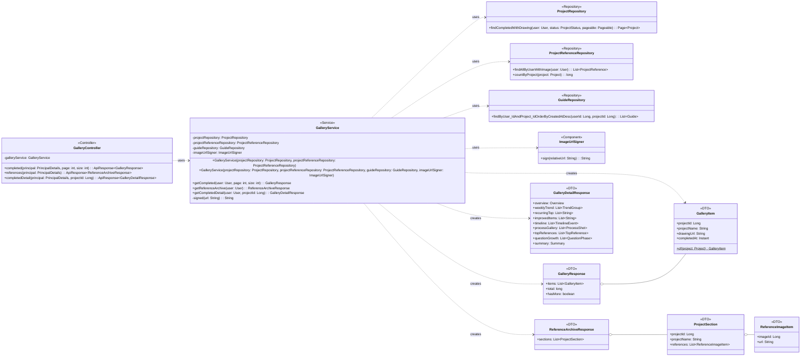

## Gallery Class Diagram

## GalleryController 클래스 정보

| 구분 | Name | Type | Visibility | Description |
| --- | --- | --- | --- | --- |
| **class** | GalleryController | `<<Controller>>` | public | 갤러리 도메인 REST 진입점. `@RequestMapping("/gallery")`, GET 전용 읽기 컨트롤러로 인증 유저의 완성작·레퍼런스를 조회한다. |
| **Attributes** | galleryService | GalleryService | private final | 조회 위임 대상 서비스. |
| **Operations** | completed | `ApiResponse<GalleryResponse>` | public | 완성작 갤러리 조회 (GET /gallery/completed?page&size). `@AuthenticationPrincipal` 유저 기준, page≥0(기본 0)·size 1~100(기본 20) 검증 후 `galleryService.getCompleted` 위임.  |
| **Operations** | references | `ApiResponse<ReferenceArchiveResponse>` | public | 레퍼런스 아카이브 조회 (GET /gallery/references). 인증 유저의 프로젝트별 레퍼런스 섹션을 `galleryService.getReferenceArchive` 로 조회.  |
| **Operations** | completedDetail | `ApiResponse<GalleryDetailResponse>` | public | 완성작 상세(회고) 조회 (GET /gallery/completed/{projectId}). 한 완성 프로젝트의 가이드 히스토리를 `galleryService.getCompletedDetail` 로 집계(성장 서사·타임라인·프로세스 갤러리).  |

## GalleryService 클래스 정보

| 구분 | Name | Type | Visibility | Description |
| --- | --- | --- | --- | --- |
| **class** | GalleryService | `<<Service>>` | public | 완성작 갤러리 + 레퍼런스 아카이브 + 완성작 상세(회고) 조회 코디네이터. 자체 엔티티 없이 리포지토리를 조합하는 읽기 전용(`@Transactional(readOnly = true)`) 서비스. |
| **Attributes** | projectRepository | ProjectRepository | private final | 완성작(=drawingUrl 있는 COMPLETED 프로젝트) 페이징·소유 조회용 리포지토리. |
| **Attributes** | projectReferenceRepository | ProjectReferenceRepository | private final | 프로젝트 레퍼런스(JOIN FETCH)·레퍼런스 카운트 조회용 리포지토리. |
| **Attributes** | guideRepository | GuideRepository | private final | 완성작 상세(회고) 집계용 가이드 히스토리 조회. 2-인자 생성자 경로에서는 null. |
| **Attributes** | imageUrlSigner | ImageUrlSigner | private final | 브라우저 노출 전 이미지 URL 서명(s3:{key}→presigned, /images/{id}→HMAC). null(비-s3·테스트)이면 원본 통과. |
| **Operations** | getCompleted | GalleryResponse | public | 완성작 = drawingUrl 있는 `status=COMPLETED` 프로젝트를 `projectRepository.findCompletedWithDrawing(user, COMPLETED, PageRequest.of(page,size))` 로 페이징 조회 → `GalleryItem`(drawingUrl 은 `signed`) 매핑, `getTotalElements()`/`hasNext()` 로 total·hasMore.  |
| **Operations** | getReferenceArchive | ReferenceArchiveResponse | public | 아카이브 = 유저의 모든 ProjectReference 를 JOIN FETCH 로 조회(project.id DESC, addedAt DESC). 그 순서를 보존하는 LinkedHashMap 으로 프로젝트별 ProjectSection 에 ReferenceImageItem(url 은 `signed`) 을 그룹핑.  |
| **Operations** | getCompletedDetail | GalleryDetailResponse | public | 한 완성 프로젝트의 가이드 히스토리를 집계(회고). findById 후 소유 검증, 가이드 오름차순 정렬 후 overview/weeklyTrend/timeline/processGallery/topReferences/questionGrowth/summary 조립. 가이드 0개여도 500 없이 200.  |
| **Operations** | signed | String | private | 이미지 URL 서명 헬퍼 — `imageUrlSigner` 있으면 `sign`, 없으면 원본.  |

## 사용 리포지토리

| 구분 | Name | Type | Visibility | Description |
| --- | --- | --- | --- | --- |
| **ProjectRepository** | findCompletedWithDrawing | `Page<Project>` | public | drawingUrl 이 있는 `status=COMPLETED` 프로젝트를 유저 기준 최신순 페이징(파라미터: user, status, pageable). 완성작 = AI 이미지가 아니라 **완성 처리된 프로젝트의 업로드 그림**. |
| **ProjectReferenceRepository** | findAllByUserWithImage | `List<ProjectReference>` | public | `SELECT pr FROM ProjectReference pr JOIN FETCH pr.image JOIN FETCH pr.project p WHERE p.user = :user ORDER BY p.id DESC, pr.addedAt DESC`. 유저의 모든 레퍼런스를 image·project 즉시 로딩으로 조회(프로젝트 최신순, 그 안에서 추가 최신순). |
| **ProjectReferenceRepository** | countByProject | long | public | 프로젝트별 레퍼런스 개수(완성작 상세 Overview referenceCount 용). |
| **GuideRepository** | findByUser_IdAndProject_IdOrderByCreatedAtDesc | `List<Guide>` | public | 완성작 상세 회고 집계용 — 유저·프로젝트의 가이드 히스토리를 최신순 조회(서비스에서 오름차순으로 뒤집음). |

## GalleryResponse 클래스 정보

| 구분 | Name | Type | Visibility | Description |
| --- | --- | --- | --- | --- |
| **class** | GalleryResponse | `<<DTO>>` | public record | 완성작 갤러리 목록 응답. items/total/hasMore 페이징 계약. |
| **Attributes** | items | `List<GalleryItem>` | public | 완성작 항목 목록. |
| **Attributes** | total | long | public | 전체 완성작 개수(`Page.getTotalElements()`). |
| **Attributes** | hasMore | boolean | public | 다음 페이지 존재 여부(`Page.hasNext()`). |

## GalleryItem 클래스 정보

| 구분 | Name | Type | Visibility | Description |
| --- | --- | --- | --- | --- |
| **class** | GalleryItem | `<<DTO>>` | public record | 완성작 갤러리 단일 항목 — 완성(COMPLETED) 처리된 프로젝트의 완성 그림. `@JsonInclude(ALWAYS)`. drawingUrl 은 업로드 완성 그림의 서빙 경로(`/images/{blobId}`, prod 는 서명됨). |
| **Attributes** | projectId | Long | public | 완성 프로젝트 식별자. |
| **Attributes** | projectName | String | public | 프로젝트 이름. |
| **Attributes** | drawingUrl | String | public | 완성 그림 서빙 경로(썸네일/다운로드 공용). |
| **Attributes** | completedAt | Instant | public | 완성 시각(project.updatedAt). |
| **Operations** | of | GalleryItem | public static | Project 엔티티를 GalleryItem 으로 매핑하는 팩토리.  |

## GalleryDetailResponse 클래스 정보

| 구분 | Name | Type | Visibility | Description |
| --- | --- | --- | --- | --- |
| **class** | GalleryDetailResponse | `<<DTO>>` | public record | 완성작 상세(회고) 응답. `@JsonInclude(ALWAYS)`. 한 완성 프로젝트의 가이드 히스토리를 집계해 성장 서사·타임라인·프로세스 갤러리로 조립. additive read-only 계약(라벨 매핑은 프론트). |
| **Attributes** | overview | Overview | public | 개요(프로젝트명·대표 이미지·작업기간·가이드/레퍼런스/드로잉 수). nested record. |
| **Attributes** | weeklyTrend | `List<TrendGroup>` | public | 주별 그룹(전체/형태/구조/표현/연출)×주 count 추이. |
| **Attributes** | recurringTop | `List<String>` | public | 반복된 primaryFocus axisId 상위(최대 6, 프론트 3+더보기). |
| **Attributes** | improvedItems | `List<String>` | public | 전반엔 있고 후반엔 사라진 axisId(=개선됨). |
| **Attributes** | timeline | `List<TimelineEvent>` | public | 스케치 시작·가이드·완료 마일스톤 타임라인. |
| **Attributes** | processGallery | `List<ProcessShot>` | public | 업로드 있는 가이드의 진행 스냅샷(n차). |
| **Attributes** | topReferences | `List<TopReference>` | public | 참조 빈도 상위 레퍼런스(최대 3). |
| **Attributes** | questionGrowth | `List<QuestionPhase>` | public | requestText 있는 가이드를 초/중/후기로 3등분한 대표 질문. |
| **Attributes** | summary | Summary | public | 대표 축의 첫/마지막 주 요청 수(null 가능). |

## ReferenceArchiveResponse 클래스 정보

| 구분 | Name | Type | Visibility | Description |
| --- | --- | --- | --- | --- |
| **class** | ReferenceArchiveResponse | `<<DTO>>` | public record | 레퍼런스 아카이브 응답. `@JsonInclude(ALWAYS)`. 프로젝트별 섹션 구조로 구성된다. |
| **Attributes** | sections | `List<ProjectSection>` | public | 프로젝트별 레퍼런스 섹션 목록(프로젝트 최신순). |
| **class** | ProjectSection | `<<DTO>>` | public record (nested) | 한 프로젝트와 그 프로젝트에 담긴 레퍼런스 이미지 목록을 묶은 섹션. |
| **Attributes** | projectId | Long | public | 프로젝트 식별자. |
| **Attributes** | projectName | String | public | 프로젝트 이름. |
| **Attributes** | references | `List<ReferenceImageItem>` | public | 해당 프로젝트의 레퍼런스 이미지 목록(추가 최신순). |
| **class** | ReferenceImageItem | `<<DTO>>` | public record (nested) | 레퍼런스 이미지 단일 항목. |
| **Attributes** | imageId | Long | public | 레퍼런스 이미지 식별자. |
| **Attributes** | url | String | public | 이미지 저장 경로. |
