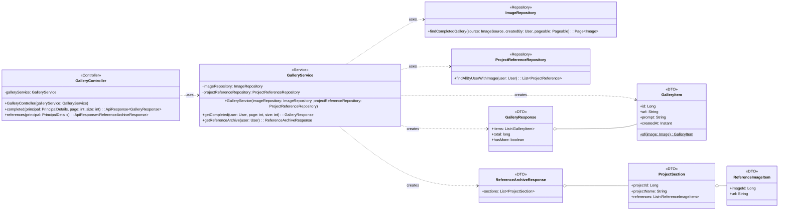

## Gallery Class Diagram

## GalleryController 클래스 정보

| 구분 | Name | Type | Visibility | Description |
| --- | --- | --- | --- | --- |
| **class** | GalleryController | `<<Controller>>` | public | 갤러리 도메인 REST 진입점. `@RequestMapping("/gallery")`, GET 전용 읽기 컨트롤러로 인증 유저의 완성작·레퍼런스를 조회한다. |
| **Attributes** | galleryService | GalleryService | private final | 조회 위임 대상 서비스. |
| **Operations** | completed | ApiResponse&lt;GalleryResponse&gt; | public | 완성작 갤러리 조회 (GET /gallery/completed?page&size). `@AuthenticationPrincipal` 유저 기준, page≥0(기본 0)·size 1~100(기본 20) 검증 후 `galleryService.getCompleted` 위임.  |
| **Operations** | references | ApiResponse&lt;ReferenceArchiveResponse&gt; | public | 레퍼런스 아카이브 조회 (GET /gallery/references). 인증 유저의 프로젝트별 레퍼런스 섹션을 `galleryService.getReferenceArchive` 로 조회.  |

## GalleryService 클래스 정보

| 구분 | Name | Type | Visibility | Description |
| --- | --- | --- | --- | --- |
| **class** | GalleryService | `<<Service>>` | public | 완성작 갤러리 + 레퍼런스 아카이브 조회 코디네이터. 자체 엔티티 없이 두 리포지토리를 조합하는 읽기 전용(`@Transactional(readOnly = true)`) 서비스. |
| **Attributes** | imageRepository | ImageRepository | private final | 완성작(AI 이미지) 페이징 조회용 리포지토리. |
| **Attributes** | projectReferenceRepository | ProjectReferenceRepository | private final | 프로젝트 레퍼런스(JOIN FETCH) 조회용 리포지토리. |
| **Operations** | getCompleted | GalleryResponse | public | 완성작 = `source=AI AND createdBy=user` 인 Image 를 최신순(createdAt DESC, id DESC) 페이징 조회. `PageRequest.of(page, size)` 로 조회 후 `GalleryItem.of` 매핑, `result.getTotalElements()`/`hasNext()` 로 total·hasMore 구성.  |
| **Operations** | getReferenceArchive | ReferenceArchiveResponse | public | 아카이브 = 유저의 모든 ProjectReference 를 JOIN FETCH 로 조회(project.id DESC, addedAt DESC 정렬). 그 순서를 보존하는 LinkedHashMap 으로 프로젝트별 ProjectSection 에 ReferenceImageItem 을 그룹핑한다.  |

## 사용 리포지토리

| 구분 | Name | Type | Visibility | Description |
| --- | --- | --- | --- | --- |
| **ImageRepository** | findCompletedGallery | Page&lt;Image&gt; | public | `SELECT i FROM Image i WHERE i.source = :source AND i.createdBy = :createdBy ORDER BY i.createdAt DESC, i.id DESC`. 특정 유저가 만든 AI 이미지를 최신순 페이징(파라미터: source, createdBy, pageable). |
| **ProjectReferenceRepository** | findAllByUserWithImage | List&lt;ProjectReference&gt; | public | `SELECT pr FROM ProjectReference pr JOIN FETCH pr.image JOIN FETCH pr.project p WHERE p.user = :user ORDER BY p.id DESC, pr.addedAt DESC`. 유저의 모든 레퍼런스를 image·project 즉시 로딩으로 조회(프로젝트 최신순, 그 안에서 추가 최신순). |

## GalleryResponse 클래스 정보

| 구분 | Name | Type | Visibility | Description |
| --- | --- | --- | --- | --- |
| **class** | GalleryResponse | `<<DTO>>` | public record | 완성작 갤러리 목록 응답. items/total/hasMore 페이징 계약. |
| **Attributes** | items | List&lt;GalleryItem&gt; | public | 완성작 항목 목록. |
| **Attributes** | total | long | public | 전체 완성작 개수(`Page.getTotalElements()`). |
| **Attributes** | hasMore | boolean | public | 다음 페이지 존재 여부(`Page.hasNext()`). |

## GalleryItem 클래스 정보

| 구분 | Name | Type | Visibility | Description |
| --- | --- | --- | --- | --- |
| **class** | GalleryItem | `<<DTO>>` | public record | 완성작 갤러리 단일 항목. `@JsonInclude(ALWAYS)`. url 은 Image.url(저장 경로)을 그대로 노출하며 실제 이미지 서빙은 GET /images/{id} 가 담당. |
| **Attributes** | id | Long | public | Image 식별자. |
| **Attributes** | url | String | public | 이미지 저장 경로. |
| **Attributes** | prompt | String | public | 생성 프롬프트. |
| **Attributes** | createdAt | Instant | public | 생성 시각. |
| **Operations** | of | GalleryItem | public static | Image 엔티티를 GalleryItem 으로 매핑하는 팩토리.  |

## ReferenceArchiveResponse 클래스 정보

| 구분 | Name | Type | Visibility | Description |
| --- | --- | --- | --- | --- |
| **class** | ReferenceArchiveResponse | `<<DTO>>` | public record | 레퍼런스 아카이브 응답. `@JsonInclude(ALWAYS)`. 프로젝트별 섹션 구조로 구성된다. |
| **Attributes** | sections | List&lt;ProjectSection&gt; | public | 프로젝트별 레퍼런스 섹션 목록(프로젝트 최신순). |
| **class** | ProjectSection | `<<DTO>>` | public record (nested) | 한 프로젝트와 그 프로젝트에 담긴 레퍼런스 이미지 목록을 묶은 섹션. |
| **Attributes** | projectId | Long | public | 프로젝트 식별자. |
| **Attributes** | projectName | String | public | 프로젝트 이름. |
| **Attributes** | references | List&lt;ReferenceImageItem&gt; | public | 해당 프로젝트의 레퍼런스 이미지 목록(추가 최신순). |
| **class** | ReferenceImageItem | `<<DTO>>` | public record (nested) | 레퍼런스 이미지 단일 항목. |
| **Attributes** | imageId | Long | public | 레퍼런스 이미지 식별자. |
| **Attributes** | url | String | public | 이미지 저장 경로. |
