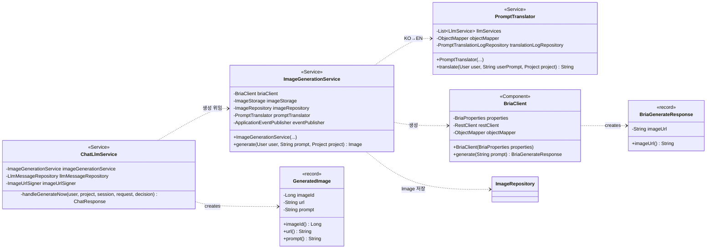

## AI 이미지 생성 (GENERATE · legacy) Class Diagram

AI 이미지 생성은 신규 워크플로(WorkflowService) 로 옮기지 않고 레거시 직접 합성 경로에 남아 있다. 라이브 게이트(`workflowComposeProperties.isLive`) 는 COMPOSE 로 종착하는 의도만 허용하는데, 생성은 Bria 호출·엔티티 영속화로 끝나 이 계약을 만족하지 못하고, 워크플로 executor 들은 아직 스켈레톤이며, `ImageGenerationService` 가 `Image` 엔티티에 강하게 의존하기 때문이다. 그래서 `ChatLlmService.chat()` 은 명시적 `GENERATE_NOW` 결정을 라이브 게이트 **이전**에 short-circuit 해 곧장 `handleGenerateNow(...)` → 레거시 합성으로 흘린다. 트리거는 둘이다. ① 사용자가 명시적으로 "그려줘/만들어줘" 라고 한 경우 `GENERATE_NOW` 로 즉시 생성, ② 검색은 했으나 레퍼런스가 비었을 때(`NEW_SEARCH && references.isEmpty()`) 는 생성을 **제안(offerGenerate)** 만 하고, 사용자가 수락(버튼)하면 `generateImage(...)` 로 생성한다.

## ChatLlmService 클래스 정보

| 구분 | Name | Type | Visibility | Description |
| --- | --- | --- | --- | --- |
| **class** | ChatLlmService | `class` | public | 채팅 오케스트레이터. `chat()` 안에서 의도 라우팅 결과가 `GENERATE_NOW` 면 라이브 게이트 검사 **이전**에 short-circuit 한다. |
| **Attributes** | imageGenerationService | `ImageGenerationService` | private | 레거시 직접 합성 위임 대상.   imageUrlSigner | `ImageUrlSigner` | private | 저장된 이미지 URL 을 서명해 응답에 담는다.   llmMessageRepository | `LlmMessageRepository` | private | USER·ASSISTANT 메시지 영속화. |
| **Operations** | handleGenerateNow | `ChatResponse` | private | `GENERATE_NOW` 분기. 검색·LLM 답변을 모두 건너뛰고 USER 메시지 저장 → `imageGenerationService.generate(user, decision.keywords(), project)` 호출 → 고정 안내 문구로 ASSISTANT 메시지 저장(할루시네이션 차단) → `ChatResponse.generatedImage` 에 새 이미지(서명 URL) 를 담아 반환. 시그니처는 `(User, Project, ChatSession, ChatRequest, ExtractionResult)`. |

## ImageGenerationService 클래스 정보

| 구분 | Name | Type | Visibility | Description |
| --- | --- | --- | --- | --- |
| **class** | ImageGenerationService | `class` | public | Bria 로 이미지를 생성하고 결과 바이트를 `ImageStorage`(DB) 에 영구 저장한 뒤 `Image` 엔티티를 만들어 반환한다. Bria 의 `image_url` 은 임시라 즉시 다운로드해 우리 DB 로 옮긴다. |
| **Attributes** | briaClient | `BriaClient` | private | Bria 생성 API 호출.   imageStorage | `ImageStorage` | private | 다운로드한 바이트를 DB blob 으로 영구 저장.   imageRepository | `ImageRepository` | private | `Image` 엔티티 영속화.   promptTranslator | `PromptTranslator` | private | 한국어 프롬프트 → 영문 변환.   eventPublisher | `ApplicationEventPublisher` | private | `AiImageCreatedEvent` 발행. |
| **Operations** | generate | `Image` | public | `@Transactional`. 체인: `PromptTranslator`(Grok) 로 KO→EN 변환 → `BriaClient.generate(en)` → 임시 `image_url` 다운로드 → `ImageStorage.store` 영구 저장 → `Image` 생성 후 `ImageRepository` 영속화(`sourceId="ai_<id>"`) → `AnalyticsEventService.track(IMAGE_GENERATED)` → commit 후 비동기 CLIP 인덱싱을 위해 `AiImageCreatedEvent` 발행. 빈 프롬프트는 `INVALID_INPUT`, 다운로드·빈 바이트는 `AI_SERVICE_ERROR`. |

## PromptTranslator 클래스 정보

| 구분 | Name | Type | Visibility | Description |
| --- | --- | --- | --- | --- |
| **class** | PromptTranslator | `class` | public | 한국어 채팅 메시지를 Bria 가 잘 이해하는 영문 image-generation prompt 로 변환. 고정 모델(Grok) 사용 — 단순·짧아 저렴한 모델로 충분하고 비용·응답시간 예측성 확보. |
| **Attributes** | llmServices | `List<LlmService>` | private | provider 가 `GROK` 인 서비스를 골라 쓴다(`pickService`).   objectMapper | `ObjectMapper` | private | `{"prompt": "..."}` JSON 파싱.   translationLogRepository | `PromptTranslationLogRepository` | private | 변환 결과를 `prompt_translation_logs` 에 기록. |
| **Operations** | translate | `String` | public | 프로젝트의 subject/technique/mood 를 함께 반영해 영문 프롬프트 1개를 반환. LLM 호출 실패·빈 결과·정제 실패 시 원문(`userPrompt`) 으로 fallback. JSON 파싱 실패 시 `sanitize` fallback. |

## BriaClient 클래스 정보

| 구분 | Name | Type | Visibility | Description |
| --- | --- | --- | --- | --- |
| **class** | BriaClient | `class` | public | Bria 이미지 생성 REST 클라이언트(`/v2/image/generate`). 동기 `image_url` 즉시 반환 또는 비동기 `status_url` 폴링(최대 30회, 1초 간격) 을 모두 처리. |
| **Attributes** | properties | `BriaProperties` | private | baseUrl·apiKey(`api_token` 헤더) 구성.   restClient | `RestClient` | private | POST 생성 및 GET 폴링.   objectMapper | `ObjectMapper` | private | 응답 JSON 에서 `image_url` 추출. |
| **Operations** | generate | `BriaGenerateResponse` | public | 프롬프트로 생성 요청. apiKey 누락·HTTP 오류·폴링 타임아웃·`status=failed/error` 등은 모두 `AI_SERVICE_ERROR`. `image_url` 발견 시 `BriaGenerateResponse` 로 감싸 반환. |

## BriaGenerateResponse 클래스 정보

| 구분 | Name | Type | Visibility | Description |
| --- | --- | --- | --- | --- |
| **class** | BriaGenerateResponse | `record` | public | Bria 생성 응답 DTO. `@JsonIgnoreProperties(ignoreUnknown = true)`. |
| **Attributes** | imageUrl | `String` | private | `@JsonProperty("image_url")`. 생성된 이미지의 임시 URL — `ImageGenerationService` 가 즉시 다운로드한다. |
| **Operations** | imageUrl | `String` | public | record accessor. |

## GeneratedImage 클래스 정보

| 구분 | Name | Type | Visibility | Description |
| --- | --- | --- | --- | --- |
| **class** | GeneratedImage | `record` | public | `ChatResponse.GeneratedImage` — 사용자의 명시적 "만들어줘" 요청(`GENERATE_NOW`) 에 응답해 즉시 생성된 이미지. 그 외 경우 `ChatResponse.generatedImage` 는 null. |
| **Attributes** | imageId | `Long` | private | 영속화된 `Image` 의 PK.   url | `String` | private | 서명된(`imageUrlSigner.sign`) 이미지 URL.   prompt | `String` | private | 생성에 쓰인 프롬프트(`decision.keywords()`). |
| **Operations** | imageId / url / prompt | `Long` / `String` / `String` | public | record accessors. |

## legacy 인 이유

- **COMPOSE 종착 계약**: 라이브 게이트는 COMPOSE 로 종착하는 의도만 허용하는데, 생성은 Bria 호출·엔티티 영속화로 끝나 이 계약을 만족하지 못한다.
- **엔티티 의존**: `ImageGenerationService` 가 `Image` 엔티티 생성·영속화에 강하게 묶여 있어 워크플로 executor 추상화로 그대로 옮기기 어렵다(executor 들은 아직 스켈레톤).
- **부팅 검증**: 워크플로 compose 라이브 플래그는 기본 off 이며 부팅 시 검증을 거치므로, 생성 경로는 검증 대상에서 빠진 레거시 직접 합성으로 남는다.
- **short-circuit**: `chat()` 은 `GENERATE_NOW` 를 라이브 게이트보다 먼저 가로채 `handleGenerateNow(...)` 로 즉시 분기하므로, 생성은 결코 워크플로 경로에 진입하지 않는다.
