## ⭐ Guide Class Diagram

이미지 기반 그림 진단/코칭(한 끗 가이드) 도메인. 백엔드는 **오케스트레이션만** 담당하고, 실제 비전/코칭 파이프라인(OpenCLIP ViT-L/14 → observation 신호 + mediapipe 손 게이트 → Qdrant 레퍼런스 검색 → LLM 코칭)은 외부 `fastapi-guide` 서비스에서 수행한다.

```mermaid
classDiagram
    direction LR

    class GuideController {
        <<Controller>>
        -guideService: GuideService
        +GuideController(guideService: GuideService)
        +list(principal: PrincipalDetails, projectId: Long): ApiResponse~List~GuideResult~~
        +guide(principal: PrincipalDetails, projectId: Long, file: MultipartFile, message: String, intent: String, track: String, medium: String, idempotencyKey: String): ApiResponse~GuideResult~
        +referenceFeedback(principal: PrincipalDetails, projectId: Long, guideId: String, request: ReferenceFeedbackRequest): ApiResponse~Void~
        +guideFeedback(principal: PrincipalDetails, projectId: Long, guideId: String, request: GuideFeedbackRequest): ApiResponse~Void~
    }

    class GuideAssetProxyController {
        <<Controller>>
        -guideClient: GuideClient
        +GuideAssetProxyController(guideClient: GuideClient)
        +image(refId: String): ResponseEntity~byte[]~
        +guideAsset(refId: String): ResponseEntity~byte[]~
    }

    class GuideService {
        <<Service>>
        -MAX_REFERENCES: int
        -guideClient: GuideClient
        -guideRepository: GuideRepository
        -guideFeedbackRepository: GuideFeedbackRepository
        -projectRepository: ProjectRepository
        -imageStorage: DbImageStorage
        -imageBlobRepository: ImageBlobRepository
        -guidePublicUrl: String
        +guide(user: User, projectId: Long, file: MultipartFile, message: String, intent: String, track: String, medium: String, idempotencyKey: String): GuideResult
        +list(user: User, projectId: Long): List~GuideResult~
        +adoptReferences(user: User, projectId: Long, guideId: String, event: String, referenceIds: List~String~): void
        +setGuideFeedback(user: User, projectId: Long, guideId: String, feedback: String): void
        -persistGuide(reqId: String, resp: GuideResponse, user: User, project: Project, bytes: byte[], mime: String): Guide
        -storeUploadQuietly(user: User, bytes: byte[], mime: String): ImageBlob
        -allReferenceIds(resp: GuideResponse): Set~String~
        -buildResult(resp: GuideResponse, createdAt: Instant, uploadUrl: String): GuideResult
        -uploadUrl(g: Guide): String
        -resolveReferences(resp: GuideResponse): List~ResolvedReference~
        -referenceUrl(refId: String): String
        -loadProjectAuthorized(user: User, projectId: Long): Project
    }

    class GuideClient {
        <<Client>>
        -webClient: WebClient
        +GuideClient(guideUrl: String)
        +guideImage(imageBytes: byte[], filename: String, mimeType: String, message: String, userId: String, intent: String, track: String, medium: String, requestId: String): GuideResponse
        +adopt(guideId: String, referenceId: String, event: String): void
        +fetchAsset(path: String): ResponseEntity~byte[]~
    }

    class GuideRepository {
        <<Repository>>
        +findByRequestId(requestId: String): Optional~Guide~
        +findByGuideId(guideId: String): Optional~Guide~
        +findByUser_IdAndProject_IdOrderByCreatedAtDesc(userId: Long, projectId: Long): List~Guide~
    }

    class GuideFeedbackRepository {
        <<Repository>>
        +findByUserAndGuide(user: User, guide: Guide): Optional~GuideFeedback~
    }

    class Guide {
        <<Entity>>
        -id: Long
        -requestId: String
        -guideId: String
        -user: User
        -project: Project
        -upload: ImageBlob
        -primaryFocus: String
        -degraded: boolean
        -payload: GuideResponse
        -createdAt: Instant
    }

    class GuideFeedback {
        <<Entity>>
        -id: Long
        -user: User
        -guide: Guide
        -sessionId: String
        -feedback: FeedbackType
        -createdAt: Instant
    }

    class GuideResult {
        <<record>>
        +guide: GuideResponse
        +references: List~ResolvedReference~
        +createdAt: Instant
        +uploadUrl: String
    }

    class GuideResponse {
        <<record>>
        +mode: String
        +guideId: String
        +primaryFocus: String
        +degraded: boolean
        +blocks: List~GuideBlock~
        +synthesis: String
        +oneThing: String
        +message: String
        +nextSteps: NextSteps
        +growth: Growth
        +reason: String
        +nextStepsNote: String
    }

    class ResolvedReference {
        <<record>>
        +ordinal: int
        +refId: String
        +url: String
    }

    class GuideFeedbackRequest {
        <<DTO>>
        +feedback: String
    }

    class ReferenceFeedbackRequest {
        <<DTO>>
        +event: String
        +referenceIds: List~String~
    }

    GuideController ..> GuideService : uses
    GuideController ..> GuideResult : returns
    GuideController ..> GuideFeedbackRequest : reads
    GuideController ..> ReferenceFeedbackRequest : reads
    GuideAssetProxyController ..> GuideClient : uses
    GuideService ..> GuideClient : uses (HTTP fastapi-guide)
    GuideService ..> GuideRepository : uses
    GuideService ..> GuideFeedbackRepository : uses
    GuideService ..> Guide : persists
    GuideService ..> GuideFeedback : persists
    GuideService ..> GuideResult : creates
    GuideService ..> ResolvedReference : creates
    GuideClient ..> GuideResponse : creates
    Guide ..> GuideResponse : payload
    GuideRepository ..> Guide : manages
    GuideFeedbackRepository ..> GuideFeedback : manages
    GuideResult ..> GuideResponse : wraps
    GuideResult ..> ResolvedReference : contains
```

## GuideController 클래스 정보

| 구분 | Name | Type | Visibility | Description |
| --- | --- | --- | --- | --- |
| **class** | GuideController | `<<Controller>>` | public | 이미지 가이딩(한 끗 가이드) 전용 엔드포인트. 클립📎 업로드 모달이 호출. 멀티파트 file(필수) + message/intent/track/medium(선택), 멱등은 Idempotency-Key 헤더로. 베이스 경로 `/projects/{projectId}/guide` |
| **Attributes** | guideService | GuideService | private | 가이드 오케스트레이션 서비스 |
| **Operations** | list | ApiResponse&lt;List&lt;GuideResult&gt;&gt; | public | 가이드 이력 조회 (GET /projects/{id}/guide). 채팅 재진입 시 가이드 카드 복원용 — 프로젝트의 가이드 히스토리(오래된→최신) |
| **Operations** | guide | ApiResponse&lt;GuideResult&gt; | public | 그림 업로드→가이드 (POST /projects/{id}/guide, multipart). file 업로드 후 외부 비전/코칭 파이프라인 결과 반환 |
| **Operations** | guideFeedback | ApiResponse&lt;Void&gt; | public | 가이드 피드백 (POST /projects/{id}/guide/{guideId}/feedback). body `{"feedback":"like"\|"dislike"\|null}`, null은 토글 해제 |
| **Operations** | referenceFeedback | ApiResponse&lt;Void&gt; | public | 추천 레퍼런스 피드백 (POST .../{guideId}/references/feedback). body `{"event":"liked"\|"disliked"}` — 본 레퍼런스(최대 3컷)에 묶음 기록 |

 

## GuideAssetProxyController 클래스 정보

| 구분 | Name | Type | Visibility | Description |
| --- | --- | --- | --- | --- |
| **class** | GuideAssetProxyController | `<<Controller>>` | public | 가이드 자산(레퍼런스 이미지·도식) 공개 프록시. 내부(Service Connect) guide ECS를 브라우저가 직접 못 열기에 백엔드가 `/image`·`/guide-asset`로 포워딩(presigned 302는 그대로 흘려보냄). 인증 불필요(이미지 태그는 토큰을 못 실음) |
| **Attributes** | guideClient | GuideClient | private | 내부 guide 서비스 자산 프록시 클라이언트 |
| **Operations** | image | ResponseEntity&lt;byte[]&gt; | public | 레퍼런스 이미지 프록시 (GET /image/{refId}) → 내부 guide `/image` 포워딩 |
| **Operations** | guideAsset | ResponseEntity&lt;byte[]&gt; | public | 도식/자산 슬롯 프록시 (GET /guide-asset/{*refId}) → 내부 guide `/guide-asset` 포워딩. refId가 슬래시/콜론을 포함할 수 있어 와일드카드 |

 

## GuideService 클래스 정보

| 구분 | Name | Type | Visibility | Description |
| --- | --- | --- | --- | --- |
| **class** | GuideService | `<<Service>>` | public | 가이드 오케스트레이션. 핵심 설계: ① **멱등** — Idempotency-Key → `findByRequestId` dedup(이미 처리된 키면 저장 페이로드 재사용·재보강만). ② **coach 모드만 영속**(refused/redirect/clarify는 히스토리에 안 남김). ③ 업로드 썸네일은 ImageBlob에 선택 저장(실패는 non-fatal — upload_id만 null). ④ 느린 LLM 코칭 호출은 **트랜잭션 밖**에서 수행(DB 커넥션 장시간 점유 방지). ⑤ **growth 키 = user_id**. 비전 파이프라인은 fastapi-guide에서 수행 |
| **Attributes** | MAX_REFERENCES | int | private static | 보강 레퍼런스 최대 컷 수(=3) |
| **Attributes** | guideClient | GuideClient | private | 외부 fastapi-guide HTTP 클라이언트 |
| **Attributes** | guideRepository | GuideRepository | private | 가이드 영속 레포 |
| **Attributes** | guideFeedbackRepository | GuideFeedbackRepository | private | 가이드 전체 피드백 레포 |
| **Attributes** | projectRepository | ProjectRepository | private | 프로젝트 접근 권한 확인 |
| **Attributes** | imageStorage | DbImageStorage | private | 업로드 원본 썸네일 DB 저장(구체 타입 주입 — s3 프로파일에서도 DB 서빙 보장) |
| **Attributes** | imageBlobRepository | ImageBlobRepository | private | 저장된 ImageBlob 프록시 조회 |
| **Attributes** | guidePublicUrl | String | private | 레퍼런스 이미지 브라우저 도달용 base(`/image/{ref_id}`) |
| **Operations** | guide | GuideResult | public | 업로드→가이드 핵심 흐름: 권한 확인 → 멱등 키 결정/dedup → bytes 추출 → (TX 밖) `guideClient.guideImage` 호출 → coach면 `persistGuide` → 결과 빌드 |
| **Operations** | list | List&lt;GuideResult&gt; | public | 프로젝트 내 내 가이드 히스토리(DESC 조회 후 오래된→최신으로 뒤집음). 저장 payload로 레퍼런스 URL 재보강. `@Transactional(readOnly=true)` |
| **Operations** | adoptReferences | void | public | 레퍼런스 묶음 피드백(liked/disliked) → 페이로드 ref 풀 화이트리스트 필터(없으면 top-3 폴백) 후 guide `/adopt`로 best-effort 적재. `@Transactional(readOnly=true)` |
| **Operations** | setGuideFeedback | void | public | 가이드 전체 피드백 업서트(like/dislike) / null·빈값이면 토글 해제(삭제). (user_id, guide_id) UNIQUE로 사용자별 1행. `@Transactional` |
| **Operations** | persistGuide | Guide | private | coach 가이드 영속. request_id UNIQUE 경합(동시 중복 제출) 시 DataIntegrityViolation 삼키고 null 반환 |
| **Operations** | storeUploadQuietly | ImageBlob | private | 업로드 원본을 image_blobs에 저장(히스토리 썸네일용). 실패는 non-fatal — null 반환 |
| **Operations** | allReferenceIds | Set&lt;String&gt; | private | 페이로드 전체 블록 reference_ids 합집합(피드백 대상 화이트리스트) |
| **Operations** | buildResult | GuideResult | private | GuideResponse + resolveReferences + createdAt + uploadUrl 조립 |
| **Operations** | uploadUrl | String | private | 저장 업로드 원본 internal URL(`/images/{id}`), 없으면 null |
| **Operations** | resolveReferences | List&lt;ResolvedReference&gt; | private | 전체 블록 reference_ids 등장 순서 dedupe → 최대 3컷, 순번 + URL 보강 |
| **Operations** | referenceUrl | String | private | guidePublicUrl 기반 `/image/{refId}` URL 생성 |
| **Operations** | loadProjectAuthorized | Project | private | 프로젝트 로드 + 소유자 검증(NOT_FOUND / FORBIDDEN) |

 

## GuideClient 클래스 정보

| 구분 | Name | Type | Visibility | Description |
| --- | --- | --- | --- | --- |
| **class** | GuideClient | `<<Client>>` | public | 이미지 가이딩 전용 FastAPI 클라이언트. embed와 별도 ECS 서비스(`fastapi-guide.drawe-{env}.local:8000`, `${fastapi.guide.url}`). `/guide` 계약: multipart/form-data, file field="file". request_id(멱등 키) 동봉 → 네트워크 재시도에도 부작용 at-most-once. 타임아웃 150s, 연결 establishment 실패만 재시도(4xx/5xx·읽기 타임아웃은 미재시도) |
| **Attributes** | webClient | WebClient | private | `${fastapi.guide.url}` baseUrl WebClient |
| **Operations** | guideImage | GuideResponse | public | `POST /guide` 멀티파트(file + message/user_id/intent/track/medium/request_id). 외부 비전/코칭 파이프라인 호출, GuideResponse 역직렬화 |
| **Operations** | adopt | void | public | `POST /adopt`(guide_id/reference_id/event) → adoption_log 적재. 실패는 삼키고 로그만(best-effort, 5s 타임아웃) |
| **Operations** | fetchAsset | ResponseEntity&lt;byte[]&gt; | public | 자산 프록시. 내부 guide path로 GET, 302(presigned S3)는 그대로 반환(no-store), 2xx 본문은 Content-Type과 전달. 실패는 502 매핑. 경로탈출(`..`) 차단 |

 

## GuideResponse 클래스 정보

| 구분 | Name | Type | Visibility | Description |
| --- | --- | --- | --- | --- |
| **class** | GuideResponse | `<<record>>` | public | FastAPI guide `/guide` 응답 계약(Frontend↔Spring↔FastAPI 공유). snake_case → camelCase(SnakeCaseStrategy), 미지 필드 무시(전방 호환). 비-coach(refused/redirect/clarify)는 mode + message(+reason)만 채움. 중첩 record: GuideBlock/GuideAsset/NextSteps/Growth/RecurringStat/TrendPoint/Chips |
| **Attributes** | mode | String | public | coach \| redirect \| clarify \| refused — 영속/응답 분기 핵심 |
| **Attributes** | guideId | String | public | FastAPI 발급 guide_id(coach 모드). 비-coach면 null |
| **Attributes** | primaryFocus | String | public | 대표 초점 축 id |
| **Attributes** | degraded | boolean | public | 파이프라인 degrade 여부 |
| **Attributes** | blocks | List&lt;GuideBlock&gt; | public | 코칭 블록(subProblem/observation/effect/direction/referenceIds/confidence/guideAsset) |
| **Attributes** | synthesis | String | public | 종합 코멘트 |
| **Attributes** | oneThing | String | public | 한 끗(가장 중요한 한 가지) |
| **Attributes** | message | String | public | 비-coach 모드 안내 메시지 |
| **Attributes** | nextSteps | NextSteps | public | 다음 연습 가이드 |
| **Attributes** | growth | Growth | public | 성장 내러티브(growth 키 = user_id 기준) |
| **Attributes** | reason | String | public | 거절/리다이렉트 사유 |
| **Attributes** | nextStepsNote | String | public | 다음 단계 부가 노트 |

 

## Guide 클래스 정보

| 구분 | Name | Type | Visibility | Description |
| --- | --- | --- | --- | --- |
| **class** | Guide | `<<Entity>>` | public | 이미지 가이딩 결과 영속 레코드(지난 가이드·PDF·레퍼런스 재방문 근거). 테이블 `guides`. request_id UNIQUE(멱등, at-most-once). 인덱스: (user_id, project_id, created_at), guide_id |
| **Attributes** | id | Long | private | PK (IDENTITY) |
| **Attributes** | requestId | String | private | Spring 발급 멱등 키(UNIQUE, length 64) |
| **Attributes** | guideId | String | private | FastAPI 발급 guide_id(coach), 비-coach면 null |
| **Attributes** | user | User | private | 작성 사용자(LAZY, 필수) |
| **Attributes** | project | Project | private | 소속 프로젝트(LAZY, 필수, ON DELETE CASCADE) |
| **Attributes** | upload | ImageBlob | private | 원본 업로드 썸네일(LAZY, 선택, ON DELETE SET NULL) |
| **Attributes** | primaryFocus | String | private | 대표 초점 축 id |
| **Attributes** | degraded | boolean | private | degrade 여부 |
| **Attributes** | payload | GuideResponse | private | GuideResponse 전체(JSON 컬럼). reference_ids 형태 보관(만료되는 presigned URL 미저장) |
| **Attributes** | createdAt | Instant | private | 생성 시각(@CreationTimestamp) |

 

## GuideFeedback 클래스 정보

| 구분 | Name | Type | Visibility | Description |
| --- | --- | --- | --- | --- |
| **class** | GuideFeedback | `<<Entity>>` | public | 가이드 전체 피드백(👍/👎). adoption_log(레퍼런스 단위)와 분리된 "가이드가 유용했는가" 수집용. 테이블 `guide_feedback`, (user_id, guide_id) UNIQUE. ImageFeedback와 동일 패턴 |
| **Attributes** | id | Long | private | PK (IDENTITY) |
| **Attributes** | user | User | private | 피드백 사용자(LAZY, nullable — 추후 익명 session_id 여지) |
| **Attributes** | guide | Guide | private | 대상 가이드(LAZY, 필수) |
| **Attributes** | sessionId | String | private | 익명 세션 식별자(length 64) |
| **Attributes** | feedback | FeedbackType | private | LIKE \| DISLIKE (@Enumerated STRING) |
| **Attributes** | createdAt | Instant | private | 생성 시각(@CreationTimestamp) |

 

## GuideResult 클래스 정보

| 구분 | Name | Type | Visibility | Description |
| --- | --- | --- | --- | --- |
| **class** | GuideResult | `<<record>>` | public | 가이드 API 응답 = FastAPI GuideResponse(변형 없이) + Spring 보강 |
| **Attributes** | guide | GuideResponse | public | FastAPI 응답 그대로(blocks 안에 reference_ids) |
| **Attributes** | references | List&lt;ResolvedReference&gt; | public | 전체 블록 reference_ids 등장 순서 dedupe → 최대 3컷(순번 + URL 보강) |
| **Attributes** | createdAt | Instant | public | 가이드 생성/저장 시각 |
| **Attributes** | uploadUrl | String | public | 업로드 원본 썸네일 URL(`/images/{id}`), 없으면 null |

 

## ResolvedReference 클래스 정보

| 구분 | Name | Type | Visibility | Description |
| --- | --- | --- | --- | --- |
| **class** | ResolvedReference | `<<record>>` | public | 가이드 단위로 보강된 레퍼런스 한 컷 |
| **Attributes** | ordinal | int | public | 순번(1·2·3) |
| **Attributes** | refId | String | public | 레퍼런스 ref_id |
| **Attributes** | url | String | public | 브라우저 도달용 이미지 URL |

 

## GuideFeedbackRequest 클래스 정보

| 구분 | Name | Type | Visibility | Description |
| --- | --- | --- | --- | --- |
| **class** | GuideFeedbackRequest | `<<DTO>>` | public | 가이드 전체 피드백 요청 |
| **Attributes** | feedback | String | public | "like" \| "dislike" \| null. null/빈 값은 토글 해제(기존 피드백 삭제) |

 

## ReferenceFeedbackRequest 클래스 정보

| 구분 | Name | Type | Visibility | Description |
| --- | --- | --- | --- | --- |
| **class** | ReferenceFeedbackRequest | `<<DTO>>` | public | 가이드 내 레퍼런스 묶음 피드백 요청 |
| **Attributes** | event | String | public | "liked" \| "disliked" |
| **Attributes** | referenceIds | List&lt;String&gt; | public | 사용자가 실제로 본 레퍼런스 id 목록(페이로드 ref 풀로 화이트리스트 필터, 없으면 top-3 폴백) |