## ⭐ 의도 분류 · 키워드 추출 (Intent) Class Diagram

사용자 채팅 메시지의 의도를 분류하고 검색 키워드를 추출하는 핵심 기능이다. `ChatLlmService.routeIntent` 가 **2단계(2-tier)** 로 동작한다. 1차로 결정론적 `RulePreRouter` 룰 매처가 명확한 기능 신호(인사·감사 → SKIP, 명시적 생성 동사 → GENERATE_NOW)를 LLM 콜 0으로 끝내고, 룰 미스면 2차로 `KeywordExtractor`(Grok·xAI 경량 LLM)가 8개 액션(NEW_SEARCH/KEEP/SKIP/GENERATE_NOW/FOLLOWUP/COMPARE/REFERENCE_SIMILAR/PIN_SIMILAR)으로 분류한다. 두 결과는 `RoutedIntent`(decision + ruleDecided)로 감싸져 `IntentResultAdapter` 가 `IntentResult`(code + tier)로 정규화한다. NEW_SEARCH 의 실제 검색 키워드는 `KomoranKeywordExtractor` 가 추출하는데, Komoran 형태소 분석 → `ArtTermsDictionary` 한영 사전 매핑을 거치고 사전 미스율이 30% 를 초과하면 `GrokKeywordExtractorFallback`(Grok) 으로 폴백한다. 최종 `IntentResult.code` 는 `IntentRouting.ROUTING` 으로 `StepType` 시퀀스에 매핑되어 WorkflowService 가 실행한다.

```mermaid
classDiagram
    direction LR

    class ChatLlmService {
        <<Service>>
        -RulePreRouter rulePreRouter
        -KeywordExtractor keywordExtractor
        -IntentResultAdapter intentResultAdapter
        -WorkflowService workflowService
        -routeIntent(user: User, sessionId: String, message: String, history: List~Turn~): RoutedIntent
    }

    class RulePreRouter {
        <<Component>>
        -Pattern GENERATE
        -Pattern THANKS_GREETING
        -Pattern CRITIQUE_REQUEST
        -Pattern OUT_OF_DOMAIN
        -Pattern ART_CONTEXT
        +route(message: String, history: List): Decision
        +isCritiqueRequest(message: String): boolean
        +isOutOfDomain(message: String): boolean
    }

    class KeywordExtractor {
        <<Component>>
        -String SYSTEM_PROMPT
        -List~LlmService~ llmServices
        +extract(message: String, history: List~Turn~): ExtractionResult
        -parseResult(output: String): ExtractionResult
        -parseArtIntent(label: String): IntentCode
    }

    class IntentResultAdapter {
        <<Component>>
        +adapt(decision: ExtractionResult, ruleDecided: boolean, refs: List~Integer~, hasImg: boolean): IntentResult
        +adaptSelfCritique(refs: List~Integer~): IntentResult
        +adaptOutOfDomain(): IntentResult
        -toCode(decision: ExtractionResult): IntentCode
    }

    class KomoranKeywordExtractor {
        <<Component>>
        -Set~String~ CONTENT_TAGS
        -Set~String~ STOPWORDS
        -double LLM_FALLBACK_THRESHOLD
        -ArtTermsDictionary dictionary
        -KeywordExtractorFallback fallback
        -Komoran komoran
        +extract(cleanedMessage: String): List~String~
        +analyze(cleanedMessage: String): List~Token~
        -doExtract(cleanedMessage: String): List~String~
    }

    class ArtTermsDictionary {
        <<Component>>
        -Map~String,String~ koToEn
        -Map~String,String~ koToCategory
        +lookup(koStem: String): Optional~String~
        +getCategory(koStem: String): Optional~String~
        +size(): int
    }

    class KeywordExtractorFallback {
        <<interface>>
        +extract(cleanedMessage: String): List~String~
    }

    class GrokKeywordExtractorFallback {
        <<Component>>
        -int MAX_KEYWORDS
        -String SYSTEM_PROMPT
        -GrokService grokService
        -ObjectMapper objectMapper
        +extract(cleanedMessage: String): List~String~
        -parseKeywords(content: String): List~String~
    }

    class Decision {
        <<record>>
        +String ruleId
        +ExtractionResult result
        +isHit(): boolean
        +hit(ruleId: String, result: ExtractionResult)$ Decision
        +miss()$ Decision
    }

    class ExtractionResult {
        <<record>>
        +Action action
        +String keywords
        +IntentCode artIntent
        +Integer anchorIndex
        +newSearch(keywords: String)$ ExtractionResult
        +keep()$ ExtractionResult
        +skip()$ ExtractionResult
        +followup()$ ExtractionResult
        +compare()$ ExtractionResult
        +generateNow(prompt: String)$ ExtractionResult
        +referenceSimilar(anchorIndex: int)$ ExtractionResult
        +pinSimilar(anchorIndex: int)$ ExtractionResult
    }

    class IntentResult {
        <<record>>
        +IntentCode code
        +List~Integer~ referencedImages
        +boolean hasUploadedImage
        +Tier tier
        +of(code: IntentCode, tier: Tier)$ IntentResult
        +hasReferencedImages(): boolean
    }

    class RoutedIntent {
        <<record>>
        +ExtractionResult decision
        +boolean ruleDecided
    }

    class IntentCode {
        <<enumeration>>
        OUT_OF_DOMAIN("000")
        COMPOSITION("001")
        LIGHTING("002")
        COLOR("003")
        TECHNIQUE("004")
        NEW_SEARCH("005")
        KEEP("006")
        SKIP("007")
        GENERATE("008")
        SELF_CRITIQUE("010")
        LEARNING_PATH("011")
        FOLLOWUP("012")
        COMPARE("013")
        +code(): String
    }

    note for IntentRouting "IntentCode → List~StepType~ 정적 라우팅 맵.\nWorkflowService 가 ROUTING.get(code) 로 step 시퀀스를 lookup 해 순차 실행.\nNEW_SEARCH→[EXTRACT_KEYWORDS, SEARCH, COMPOSE]\nGENERATE→[TRANSLATE, GENERATE_IMAGE]\nSELF_CRITIQUE→[CRITIQUE_UPLOAD, COMPOSE]\n그 외(001~004·KEEP·SKIP·FOLLOWUP·COMPARE·000)→[COMPOSE]"

    ChatLlmService ..> RulePreRouter : 1차 룰
    ChatLlmService ..> KeywordExtractor : 2차 Grok 폴백
    ChatLlmService ..> IntentResultAdapter : 정규화
    ChatLlmService ..> RoutedIntent : creates
    RulePreRouter ..> Decision : creates
    Decision ..> ExtractionResult : wraps
    KeywordExtractor ..> ExtractionResult : creates
    IntentResultAdapter ..> IntentResult : creates
    IntentResult ..> IntentCode : has
    ExtractionResult ..> IntentCode : artIntent
    IntentResult ..> IntentRouting : routed by
    KomoranKeywordExtractor ..> ArtTermsDictionary : uses
    KomoranKeywordExtractor ..> KeywordExtractorFallback : uses
    GrokKeywordExtractorFallback ..|> KeywordExtractorFallback : implements
```

## RulePreRouter 클래스 정보

| 구분 | Name | Type | Visibility | Description |
|------|------|------|------------|-------------|
| **class** | RulePreRouter | `@Component` | public | 검색/생성 의도 분류의 결정론적 1차 프리라우터. 명확한 기능 신호를 LLM 콜 없이 룰로 먼저 분류해 latency·비용 절감. TERMINAL 케이스만 발화하고 미스면 `Decision.miss()` 로 Grok 폴백. |
| **Attributes** | GENERATE | `Pattern` | private | 명시적 생성 동사 정규식("그려줘"/"만들어줘"/"generate" 등). 매치 시 GENERATE_NOW. 단 방법 질문("어떻게 그려?")은 HOW_QUESTION 가드로 제외. |
| **Attributes** | THANKS_GREETING | `Pattern` | private | 짧은 단독 인사·감사·확인("고마워"/"안녕"/"ok") 정규식. 길이 ≤10 일 때만 SKIP 으로 발화. |
| **Attributes** | CRITIQUE_REQUEST | `Pattern` | private | 작업물 비평 요청 신호("어때?"/"평가해줘"/"피드백") 감지. 단독으로 010 이 아니며 호출 측이 hasImage 와 AND 결합. |
| **Attributes** | OUT_OF_DOMAIN | `Pattern` | private | 명백히 비미술 도메인 신호(날씨·주식·코딩·맛집 등) 감지. 매우 보수적. |
| **Attributes** | ART_CONTEXT | `Pattern` | private | 그림 맥락 신호(그림·드로잉·구도·채색 등). OUT_OF_DOMAIN 과 동시 매치 시 미술 맥락에 양보해 false. |
| **Operations** | route | `Decision` | public | 메시지를 룰로 분류. 우선순위: 생성 동사(GENERATE_NOW) > 짧은 인사(SKIP). 둘 다 미스면 `Decision.miss()`. 빈 메시지는 SKIP hit. |
| **Operations** | isCritiqueRequest | `boolean` | public | 메시지가 비평 요청(010 후보) 신호를 담는지 결정론적 판정. LLM 콜 0. |
| **Operations** | isOutOfDomain | `boolean` | public | 비미술 도메인 외 질문(000 후보)인지 판정. OUT_OF_DOMAIN 매치 AND ART_CONTEXT 미매치일 때만 true. |

 

## KeywordExtractor 클래스 정보

| 구분 | Name | Type | Visibility | Description |
|------|------|------|------------|-------------|
| **class** | KeywordExtractor | `@Component` | public | 룰 미스 시 호출되는 2차 경량 LLM 분류기. Grok(xAI)에 SYSTEM_PROMPT + 대화 이력을 실어 8개 액션 중 하나로 분류. 실패 시 안전 기본값 SKIP. |
| **Attributes** | SYSTEM_PROMPT | `String` | private | Grok 분류 지시 프롬프트(NEW_SEARCH/KEEP/SKIP/GENERATE_NOW/FOLLOWUP/COMPARE/REFERENCE_SIMILAR/PIN_SIMILAR 규칙·예시). KEEP 시 미술 의도 라벨(COMPOSITION/LIGHTING/COLOR/TECHNIQUE) 동반 요구. |
| **Attributes** | llmServices | `List<LlmService>` | private | provider 별 LLM 서비스 목록. GROK provider 를 선택해 분류 호출. |
| **Operations** | extract | `ExtractionResult` | public | 메시지+이력을 Grok 에 보내 분류. 페르소나 SYSTEM 턴은 분류 오염 방지를 위해 제외. 응답 1줄을 파싱해 ExtractionResult 반환. |
| **Operations** | parseResult | `ExtractionResult` | private | Grok 출력 1줄("NEW_SEARCH: ..."/"KEEP: COLOR"/"SKIP" 등)을 ExtractionResult 로 변환. |
| **Operations** | parseArtIntent | `IntentCode` | private | KEEP 라벨(COMPOSITION/LIGHTING/COLOR/TECHNIQUE)을 IntentCode 001~004 로 매핑. 미인식이면 null. |

 

## IntentResultAdapter 클래스 정보

| 구분 | Name | Type | Visibility | Description |
|------|------|------|------------|-------------|
| **class** | IntentResultAdapter | `@Component` | public | `ExtractionResult`(8 Action)를 contract `IntentResult`(code + tier)로 변환하는 순수 매핑 어댑터. LLM 콜 없음. WorkflowService 가 소비하는 타입을 만든다. |
| **Operations** | adapt | `IntentResult` | public | 분류 결과를 슬롯 정보와 합쳐 IntentResult 생성. ruleDecided=true → tier RULE, false → LLM_LIGHT. KEEP 은 artIntent 있으면 001~004, 없으면 006. |
| **Operations** | adaptSelfCritique | `IntentResult` | public | 010 SELF_CRITIQUE 전용. 호출 측이 hasUploadedImage && isCritiqueRequest 로 확정 후 호출하므로 tier 는 항상 RULE. |
| **Operations** | adaptOutOfDomain | `IntentResult` | public | 000 OUT_OF_DOMAIN 전용. isOutOfDomain 으로 확정 후 호출, tier RULE. |
| **Operations** | toCode | `IntentCode` | private | Action → IntentCode 매핑(NEW_SEARCH→005, KEEP→001~004/006, SKIP→007, GENERATE_NOW→008, FOLLOWUP→012, COMPARE→013). REFERENCE_SIMILAR/PIN_SIMILAR 는 `ChatLlmService` 가 adapt 이전에 short-circuit 처리하므로 여기 도달하지 않는다. |

 

## KomoranKeywordExtractor 클래스 정보

| 구분 | Name | Type | Visibility | Description |
|------|------|------|------------|-------------|
| **class** | KomoranKeywordExtractor | `@Component` | public | NEW_SEARCH 의 한글 메시지 → 영문 CLIP 검색 키워드 추출기(EXTRACT_KEYWORDS step). Komoran 형태소 분석 → 사전 매핑 → 미스율 30% 초과 시 LLM 폴백. Micrometer 메트릭 부착. |
| **Attributes** | CONTENT_TAGS | `Set<String>` | private | 키워드 후보 품사(NNG/NNP/VV/VA). 추가로 'X하다' 무드 형용사 어근(XR+XSA)도 추출. |
| **Attributes** | STOPWORDS | `Set<String>` | private | 사전 매핑 전 제거할 무의미·요청 메타동사 어간("찾"/"만들"/"그리"/"그려" 등). 미스율 부풀림 방지. |
| **Attributes** | LLM_FALLBACK_THRESHOLD | `double` | private | 사전 미스율 임계(0.30). 초과 시 LLM 폴백 발동. |
| **Attributes** | dictionary | `ArtTermsDictionary` | private | 한영 미술 사전 (어간 → 영문 매핑). |
| **Attributes** | fallback | `KeywordExtractorFallback` | private | 미스율 초과 시 호출되는 LLM 폴백(GrokKeywordExtractorFallback 주입). |
| **Attributes** | komoran | `Komoran` | private | Komoran 형태소 분석 엔진(FULL 모델 + user-dic). |
| **Operations** | extract | `List<String>` | public | cleanedMessage → 영문 키워드 리스트. 3중 필터(품사·스톱워드·사전) + 미스율 폴백 + Timer 메트릭. 빈 입력이면 빈 리스트. |
| **Operations** | analyze | `List<Token>` | public | Komoran raw 형태소 분석 결과 반환(디버깅·테스트용). |
| **Operations** | doExtract | `List<String>` | private | 실제 추출 로직: 어간 후보 → 사전 lookup(hit/miss 카운트) → 미스율 > 30% 면 fallback.extract, 아니면 hits 중복 제거 반환. |

 

## ArtTermsDictionary 클래스 정보

| 구분 | Name | Type | Visibility | Description |
|------|------|------|------------|-------------|
| **class** | ArtTermsDictionary | `@Component` | public | 미술 도메인 한영 사전. Komoran 어간 → 영문 CLIP 검색어 매핑. `art-terms-ko-en.csv` 를 부팅 시 1회 로드 후 읽기 전용 불변 맵. |
| **Attributes** | koToEn | `Map<String,String>` | private | 한글 어간 → 영문 검색어 불변 맵. |
| **Attributes** | koToCategory | `Map<String,String>` | private | 한글 어간 → 카테고리(technique/subject/concept 등) 불변 맵. |
| **Operations** | lookup | `Optional<String>` | public | 한글 어간 → 영문 검색어. 없으면 `Optional.empty()`. |
| **Operations** | getCategory | `Optional<String>` | public | 한글 어간 → 카테고리. 없으면 `Optional.empty()`. |
| **Operations** | size | `int` | public | 사전 크기(모니터링용). |

 

## GrokKeywordExtractorFallback 클래스 정보

| 구분 | Name | Type | Visibility | Description |
|------|------|------|------------|-------------|
| **class** | GrokKeywordExtractorFallback | `@Component` | public | `KeywordExtractorFallback` 의 Grok(xAI) 구현. 사전 미스율 30% 초과 시 형태소·사전이 못 잡은 단어(신조어·미등록 미술 용어)를 Grok 이 문장 컨텍스트로 재추출. 실패 시 빈 리스트(null 금지). |
| **Attributes** | MAX_KEYWORDS | `int` | private | 반환 키워드 상한(6). 과도한 키워드로 검색 흐려짐 방지. |
| **Attributes** | SYSTEM_PROMPT | `String` | private | Grok 키워드 추출 지시(시각 요소 위주, 요청 동사 제외, JSON 배열만 출력). |
| **Attributes** | grokService | `GrokService` | private | Grok LLM 호출 서비스. |
| **Attributes** | objectMapper | `ObjectMapper` | private | Grok 응답 JSON 배열 파서. |
| **Operations** | extract | `List<String>` | public | cleanedMessage 를 Grok 에 보내 영문 키워드 추출. 실패 시 빈 리스트. |
| **Operations** | parseKeywords | `List<String>` | private | Grok 응답(JSON 배열, 코드펜스·설명 섞일 수 있음)에서 키워드 추출·소문자화·중복 제거·상한 적용. |

 

## KeywordExtractorFallback 클래스 정보

| 구분 | Name | Type | Visibility | Description |
|------|------|------|------------|-------------|
| **class** | KeywordExtractorFallback | `interface` | public | LLM 키워드 추출 폴백 계약. KomoranKeywordExtractor 가 사전 미스율 임계 초과 시 호출. 구현체: GrokKeywordExtractorFallback(실연결), NoopKeywordExtractorFallback(기본·빈값). |
| **Operations** | extract | `List<String>` | public | 원본 메시지 → 영문 검색 키워드. 실패 시 빈 리스트(null 반환 금지). |

 

## Decision 클래스 정보

| 구분 | Name | Type | Visibility | Description |
|------|------|------|------------|-------------|
| **class** | Decision | `record` (RulePreRouter 내부) | public | 룰 판정 결과. `result` 가 null 이면 MISS(LLM 폴백), non-null 이면 TERMINAL(룰이 끝까지 결정). |
| **Attributes** | ruleId | `String` | public | 발화한 룰 식별자(메트릭·디버깅용). MISS 면 `"miss"`. |
| **Attributes** | result | `ExtractionResult` | public | TERMINAL 시 확정된 ExtractionResult, MISS 면 null. |
| **Operations** | isHit | `boolean` | public | result != null 여부(룰 적중 판정). |
| **Operations** | hit | `Decision` | static | TERMINAL Decision 생성. |
| **Operations** | miss | `Decision` | static | MISS Decision 생성(ruleId="miss", result=null). |

 

## ExtractionResult 클래스 정보

| 구분 | Name | Type | Visibility | Description |
|------|------|------|------------|-------------|
| **class** | ExtractionResult | `record` | public | 검색/생성 의도 분류 결과(8 Action). 룰 또는 Grok 산출 모두 이 타입으로 표현. |
| **Attributes** | action | `Action` | public | 기능 분기 enum(8): NEW_SEARCH / KEEP / SKIP / GENERATE_NOW / FOLLOWUP / COMPARE / REFERENCE_SIMILAR / PIN_SIMILAR. |
| **Attributes** | keywords | `String` | public | NEW_SEARCH 면 영문 검색 키워드, GENERATE_NOW 면 생성 프롬프트(또는 한국어 원문). 그 외 null. |
| **Attributes** | artIntent | `IntentCode` | public | KEEP 일 때 미술 의도 세분류(001 구도/002 빛/003 색/004 기법). 미분류·KEEP 아니면 null. |
| **Attributes** | anchorIndex | `Integer` | public | REFERENCE_SIMILAR/PIN_SIMILAR 일 때 앵커 번호 N(1-based). 그 외 null. (SCRUM-112) |
| **Operations** | newSearch / keep / skip / followup / compare / generateNow / referenceSimilar / pinSimilar | `ExtractionResult` | static | 각 Action 별 팩토리. keep(artIntent) 오버로드로 미술 의도 라벨 동반 가능. referenceSimilar(N)/pinSimilar(N) 은 anchorIndex 를 채운다. |

 

## IntentResult 클래스 정보

| 구분 | Name | Type | Visibility | Description |
|------|------|------|------------|-------------|
| **class** | IntentResult | `record` | public | Intent 분류의 최종 contract(PLAN 단계 출력 = EXECUTE 단계 입력). WorkflowService 가 소비. |
| **Attributes** | code | `IntentCode` | public | 분류된 의도 코드(룰 매치 또는 경량 LLM 결과). |
| **Attributes** | referencedImages | `List<Integer>` | public | 사용자가 명시 참조한 이미지 인덱스("[2]번"→[2]). 1-based, 없으면 빈 리스트. |
| **Attributes** | hasUploadedImage | `boolean` | public | 사용자가 본인 작업물을 업로드했는지(010 트리거). |
| **Attributes** | tier | `Tier` | public | 분류 결정 단계(RULE / LLM_LIGHT). Micrometer 태그용. |
| **Operations** | of | `IntentResult` | static | 슬롯 없는 단순 케이스용 팩토리(code, tier). |
| **Operations** | hasReferencedImages | `boolean` | public | referencedImages 비어있지 않은지. |

 

## RoutedIntent 클래스 정보

| 구분 | Name | Type | Visibility | Description |
|------|------|------|------------|-------------|
| **class** | RoutedIntent | `record` (ChatLlmService 내부) | private | 분류 결과 + 어느 tier 가 결정했는지 묶음. `routeIntent` 산출, 어댑터의 tier 판정 및 GENERATE_NOW 조기 분기에 쓰인다. |
| **Attributes** | decision | `ExtractionResult` | public | 룰 또는 Grok 이 산출한 최종 분류 결과. |
| **Attributes** | ruleDecided | `boolean` | public | true 면 룰(RulePreRouter)이 결정 → tier RULE, false 면 Grok 폴백 → tier LLM_LIGHT. |

 

## IntentCode 클래스 정보

| 구분 | Name | Type | Visibility | Description |
|------|------|------|------------|-------------|
| **class** | IntentCode | `enumeration` | public | 사용자 메시지 의도 분류 코드(3자리). IntentResult.code 의 타입이자 IntentRouting 의 라우팅 키. |
| **Attributes** | OUT_OF_DOMAIN | `"000"` | enum | 도메인 외 질문(음식·날씨·잡담 등 비미술). 거절 응답. |
| **Attributes** | COMPOSITION | `"001"` | enum | 구도 분석(배치·시점·프레이밍). |
| **Attributes** | LIGHTING | `"002"` | enum | 빛/명암 분석(광원·그림자·하이라이트). |
| **Attributes** | COLOR | `"003"` | enum | 색감/색상 조언(팔레트·채도). |
| **Attributes** | TECHNIQUE | `"004"` | enum | 기법 질문(수채화·유화·디지털·붓질). |
| **Attributes** | NEW_SEARCH | `"005"` | enum | 새 레퍼런스 요청. 키워드 추출 → 검색 수행. |
| **Attributes** | KEEP | `"006"` | enum | 기존 레퍼런스 유지 / 같은 레퍼런스 세부 질문(미분류). |
| **Attributes** | SKIP | `"007"` | enum | 잡담/감사. 짧은 응답, 레퍼런스 없음. |
| **Attributes** | GENERATE | `"008"` | enum | AI 이미지 생성 요청. PromptTranslator → Bedrock(guide) 생성 호출. |
| **Attributes** | SELF_CRITIQUE | `"010"` | enum | 사용자 본인 작업물 비평(이미지 업로드 + 평가 요청). 멀티모달. |
| **Attributes** | LEARNING_PATH | `"011"` | enum | 학습 경로 / 커리큘럼 코칭("초보자는 뭐부터?"). 빈도 낮아 라우팅 보류. |
| **Attributes** | FOLLOWUP | `"012"` | enum | 직전 답변 부연·후속 질문. KEEP 과 달리 레퍼런스 유지가 아님. |
| **Attributes** | COMPARE | `"013"` | enum | 비교(두 레퍼런스 / 내 시안 vs 레퍼런스). |
| **Operations** | code | `String` | public | 3자리 코드 문자열 반환. |

> 참고: `009`(N번 이미지 참조)는 의도가 아니라 파라미터로 보고 enum 에서 제거, `IntentResult.referencedImages` 슬롯으로 분리했다.

 

## StepType 라우팅 (IntentRouting.ROUTING)

| IntentCode | StepType 시퀀스 |
|------------|-----------------|
| NEW_SEARCH (005) | EXTRACT_KEYWORDS → SEARCH → COMPOSE |
| GENERATE (008) | TRANSLATE → GENERATE_IMAGE |
| SELF_CRITIQUE (010) | CRITIQUE_UPLOAD → COMPOSE |
| OUT_OF_DOMAIN(000)·COMPOSITION(001)·LIGHTING(002)·COLOR(003)·TECHNIQUE(004)·KEEP(006)·SKIP(007)·FOLLOWUP(012)·COMPARE(013) | COMPOSE |

 

## 전체 흐름 요약

1. **routeIntent 진입** — `ChatLlmService.chat` 이 `routeIntent(user, sessionId, message, history)` 를 호출한다.
2. **1차: RulePreRouter.route** — 결정론적 룰 매처가 먼저 시도한다.
   - **룰 히트** → `Decision.hit(...)` (예: 생성 동사 "그려줘" → GENERATE_NOW, 짧은 "고마워" → SKIP). `INTENT_RULE_HIT` analytics + `llmMetrics.ruleHit` 기록 후 `RoutedIntent(decision, ruleDecided=true)` 반환. LLM 콜 0.
   - **룰 미스** → `Decision.miss()`. `INTENT_RULE_MISS` 기록 후 3번으로.
3. **2차: KeywordExtractor.extract (Grok)** — 룰 미스 시 Grok(xAI) 경량 LLM 이 메시지+이력을 보고 6개 액션 중 하나로 분류한다. KEEP 이면 미술 의도 라벨(001~004)도 파싱. 실패 시 안전 기본값 SKIP. `RoutedIntent(decision, ruleDecided=false)` 반환(classifyLatency 측정).
4. **adapt: IntentResultAdapter** — `adapt(decision, ruleDecided, refs, hasImg)` 가 `ExtractionResult` 를 `IntentResult`(code + tier)로 정규화한다. ruleDecided 로 tier 를 RULE/LLM_LIGHT 로 판정. 별도 분기에서 000 은 `adaptOutOfDomain`, 010 은 `adaptSelfCritique` 로 직접 생성.
5. **IntentResult 산출** — code(IntentCode) + referencedImages + hasUploadedImage + tier 를 담은 최종 분류 결과.
6. **IntentRouting.ROUTING 매핑** — `WorkflowService` 가 `ROUTING.get(intent.code())` 로 `StepType` 시퀀스를 lookup 한다.

> **⚠️ 폐기된 설계(historical)**: 아래 6~7번의 `WorkflowService` 라우팅→실행 경로는 **미채택(retired) COMPOSE 워크플로**다 — 제품 방향(무드보드 검색+가이드)으로 정리되며 채택되지 않았다. prod live-intents 비활성(2026-07 overlay 에서 env 제거), 코드는 dormant(빈 집합)로 잔존한다. 기본 배포에서는 의도 분류 결과가 legacy 직접 합성으로 흘러가며, 아래 StepType 실행 서술은 이력 참고용 설계 경로다(chatPipeline 다이어그램과 동일).

7. **StepType 순차 실행** — 예: NEW_SEARCH(005) → `EXTRACT_KEYWORDS`(KomoranKeywordExtractor: Komoran 형태소 → ArtTermsDictionary 한영 매핑, 사전 미스율 > 30% 면 GrokKeywordExtractorFallback 폴백) → `SEARCH`(CLIP 임베딩 + Score Guard) → `COMPOSE`(페르소나 v2 + Structured Output). GENERATE(008)는 `TRANSLATE → GENERATE_IMAGE`, SELF_CRITIQUE(010)는 `CRITIQUE_UPLOAD → COMPOSE`, 그 외(KEEP·SKIP·FOLLOWUP·COMPARE·미술의도·OUT_OF_DOMAIN)는 `COMPOSE` 단독으로 종착한다.
