## Project Class Diagram

```mermaid
classDiagram
    direction LR

    class ProjectController {
        <<Controller>>
        -projectService: ProjectService
        +ProjectController(projectService: ProjectService)
        +create(principal: PrincipalDetails, request: CreateProjectRequest): ApiResponse~ProjectDetailResponse~
        +list(principal: PrincipalDetails, q: String, status: String, sort: ProjectSort, limit: int, offset: int): ApiResponse~ProjectListResponse~
        +detail(principal: PrincipalDetails, projectId: Long): ApiResponse~ProjectDetailResponse~
        +update(principal: PrincipalDetails, projectId: Long, request: UpdateProjectRequest): ApiResponse~Map~String, Boolean~~
        +delete(principal: PrincipalDetails, projectId: Long): ApiResponse~Map~String, Boolean~~
    }

    class PinController {
        <<Controller>>
        -pinService: PinService
        +PinController(pinService: PinService)
        +add(principalDetails: PrincipalDetails, projectId: Long, pinAddRequest: PinAddRequest): ApiResponse~PinListResponse~
        +delete(principalDetails: PrincipalDetails, projectId: Long, imageId: Long): ApiResponse~Map~String, Boolean~~
        +list(principalDetails: PrincipalDetails, projectId: Long): ApiResponse~PinListResponse~
    }

    class ProjectService {
        <<Service>>
        -projectRepository: ProjectRepository
        -projectReferenceRepository: ProjectReferenceRepository
        -chatSessionRepository: ChatSessionRepository
        -llmMessageRepository: LlmMessageRepository
        -searchLogRepository: SearchLogRepository
        +ProjectService(projectRepository: ProjectRepository, projectReferenceRepository: ProjectReferenceRepository, chatSessionRepository: ChatSessionRepository, llmMessageRepository: LlmMessageRepository, searchLogRepository: SearchLogRepository)
        +create(user: User, request: CreateProjectRequest): ProjectDetailResponse
        +getList(user: User, q: String, statusParam: String, sort: ProjectSort, limit: int, offset: int): ProjectListResponse
        +getDetail(user: User, projectId: Long): ProjectDetailResponse
        +update(user: User, projectId: Long, request: UpdateProjectRequest): void
        +delete(user: User, projectId: Long): void
        -loadAuthorized(user: User, projectId: Long): Project
        -parseStatus(statusParam: String): ProjectStatus
        -parseStatusStrict(statusParam: String): ProjectStatus
    }

    class PinService {
        <<Service>>
        -MAX_PIN_SLOTS: int
        -projectRepository: ProjectRepository
        -imageRepository: ImageRepository
        -imageDraweTagRepository: ImageDraweTagRepository
        +PinService(projectRepository: ProjectRepository, imageRepository: ImageRepository, imageDraweTagRepository: ImageDraweTagRepository)
        +addPins(user: User, projectId: Long, imageId: Long): void
        +removePin(user: User, projectId: Long, imageId: Long): void
        +getPins(user: User, projectId: Long): PinListResponse
        -toPinItem(img: Image, tag: ImageDraweTag): PinItem
        -loadAuthorized(user: User, projectId: Long): Project
    }

    class ProjectRepository {
        <<Repository>>
        +countByUser(user: User): long
        +countByUserAndStatus(user: User, status: ProjectStatus): long
    }

    class ProjectRepositoryCustom {
        <<Repository>>
        +findPage(user: User, statusOrNull: ProjectStatus, sort: ProjectSort, keyword: String, limit: int, offset: int): List~Project~
        +countPage(user: User, statusOrNull: ProjectStatus, keyword: String): long
    }

    class ProjectRepositoryImpl {
        <<Repository>>
        -queryFactory: JPAQueryFactory
        +ProjectRepositoryImpl(queryFactory: JPAQueryFactory)
        +findPage(user: User, statusOrNull: ProjectStatus, sort: ProjectSort, keyword: String, limit: int, offset: int): List~Project~
        +countPage(user: User, statusOrNull: ProjectStatus, keyword: String): long
        -statusEq(status: ProjectStatus): BooleanExpression
        -searchContains(q: String): BooleanExpression
        -getOrderSpecifier(sort: ProjectSort): OrderSpecifier~?~
    }

    class ProjectReferenceRepository {
        <<Repository>>
        +countByProject(project: Project): long
        +deleteByProject(project: Project): void
        +findAllByUserWithImage(user: User): List~ProjectReference~
    }

    class Project {
        <<Entity>>
        -id: Long
        -user: User
        -name: String
        -subject: String
        -description: String
        -technique: String
        -mood: String
        -status: ProjectStatus
        -pinnedImageIds: List~Long~
        -drawingUrl: String
        -detailAnswers: Map~String, Object~
        -suggestionsShown: Boolean
        -createdAt: Instant
        -updatedAt: Instant
    }

    class ProjectReference {
        <<Entity>>
        -id: Long
        -project: Project
        -image: Image
        -addedAt: Instant
    }

    class CreateProjectRequest {
        <<DTO>>
        +name: String
        +subject: String
        +technique: String
        +mood: String
        +description: String
    }

    class UpdateProjectRequest {
        <<DTO>>
        +name: String
        +subject: String
        +technique: String
        +mood: String
        +description: String
        +status: String
        +detailAnswers: Map~String, Object~
    }

    class ProjectDetailResponse {
        <<DTO>>
        +id: Long
        +name: String
        +subject: String
        +technique: String
        +mood: String
        +description: String
        +status: String
        +drawingUrl: String
        +suggestionsShown: Boolean
        +board: List~BoardItem~
        +createdAt: Instant
        +updatedAt: Instant
        +from(p: Project, board: List~BoardItem~)$ ProjectDetailResponse
    }

    class BoardItem {
        <<DTO>>
        +id: Long
        +url: String
        +technique: String
        +subject: String
        +mood: String
        +addedAt: Instant
    }

    class ProjectListResponse {
        <<DTO>>
        +projects: List~ProjectListItem~
        +total: long
        +hasMore: boolean
    }

    class ProjectListItem {
        <<DTO>>
        +id: Long
        +name: String
        +technique: String
        +status: String
        +referenceCount: long
        +createdAt: Instant
        +updatedAt: Instant
        +of(p: Project, referenceCount: long)$ ProjectListItem
    }

    class PinAddRequest {
        <<DTO>>
        +imageId: Long
    }

    class PinItem {
        <<DTO>>
        +id: Long
        +url: String
        +photographerName: String
        +photographerUsername: String
        +source: String
        +technique: String
        +subject: String
        +mood: String
        +rawTags: List~String~
        +freeTags: List~String~
        +prompt: String
        +aiDescription: String
    }

    class PinListResponse {
        <<DTO>>
        +pins: List~PinItem~
        +count: int
        +maxSlots: int
    }

    class ProjectSort {
        <<enumeration>>
        RECENT
        CREATED
        NAME
    }

    class ProjectStatus {
        <<enumeration>>
        IN_PROGRESS
        COMPLETED
    }

    ProjectController ..> ProjectService : uses
    PinController ..> PinService : uses
    ProjectService ..> ProjectRepository : uses
    ProjectService ..> ProjectReferenceRepository : uses
    PinService ..> ProjectRepository : uses
    ProjectRepository --|> JpaRepository : extends
    ProjectRepository --|> ProjectRepositoryCustom : extends
    ProjectRepositoryImpl ..|> ProjectRepositoryCustom : implements
    ProjectReferenceRepository --|> JpaRepository : extends
    ProjectRepository ..> Project : manages
    ProjectReferenceRepository ..> ProjectReference : manages
    Project ..> User : uses
    Project ..> ProjectStatus : uses
    ProjectReference ..> Project : uses
    ProjectReference ..> Image : uses
    ProjectService ..> ProjectSort : uses
    ProjectService ..> ProjectStatus : uses
    ProjectDetailResponse ..> Project : maps
    ProjectDetailResponse *-- BoardItem : contains
    ProjectListResponse *-- ProjectListItem : contains
    ProjectListItem ..> Project : maps
    PinListResponse *-- PinItem : contains
    ProjectController ..> CreateProjectRequest : uses
    ProjectController ..> UpdateProjectRequest : uses
    ProjectController ..> ProjectDetailResponse : returns
    ProjectController ..> ProjectListResponse : returns
    PinController ..> PinAddRequest : uses
    PinController ..> PinListResponse : returns
    PinService ..> PinItem : builds
    PinService ..> PinListResponse : returns
```

## ProjectController 클래스 정보

| 구분 | Name | Type | Visibility | Description |
| --- | --- | --- | --- | --- |
| **class** | ProjectController | Class | public | 프로젝트 CRUD REST 컨트롤러 (`@RequestMapping("/projects")`). 인증 사용자(`PrincipalDetails`) 기준으로 동작 |
| **Attributes** | projectService | ProjectService | private | 프로젝트 비즈니스 로직 위임 대상 (생성자 주입) |
| **Operations** | create | ApiResponse~ProjectDetailResponse~ | public | 프로젝트 생성 (POST /projects), 201 CREATED. `@Valid CreateProjectRequest` 검증 후 생성된 상세 반환 |
| **Operations** | list | ApiResponse~ProjectListResponse~ | public | 프로젝트 목록 조회 (GET /projects?q&status&sort&limit&offset). sort 기본 RECENT, limit 기본 20(@Min 1), offset 기본 0(@Min 0) |
| **Operations** | detail | ApiResponse~ProjectDetailResponse~ | public | 프로젝트 상세 조회 (GET /projects/{projectId}) |
| **Operations** | update | ApiResponse~Map~String, Boolean~~ | public | 프로젝트 부분 수정 (PATCH /projects/{projectId}). `{"success": true}` 반환 |
| **Operations** | delete | ApiResponse~Map~String, Boolean~~ | public | 프로젝트 삭제 (DELETE /projects/{projectId}). `{"success": true}` 반환 |

 

## PinController 클래스 정보

| 구분 | Name | Type | Visibility | Description |
| --- | --- | --- | --- | --- |
| **class** | PinController | Class | public | 프로젝트 핀(책갈피) REST 컨트롤러 (`@RequestMapping("/projects/{projectId}/pins")`) |
| **Attributes** | pinService | PinService | private | 핀 비즈니스 로직 위임 대상 (생성자 주입) |
| **Operations** | add | ApiResponse~PinListResponse~ | public | 핀 추가 (POST /projects/{projectId}/pins), 201 CREATED. 이미지 핀 후 갱신된 핀 목록 반환. 최대 3개 |
| **Operations** | delete | ApiResponse~Map~String, Boolean~~ | public | 핀 해제 (DELETE /projects/{projectId}/pins/{imageId}). `{"success": true}` 반환 |
| **Operations** | list | ApiResponse~PinListResponse~ | public | 핀 목록 조회 (GET /projects/{projectId}/pins) |

 

## ProjectService 클래스 정보

| 구분 | Name | Type | Visibility | Description |
| --- | --- | --- | --- | --- |
| **class** | ProjectService | Class | public | 프로젝트 CRUD 및 목록/상세 서비스. 소유권 검증과 삭제 캐스케이드 담당 |
| **Attributes** | projectRepository | ProjectRepository | private | 프로젝트 영속성/QueryDSL 페이징 |
| **Attributes** | projectReferenceRepository | ProjectReferenceRepository | private | 레퍼런스 카운트/삭제 |
| **Attributes** | chatSessionRepository | ChatSessionRepository | private | 삭제 캐스케이드용 채팅 세션 조회/삭제 |
| **Attributes** | llmMessageRepository | LlmMessageRepository | private | 삭제 캐스케이드용 LLM 메시지 삭제 |
| **Attributes** | searchLogRepository | SearchLogRepository | private | 삭제 캐스케이드용 검색 로그 삭제 |
| **Operations** | create | ProjectDetailResponse | public | 프로젝트 생성. status 기본 IN_PROGRESS, 빈 board 로 상세 반환 |
| **Operations** | getList | ProjectListResponse | public | `findPage`+`countPage` 로 목록 조회, 각 항목에 `countByProject` 레퍼런스 수 매핑, `offset+size<total` 로 hasMore 계산 |
| **Operations** | getDetail | ProjectDetailResponse | public | 소유권 검증 후 상세 반환 (board 빈 목록) |
| **Operations** | update | void | public | null 이 아닌 필드만 부분 수정. status 는 `parseStatusStrict` 로 변환, detailAnswers JSON 갱신 |
| **Operations** | delete | void | public | 삭제 캐스케이드: ChatSession→LlmMessage(`deleteByChatSession`)→ChatSession 삭제→ProjectReference(`deleteByProject`)→SearchLog(`deleteByProject`)→Project 삭제 순으로 연관 데이터 정리 |
| **Operations** | loadAuthorized | Project | private | `findById` 후 없으면 NOT_FOUND, 소유자 불일치면 FORBIDDEN |
| **Operations** | parseStatus | ProjectStatus | private | null/blank 면 null(필터 없음), 아니면 strict 파싱 |
| **Operations** | parseStatusStrict | ProjectStatus | private | 대문자 변환 후 `ProjectStatus.valueOf`, 실패 시 INVALID_INPUT |

 

## PinService 클래스 정보

| 구분 | Name | Type | Visibility | Description |
| --- | --- | --- | --- | --- |
| **class** | PinService | Class | public | 프로젝트 핀(최대 3개) 관리 서비스. 핀은 `Project.pinnedImageIds` JSON 컬럼에 저장 |
| **Attributes** | MAX_PIN_SLOTS | int | private static | 핀 최대 슬롯 수 (3) |
| **Attributes** | projectRepository | ProjectRepository | private | 프로젝트 조회/소유권 검증 |
| **Attributes** | imageRepository | ImageRepository | private | 이미지 존재 확인 및 메타 조회 |
| **Attributes** | imageDraweTagRepository | ImageDraweTagRepository | private | 이미지 Drawe 태그(technique/subject/mood/freeTags) 조회 |
| **Operations** | addPins | void | public | 이미지 존재 확인 후 핀 추가. 중복이면 no-op, 슬롯 3개 초과면 PIN_SLOT_FULL |
| **Operations** | removePin | void | public | `pinnedImageIds` 에서 제거. 미존재 시 no-op |
| **Operations** | getPins | PinListResponse | public | 핀 ID 순서 유지하며 이미지+태그 메타 조립. 삭제된 이미지는 필터링 |
| **Operations** | toPinItem | PinItem | private | Image+ImageDraweTag 를 PinItem 으로 변환 (source/태그 null-safe) |
| **Operations** | loadAuthorized | Project | private | `findById` 후 없으면 NOT_FOUND, 소유자 불일치면 FORBIDDEN |

 

## ProjectRepositoryCustom 클래스 정보

| 구분 | Name | Type | Visibility | Description |
| --- | --- | --- | --- | --- |
| **class** | ProjectRepositoryCustom | Interface | public | QueryDSL 동적 검색/정렬/페이징 커스텀 인터페이스 |
| **Operations** | findPage | List~Project~ | public | user 필수, status·q 선택. q 있으면 name/subject/technique/mood 부분일치(대소문자 무시) 필터 후 sort 정렬하여 페이지 반환 |
| **Operations** | countPage | long | public | `findPage` 와 동일 필터(status·q)의 전체 건수 — total/hasMore 계산용 |

 

## ProjectRepositoryImpl 클래스 정보

| 구분 | Name | Type | Visibility | Description |
| --- | --- | --- | --- | --- |
| **class** | ProjectRepositoryImpl | Class | public | `ProjectRepositoryCustom` 의 QueryDSL 구현체 (`QProject.project` 사용) |
| **Attributes** | queryFactory | JPAQueryFactory | private | QueryDSL 쿼리 팩토리 (생성자 주입) |
| **Operations** | findPage | List~Project~ | public | `where(user.eq, statusEq, searchContains)` + `orderBy(getOrderSpecifier, id.desc())` + offset/limit fetch |
| **Operations** | countPage | long | public | 동일 where 조건으로 `count()` fetch, null 이면 0 반환 |
| **Operations** | statusEq | BooleanExpression | private | null-safe: status==null 이면 null 반환(where 에서 무시), 아니면 `status.eq` |
| **Operations** | searchContains | BooleanExpression | private | q null/blank 면 null. trim 후 name/subject/technique/mood 에 대해 `containsIgnoreCase` OR 결합 |
| **Operations** | getOrderSpecifier | OrderSpecifier~?~ | private | RECENT→updatedAt.desc, CREATED→createdAt.desc, NAME→name.asc |

 

## ProjectReferenceRepository 클래스 정보

| 구분 | Name | Type | Visibility | Description |
| --- | --- | --- | --- | --- |
| **class** | ProjectReferenceRepository | Interface | public | `ProjectReference` JPA 레포지토리. 레퍼런스 아카이브 연동 |
| **Operations** | countByProject | long | public | 프로젝트별 레퍼런스 개수 (목록 항목 referenceCount 용) |
| **Operations** | deleteByProject | void | public | 프로젝트 삭제 캐스케이드 시 레퍼런스 일괄 삭제 |
| **Operations** | findAllByUserWithImage | List~ProjectReference~ | public | 한 유저의 모든 프로젝트 레퍼런스를 image·project JOIN FETCH(N+1 방지)로 로드. 프로젝트 최신순(p.id DESC), 그 안에서 addedAt DESC 정렬 |

 

## Project 클래스 정보

| 구분 | Name | Type | Visibility | Description |
| --- | --- | --- | --- | --- |
| **class** | Project | Entity | public | `projects` 테이블 엔티티. (user_id, status) 복합 인덱스 |
| **Attributes** | id | Long | private | PK (IDENTITY) |
| **Attributes** | user | User | private | 소유자 (ManyToOne LAZY, not null) |
| **Attributes** | name | String | private | 프로젝트명 (not null, max 100) |
| **Attributes** | subject | String | private | 주제 (max 100) |
| **Attributes** | description | String | private | 설명 (@Lob) |
| **Attributes** | technique | String | private | 기법 (max 30) |
| **Attributes** | mood | String | private | 분위기 (max 30) |
| **Attributes** | status | ProjectStatus | private | 상태 (EnumType.STRING, 기본 IN_PROGRESS) |
| **Attributes** | pinnedImageIds | List~Long~ | private | 핀된 이미지 ID 목록 (JSON 컬럼, 최대 3개) |
| **Attributes** | drawingUrl | String | private | 그림 결과 URL (max 500) |
| **Attributes** | detailAnswers | Map~String, Object~ | private | 세부 질문 답변 (JSON 컬럼) |
| **Attributes** | suggestionsShown | Boolean | private | 제안 표시 여부 (기본 false) |
| **Attributes** | createdAt | Instant | private | 생성 시각 (@CreationTimestamp) |
| **Attributes** | updatedAt | Instant | private | 수정 시각 (@UpdateTimestamp) |

 

## ProjectReference 클래스 정보

| 구분 | Name | Type | Visibility | Description |
| --- | --- | --- | --- | --- |
| **class** | ProjectReference | Entity | public | `project_references` 테이블. (project_id, image_id) 유니크 제약 — 프로젝트-이미지 레퍼런스 연결 |
| **Attributes** | id | Long | private | PK (IDENTITY) |
| **Attributes** | project | Project | private | 소속 프로젝트 (ManyToOne LAZY, not null) |
| **Attributes** | image | Image | private | 레퍼런스 이미지 (ManyToOne LAZY, not null) |
| **Attributes** | addedAt | Instant | private | 추가 시각 (@CreationTimestamp) |

 

## CreateProjectRequest 클래스 정보

| 구분 | Name | Type | Visibility | Description |
| --- | --- | --- | --- | --- |
| **class** | CreateProjectRequest | DTO (record) | public | 프로젝트 생성 요청 |
| **Attributes** | name | String | public | 프로젝트명 (@NotBlank, max 100) |
| **Attributes** | subject | String | public | 주제 (@NotBlank, max 100) |
| **Attributes** | technique | String | public | 기법 (max 30) |
| **Attributes** | mood | String | public | 분위기 (max 30) |
| **Attributes** | description | String | public | 설명 |

 

## UpdateProjectRequest 클래스 정보

| 구분 | Name | Type | Visibility | Description |
| --- | --- | --- | --- | --- |
| **class** | UpdateProjectRequest | DTO (record) | public | 프로젝트 부분 수정 요청 (null 필드는 미수정) |
| **Attributes** | name | String | public | 프로젝트명 (max 100) |
| **Attributes** | subject | String | public | 주제 (max 100) |
| **Attributes** | technique | String | public | 기법 (max 30) |
| **Attributes** | mood | String | public | 분위기 (max 30) |
| **Attributes** | description | String | public | 설명 |
| **Attributes** | status | String | public | 상태 문자열 (parseStatusStrict 로 변환) |
| **Attributes** | detailAnswers | Map~String, Object~ | public | 세부 질문 답변 |

 

## ProjectDetailResponse 클래스 정보

| 구분 | Name | Type | Visibility | Description |
| --- | --- | --- | --- | --- |
| **class** | ProjectDetailResponse | DTO (record) | public | 프로젝트 상세 응답 (`@JsonInclude(ALWAYS)`) |
| **Attributes** | id | Long | public | 프로젝트 ID |
| **Attributes** | name | String | public | 프로젝트명 |
| **Attributes** | subject | String | public | 주제 |
| **Attributes** | technique | String | public | 기법 |
| **Attributes** | mood | String | public | 분위기 |
| **Attributes** | description | String | public | 설명 |
| **Attributes** | status | String | public | 상태(소문자) |
| **Attributes** | drawingUrl | String | public | 그림 결과 URL |
| **Attributes** | suggestionsShown | Boolean | public | 제안 표시 여부 |
| **Attributes** | board | List~BoardItem~ | public | 보드(레퍼런스) 항목 목록 |
| **Attributes** | createdAt | Instant | public | 생성 시각 |
| **Attributes** | updatedAt | Instant | public | 수정 시각 |
| **Operations** | from | ProjectDetailResponse | public static | Project + board 로부터 응답 생성 (status 는 소문자로 변환) |

 

## ProjectListResponse 클래스 정보

| 구분 | Name | Type | Visibility | Description |
| --- | --- | --- | --- | --- |
| **class** | ProjectListResponse | DTO (record) | public | 프로젝트 목록 응답 |
| **Attributes** | projects | List~ProjectListItem~ | public | 목록 항목 |
| **Attributes** | total | long | public | 필터 적용 전체 건수 |
| **Attributes** | hasMore | boolean | public | 추가 페이지 존재 여부 |

 

## ProjectListItem 클래스 정보

| 구분 | Name | Type | Visibility | Description |
| --- | --- | --- | --- | --- |
| **class** | ProjectListItem | DTO (record) | public | 프로젝트 목록 항목 (`@JsonInclude(ALWAYS)`) |
| **Attributes** | id | Long | public | 프로젝트 ID |
| **Attributes** | name | String | public | 프로젝트명 |
| **Attributes** | technique | String | public | 기법 |
| **Attributes** | status | String | public | 상태(소문자) |
| **Attributes** | referenceCount | long | public | 레퍼런스 개수 (`countByProject`) |
| **Attributes** | createdAt | Instant | public | 생성 시각 |
| **Attributes** | updatedAt | Instant | public | 수정 시각 |
| **Operations** | of | ProjectListItem | public static | Project + referenceCount 로부터 항목 생성 |

 

## PinAddRequest 클래스 정보

| 구분 | Name | Type | Visibility | Description |
| --- | --- | --- | --- | --- |
| **class** | PinAddRequest | DTO (record) | public | 핀 추가 요청 |
| **Attributes** | imageId | Long | public | 핀할 이미지 ID (@NotNull) |

 

## PinItem 클래스 정보

| 구분 | Name | Type | Visibility | Description |
| --- | --- | --- | --- | --- |
| **class** | PinItem | DTO (record) | public | 핀된 이미지 상세 항목 (`@JsonInclude(ALWAYS)`) |
| **Attributes** | id | Long | public | 이미지 ID |
| **Attributes** | url | String | public | 이미지 URL |
| **Attributes** | photographerName | String | public | 작가명 |
| **Attributes** | photographerUsername | String | public | 작가 username |
| **Attributes** | source | String | public | 출처(source enum 이름, null-safe) |
| **Attributes** | technique | String | public | 기법 (ImageDraweTag) |
| **Attributes** | subject | String | public | 주제 (ImageDraweTag) |
| **Attributes** | mood | String | public | 분위기 (ImageDraweTag) |
| **Attributes** | rawTags | List~String~ | public | 원본 태그 |
| **Attributes** | freeTags | List~String~ | public | 자유 태그 (ImageDraweTag) |
| **Attributes** | prompt | String | public | 프롬프트 |
| **Attributes** | aiDescription | String | public | AI 설명 |

 

## PinListResponse 클래스 정보

| 구분 | Name | Type | Visibility | Description |
| --- | --- | --- | --- | --- |
| **class** | PinListResponse | DTO (record) | public | 핀 목록 응답 |
| **Attributes** | pins | List~PinItem~ | public | 핀된 이미지 목록 (핀 순서 유지) |
| **Attributes** | count | int | public | 현재 핀 개수 |
| **Attributes** | maxSlots | int | public | 최대 핀 슬롯 수 (3) |