## ⭐ Reference Board Class Diagram

레퍼런스 보드(SCRUM-113/115/118) — 사용자가 레퍼런스를 실제로 **찾고·생성하고·반응(좋아요/싫어요)** 하는 1차 화면(`/projects/{projectId}/reference-board`)의 백엔드 도메인. 검색 도구(`SearchService` CLIP·Pinecone)·이미지 생성(`ImageGenerationService` Bedrock)·피드백 영속(`ImageFeedbackService`)을 **재활용하는 오케스트레이션 레이어**이며, 노출 세션은 Redis(`ReferenceBoardSession`)로만 관리한다.

```mermaid
classDiagram
    direction LR

    class ReferenceBoardController {
        <<Controller>>
        -referenceBoardService: ReferenceBoardService
        +search(principal: PrincipalDetails, projectId: Long, q: String, source: String, topK: Integer) ApiResponse~ReferenceBoardSearchResponse~
        +generate(principal: PrincipalDetails, projectId: Long, body: Map~String, String~) ApiResponse~Map~String, Object~~
        +generations(principal: PrincipalDetails, projectId: Long) ApiResponse~List~GenerationHistoryItem~~
        +like(principal: PrincipalDetails, projectId: Long, imageId: Long) ApiResponse~ReactionResponse~
        +dislike(principal: PrincipalDetails, projectId: Long, imageId: Long) ApiResponse~ReactionResponse~
        +removeReaction(principal: PrincipalDetails, projectId: Long, imageId: Long) ApiResponse~ReactionResponse~
        +ackGenerationSuggestion(principal: PrincipalDetails, projectId: Long) ApiResponse~Map~String, Boolean~~
    }

    class ReferenceBoardService {
        <<Service>>
        -DISLIKE_MODAL_THRESHOLD: int = 3
        -CANDIDATE_K: int = 40
        -DEFAULT_TOP_K: int = 10
        -MIN_MAX_SCORE: double = 0.18
        -searchService: SearchService
        -keywordExtractor: KomoranKeywordExtractor
        -imageFeedbackService: ImageFeedbackService
        -imageFeedbackRepository: ImageFeedbackRepository
        -projectReferenceRepository: ProjectReferenceRepository
        -projectRepository: ProjectRepository
        -sessionService: ReferenceBoardSessionService
        -referenceGenerationRepository: ReferenceGenerationRepository
        -imageGenerationService: ImageGenerationService
        -imageUrlSigner: ImageUrlSigner
        +search(user: User, projectId: Long, query: String, source: ReferenceSource, topK: Integer) ReferenceBoardSearchResponse
        +generateReference(user: User, projectId: Long, prompt: String) Map~String, Object~
        +generationHistory(user: User, projectId: Long) List~GenerationHistoryItem~
        +like(user: User, projectId: Long, imageId: Long) ReactionResponse
        +dislike(user: User, projectId: Long, imageId: Long) ReactionResponse
        +removeReaction(user: User, projectId: Long, imageId: Long) ReactionResponse
        +ackGenerationSuggestion(user: User, projectId: Long) void
        -searchCorpus(user: User, projectId: Long, query: String, src: ReferenceSource, limit: int) ReferenceBoardSearchResponse
        -searchArchive(user: User, query: String, limit: int) ReferenceBoardSearchResponse
        -pinnedImageIds(user: User, projectId: Long) Set~Long~
        -signed(url: String) String
    }

    class ReferenceBoardSessionService {
        <<Service>>
        -TTL: Duration = 6h
        -KEY_PREFIX: String = refboard
        -redisTemplate: StringRedisTemplate
        -objectMapper: ObjectMapper
        +get(userId: Long, projectId: Long) ReferenceBoardSession
        +save(session: ReferenceBoardSession) void
        +clear(userId: Long, projectId: Long) void
    }

    class ReferenceBoardSession {
        <<Session · Redis>>
        -userId: Long
        -projectId: Long
        -dislikeCount: int
        -lastUpdatedAt: Instant
        +start(userId: Long, projectId: Long) ReferenceBoardSession$
        +incrementDislike() int
        +resetDislike() void
    }

    class ReferenceGeneration {
        <<Entity>>
        -id: Long
        -projectId: Long
        -userId: Long
        -prompt: String
        -imageId: Long
        -url: String
        -createdAt: Instant
    }

    class ReferenceGenerationRepository {
        <<Repository>>
        +findByProjectIdAndUserIdOrderByCreatedAtAsc(projectId: Long, userId: Long) List~ReferenceGeneration~
    }

    class ReferenceBoardSearchResponse {
        <<record>>
        +results: List~ReferenceCard~
        +total: int
        +query: String
        +source: String
        +blocked: boolean
    }

    class ReferenceCard {
        <<record>>
        +image: ImageResult
        +myReaction: String
    }

    class ReactionResponse {
        <<record>>
        +imageId: Long
        +reaction: String
        +dislikeCount: int
        +suggestGeneration: boolean
    }

    class GenerationHistoryItem {
        <<record>>
        +prompt: String
        +imageId: Long
        +url: String
        +createdAt: Instant
    }

    class ReferenceSource {
        <<enum>>
        ALL
        PHOTO
        AI
        ARCHIVE
        +from(v: String) ReferenceSource$
        +imageSourceName() String
    }

    class SearchService {
        <<Service · 재활용>>
        +search(request: SearchRequest) SearchResponse
    }
    class ImageGenerationService {
        <<Service · 재활용>>
        +generate(user: User, prompt: String, project: Project) Image
    }
    class KomoranKeywordExtractor {
        <<Component · 재활용>>
        +extract(query: String) List~String~
    }
    class ImageFeedbackService {
        <<Service · 재활용>>
        +saveFeedback(user: User, imageId: Long, type: FeedbackType) void
        +removeFeedback(user: User, imageId: Long) void
    }

    ReferenceBoardController ..> ReferenceBoardService : uses
    ReferenceBoardService ..> KomoranKeywordExtractor : 키워드 추출(→ CLIP)
    ReferenceBoardService ..> SearchService : CLIP 의미검색(Pinecone)
    ReferenceBoardService ..> ImageGenerationService : AI 생성 위임(Bedrock)
    ReferenceBoardService ..> ImageFeedbackService : 좋아요/싫어요 영속
    ReferenceBoardService ..> ReferenceBoardSessionService : 싫어요 카운터 세션
    ReferenceBoardService ..> ReferenceGenerationRepository : 생성 이력
    ReferenceBoardService ..> ReferenceBoardSearchResponse : creates
    ReferenceBoardService ..> ReactionResponse : creates
    ReferenceBoardService ..> GenerationHistoryItem : creates
    ReferenceBoardSessionService ..> ReferenceBoardSession : Redis 저장(refboard)
    ReferenceGenerationRepository ..> ReferenceGeneration : manages
    ReferenceBoardSearchResponse *-- ReferenceCard : contains
```

## ReferenceBoardController 클래스 정보

| 구분 | Name | Type | Visibility | Description |
| --- | --- | --- | --- | --- |
| **class** | ReferenceBoardController | `<<Controller>>` | public | 레퍼런스 보드 API. 베이스 경로 `/projects/{projectId}/reference-board`. 검색·생성·생성이력·좋아요/싫어요·반응취소·생성모달 ack |
| **Operations** | search | `ApiResponse<ReferenceBoardSearchResponse>` | public | GET `/search?q&source&topK` — 키워드 검색(소스필터 ALL/AI/PHOTO/ARCHIVE). 싫어요·핀 이미지는 제외 |
| **Operations** | generate | `ApiResponse<Map>` | public | POST `/generate` (body `{prompt}`) — Bedrock 생성 → source=AI 저장·인덱싱 → `{imageId, url}` 즉시 미리보기 |
| **Operations** | generations | `ApiResponse<List<GenerationHistoryItem>>` | public | GET `/generations` — 생성 대화(프롬프트→이미지) 시간순, 보드 진입 시 생성 채팅 복원 |
| **Operations** | like / dislike | `ApiResponse<ReactionResponse>` | public | POST `/images/{imageId}/like`\|`/dislike` — 반응 저장. 싫어요는 향후 검색 제외 + 3회 누적 시 `suggestGeneration=true` |
| **Operations** | removeReaction | `ApiResponse<ReactionResponse>` | public | DELETE `/images/{imageId}/reaction` — 좋아요/싫어요 해제 |
| **Operations** | ackGenerationSuggestion | `ApiResponse<Map>` | public | POST `/generation-suggestion/ack` — 생성 모달 노출 후 세션 싫어요 카운터 리셋 |

## ReferenceBoardService 클래스 정보

| 구분 | Name | Type | Visibility | Description |
| --- | --- | --- | --- | --- |
| **class** | ReferenceBoardService | `<<Service>>` | public | 검색+생성+피드백 오케스트레이션. 검색·이미지생성·피드백 도메인을 **재활용**하고 소스필터·싫어요/핀 제외·세션 카운터만 이 레이어에서 얹는다 |
| **Attributes** | (재활용 의존) | — | private | `searchService`(CLIP·Pinecone), `keywordExtractor`(Komoran+ArtTerms), `imageGenerationService`(Bedrock), `imageFeedbackService`, `sessionService`, `referenceGenerationRepository`, `imageUrlSigner` 등 10개 |
| **Operations** | search | `ReferenceBoardSearchResponse` | public | ARCHIVE=저장 레퍼런스 텍스트검색(`searchArchive`), 그 외=`searchCorpus`(Komoran 키워드→CLIP→Pinecone→관련성 게이트 `max<0.18` or 태그 미매칭 시 `blocked`→생성 유도). 핀·싫어요 제외, 결과 있으면 `project.lastReferenceQuery` 저장(재진입 복원) |
| **Operations** | generateReference | `Map<String, Object>` | public | `@Transactional`. 소유 검증 → `imageGenerationService.generate`(Bedrock) → `ReferenceGeneration`(프롬프트 500자·image_id·url) 이력 저장 → `{imageId, signed(url)}` |
| **Operations** | generationHistory | `List<GenerationHistoryItem>` | public | 소유 검증 → `findByProjectIdAndUserIdOrderByCreatedAtAsc` → url은 조회 시 `signed()` 재서명 |
| **Operations** | like / dislike / removeReaction | `ReactionResponse` | public | `imageFeedbackService`로 (user,image) 영속 + 세션 `dislikeCount` 갱신. 싫어요는 `incrementDislike()` 후 3회면 `suggestGeneration=true` |
| **Operations** | ackGenerationSuggestion | `void` | public | 세션 `resetDislike()` — 다음 3회부터 다시 트리거 |

## 도메인 세션·엔티티

| 구분 | Name | Type | Description |
| --- | --- | --- | --- |
| **Session** | ReferenceBoardSession | Redis(`refboard:` prefix, TTL 6h) | 챗 세션과 분리된 별도 세션. `dislikeCount`(3회 도달 시 생성 모달, ack 리셋). 순수 세션성 — MySQL 폴백 없이 best-effort(Redis 장애 시 새 세션) |
| **Entity** | ReferenceGeneration | MySQL(V18 `reference_generations`) | 생성 대화 이력(프롬프트→이미지). `projectId·userId·prompt(500)·imageId·url(1000)·createdAt`. 인덱스 `(project_id, user_id, created_at)` |
| **DTO** | ReferenceBoardSearchResponse | record | `results: ReferenceCard[]`, `total`, `query`, `source`, `blocked`(관련성 가드로 결과 비움→생성 유도) |
| **DTO** | ReferenceCard | record | `image: ImageResult`(재활용), `myReaction`("LIKE"\|null — 싫어요는 결과에서 제외돼 안 나옴) |
| **DTO** | ReactionResponse | record | `imageId`, `reaction`("LIKE"\|"DISLIKE"\|null), `dislikeCount`, `suggestGeneration` |
| **DTO** | GenerationHistoryItem | record | `prompt`, `imageId`, `url`(서명됨), `createdAt` |
| **enum** | ReferenceSource | enum | ALL·PHOTO·AI·ARCHIVE. PHOTO/AI는 CLIP 결과를 `ImageSource`로 필터, ARCHIVE는 저장 `ProjectReference` 텍스트검색(별도 경로) |
