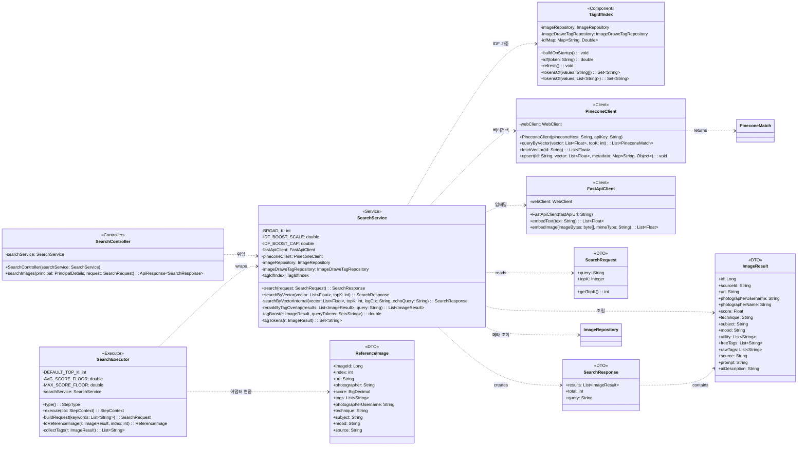

## 검색 (Search) Class Diagram

텍스트(또는 이미지) 쿼리로 유사 레퍼런스 이미지를 찾는 하이브리드 검색 도메인. 파이프라인은 **embed → Pinecone 벡터검색(overfetch) → MySQL 메타 조인 → 태그 IDF re-rank → 점수 가드 → topK** 순서다. `FastApiClient`(CLIP)로 쿼리를 768차원 벡터로 만들고, `PineconeClient`가 dense 유사도 top-K(텍스트면 `BROAD_K=40`으로 넓게)를 뽑은 뒤 `ImageRepository`로 메타·태그를 한 번에 조회한다. 그 위에 `TagIdfIndex`의 토큰별 IDF를 더해 순서만 보정하는데, 점수 공식은 `score = CLIP + min(cap, scale·ΣIDF(matched tags))`(scale=0.015, cap=0.05)이며 raw CLIP 점수는 보존된다. 워크플로 경로에서는 `SearchExecutor`가 `SearchService`를 감싸 호출하고 점수 가드(avg<0.2 AND max<0.24 → 차단)를 적용해 `ReferenceImage`로 어댑터 변환한다.

## SearchController 클래스 정보

| 구분 | Name | Type | Visibility | Description |
| --- | --- | --- | --- | --- |
| **class** | SearchController | `<<Controller>>` | public | 이미지 검색 REST 엔드포인트(`/search`). 텍스트 쿼리로 유사 이미지를 찾는 베타 직접 경로 — 인증 사용자(`PrincipalDetails`)가 호출. 워크플로 채팅 경로는 컨트롤러를 거치지 않고 `SearchExecutor`가 `SearchService`를 내부 호출한다 |
| **Attributes** | searchService | SearchService | private | CLIP+IDF 하이브리드 검색 서비스 |
| **Operations** | searchImages | `ApiResponse<SearchResponse>` | public | 이미지 검색(POST /search/images). `@Valid SearchRequest`(query 필수) 받아 `searchService.search` 위임, 결과를 `ApiResponse`로 래핑 |

 

## SearchService 클래스 정보

| 구분 | Name | Type | Visibility | Description |
| --- | --- | --- | --- | --- |
| **class** | SearchService | `<<Service>>` | public | 검색 파이프라인 본체. embed→Pinecone→MySQL 메타→**태그 IDF re-rank**→topK. `@Transactional(REQUIRES_NEW, readOnly)` — 외부호출(embed/Pinecone) 장애가 호출자(ChatLlmService) 트랜잭션을 오염시켜 `UnexpectedRollbackException`이 나지 않도록 별도 트랜잭션 격리. **tagBoost/IDF re-rank**: 쿼리 토큰이 이미지 태그(기법·주제·분위기·용도·freeTags·Unsplash rawTags·AI prompt·aiDescription)와 겹치면 그 토큰 IDF만큼 가산 — 흔한 태그는 IDF≈0으로 자동 무력화, 희귀 태그가 순위를 가른다. `score = CLIP + min(cap, scale·ΣIDF(matched tags))`(scale=0.015, cap=0.05), raw CLIP 점수는 보존하고 **순서만** 보정. 점수 가드(avg<0.2 AND max<0.24 → 차단)는 `SearchExecutor`가 적용 |
| **Attributes** | BROAD_K | int | private static | overfetch 폭(=40). 텍스트 검색은 이만큼 넓게 뽑아 태그 rerank 후 topK로 자른다(CLIP이 하위로 민 태그-강한 이미지 구제) |
| **Attributes** | IDF_BOOST_SCALE | double | private static | ΣIDF에 곱하는 스케일(=0.015). CLIP 변별폭(≈0.02~0.09)에 맞춰 태그가 CLIP을 덮어쓰지 않게 함 |
| **Attributes** | IDF_BOOST_CAP | double | private static | 가산 상한(=0.05). 태그 부스트가 dense 점수를 지배하지 못하도록 캡 |
| **Attributes** | fastApiClient | FastApiClient | private | 쿼리→768차원 CLIP 벡터 임베딩 |
| **Attributes** | pineconeClient | PineconeClient | private | 벡터 유사도 top-K 조회 |
| **Attributes** | imageRepository | ImageRepository | private | sourceId로 이미지 메타 일괄 조회 |
| **Attributes** | imageDraweTagRepository | ImageDraweTagRepository | private | 이미지 자동태그(기법/주제/분위기/용도/freeTags) 일괄 조회 |
| **Attributes** | tagIdfIndex | TagIdfIndex | private | 토큰별 IDF 가중치 원천(rerank용) |
| **Operations** | search | SearchResponse | public | 텍스트 쿼리 검색. embedText로 벡터화 후 `searchByVectorInternal`로 공통 경로 진입. `REQUIRES_NEW` 트랜잭션 |
| **Operations** | searchByVector | SearchResponse | public | 이미지/임의 벡터 검색(010 self-critique의 "내 작업물과 비슷한 레퍼런스"). 텍스트 임베딩만 건너뛰고 동일 CLIP 공간·조립 경로 공유. `echoQuery`가 빈 문자열이라 rerank 미적용 |
| **Operations** | searchByVectorInternal | SearchResponse | private | 벡터→Pinecone(overfetch)→MySQL 메타·태그 조인→Pinecone 순위 유지 ImageResult 조립→`rerankByTagOverlap`→topK 절단 공통 경로 |
| **Operations** | rerankByTagOverlap | `List<ImageResult>` | private | dense(CLIP) 점수 위에 태그 매칭 소프트 점수(tagBoost)를 더해 재정렬. 쿼리 비었거나 결과<2면 그대로(stable, 동률 시 Pinecone 순서 유지) |
| **Operations** | tagBoost | double | private | 쿼리 토큰∩이미지 태그 토큰의 IDF 합 × scale, cap으로 클램프. 태그 없으면 0 |
| **Operations** | tagTokens | `Set<String>` | private | 이미지의 모든 태그(구조화+freeTags+rawTags+prompt+aiDescription)를 토큰 집합으로 |

 

## TagIdfIndex 클래스 정보

| 구분 | Name | Type | Visibility | Description |
| --- | --- | --- | --- | --- |
| **class** | TagIdfIndex | `<<Component>>` | public | 태그 IDF(역문서빈도) 색인 — rerank의 '태그 변별력' 가중치 원천. 코퍼스(Image.rawTags JSON + AI prompt + ImageDraweTag 자동태깅)를 1회 스캔해 토큰별 IDF 맵 생성. 기동 완료(`ApplicationReadyEvent`) 후 데몬 스레드로 비차단 빌드, 빌드 전/실패 시 빈 맵→idf=0→rerank가 순수 CLIP으로 자연 폴백. 토큰화 규칙(소문자·비영숫자 분할·2자 이상·한글 유지)을 검색 rerank와 단일 출처로 공유 |
| **Attributes** | imageRepository | ImageRepository | private | rawTags JSON·prompt 코퍼스 스캔 |
| **Attributes** | imageDraweTagRepository | ImageDraweTagRepository | private | 자동태깅 구조화 축 코퍼스 스캔 |
| **Attributes** | idfMap | `Map<String, Double>` | private volatile | 토큰→IDF. volatile로 빌드 중에도 일관된 스냅샷 원자 교체 |
| **Operations** | buildOnStartup | void | public | `@EventListener(ApplicationReadyEvent)` — 기동 후 데몬 스레드로 `refresh` 1회(부팅 비차단) |
| **Operations** | idf | double | public | 토큰의 IDF(모르는 토큰=0 → 가산 없음) |
| **Operations** | refresh | void | public | 코퍼스 스캔 → df 집계 → `ln((N+1)/(df+1))` IDF 재계산(음수 0 클램프) → 원자 교체. 실패 시 빈 맵 유지 |
| **Operations** | tokensOf | `Set<String>` | public static | 가변인자(String...) 토큰화. 소문자화 후 비영숫자 분할, 2자 미만 제거 |
| **Operations** | tokensOf | `Set<String>` | public static | `List<String>` 오버로드 토큰화 |

 

## PineconeClient 클래스 정보

| 구분 | Name | Type | Visibility | Description |
| --- | --- | --- | --- | --- |
| **class** | PineconeClient | `<<Client>>` | public | Pinecone 벡터 DB HTTP 클라이언트(WebClient). `${pinecone.host}` baseUrl + Api-Key 헤더 + API 버전 2024-07. dense 유사도 검색과 AI 이미지 적재(upsert) 담당 |
| **Attributes** | webClient | WebClient | private | Pinecone 호스트 baseUrl WebClient(헤더 사전 설정) |
| **Operations** | queryByVector | `List<PineconeMatch>` | public | `POST /query` — 주어진 768차원 벡터와 가장 유사한 top-K 이미지 (id, score)를 유사도 순으로 반환. 응답 null이면 빈 리스트, 호출 실패는 RuntimeException("벡터 검색 실패") |
| **Operations** | fetchVector | `List<Float>` | public | `GET /vectors/fetch?ids={id}` — 이미 색인된 벡터를 id로 재임베딩 없이 그대로 조회(SCRUM-112 "[N]번 유사" 검색). 없거나 실패 시 예외 대신 null(호출 측 embedImage 폴백 유도) |
| **Operations** | upsert | void | public | `POST /vectors/upsert` — L2 정규화 768차원 CLIP 벡터 1건을 메타와 함께 적재(AI 이미지 인덱싱용, id=Image.sourceId) |

 

## FastApiClient 클래스 정보

| 구분 | Name | Type | Visibility | Description |
| --- | --- | --- | --- | --- |
| **class** | FastApiClient | `<<Client>>` | public | FastAPI 임베딩 서비스 HTTP 클라이언트(WebClient). `${fastapi.url}` baseUrl. 텍스트·이미지를 동일 CLIP 모델(openai/clip-vit-large-patch14)·동일 정규화로 임베딩해 같은 벡터 공간에서 비교 가능 |
| **Attributes** | webClient | WebClient | private | FastAPI baseUrl WebClient(기본 JSON, multipart는 호출 시 덮어씀) |
| **Operations** | embedText | `List<Float>` | public | `POST /embed/text` — 텍스트→768차원 CLIP 벡터. 응답 비면 IllegalState, 호출 실패는 RuntimeException("임베딩 변환 실패") |
| **Operations** | embedImage | `List<Float>` | public | `POST /embed/image`(multipart/form-data, field="image") — 이미지 바이트→768차원 CLIP 벡터. `searchByVector`(010 self-critique)가 소비 |

 

## SearchExecutor 클래스 정보

| 구분 | Name | Type | Visibility | Description |
| --- | --- | --- | --- | --- |
| **class** | SearchExecutor | `<<Executor>>` | public | SEARCH 단계 실행기 — 워크플로에서 베타 `SearchService`를 감싸 호출하는 어댑터(`StepExecutor` 구현, `StepType.SEARCH`). 2역할: ① SearchService 호출(CLIP 검색 재사용) ② `ImageResult`→`ReferenceImage` 어댑터 변환(search 도메인→contract 패키지 의존 차단, 1-based index 부여로 인용 무결성). **점수 가드**(레거시 handleSearchDecision 이관, 베타 49건 튜닝): `avg<0.2 AND max<0.24`이면(평균도 낮고 최상위 1장도 별로) 무관 결과로 보고 차단(references 비움, blocked_reason="low_score") — avg가 낮아도 max≥0.24면 최상위 레퍼런스는 살린다(rescue). 결과 0건도 차단. 검색 예외는 삼키고 빈 references + blocked_reason="exception" |
| **Attributes** | DEFAULT_TOP_K | int | private static | 기본 topK(=10) |
| **Attributes** | AVG_SCORE_FLOOR | double | private static | 평균 점수 하한(=0.2). avg가 이 미만이면 차단 후보 |
| **Attributes** | MAX_SCORE_FLOOR | double | private static | 최대 점수 하한(=0.24). max가 이 미만이어야 최종 차단(AND) — 이상이면 rescue |
| **Attributes** | searchService | SearchService | private | 감싸는 베타 검색 서비스 |
| **Operations** | type | StepType | public | `StepType.SEARCH` 반환(실행기 식별) |
| **Operations** | execute | StepContext | public | keywords로 SearchRequest 빌드→search 호출→avg/max/min 통계→점수 가드 판정→통과 시 `toReferenceImage` 변환·SearchStats와 함께 컨텍스트 갱신 |
| **Operations** | buildRequest | SearchRequest | private | 키워드 space-join을 query로, topK=DEFAULT_TOP_K(10)로 SearchRequest 생성 |
| **Operations** | toReferenceImage | ReferenceImage | private | ImageResult→ReferenceImage 어댑터(1-based index, score는 Float→BigDecimal, 표시 필드·collectTags 합산) |
| **Operations** | collectTags | `List<String>` | private | aiDescription·prompt(내용 문장 우선)+rawTags+freeTags+기법/주제/분위기+utility 합산, null 필터 |

 

## SearchRequest 클래스 정보

| 구분 | Name | Type | Visibility | Description |
| --- | --- | --- | --- | --- |
| **class** | SearchRequest | `<<DTO>>` | public | 검색 요청 record. query는 `@NotBlank`(비어있을 수 없음) |
| **Attributes** | query | String | public | 검색어(필수) |
| **Attributes** | topK | Integer | public | 반환 상한(선택, null/0 이하면 기본 10) |
| **Operations** | getTopK | int | public | topK가 null이거나 0 이하면 기본값 10 반환 |

 

## SearchResponse 클래스 정보

| 구분 | Name | Type | Visibility | Description |
| --- | --- | --- | --- | --- |
| **class** | SearchResponse | `<<DTO>>` | public | 검색 응답 record. Pinecone 순위 유지(태그 rerank 반영) 결과 묶음 |
| **Attributes** | results | `List<ImageResult>` | public | 정렬된 결과 리스트(최대 topK) |
| **Attributes** | total | int | public | 반환 개수 |
| **Attributes** | query | String | public | 에코된 쿼리(벡터 검색이면 빈 문자열) |

 

## ImageResult 클래스 정보

| 구분 | Name | Type | Visibility | Description |
| --- | --- | --- | --- | --- |
| **class** | ImageResult | `<<DTO>>` | public | 검색 결과 한 컷 record. dense(raw CLIP) score 보존 + MySQL 메타·태그. rerank의 태그 토큰 소스 |
| **Attributes** | id | Long | public | DB 이미지 PK |
| **Attributes** | sourceId | String | public | Pinecone vector ID(=Image.sourceId) |
| **Attributes** | url | String | public | 이미지 URL |
| **Attributes** | photographerUsername | String | public | 사진작가 username(표시용) |
| **Attributes** | photographerName | String | public | 사진작가 이름 |
| **Attributes** | score | Float | public | raw CLIP 유사도 점수(가드·표시는 이 dense 점수 그대로, 순서만 IDF 보정) |
| **Attributes** | technique | String | public | 기법 자동태그 |
| **Attributes** | subject | String | public | 주제 자동태그 |
| **Attributes** | mood | String | public | 분위기 자동태그 |
| **Attributes** | utility | `List<String>` | public | 용도 태그 |
| **Attributes** | freeTags | `List<String>` | public | 자유 태그 |
| **Attributes** | rawTags | `List<String>` | public | Unsplash 원본 키워드(고변별 신호) |
| **Attributes** | source | String | public | ImageSource enum 이름("UNSPLASH"\|"AI", 프론트 AI 배지) |
| **Attributes** | prompt | String | public | AI 이미지 영문 생성 프롬프트(Unsplash는 null) — rerank의 AI 내용 신호 |
| **Attributes** | aiDescription | String | public | Unsplash 네이티브 AI 캡션(AI 이미지는 null) — 내용 신호 |

 

## ReferenceImage 클래스 정보

| 구분 | Name | Type | Visibility | Description |
| --- | --- | --- | --- | --- |
| **class** | ReferenceImage | `<<DTO>>` | public | 검색으로 찾은 레퍼런스 이미지 record(contract 패키지). B가 채우고 A가 인용 무결성 검사(index 기준)에 사용. `ImageResult`와 필드 일부 겹치지만 도메인 의존 차단 위해 별도 타입, SearchExecutor가 어댑터 변환. 표시 필드 없는 6-인자 보존 생성자 제공 |
| **Attributes** | imageId | Long | public | DB 이미지 ID(메트릭·로깅용) |
| **Attributes** | index | int | public | 사용자 표시 순서(1-based). LLM 인용 무결성 검사 키([1][2][3]) |
| **Attributes** | url | String | public | 이미지 URL |
| **Attributes** | photographer | String | public | 사진작가 이름(없으면 null) |
| **Attributes** | score | BigDecimal | public | 검색 점수(CLIP 유사도, Score Guard 판정 결과 그대로) |
| **Attributes** | tags | `List<String>` | public | 태그 목록(collectTags 합산, null이면 빈 리스트로 정규화) |
| **Attributes** | photographerUsername | String | public | 사진작가 username(표시용, 없으면 null) |
| **Attributes** | technique | String | public | 기법(표시용) |
| **Attributes** | subject | String | public | 주제(표시용) |
| **Attributes** | mood | String | public | 분위기(표시용) |
| **Attributes** | source | String | public | 출처 enum 이름("UNSPLASH"\|"AI", 프론트 AI 배지) |