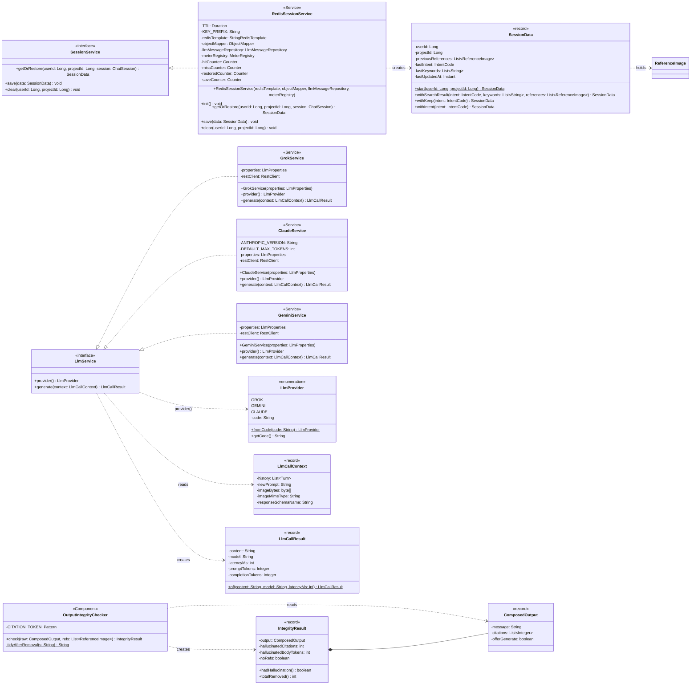

## 세션 · LLM Provider · 출력 무결성 Class Diagram

이 다이어그램은 채팅 한 턴(turn)을 떠받치는 LLM core support 의 세 하위 영역을 묶는다. **세션(단기 메모리)** 은 `SessionService.getOrRestore` 로 직전 검색 결과(`previousReferences`)를 Redis 에서 꺼내 KEEP/FOLLOWUP 멀티턴 맥락에 주입하고, 턴이 끝나면 `save` 로 다시 박제한다(reset 시 `clear`). **LLM Provider** 영역은 `pickService(resolveProvider(user))` 로 사용자 플랜에 맞는 구현체를 고른다 — `resolveProvider` 는 PAID→Claude, 그 외→Grok 으로 결정하고, `pickService` 는 `List<LlmService>` 에서 `provider()` 가 일치하는 빈을 찾는다. 고른 구현체는 `generate(LlmCallContext)` 로 호출되어 `LlmCallResult` 를 돌려준다. **출력 무결성** 영역은 COMPOSE 합성 직후 `OutputIntegrityChecker.check(ComposedOutput, refs)` 가 유효 범위(`1..refs.size()`) 밖의 환각 `[N]` 인용을 결정론적으로(재호출 없이) 제거하고 `IntegrityResult` 로 위반 카운트와 정정본을 반환한다.

## SessionService 클래스 정보

| 구분 | Name | Type | Visibility | Description |
| --- | --- | --- | --- | --- |
| **class** | SessionService | interface | public | 단기(휘발성) 대화 컨텍스트 추상화. 한 턴 시작 시 `getOrRestore` 로 직전 맥락을 꺼내고 종료 시 `save`, reset 시 `clear` 한다. |
| **Operations** | getOrRestore | (userId: Long, projectId: Long, session: ChatSession): SessionData | public | Redis hit 시 즉시 반환, miss 시 MySQL(`ChatSession`)에서 복원. 없으면 `SessionData.start`. |
| **Operations** | save | (data: SessionData): void | public | 세션 데이터를 TTL 24h 로 저장(best-effort). |
| **Operations** | clear | (userId: Long, projectId: Long): void | public | 명시적 세션 삭제(사용자 reset 등). |

 

## RedisSessionService 클래스 정보

| 구분 | Name | Type | Visibility | Description |
| --- | --- | --- | --- | --- |
| **class** | RedisSessionService | Service | public | `SessionService` 의 Redis 구현 + MySQL 폴백. Redis 키는 `session:{userId}:{projectId}`, TTL 24h(활동 시 갱신). cache miss 면 `LlmMessageRepository` 의 직전 ASSISTANT 메시지 references 로 복원 후 Redis 재저장. Redis I/O 장애는 삼켜 요청을 살린다. |
| **Attributes** | TTL | Duration | private | 세션 만료 기간 = 24시간. |
| **Attributes** | KEY_PREFIX | String | private | Redis 키 접두사 `session:` ( → `session:{userId}:{projectId}`). |
| **Attributes** | redisTemplate | StringRedisTemplate | private | Redis 문자열 read/write/expire/delete. |
| **Attributes** | objectMapper | ObjectMapper | private | `SessionData` JSON 직렬화/역직렬화(Jackson). |
| **Attributes** | llmMessageRepository | LlmMessageRepository | private | cache miss 시 직전 ASSISTANT 메시지 references 복원용. |
| **Attributes** | meterRegistry | MeterRegistry | private | hit/miss/restored/save 카운터 등록용. |
| **Attributes** | hitCounter / missCounter / restoredCounter / saveCounter | Counter | private | `drawe.session.cache.*` Micrometer 카운터. |
| **Operations** | RedisSessionService | (redisTemplate, objectMapper, llmMessageRepository, meterRegistry) | public | `@RequiredArgsConstructor` 생성자. |
| **Operations** | init | (): void | public | `@PostConstruct` — 4개 캐시 카운터 초기화. |
| **Operations** | getOrRestore | (userId: Long, projectId: Long, session: ChatSession): SessionData | public | hot path: Redis hit→TTL 갱신·hit++. cold path: miss++→MySQL 직전 ASSISTANT references 복원→Redis 재저장·restored++. 메시지 없으면 `SessionData.start`. |
| **Operations** | save | (data: SessionData): void | public | `session:{userId}:{projectId}` 에 JSON, TTL 24h, save++. 직렬화/Redis 실패는 로깅만(요청 보존). |
| **Operations** | clear | (userId: Long, projectId: Long): void | public | 해당 키 삭제. |

 

## SessionData 클래스 정보

| 구분 | Name | Type | Visibility | Description |
| --- | --- | --- | --- | --- |
| **class** | SessionData | record | public | 프로젝트 단위 휘발성 대화 컨텍스트(Redis 저장). 멀티턴 효율을 위해 직전 검색 결과·의도·키워드를 보관. KEEP 의도 시 `previousReferences` 가 SYSTEM 블록으로 주입된다. |
| **Attributes** | userId | Long | private | 사용자 ID. |
| **Attributes** | projectId | Long | private | 프로젝트 ID. |
| **Attributes** | previousReferences | `List<ReferenceImage>` | private | 직전 검색 결과 — KEEP 멀티턴의 핵심. null 이면 빈 리스트. |
| **Attributes** | lastIntent | IntentCode | private | 직전 의도 — 후속 분류 보조. MySQL 복원 시에는 null. |
| **Attributes** | lastKeywords | `List<String>` | private | 직전 추출 키워드 — 디버깅·메트릭. |
| **Attributes** | lastUpdatedAt | Instant | private | 마지막 활동 시각(null 이면 now). |
| **Operations** | start | (userId: Long, projectId: Long): SessionData | public static | 빈 세션 시작(메시지 없는 새 프로젝트). |
| **Operations** | withSearchResult | (intent: IntentCode, keywords: `List<String>`, references: `List<ReferenceImage>`): SessionData | public | NEW_SEARCH 후 새 검색 결과로 갱신. |
| **Operations** | withKeep | (intent: IntentCode): SessionData | public | KEEP 의도 — references 유지, 의도만 갱신. |
| **Operations** | withIntent | (intent: IntentCode): SessionData | public | SKIP/GENERATE 등 — references 유지, 의도·시각 갱신. |

 

## LlmService 클래스 정보

| 구분 | Name | Type | Visibility | Description |
| --- | --- | --- | --- | --- |
| **class** | LlmService | interface | public | LLM 호출 추상화. `ChatLlmService` 가 `pickService(resolveProvider(user))` 로 구현체를 고른다. |
| **Operations** | provider | (): LlmProvider | public | 이 구현체가 담당하는 provider 식별값(`pickService` 매칭 키). |
| **Operations** | generate | (context: LlmCallContext): LlmCallResult | public | 히스토리+새 입력을 받아 1회 호출, 결과 반환. |

 

## GrokService 클래스 정보

| 구분 | Name | Type | Visibility | Description |
| --- | --- | --- | --- | --- |
| **class** | GrokService | Service | public | Grok(xAI) 클라이언트. OpenAI 호환 `/chat/completions`. COMPOSE 호출(`responseSchemaName`)만 네이티브 `response_format:json_schema`(`draw_guide_response`), 그 외는 평문. connect 3s/read 30s. 무료 플랜 기본 provider. |
| **Attributes** | properties | LlmProperties | private | Grok baseUrl·model·apiKey 설정. |
| **Attributes** | restClient | RestClient | private | 타임아웃 적용된 HTTP 클라이언트. |
| **Operations** | GrokService | (properties: LlmProperties) | public | 생성자. |
| **Operations** | provider | (): LlmProvider | public | `LlmProvider.GROK` 반환. |
| **Operations** | generate | (context: LlmCallContext): LlmCallResult | public | 호출 후 content + model + latency + usage(prompt/completion_tokens) 반환. 실패는 `AI_SERVICE_ERROR`. |

 

## ClaudeService 클래스 정보

| 구분 | Name | Type | Visibility | Description |
| --- | --- | --- | --- | --- |
| **class** | ClaudeService | Service | public | Claude(Anthropic) 클라이언트. `/messages`, `anthropic-version` 헤더, system 프롬프트를 `cache_control: ephemeral` 블록으로 전달(프롬프트 캐싱). PAID 플랜 provider. connect 3s/read 30s. |
| **Attributes** | ANTHROPIC_VERSION | String | private | API 버전 `2023-06-01`. |
| **Attributes** | DEFAULT_MAX_TOKENS | int | private | 기본 max_tokens = 1024. |
| **Attributes** | properties | LlmProperties | private | Claude baseUrl·model·apiKey 설정. |
| **Attributes** | restClient | RestClient | private | 타임아웃 적용된 HTTP 클라이언트. |
| **Operations** | ClaudeService | (properties: LlmProperties) | public | 생성자. |
| **Operations** | provider | (): LlmProvider | public | `LlmProvider.CLAUDE` 반환. |
| **Operations** | generate | (context: LlmCallContext): LlmCallResult | public | 호출 후 content + model + latency + usage(input/output_tokens) 반환. cache 사용량 debug 로깅. |

 

## GeminiService 클래스 정보

| 구분 | Name | Type | Visibility | Description |
| --- | --- | --- | --- | --- |
| **class** | GeminiService | Service | public | Gemini(Google) 클라이언트. `:generateContent?key=` URL, system 은 `systemInstruction`, role 은 user/model. connect 3s/read 30s. (현재 `resolveProvider` 선택지엔 미포함 — provider 추상화상 등록만.) |
| **Attributes** | properties | LlmProperties | private | Gemini baseUrl·model·apiKey 설정. |
| **Attributes** | restClient | RestClient | private | 타임아웃 적용된 HTTP 클라이언트. |
| **Operations** | GeminiService | (properties: LlmProperties) | public | 생성자. |
| **Operations** | provider | (): LlmProvider | public | `LlmProvider.GEMINI` 반환. |
| **Operations** | generate | (context: LlmCallContext): LlmCallResult | public | 호출 후 content + model + latency + usage(promptTokenCount/candidatesTokenCount) 반환. |

 

## LlmProvider 클래스 정보

| 구분 | Name | Type | Visibility | Description |
| --- | --- | --- | --- | --- |
| **class** | LlmProvider | enumeration | public | LLM provider 식별 enum. `resolveProvider(user)` 는 `UserPlan.PAID`→`CLAUDE`, 그 외→`GROK` 로 매핑하고, `pickService` 가 `List<LlmService>` 에서 `provider()` 일치 빈을 선택한다. |
| **Attributes** | GROK / GEMINI / CLAUDE | LlmProvider | public | enum 상수(각 code: `grok`/`gemini`/`claude`). |
| **Attributes** | code | String | private | provider 코드 문자열. |
| **Operations** | fromCode | (code: String): LlmProvider | public static | code 문자열→enum(대소문자 무시). 미존재 시 `IllegalArgumentException`. |
| **Operations** | getCode | (): String | public | code 접근자(Lombok `@Getter`). |

 

## LlmCallContext 클래스 정보

| 구분 | Name | Type | Visibility | Description |
| --- | --- | --- | --- | --- |
| **class** | LlmCallContext | record | public | LLM 구현체에 넘길 호출 컨텍스트(히스토리 + 새 입력). `responseSchemaName` 이 있으면 구현체가 네이티브 스키마 모드를 요청(COMPOSE 전용). |
| **Attributes** | history | `List<Turn>` | private | 직전 대화 턴들(role+content). |
| **Attributes** | newPrompt | String | private | 이번 턴 새 user 프롬프트. |
| **Attributes** | imageBytes | byte[] | private | 첨부 이미지 바이트(없으면 null). |
| **Attributes** | imageMimeType | String | private | 이미지 MIME 타입. |
| **Attributes** | responseSchemaName | String | private | Structured Output 스키마 이름(null 이면 평문). |

 

## LlmCallResult 클래스 정보

| 구분 | Name | Type | Visibility | Description |
| --- | --- | --- | --- | --- |
| **class** | LlmCallResult | record | public | LLM 호출 1건의 결과. 토큰 usage 는 부가 정보로 없어도 호출은 성공 처리. |
| **Attributes** | content | String | private | 응답 본문 텍스트. |
| **Attributes** | model | String | private | 사용 모델명. |
| **Attributes** | latencyMs | int | private | 호출 소요 시간(ms). |
| **Attributes** | promptTokens | Integer | private | 입력 토큰(usage 없으면 null). |
| **Attributes** | completionTokens | Integer | private | 출력 토큰(usage 없으면 null). |
| **Operations** | of | (content: String, model: String, latencyMs: int): LlmCallResult | public static | usage 없이 결과 생성. |

 

## OutputIntegrityChecker 클래스 정보

| 구분 | Name | Type | Visibility | Description |
| --- | --- | --- | --- | --- |
| **class** | OutputIntegrityChecker | Component | public | 결정론적 참조 무결성 검사 — **LLM 재호출 없음**. 유효 인덱스 집합은 `{1 .. refs.size()}` 이고, 본문 `[N]` 토큰·`citations` 슬롯 양쪽에서 이 범위 밖(=환각) 인용만 제거한다. refs 가 비면 모든 인용이 환각. 유효 토큰은 보존(번호↔references 표시 순서 매칭), 토큰 삭제로 생긴 잉여 공백만 정리. |
| **Attributes** | CITATION_TOKEN | Pattern | private | 본문 인용 토큰 정규식 `\[(\d+)\]`. |
| **Operations** | check | (raw: ComposedOutput, refs: `List<ReferenceImage>`): IntegrityResult | public | `1..refs.size()` 밖 인용 제거 후 정정본 + 위반 카운트 반환. refs null/empty 면 전부 제거(noRefs=true). |
| **Operations** | tidyAfterRemoval | (s: String): String | private static | 환각 토큰 삭제 후 가로 공백·문장부호 직전 공백 정리(줄바꿈 보존). |

 

## ComposedOutput 클래스 정보

| 구분 | Name | Type | Visibility | Description |
| --- | --- | --- | --- | --- |
| **class** | ComposedOutput | record | public | COMPOSE 단계의 구조화 응답. `OutputParser` 가 Grok `draw_guide_response` 스키마를 옮기고, `OutputIntegrityChecker` 가 환각 제거 후 정정본을 다시 이 DTO 로 돌려준다. |
| **Attributes** | message | String | private | 사용자에게 보일 가이드 본문(검사 후 정정본). |
| **Attributes** | citations | `List<Integer>` | private | 본문이 실제 인용한 references 1-based 인덱스(검사 후 생존분, 오름차순·중복 제거). null 이면 빈 리스트. |
| **Attributes** | offerGenerate | boolean | private | LLM 의 생성 제안 의견(보조 신호). 최종 버튼 노출은 시스템 결정. |

 

## IntegrityResult 클래스 정보

| 구분 | Name | Type | Visibility | Description |
| --- | --- | --- | --- | --- |
| **class** | IntegrityResult | record | public | `OutputIntegrityChecker.check` 결과 — 정정 출력 + 위반 카운트. 카운트는 `drawe.output.hallucinated_citation`·`drawe.output.citation_removed` 메트릭 입력. DoD: `hallucinatedCount == 0`. |
| **Attributes** | output | ComposedOutput | private | 환각 인용 제거 후 정정 출력. |
| **Attributes** | hallucinatedCitations | int | private | citations 슬롯에서 범위 밖이라 제거된 인덱스 수. |
| **Attributes** | hallucinatedBodyTokens | int | private | 본문 `[N]` 중 범위 밖이라 제거된 토큰 수. |
| **Attributes** | noRefs | boolean | private | references 가 비어 있었는지(메트릭 `source=no_refs` 분류용). |
| **Operations** | hadHallucination | (): boolean | public | 환각이 하나라도 있었는지(DoD 위반·메트릭 분기). |
| **Operations** | totalRemoved | (): int | public | 제거된 인용 총수(citations 슬롯 + 본문). |