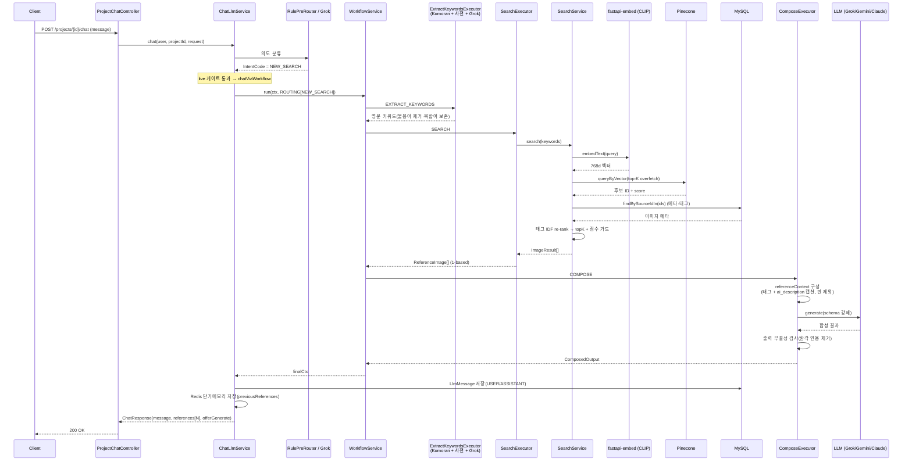
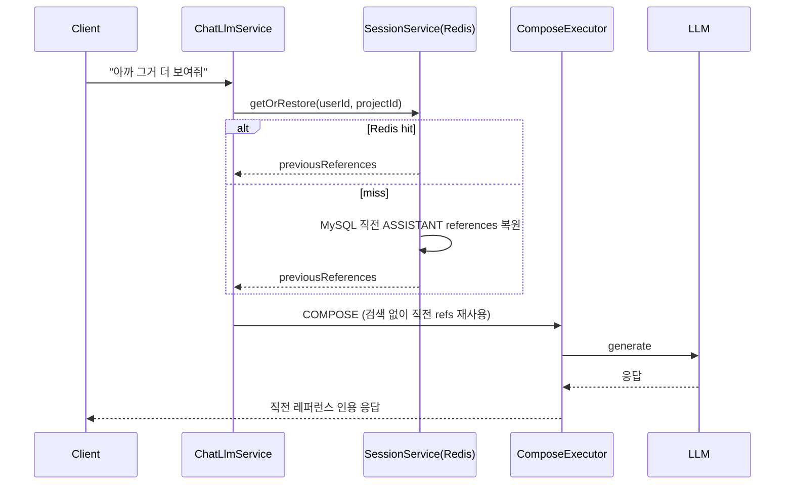
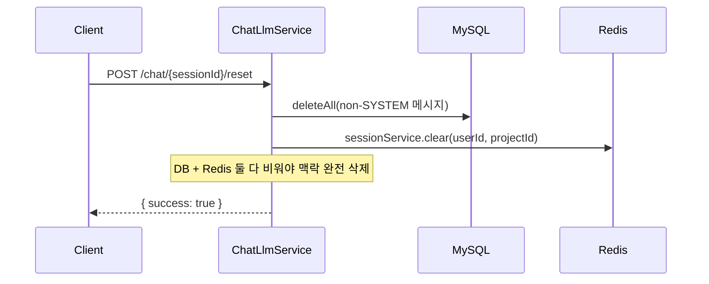
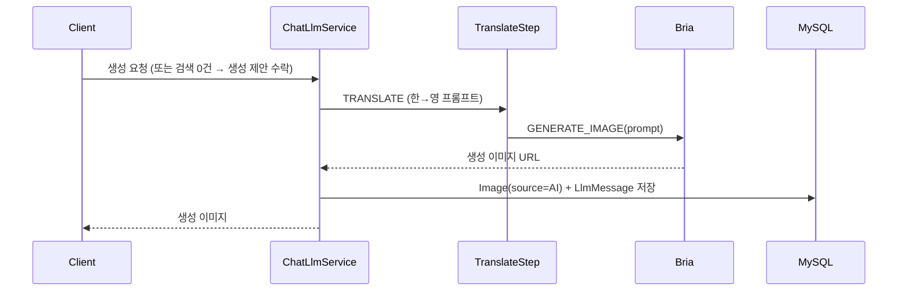
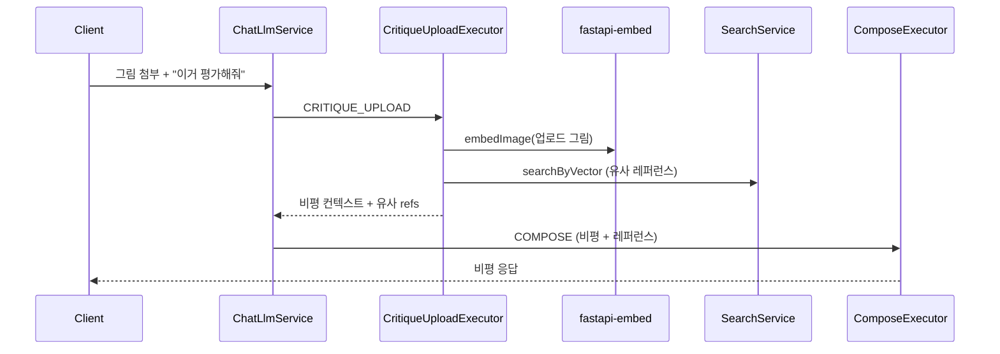
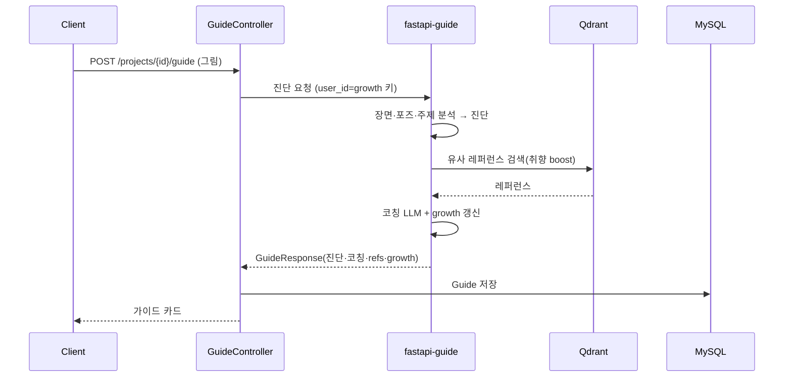
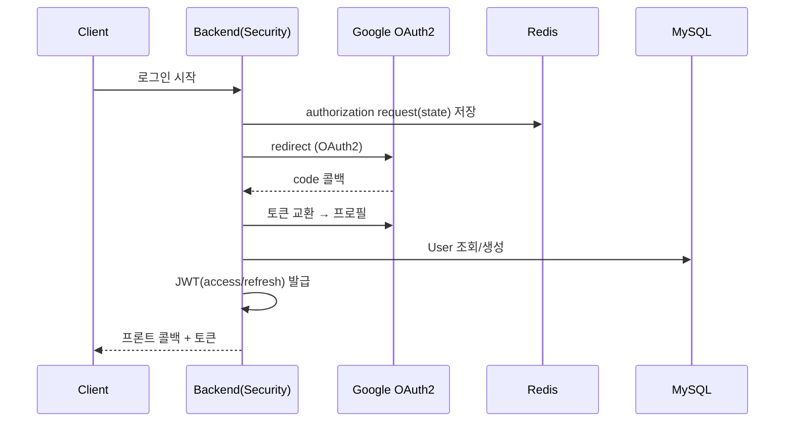
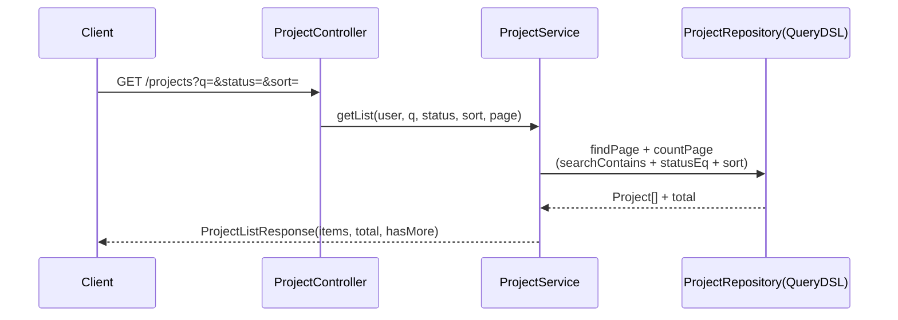

# 8. Sequence Diagram

도메인별 핵심 흐름. **AI 추천 파이프라인(8.1)** 을 가장 상세히 다룬다.

---

## 8.1 레퍼런스 검색 (NEW_SEARCH) ⭐
사용자 메시지 → 의도 분류 → 키워드 추출 → CLIP 검색 → IDF re-rank → COMPOSE.

| 단계 | 핵심 |
|---|---|
| 의도 분류 | Rule 우선 + Grok. NEW_SEARCH면 검색 경로 |
| 키워드 추출 | 형태소 + 미술사전(247) + Grok 폴백, 요청 동사 불용어 |
| 검색 | CLIP→Pinecone overfetch→MySQL 메타→**IDF re-rank**→점수 가드 |
| COMPOSE | 태그+**ai_description** 주입, 스키마 LLM, 무결성 검사 |
| 저장 | LlmMessage(DB) + previousReferences(Redis) |

---

## 8.2 멀티턴 이어묻기 (KEEP)

## 8.3 대화 초기화

## 8.4 AI 이미지 생성 (검색 결과 없음 / GENERATE)

## 8.5 자기비평 (SELF_CRITIQUE)

## 8.6 가이드 (이미지 업로드)

## 8.7 인증 (Google OAuth 로그인)

## 8.8 프로젝트 목록 (정렬·검색)

> 핀 추가/해제, 갤러리 조회 등 단순 CRUD는 위와 동일한 Controller→Service→Repository 패턴을 따른다.
