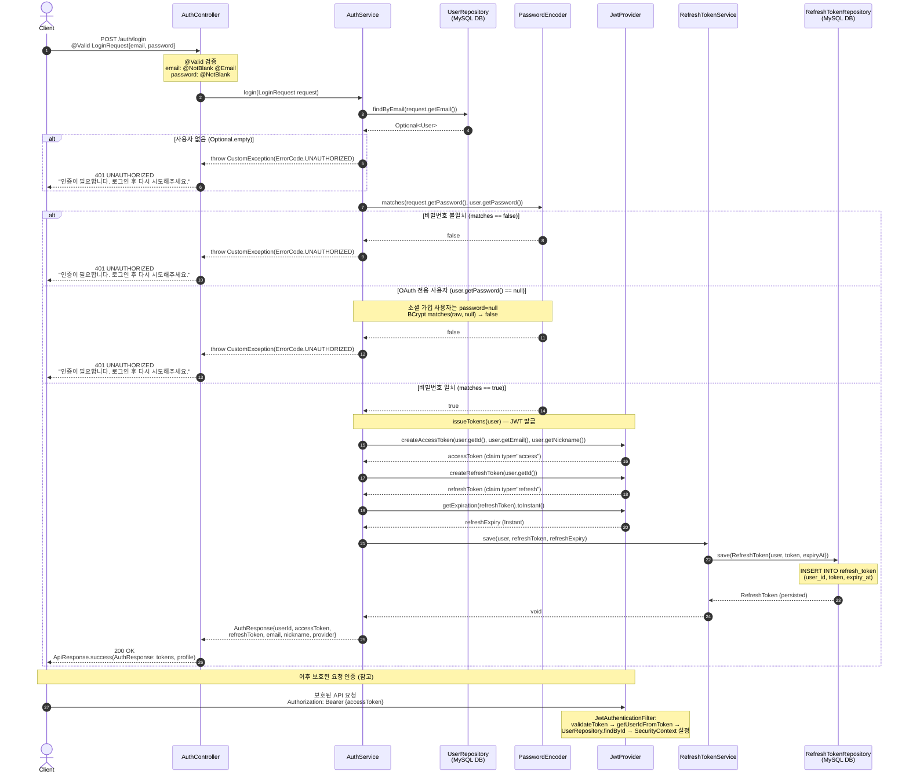
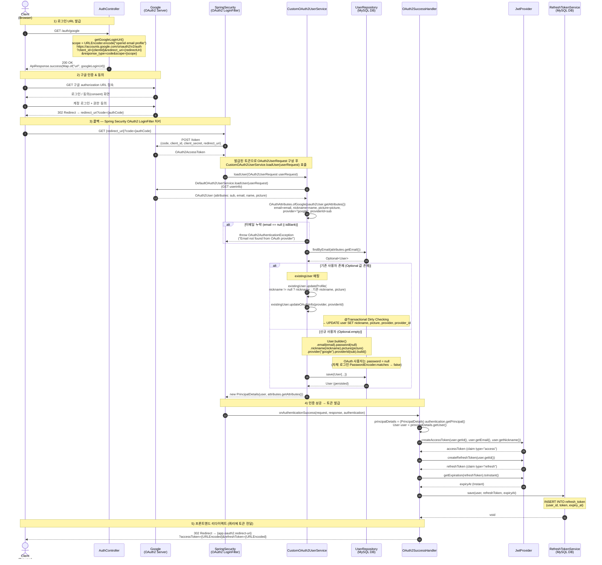
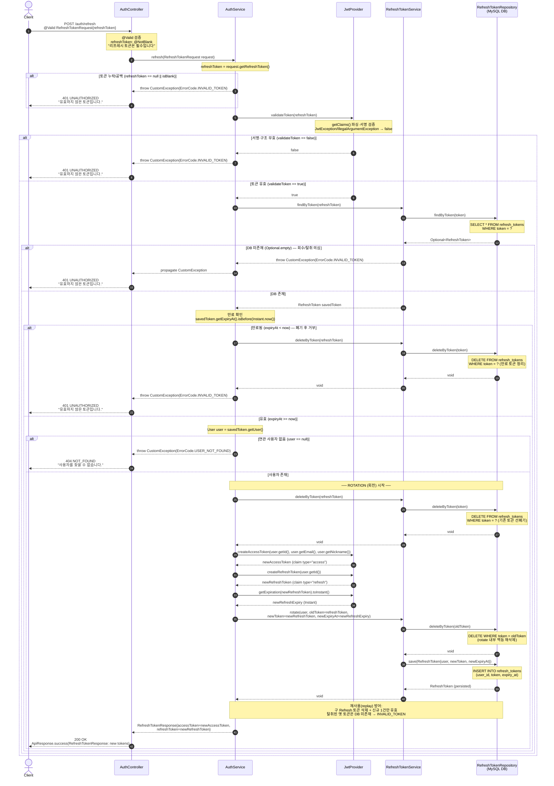

# 인증 시퀀스 다이어그램

이메일 회원가입·로그인, Google OAuth2, JWT 토큰 갱신(rotation).

## 이메일 회원가입 (Signup) Sequence Diagram

```mermaid
sequenceDiagram
    autonumber
    actor Client
    participant AuthController
    participant EmailVerificationService as EmailVerificationService
    participant MailService as MailService (SMTP)
    participant Redis
    participant AuthService
    participant UserRepository as UserRepository (MySQL DB)
    participant JwtProvider
    participant RefreshTokenService

    %% =========================================================
    %% STEP 1. 인증코드 발송 — POST /auth/email/send-code
    %% =========================================================
    Client->>AuthController: POST /auth/email/send-code\nSendCodeRequest{ email }
    AuthController->>EmailVerificationService: sendCode(email)
    Note over EmailVerificationService: normalize(email) — trim + toLowerCase

    EmailVerificationService->>UserRepository: existsByEmail(email)
    UserRepository-->>EmailVerificationService: boolean
    alt 이미 가입된 이메일
        EmailVerificationService-->>AuthController: throw CustomException(EMAIL_ALREADY_EXISTS)
        AuthController-->>Client: 4xx ApiResponse(error: EMAIL_ALREADY_EXISTS)
    end

    EmailVerificationService->>Redis: hasKey("email:verify:cooldown:" + email)
    Redis-->>EmailVerificationService: boolean
    alt 60초 쿨다운 미경과 (cooldown 키 존재)
        EmailVerificationService-->>AuthController: throw CustomException(EMAIL_SEND_COOLDOWN)
        AuthController-->>Client: 4xx ApiResponse(error: EMAIL_SEND_COOLDOWN)
    end

    Note over EmailVerificationService: code = String.format("%06d", RANDOM.nextInt(1_000_000))\nThymeleaf "email/verification-code" 렌더 → htmlBody
    EmailVerificationService->>MailService: sendHtml("[Drawe] 이메일 인증번호", htmlBody, email)
    MailService->>MailService: SMTP 전송 (MimeMessage, CID logo 인라인)
    alt 메일 전송 실패 (MessagingException)
        MailService-->>EmailVerificationService: throw CustomException(INTERNAL_SERVER_ERROR)
        Note over EmailVerificationService: 발송 실패 시 code/cooldown 미저장 → 즉시 재시도 가능
        EmailVerificationService-->>AuthController: 전파
        AuthController-->>Client: 5xx ApiResponse(error: INTERNAL_SERVER_ERROR)
    end
    MailService-->>EmailVerificationService: 전송 완료

    EmailVerificationService->>Redis: SET "email:verify:code:" + email = code (TTL 5min)
    Note over Redis: 인증코드 TTL = 5분 (CODE_TTL)
    EmailVerificationService->>Redis: DEL "email:verify:attempts:" + email
    EmailVerificationService->>Redis: SET "email:verify:cooldown:" + email = "1" (TTL 60s)
    Note over Redis: 쿨다운 TTL = 60초 (COOLDOWN_TTL)
    EmailVerificationService-->>AuthController: void
    AuthController-->>Client: 200 ApiResponse<Void> success

    %% =========================================================
    %% STEP 2. 코드 검증 — POST /auth/email/verify-code
    %% =========================================================
    Client->>AuthController: POST /auth/email/verify-code\nVerifyCodeRequest{ email, code }
    AuthController->>EmailVerificationService: verifyCode(email, code)
    Note over EmailVerificationService: normalize(email)

    EmailVerificationService->>Redis: GET "email:verify:code:" + email
    Redis-->>EmailVerificationService: savedCode | null
    alt 코드 만료/없음 (savedCode == null)
        EmailVerificationService-->>AuthController: throw CustomException(VERIFICATION_CODE_EXPIRED)
        AuthController-->>Client: 4xx ApiResponse(error: VERIFICATION_CODE_EXPIRED)
    else 코드 불일치 (!savedCode.equals(inputCode))
        EmailVerificationService->>Redis: INCR "email:verify:attempts:" + email
        Redis-->>EmailVerificationService: attempts
        opt 최초 실패 (attempts == 1)
            EmailVerificationService->>Redis: EXPIRE attempts 키 (TTL 5min)
        end
        opt 최대 시도 초과 (attempts >= 5 = MAX_ATTEMPTS)
            EmailVerificationService->>Redis: DEL "email:verify:code:" + email
            Note over Redis: 5회 실패 시 코드 폐기 → 재발급 필요
        end
        EmailVerificationService-->>AuthController: throw CustomException(VERIFICATION_CODE_MISMATCH)
        AuthController-->>Client: 4xx ApiResponse(error: VERIFICATION_CODE_MISMATCH)
    else 코드 일치 (성공)
        EmailVerificationService->>Redis: DEL "email:verify:code:" + email
        EmailVerificationService->>Redis: DEL "email:verify:attempts:" + email
        EmailVerificationService->>Redis: SET "email:verify:verified:" + email = "true" (TTL 30min)
        Note over Redis: 인증완료 플래그 TTL = 30분 (VERIFIED_TTL)
        EmailVerificationService-->>AuthController: void
        AuthController-->>Client: 200 ApiResponse<Void> success
    end

    %% =========================================================
    %% STEP 3. 회원가입 — POST /auth/signup
    %% =========================================================
    Client->>AuthController: POST /auth/signup\nSignupRequest{ email, password, nickname,\nagreeTerms, agreePrivacy, agreeAge }
    AuthController->>AuthService: signup(request)
    Note over AuthService: @Transactional

    AuthService->>UserRepository: existsByEmail(request.getEmail())
    UserRepository-->>AuthService: boolean
    alt 이메일 중복
        AuthService-->>AuthController: throw CustomException(EMAIL_ALREADY_EXISTS)
        AuthController-->>Client: 4xx ApiResponse(error: EMAIL_ALREADY_EXISTS)
    end

    AuthService->>UserRepository: existsByNickname(request.getNickname())
    UserRepository-->>AuthService: boolean
    alt 닉네임 중복
        AuthService-->>AuthController: throw CustomException(NICKNAME_ALREADY_EXISTS)
        AuthController-->>Client: 4xx ApiResponse(error: NICKNAME_ALREADY_EXISTS)
    end

    Note over AuthService: 모든 중복 검증 통과 후 인증 플래그 소비\n(닉네임 충돌로 재인증 강요 방지)
    AuthService->>EmailVerificationService: assertVerifiedAndConsume(email)
    EmailVerificationService->>Redis: hasKey("email:verify:verified:" + email)
    Redis-->>EmailVerificationService: boolean
    alt 이메일 미인증 (verified 키 없음)
        EmailVerificationService-->>AuthService: throw CustomException(EMAIL_NOT_VERIFIED)
        AuthService-->>AuthController: 전파
        AuthController-->>Client: 4xx ApiResponse(error: EMAIL_NOT_VERIFIED)
    else 인증됨
        EmailVerificationService->>Redis: DEL "email:verify:verified:" + email
        EmailVerificationService-->>AuthService: void (플래그 소비 완료)
    end

    Note over AuthService: User.builder()\n.password(passwordEncoder.encode(password))\n.termsAgreeAt(Instant.now())
    AuthService->>UserRepository: save(User)
    UserRepository-->>AuthService: User (with userId)

    AuthService-->>AuthController: SignupResponse{ userId, email, nickname }
    AuthController-->>Client: 200 ApiResponse<SignupResponse> success

    %% =========================================================
    %% (참고) 토큰 발급은 가입 후 별도 로그인(POST /auth/login)에서 수행
    %% issueTokens(user): JwtProvider access+refresh, RefreshTokenService.save
    %% =========================================================
    rect rgb(245, 245, 245)
        Note over Client,RefreshTokenService: 이후 로그인(POST /auth/login) 시 토큰 발급 흐름
        Client->>AuthController: POST /auth/login (email, password)
        AuthController->>AuthService: login(request)
        AuthService->>JwtProvider: createAccessToken(userId, email, nickname)
        JwtProvider-->>AuthService: accessToken
        AuthService->>JwtProvider: createRefreshToken(userId)
        JwtProvider-->>AuthService: refreshToken
        AuthService->>RefreshTokenService: save(user, refreshToken, refreshExpiry)
        RefreshTokenService->>UserRepository: save(RefreshToken) (DB)
        AuthService-->>AuthController: AuthResponse{ userId, accessToken, refreshToken, email, nickname, provider }
        AuthController-->>Client: 200 ApiResponse<AuthResponse> success
    end
```

---

| 항목 | 흐름 요약 | 핵심 비즈니스 로직 |
| --- | --- | --- |
| 목표 | 이메일 인증코드 발송 → 코드 검증 → 회원가입의 3단계로 이메일 소유권을 확인한 뒤 신규 사용자를 생성한다. | 발송·검증·가입을 분리하고 Redis 플래그로 인증 상태를 연결. 이메일은 `normalize`(trim+toLowerCase)로 정규화해 키 불일치 방지. |
| 인증코드 발송 (쿨다운) | `POST /auth/email/send-code` → `sendCode(email)`. 가입여부·쿨다운 확인 후 6자리 코드를 메일로 발송하고 Redis에 저장. | `existsByEmail` 시 `EMAIL_ALREADY_EXISTS`. `cooldown` 키 존재 시 `EMAIL_SEND_COOLDOWN`(60초). 메일을 먼저 보내고 성공 후에만 code(5분)·cooldown(60초) 저장 → 발송 실패 시 사용자 차단 방지. |
| 코드 검증 (시도제한) | `POST /auth/email/verify-code` → `verifyCode(email, code)`. 저장 코드와 비교 후 일치 시 verified 플래그 발급. | `null` → `VERIFICATION_CODE_EXPIRED`. 불일치 시 `attempts` INCR(최초 실패에 5분 TTL), `MAX_ATTEMPTS(5)` 도달 시 코드 폐기 후 `VERIFICATION_CODE_MISMATCH`. 성공 시 code/attempts 삭제 + `verified` 플래그(30분) 저장. |
| 회원가입 (중복·검증확인) | `POST /auth/signup` → `signup(SignupRequest)`. 이메일·닉네임 중복 검사 후 인증 플래그를 소비하고 User 저장. `@Transactional`. | `existsByEmail`→`EMAIL_ALREADY_EXISTS`, `existsByNickname`→`NICKNAME_ALREADY_EXISTS`. 중복 통과 후 `assertVerifiedAndConsume`(미인증 시 `EMAIL_NOT_VERIFIED`, 통과 시 플래그 삭제). 닉네임 충돌로 재인증 강요되지 않도록 순서 보장. 비밀번호는 `passwordEncoder.encode`, `termsAgreeAt = Instant.now()`. |
| 토큰 발급 | 가입(`signup`)은 토큰을 발급하지 않고 별도 로그인(`POST /auth/login`)의 `issueTokens(user)`에서 발급. | `JwtProvider.createAccessToken(userId, email, nickname)` + `createRefreshToken(userId)`, `RefreshTokenService.save(user, refreshToken, refreshExpiry)`로 RefreshToken을 DB에 영속화. |
| 응답 | 각 단계는 공통 래퍼 `ApiResponse`로 응답. | 발송/검증: `ApiResponse<Void>` 200 success. 가입: `ApiResponse<SignupResponse>`(userId, email, nickname) 200 success. 실패는 `CustomException`의 `ErrorCode`가 `ApiResponse` 에러로 변환. |

## 이메일/비밀번호 로그인 (Email Login) Sequence Diagram

---

| 항목 | 흐름 요약 | 핵심 비즈니스 로직 |
| --- | --- | --- |
| 목표 | 이메일/비밀번호로 사용자를 인증하고 Access/Refresh 토큰과 프로필을 발급한다. | OAuth가 아닌 일반(자체) 로그인. 성공 시 무상태(JWT) 인증 자격 발급. |
| 요청 수신 | `POST /auth/login`을 `AuthController.login(@Valid LoginRequest)`이 받아 `AuthService.login(request)`로 위임한다. | `LoginRequest.email`은 `@NotBlank @Email`, `password`는 `@NotBlank`로 컨트롤러 진입 전 Bean Validation 수행. |
| 사용자 조회 | `UserRepository.findByEmail(email)`으로 사용자를 조회한다. | 결과가 `Optional.empty`이면 `CustomException(ErrorCode.UNAUTHORIZED)` → 401. (존재 여부 노출 방지를 위해 동일 에러 사용) |
| 비밀번호 검증 | `PasswordEncoder.matches(rawPassword, user.getPassword())`로 검증한다. | 불일치 시 `ErrorCode.UNAUTHORIZED` → 401. OAuth 전용 사용자는 `password=null`이라 `matches`가 false → 동일하게 401(자체 로그인 차단). |
| 토큰 발급·저장 | `issueTokens(user)`에서 `JwtProvider.createAccessToken / createRefreshToken` 발급 후 `RefreshTokenService.save(user, refreshToken, refreshExpiry)`로 저장한다. | Access 토큰(claim `type=access`, userId/email/nickname 포함)과 Refresh 토큰(claim `type=refresh`)을 발급하고, Refresh 토큰은 만료시각과 함께 `refresh_token` 테이블에 INSERT. |
| 응답 | `AuthResponse{userId, accessToken, refreshToken, email, nickname, provider}`를 `ApiResponse.success(...)`로 감싸 `200 OK` 반환. | 이후 보호된 요청은 `JwtAuthenticationFilter`가 `Authorization: Bearer {accessToken}`를 검증(`validateToken` → `getUserIdFromToken` → `findById`)하여 `SecurityContext`에 인증을 설정. |

## Google OAuth2 로그인 Sequence Diagram

---

| 항목 | 흐름 요약 | 핵심 비즈니스 로직 |
| --- | --- | --- |
| 목표 | Google OAuth2 인가 코드(Authorization Code) 흐름으로 사용자를 인증/가입시키고 Access/Refresh 토큰을 발급해 프론트엔드로 전달한다. | 소셜 로그인. 성공 시 자체 JWT(무상태) 자격을 발급하고, OAuth 사용자는 `password = null`로 관리. |
| 로그인 URL | `GET /auth/google`을 `AuthController.getGoogleLoginUrl()`이 받아 구글 인가 URL을 생성한다. | `scope = URLEncoder.encode("openid email profile")`, `client_id` / `redirect_uri`(설정값) / `response_type=code`를 조합해 `ApiResponse.success(Map.of("url", googleLoginUrl))`로 반환. |
| 구글 인증·콜백 | 클라이언트가 구글 인가 URL로 이동 → 로그인·동의 후 `redirect_uri?code=`로 콜백되면 Spring Security OAuth2 LoginFilter가 코드를 Access Token으로 교환한다. | 코드↔토큰 교환과 userinfo 조회는 Spring Security가 처리하며, `CustomOAuth2UserService.loadUser(OAuth2UserRequest)`를 호출한다. `loadUser`는 `@Transactional`. |
| 사용자 조회·생성 | `DefaultOAuth2UserService.loadUser`로 구글 속성을 받고 `OAuthAttributes.ofGoogle(attributes)`로 매핑(`email`, `name`→nickname, `picture`, provider=`"google"`, `sub`→providerId) 후 `UserRepository.findByEmail(email)`로 분기한다. | email이 null/blank면 `OAuth2AuthenticationException`. 기존 사용자는 `updateProfile(nickname, picture)` + `updateOAuthInfo(provider, providerId)`로 갱신(Dirty Checking), 신규 사용자는 `User.builder().password(null)...build()`로 `save`. 결과로 `new PrincipalDetails(user, attributes.getAttributes())` 반환. |
| 토큰 발급·저장 | 인증 성공 시 `OAuth2SuccessHandler.onAuthenticationSuccess`가 `PrincipalDetails`에서 `User`를 꺼내 토큰을 발급한다. | `JwtProvider.createAccessToken(userId, email, nickname)`(claim `type=access`) / `createRefreshToken(userId)`(claim `type=refresh`) 발급 후, `getExpiration(refreshToken).toInstant()` 만료시각과 함께 `RefreshTokenService.save(user, refreshToken, expiryAt)`로 `refresh_token` 테이블에 저장. |
| 프론트 리다이렉트 | 토큰을 쿼리 파라미터로 붙여 `{app.oauth2.redirect-uri}`로 302 리다이렉트한다. | `redirectUri + "?accessToken=" + URLEncoder.encode(accessToken) + "&refreshToken=" + URLEncoder.encode(refreshToken)` 형태로 `response.sendRedirect(redirectUrl)` 수행. 프론트엔드가 쿼리에서 토큰을 추출해 이후 `Authorization: Bearer` 인증에 사용. |

## 토큰 갱신 (Token Refresh) Sequence Diagram

---

| 항목 | 흐름 요약 | 핵심 비즈니스 로직 |
| --- | --- | --- |
| 목표 | 유효한 Refresh 토큰을 제시받아 새로운 Access/Refresh 토큰을 발급하고, 기존 Refresh 토큰을 회전(rotate)시켜 무효화한다. | 무상태(JWT) 인증의 세션 연장. Refresh 토큰 1회용 회전으로 탈취·재사용(replay) 위험을 축소. |
| 요청 수신 | `POST /auth/refresh`를 `AuthController.refresh(@Valid RefreshTokenRequest)`이 받아 `AuthService.refresh(request)`로 위임한다. | `RefreshTokenRequest.refreshToken`은 `@NotBlank`("리프레시 토큰은 필수입니다")로 컨트롤러 진입 전 Bean Validation. 서비스 내부에서도 `null/isBlank` 재확인 시 `ErrorCode.INVALID_TOKEN`. |
| 토큰 검증 | `JwtProvider.validateToken(refreshToken)`으로 서명·구조·만료를 1차 검증한다. | 내부 `getClaims()` 파싱에서 `JwtException`/`IllegalArgumentException` 발생 시 `false` 반환 → `ErrorCode.INVALID_TOKEN`(401). |
| DB 조회·만료확인 | `RefreshTokenService.findByToken(token)` → `RefreshTokenRepository.findByToken`으로 저장된 토큰을 조회하고, `savedToken.getExpiryAt().isBefore(Instant.now())`로 만료를 확인한다. | DB 미존재(`Optional.empty`)면 `INVALID_TOKEN`(회수/탈취 의심). 만료된 경우 `deleteByToken`으로 정리 후 `INVALID_TOKEN`(401). 연관 `user == null`이면 `USER_NOT_FOUND`(404). |
| 토큰 회전(rotate) | 기존 토큰을 `deleteByToken`으로 선폐기한 뒤, `RefreshTokenService.rotate(user, oldToken, newToken, newExpiry)`로 옛 토큰 삭제 + 신규 토큰 저장을 수행한다. | `rotate` 내부는 `deleteByToken(oldToken)` 후 `save(RefreshToken{user, newToken, newExpiryAt})`. 구 토큰은 DB에서 제거되어 재사용 불가 → replay 방어. |
| 신규 발급 | `JwtProvider.createAccessToken(userId, email, nickname)`와 `createRefreshToken(userId)`로 새 토큰을 만들고, `getExpiration(newRefreshToken).toInstant()`로 만료시각을 계산한다. | Access(claim `type=access`, userId/email/nickname)와 Refresh(claim `type=refresh`)를 신규 발급. Refresh 만료시각은 신규 토큰 기준으로 `refresh_tokens.expiry_at`에 반영. |
| 응답 | `RefreshTokenResponse{accessToken, refreshToken}`을 `ApiResponse.success(...)`로 감싸 `200 OK` 반환. | 클라이언트는 회전된 새 Refresh 토큰으로 기존 토큰을 교체 저장해야 하며, 이전 토큰으로의 재요청은 DB 미존재로 `INVALID_TOKEN` 처리된다. |
