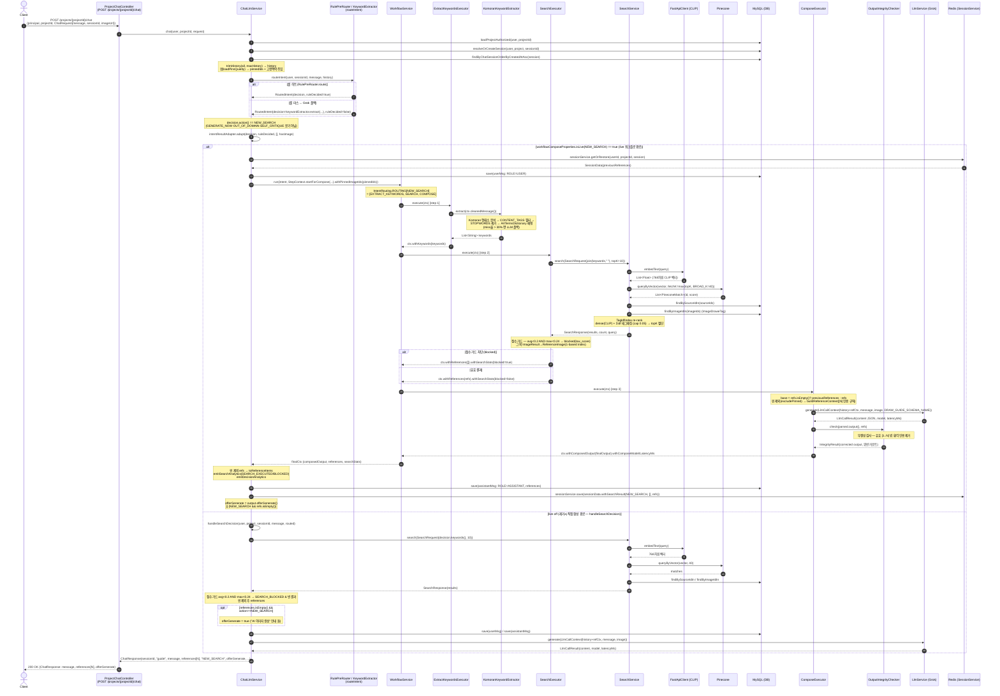
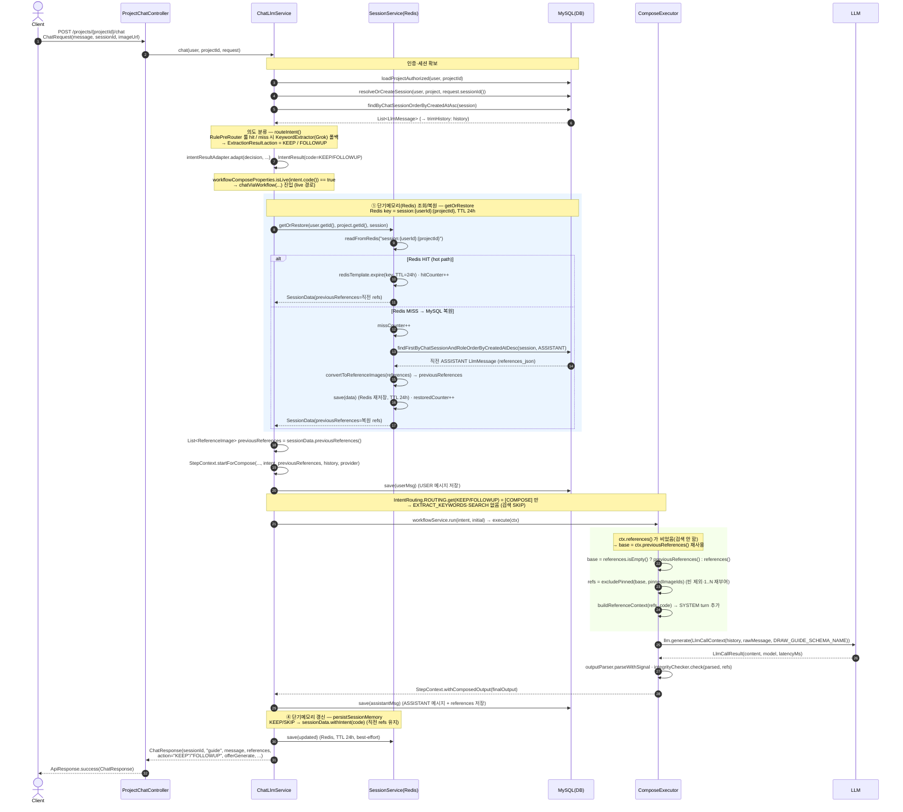
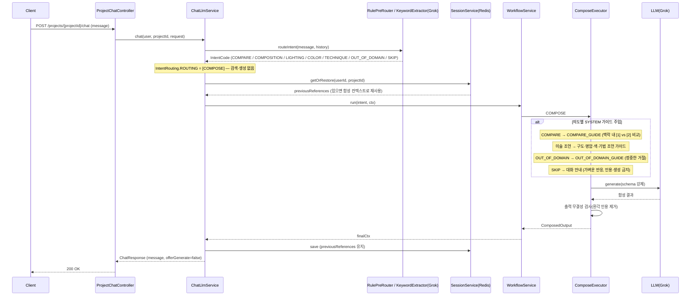
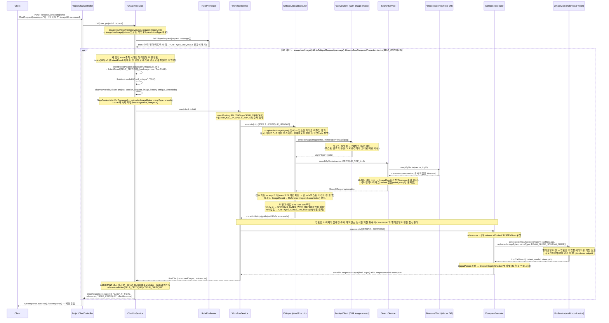
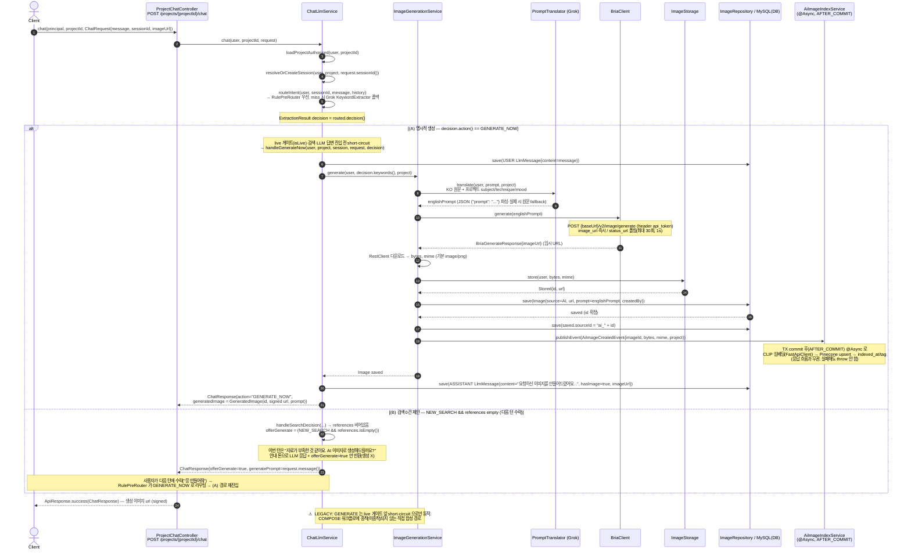
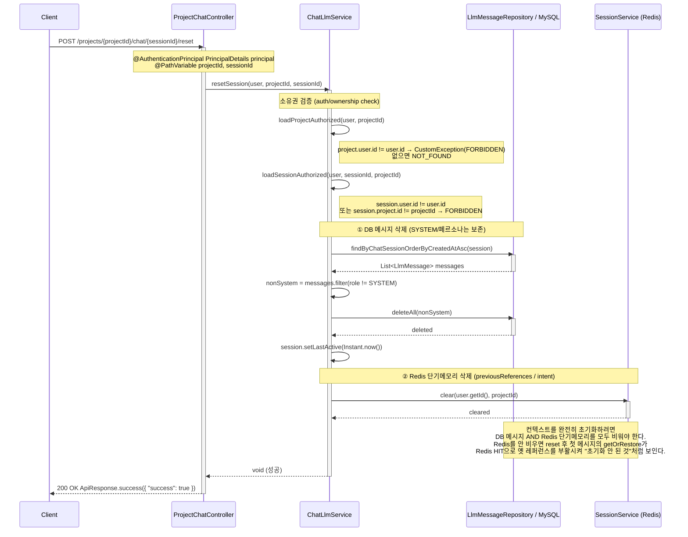

# 채팅 (LLM) 시퀀스 다이어그램

AI 추천 파이프라인 진입(`POST /projects/{id}/chat`)에서 **의도(IntentCode)** 에 따라 갈라지는 흐름들. 핵심은 ⭐ NEW_SEARCH.

## ⭐ 레퍼런스 검색 (NEW_SEARCH) Sequence Diagram

---

| 항목 | 흐름 요약 | 핵심 비즈니스 로직 |
| --- | --- | --- |
| 목표 | 사용자 발화에서 키워드를 뽑아 CLIP 임베딩으로 유사 레퍼런스를 검색하고, 인용 가능한 가이드 답변을 합성한다 | NEW_SEARCH 는 검색·인용이 들어가는 챗봇의 핵심 플로우 (EXTRACT_KEYWORDS → SEARCH → COMPOSE) |
| 요청·인증 | `POST /projects/{projectId}/chat` → `ProjectChatController.chat(principal, projectId, request)` → `ChatLlmService.chat(user, projectId, request)` | `@AuthenticationPrincipal` 로 user 주입, `loadProjectAuthorized` 로 프로젝트 소유권 검증, `resolveOrCreateSession` 으로 세션 확보 |
| 의도 분류 | `routeIntent()` — 결정론적 `RulePreRouter.route` 먼저, 미스면 Grok `keywordExtractor.extract` 폴백 → `decision.action() == NEW_SEARCH` | 룰 히트/미스를 analytics(INTENT_RULE_HIT/MISS) + Micrometer 로 집계, 분류 latency 측정 (DoD ≤ 300ms) |
| 키워드 추출 | `ExtractKeywordsExecutor` → `KomoranKeywordExtractor.extract(cleanedMessage)` | Komoran 형태소 분석 → CONTENT_TAGS(NNG/NNP/VV/VA) 필터 → STOPWORDS 제거 → ArtTermsDictionary 한→영 매핑, 사전 미스율 > 30% 면 LLM 폴백 |
| 검색 + IDF re-rank | `SearchExecutor` → `SearchService.search` → `FastApiClient.embedText` (768차원) → `Pinecone.queryByVector(vector, 40)` → MySQL `findBySourceIdIn`·`findByImageIdIn` 메타 조인 → `TagIdfIndex` re-rank → topK 절단 | dense(CLIP) 위에 태그 IDF 매칭 소프트 점수(cap 0.05)를 얹어 재정렬. 점수 가드 `avg<0.2 AND max<0.24` 충족 시 무관 결과로 차단(blocked=low_score), 통과 시 ImageResult→ReferenceImage(1-based index) |
| COMPOSE + 무결성 | `ComposeExecutor` → `buildReferenceContext([N] 인용 규칙)` → `LLM(Grok).generate(DRAW_GUIDE_SCHEMA_NAME)` → `OutputParser` → `OutputIntegrityChecker.check` | references 비면 previousReferences 재사용·핀 제외. 무결성 검사로 유효 범위 `1..refs.size()` 밖 환각 인용을 본문·citations 양쪽에서 결정론적으로 제거(재호출 없음) |
| 세션 저장 | `RedisSessionService.save(sessionData.withSearchResult(NEW_SEARCH, [], refs))` + MySQL `LlmMessage`(USER/ASSISTANT) 저장 | NEW_SEARCH 는 결과 유무와 무관하게 이번 턴 refs 로 단기메모리 덮어쓰기(0건이면 비움 = 화면과 일치, 다음 턴 KEEP lookup 일관), best-effort I/O |
| 응답 | `ChatResponse(sessionId, "guide", message, references[N], "NEW_SEARCH", offerGenerate, ...)` → `ApiResponse.success` → 200 OK | `offerGenerate = output.offerGenerate() || (NEW_SEARCH && refs.isEmpty())` — 검색은 했으나 적합 레퍼런스가 없으면 'AI 이미지 생성' 버튼 노출. CHAT_SUCCESS analytics + LLM Timer 메트릭 기록 |

## 멀티턴 이어묻기 (KEEP / FOLLOWUP) Sequence Diagram

---

| 항목 | 흐름 요약 | 핵심 비즈니스 로직 |
| --- | --- | --- |
| 목표 | 직전 턴의 참고 이미지(레퍼런스)를 **새로 검색하지 않고** 그대로 이어 활용해 멀티턴 대화 맥락을 유지한다 | `ComposeExecutor` 가 `ctx.references()` 가 비면 `ctx.previousReferences()` 로 폴백해 합성 컨텍스트를 구성 |
| 요청·인증 | `POST /projects/{projectId}/chat` → `ChatLlmService.chat(user, projectId, request)` | `loadProjectAuthorized` 로 소유 검증, `resolveOrCreateSession` 으로 `ChatSession` 확보, `findByChatSessionOrderByCreatedAtAsc` 로 history 로드 |
| 의도(KEEP/FOLLOWUP) | `routeIntent` → `RulePreRouter` 룰 hit, miss 시 `KeywordExtractor`(Grok) 폴백 → KEEP/FOLLOWUP 판정 후 live 게이트면 `chatViaWorkflow` 진입 | `intentResultAdapter.adapt` → `IntentResult`, `IntentRouting.ROUTING.get(KEEP/FOLLOWUP) = [COMPOSE]` 단일 스텝 — `EXTRACT_KEYWORDS`/`SEARCH` 없음(검색 스킵) |
| 단기메모리 조회(hit/miss) | `sessionService.getOrRestore(userId, projectId, session)` 로 Redis 단기메모리 조회 | Redis key `session:{userId}:{projectId}`, TTL 24h. **HIT** → 즉시 반환 + TTL 갱신. **MISS** → `findFirstByChatSessionAndRoleOrderByCreatedAtDesc(session, ASSISTANT)` 로 MySQL 직전 ASSISTANT references 복원 후 Redis 재저장 |
| COMPOSE 재사용 | `previousReferences` 를 `StepContext.startForCompose` 로 실어 보내고 `ComposeExecutor` 가 재사용 | `base = references.isEmpty() ? previousReferences() : references()` → `excludePinned` → `buildReferenceContext` SYSTEM turn 구성 → `DRAW_GUIDE_SCHEMA_NAME` 구조화 LLM 호출 → 파싱·무결성 검사 |
| 응답 | `ComposedOutput` 으로 `ChatResponse` 조립 후 `assistantMsg` 저장, `persistSessionMemory` 로 단기메모리 갱신 | KEEP/SKIP 은 `sessionData.withIntent(code)` 로 직전 refs 유지(검색 안 했으므로 덮어쓰지 않음). 응답 `action`="KEEP"/"FOLLOWUP", `ApiResponse.success(ChatResponse)` 반환 |

## COMPOSE 종착 의도 — 조언·비교·도메인이탈·SKIP Sequence Diagram

검색 없이 **직전 맥락만으로 응답**하는 의도들은 `IntentRouting.ROUTING` 에서 `[COMPOSE]` 한 단계만 탄다. 대상은 **COMPARE**(비교) · **COMPOSITION / LIGHTING / COLOR / TECHNIQUE**(미술 조언) · **OUT_OF_DOMAIN**(도메인 이탈 거절) · **SKIP**(인사·감사·확인) 이다. 구조는 동일하고, **의도별로 다른 SYSTEM 가이드**가 주입되는 점만 다르다(검색·생성 없음).

---

| 항목 | 흐름 요약 | 핵심 비즈니스 로직 |
|:---|:---|:---|
| **목표** | 검색이 불필요한 의도를 직전 맥락만으로 응답 | `[COMPOSE]` 단일 단계 라우팅 |
| **대상 의도** | COMPARE · COMPOSITION · LIGHTING · COLOR · TECHNIQUE · OUT_OF_DOMAIN · SKIP | 모두 **COMPOSE 종착**(검색·생성 없음) |
| **의도 분류** | `routeIntent` 가 규칙 우선 → 모호하면 Grok 분류 | Rule + LLM 2단 |
| **맥락 재사용** | `SessionService.getOrRestore` 로 직전 레퍼런스를 합성 컨텍스트로만 사용 | Redis 단기메모리 |
| **의도별 가이드** | COMPARE=비교 / 조언=구도·명암·색·기법 / OUT_OF_DOMAIN=거절 / SKIP=가벼운 반응 | 같은 구조, **다른 SYSTEM 가이드** |
| **무결성** | 응답의 `[N]` 인용을 `1..refs.size` 로 검사 | 환각 인용 제거 |
| **응답** | `ChatResponse` (새 레퍼런스 없음, `offerGenerate=false`) | 200 OK |

## 자기비평 (SELF_CRITIQUE) Sequence Diagram

---

| 항목 | 흐름 요약 | 핵심 비즈니스 로직 |
| --- | --- | --- |
| 목표 | 사용자가 채팅에 본인이 그린 작업물을 직접 업로드하고 평가를 요청하면, 그 이미지를 멀티모달 비전으로 비평한다 | 업로드 작업물에 대한 구도/명암/색/형태 관점의 구체적·건설적 피드백. 잘된 점 1가지 + 개선점 1~2가지를 권유 톤으로 제시하고, 비슷한 레퍼런스를 곁들여 "네 그림과 비슷한 [N]처럼…" 식 비교 비평 |
| 트리거 (이미지+비평요청+live) | `image.hasImage() && rulePreRouter.isCritiqueRequest(message) && workflowComposeProperties.isLive(SELF_CRITIQUE)` 세 조건 AND | 세 조건이 모두 참일 때만 `adaptSelfCritique` → `chatViaWorkflow`. `isCritiqueRequest`는 "어때/평가/피드백/봐줘/고칠 점/잘 그렸어" 등 결정론적 정규식(LLM 콜 0). 게이트가 분류 앞에 있어 `isLive(010)` off 면 010 IntentResult 자체를 안 만들고 레거시 경로로 흘려 완전 무영향. 이미지 신호와 AND 결합 — 이미지 없이 "어때?"는 일반 대화라 010 아님 |
| 업로드 이미지 임베딩 | `CritiqueUploadExecutor` → `FastApiClient.embedImage(imageBytes, mimeType)` | 업로드 작업물을 768차원 CLIP 벡터로 변환. 텍스트 검색과 동일 CLIP 공간이라 레퍼런스와 그대로 비교 가능. 임베딩/검색 예외는 비평을 막지 않고 빈 refs 로 폴백(부가가치 실패 격리, RuntimeException catch) |
| 유사 레퍼런스 검색 | `SearchService.searchByVector(vector, CRITIQUE_TOP_K=4)` → `PineconeClient.queryByVector` → MySQL 메타 조립 | 비평용은 '핵심 비교 몇 장'이라 top-K=4(기본 검색 10보다 적게). `searchByVector`는 텍스트 검색과 동일 조립 경로를 공유하되 텍스트 임베딩 단계만 건너뜀(REQUIRES_NEW 트랜잭션 격리). 점수 가드(avg<0.2 ‖ max<0.21) 통과분만 `ReferenceImage`(1-based)로 첨부, 차단/0건이면 텍스트(비전) 비평으로 폴백 |
| 멀티모달 COMPOSE | `WorkflowService.run` → `IntentRouting[SELF_CRITIQUE]=[CRITIQUE_UPLOAD, COMPOSE]` → `ComposeExecutor` → `LlmService.generate(uploadedImageBytes 포함)` | 업로드 이미지가 임베딩·유사 레퍼런스 검색을 거친 뒤에야 COMPOSE. 비평 가이드는 refs 유무로 분기(WITH_REFS: [N] 인용 허용 / NO_REFS: 인용 금지). LLM 이 업로드 작업물을 직접 보고 `DRAW_GUIDE_SCHEMA_NAME` structured output 으로 비평, `OutputIntegrityChecker` 가 범위 밖 환각 인용을 제거 |
| 응답 | `ChatResponse(sessionId, "guide", 비평응답, references, "SELF_CRITIQUE", offerGenerate)` | `referencesAction(SELF_CRITIQUE)`는 "SELF_CRITIQUE" 문자열을 그대로 노출(숫자 코드 "010" 비노출). ASSISTANT 메시지 저장 + CHAT_SUCCESS analytics + `llmCall` 메트릭 기록 후 비평 응답을 `ApiResponse.success`로 반환 |

## AI 이미지 생성 (GENERATE) Sequence Diagram

---

| 항목 | 흐름 요약 | 핵심 비즈니스 로직 |
| --- | --- | --- |
| 목표 | 사용자가 원하는 이미지를 검색 대신 AI(Bria)로 즉석 생성해 채팅 응답에 url 로 돌려준다 | `chat()` 진입 후 `routeIntent` 결과가 `GENERATE_NOW` 이면 검색·LLM 답변을 모두 건너뛴다 |
| 트리거 (명시) | "만들어줘" 등 명시적 생성 발화 → `decision.action() == GENERATE_NOW` | live 게이트(`isLive`)·검색·LLM 호출 **이전**에 `handleGenerateNow(...)` 로 short-circuit (할루시네이션 차단 위해 고정 안내 문구 사용) |
| 트리거 (검색 0건 제안) | `NEW_SEARCH` 인데 적합 레퍼런스 0건 → `offerGenerate=true` 안내만 반환 | 이번 턴은 생성하지 않고 제안 톤 응답 + `generatePrompt=message`. 사용자가 다음 턴에 수락하면 룰이 `GENERATE_NOW` 로 라우팅돼 (A) 경로로 들어간다 |
| 프롬프트 번역 | 한국어 원문 → 영문 image-gen 프롬프트 | `PromptTranslator.translate(user, prompt, project)` — 고정 모델 Grok, 프로젝트 subject/technique/mood 반영, `{"prompt":"..."}` JSON 파싱(실패 시 sanitize·원문 fallback), `prompt_translation_logs` 기록 |
| Bria 생성 | 영문 프롬프트로 Bria 호출 후 임시 url 수신 | `BriaClient.generate(englishPrompt)` — `POST /v2/image/generate`(`api_token` 헤더), 동기 `image_url` 또는 비동기 `status_url` 폴링(최대 30회·1s 간격). 임시 url 은 즉시 다운로드 |
| 저장 + 이벤트 | 다운로드 바이트를 우리 저장소·DB 로 영구화하고 인덱싱 이벤트 발행 | `ImageStorage.store` → `ImageRepository` 저장(`source=AI`, `prompt=englishPrompt`) → id 확정 후 `sourceId="ai_"+id` → `AiImageCreatedEvent` publish. `AiImageIndexService` 가 AFTER_COMMIT·@Async 로 CLIP→Pinecone upsert(응답과 비동기 분리) |
| 응답 | 생성 이미지 url 을 채팅 응답으로 반환 | `ChatResponse{action="GENERATE_NOW", generatedImage=GeneratedImage(id, signed url, prompt)}` — `imageUrlSigner.sign` 으로 서명된 url. ASSISTANT 메시지도 함께 저장 |
| 왜 LEGACY 인가 | GENERATE 는 신규 COMPOSE 워크플로에 종착되지 못한 직접 합성 경로로 남아있다 | ① 다른 의도와 달리 `COMPOSE 종착 계약`(스키마 강제 LLM→파싱→무결성)을 따르지 않음 ② `Image` 엔티티·`Bria/Storage` 인프라에 직접 의존 ③ Bria API 키 등 부팅 검증 의존성이 있어 워크플로 단계로 일반화하기 전까지 live 게이트 앞 short-circuit 으로 유지 |

## 대화 초기화 (Reset) Sequence Diagram

---

| 항목 | 흐름 요약 | 핵심 비즈니스 로직 |
| --- | --- | --- |
| 목표 | 특정 세션의 대화 컨텍스트를 완전히 초기화한다 | DB의 대화 메시지와 Redis 단기메모리를 모두 비워, 이후 첫 메시지에 이전 턴·레퍼런스가 전혀 주입되지 않도록 보장 |
| 요청·인증 | `POST /projects/{projectId}/chat/{sessionId}/reset` → `ProjectChatController.reset()` → `ChatLlmService.resetSession(user, projectId, sessionId)` | `@AuthenticationPrincipal`로 사용자 추출. `loadProjectAuthorized`(project.user 소유권)와 `loadSessionAuthorized`(session.user + session.project 일치) 이중 검증, 불일치 시 `CustomException(FORBIDDEN)`, 미존재 시 `NOT_FOUND` |
| DB 메시지 삭제 | `findByChatSessionOrderByCreatedAtAsc`로 메시지 조회 후 `deleteAll(nonSystem)` | `MessageRole.SYSTEM`(페르소나/시스템 프롬프트)은 필터로 보존하고 USER/ASSISTANT 메시지만 삭제. 이후 `session.setLastActive(now)`로 활동 시각 갱신. `@Transactional` |
| Redis 단기메모리 삭제 | `sessionService.clear(user.getId(), projectId)` | previousReferences/intent 등 단기메모리(short-term memory)를 명시적으로 제거. 버그 수정 근거: 과거에 이 clear가 누락되어 reset 후 `getOrRestore`가 Redis HIT으로 옛 레퍼런스를 복원 → 이전 컨텍스트가 leak되어 "초기화가 안 된" 것처럼 동작했음. DB + Redis 둘 다 비워야 맥락이 완전히 초기화됨 |
| 응답 | `ApiResponse.success(Map.of("success", true))` | `200 OK { "success": true }` 반환. 본문 데이터 없이 성공 여부만 전달 |
