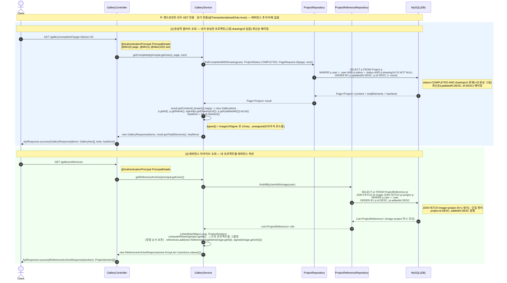

# 갤러리 · 아카이브 시퀀스 다이어그램

완성작 갤러리(COMPLETED 프로젝트·내 그림 `drawingUrl`)와 프로젝트별 레퍼런스 아카이브(읽기 전용).

## 갤러리 · 레퍼런스 아카이브 조회 Sequence Diagram

---

| 항목 | 흐름 요약 | 핵심 비즈니스 로직 |
| --- | --- | --- |
| 목표 | 로그인 유저의 완성작 갤러리(내 그림)와 프로젝트별 레퍼런스 아카이브를 조회한다. 둘 다 `GET`·읽기 전용으로, 추가/삭제 부수효과가 없다. | `@Transactional(readOnly = true)` 보장. `@AuthenticationPrincipal` 로 본인 데이터만 노출. |
| 완성작 갤러리 (완성 프로젝트·페이지) | `GET /gallery/completed?page&size` → `getCompleted(user, page, size)` → `projectRepository.findCompletedWithDrawing(user, ProjectStatus.COMPLETED, PageRequest.of(page, size))`. | `status=COMPLETED AND drawingUrl IS NOT NULL`(=내 완성 그림) 조건, `ORDER BY updatedAt DESC, id DESC` 최신순 페이징. `page`(≥0)·`size`(1~100) 검증. `GalleryItem{projectId, projectName, drawingUrl, completedAt}` (drawingUrl은 presigned 서명). |
| 완성작 상세 (회고) | `GET /gallery/completed/{projectId}` → `getCompletedDetail(user, projectId)` → 프로젝트 소유 검증(NOT_FOUND/FORBIDDEN) + 가이드 이력 집계 → `GalleryDetailResponse`(overview·weeklyTrend·timeline 등). | 가이드 0건이어도 200(빈 집계). 완성작 카드 클릭 시 성장 회고 화면. |
| 레퍼런스 아카이브 (프로젝트별 그룹핑) | `GET /gallery/references` → `getReferenceArchive(user)` → `projectReferenceRepository.findAllByUserWithImage(user)` 결과를 프로젝트별 섹션으로 묶음. | `LinkedHashMap<Long, ProjectSection>` + `computeIfAbsent(project.id, ...)` 로 쿼리 정렬 순서(project.id DESC, addedAt DESC) 보존하며 그룹핑. |
| N+1 방지 (JOIN FETCH) | 레퍼런스 조회 시 `JOIN FETCH pr.image`, `JOIN FETCH pr.project p` 로 연관 엔티티를 단일 쿼리에 즉시 로딩. | 그룹핑 단계에서 `ref.getProject()` / `ref.getImage()` 접근 시 추가 쿼리가 발생하지 않아 N+1 문제 회피. |
| 응답 | 완성작: `GalleryResponse{items: GalleryItem[], total, hasMore}` (`hasMore = result.hasNext()`). 아카이브: `ReferenceArchiveResponse{sections: ProjectSection{projectId, projectName, references[ReferenceImageItem{imageId, url}]}}`. | 모두 `ApiResponse.success(...)` 로 래핑해 반환. 브라우저 노출 URL은 `ImageUrlSigner` 서명. |
