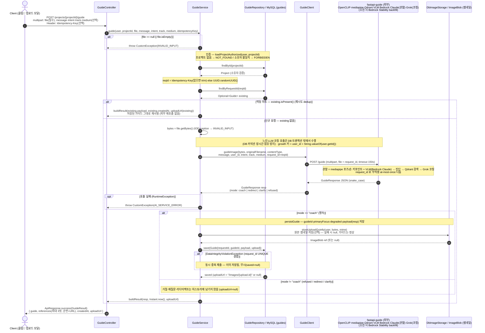
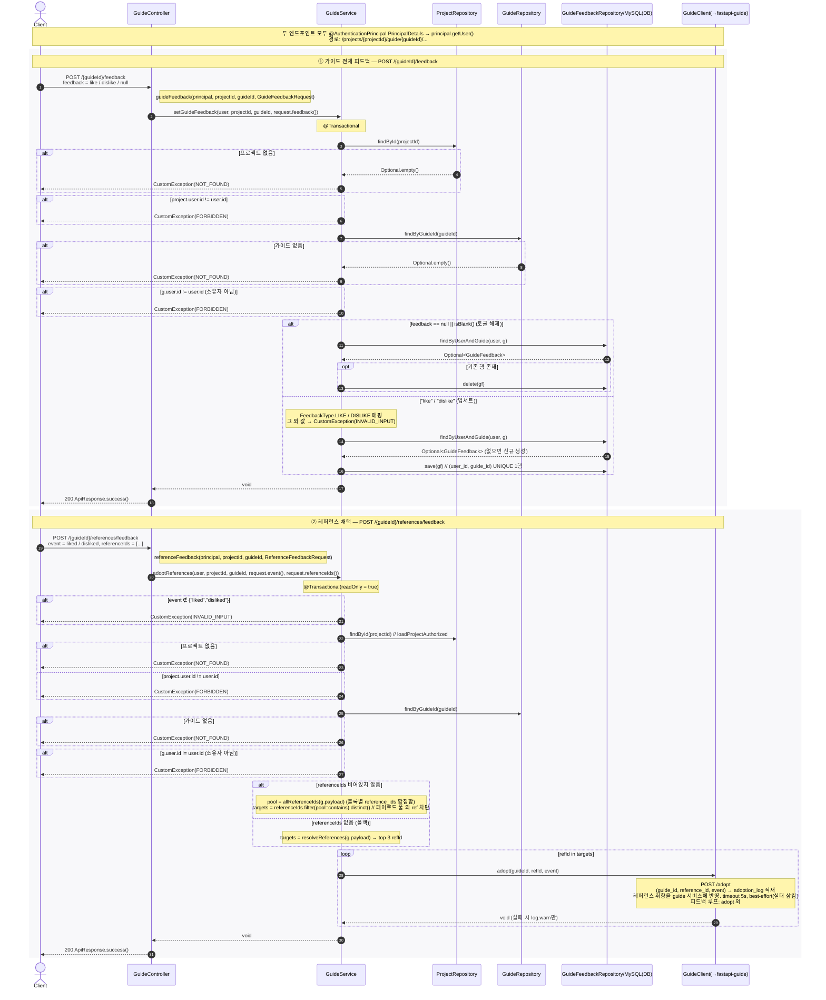

# 이미지 기반 가이드 시퀀스 다이어그램

업로드한 그림을 비전으로 진단·코칭하는 핵심 기능(⭐). 백엔드는 오케스트레이션, 실제 비전·코칭은 `fastapi-guide`.

## ⭐ 이미지 기반 가이드 — 그림 업로드 Sequence Diagram

---

| 항목 | 흐름 요약 | 핵심 비즈니스 로직 |
| --- | --- | --- |
| 목표 | 사용자가 업로드한 그림 한 컷에 대해 fastapi-guide 의 비전·코칭 결과를 받아 가이드 카드(GuideResult)로 반환 | CORE — 이미지 기반 "한 끗 가이드". coach 결과는 히스토리로 복원 가능하게 영속 |
| 요청·인증 | `POST /projects/{projectId}/guide` multipart(file 필수, message·intent·track·medium 선택, Idempotency-Key 헤더) → `guideService.guide(...)` | file 비어있으면 `INVALID_INPUT`. `loadProjectAuthorized` 로 프로젝트 접근 권한 검증(없음→`NOT_FOUND`, 소유자 불일치→`FORBIDDEN`) |
| 멱등성 dedup | `reqId` = Idempotency-Key(있으면 trim) 없으면 `UUID.randomUUID()` → `findByRequestId(reqId)` 조회 | `existing.isPresent()` 면 저장된 `payload`·`createdAt`·`uploadUrl` 로 `buildResult` 재실행, 외부 재호출 없이 즉시 반환(재시도 dedup) |
| fastapi-guide 위임 (트랜잭션 밖) | `guideClient.guideImage(bytes, filename, mime, message, user_id, intent, track, medium, requestId)` → `POST /guide` (timeout 150s) | 느린 LLM 코칭 호출은 **DB 트랜잭션 밖**에서 수행해 커넥션 장시간 점유 방지. **growth 키 = user_id = String.valueOf(user.getId())**. `request_id` 동봉으로 fastapi 측 부작용 at-most-once. 실패 시 `AI_SERVICE_ERROR`. 실제 파이프라인(관찰 = mediapipe 포즈/손 키포인트 + VLM Bedrock Claude → 진단·결정 → Qdrant 검색 → Grok 코칭)은 외부 fastapi-guide 가 수행 |
| coach 모드만 영속 | `"coach".equals(resp.mode())` 일 때만 `persistGuide` 로 Guide 저장(requestId·guideId·primaryFocus·degraded·payload) | redirect/clarify/refused 는 히스토리에 남기지 않음. `request_id` UNIQUE 경합(`DataIntegrityViolationException`)은 동시 중복 제출로 보고 무시(saved=null) |
| 썸네일 선택 저장 | `storeUploadQuietly(user, bytes, mime)` → `DbImageStorage.store` → `ImageBlob` 참조 → Guide.upload 연결 | 코칭이 핵심 가치이므로 썸네일 저장 실패(검증/IO)는 치명적 아님 — null 반환 후 `upload_id` 만 비우고 가이드는 정상 반환. `uploadUrl` = `/images/{upload.id}` (없으면 null) |
| 응답 | `buildResult(resp, createdAt, uploadUrl)` → `GuideResult{ guide, references, createdAt, uploadUrl }` → `ApiResponse.success` | `references` = 전체 블록의 `reference_ids` 를 등장 순서로 dedupe → 최대 3컷, 순번(1·2·3)+이미지 URL 보강 |

## 가이드 피드백 · 레퍼런스 채택 Sequence Diagram

---

| 항목 | 흐름 요약 | 핵심 비즈니스 로직 |
| --- | --- | --- |
| 목표 | 가이드 카드와 그 안의 레퍼런스(최대 3컷)에 대한 사용자 피드백을 수집하고, 레퍼런스 취향을 외부 guide 서비스에 반영한다. | 두 채널 분리: `guide_feedback`(카드 전체) ↔ `adoption_log`(레퍼런스별, fastapi 경유). |
| 가이드 피드백(👍/👎) | `POST /{guideId}/feedback` → `setGuideFeedback(user, projectId, guideId, feedback)` → `GuideFeedbackRepository`. | `@Transactional`. `feedback` ∈ {`like`→LIKE, `dislike`→DISLIKE}. `findByUserAndGuide` 후 있으면 갱신·없으면 생성(업서트). `(user_id, guide_id)` UNIQUE로 사용자별 1행 보장. |
| 레퍼런스 채택(liked/disliked) | `POST /{guideId}/references/feedback` → `adoptReferences(user, projectId, guideId, event, referenceIds)`. | `@Transactional(readOnly=true)`. `findByGuideId`로 가이드 조회 후, `referenceIds`를 가이드 페이로드의 ref 풀(`allReferenceIds`)로 필터링. 비어있으면 `resolveReferences` top-3로 폴백. 대상마다 `GuideClient.adopt` 호출. |
| 권한·유효성 | 두 엔드포인트 공통: 프로젝트 접근 권한 + 가이드 소유자 검증. | `loadProjectAuthorized`: 프로젝트 없음 → `NOT_FOUND`, 소유자 불일치 → `FORBIDDEN`. 가이드 없음 → `NOT_FOUND`, `g.user != user` → `FORBIDDEN`. 채택은 `event ∉ {liked,disliked}` → `INVALID_INPUT`, 피드백은 `feedback` 미인식 값 → `INVALID_INPUT`. `feedback` null/빈값은 토글 해제(행 삭제). |
| 외부 반영(adopt) | 채택 대상 ref마다 `GuideClient.adopt(guideId, refId, event)` → fastapi-guide `POST /adopt`. | body `{guide_id, reference_id, event}` → `adoption_log` 적재로 취향 반영. timeout 5s, best-effort(실패해도 예외 삼키고 `log.warn`만, 사용자 흐름 유지). 임의 ref 적재는 페이로드 풀 화이트리스트로 차단. 피드백 루프에는 adopt 외 **#52 reroll**(노출분 제외 재탐색, LLM 0콜)·**#54 취향 결**(무드 soft boost, "결이 맞는 것 우선")도 포함. |
| 응답 | 두 엔드포인트 모두 부수효과 처리 후 본문 없는 성공. | `ApiResponse.success()` (200). 가이드 피드백은 DB 커밋, 레퍼런스 채택은 외부 적재 시도 후 반환. |
