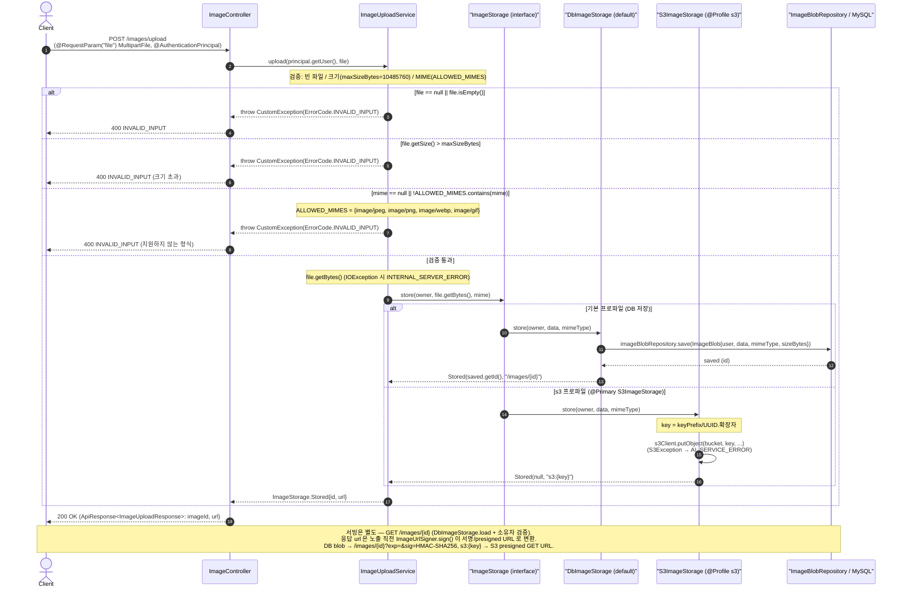
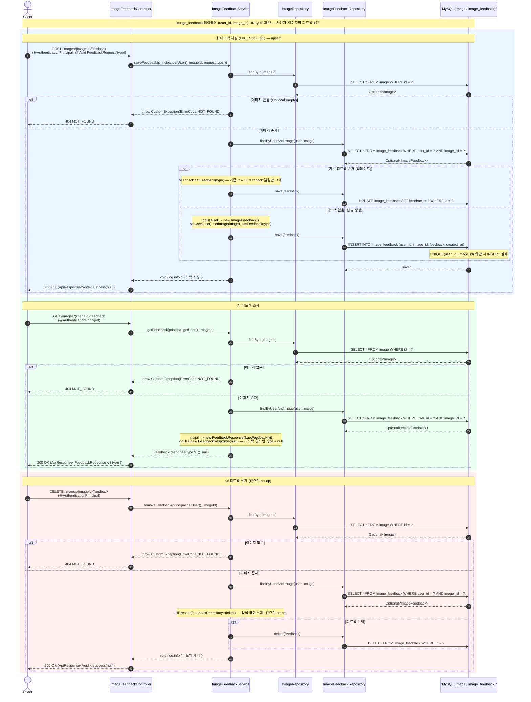

# 이미지 시퀀스 다이어그램

이미지 업로드·서빙(저장 추상화)과 좋아요/싫어요 피드백.

## 이미지 업로드 (Image Upload) Sequence Diagram

---

| 항목 | 흐름 요약 | 핵심 비즈니스 로직 |
| --- | --- | --- |
| 목표 | 인증 사용자가 채팅용 이미지를 업로드하고 저장 식별자/URL 을 돌려받는다 | `POST /images/upload` → `ImageController.upload(principal, MultipartFile)` → `ImageUploadService.upload(user, file)` |
| 검증 (MIME/크기) | 빈 파일·크기 초과·미지원 MIME 을 업로드 전에 차단 | `ALLOWED_MIMES = {image/jpeg, image/png, image/webp, image/gif}`, `maxSizeBytes`(기본 10485760, `app.image.max-size-bytes`) 초과 또는 미지원 형식 시 `CustomException(ErrorCode.INVALID_INPUT)`; `file.getBytes()` IOException 시 `INTERNAL_SERVER_ERROR` |
| 저장 (DB/S3 추상화) | `ImageStorage` 인터페이스로 백엔드 추상화, 프로파일로 구현 교체 | 기본: `DbImageStorage.store` → `ImageBlobRepository.save(ImageBlob)` → `Stored(id, "/images/{id}")`. `s3` 프로파일(@Primary `S3ImageStorage`): `s3Client.putObject` → `Stored(null, "s3:{key}")`, 실패 시 `AI_SERVICE_ERROR` |
| URL 반환 | 저장 결과를 응답 DTO 로 매핑 | `Stored{id, url}` → `new ImageUploadResponse(stored.id(), stored.url())` |
| 서빙 (서명 URL) | 저장 경로 자체는 영구 보관, 노출 직전에만 단기 서명 | `GET /images/{id}` 는 `DbImageStorage.load` + 소유자 검증(MySQL 전용). 응답 url 은 `ImageUrlSigner.sign()` 이 변환 — DB blob 은 `/images/{id}?exp=&sig=HMAC-SHA256`, `s3:{key}` 는 `S3Presigner` presigned GET URL |
| 응답 | 표준 래퍼로 imageId·url 반환 | `200 OK` `ApiResponse.success(ImageUploadResponse{imageId, url})` |

## 이미지 피드백 (좋아요/싫어요) Sequence Diagram

---

| 항목 | 흐름 요약 | 핵심 비즈니스 로직 |
| --- | --- | --- |
| 목표 | 인증 사용자가 특정 이미지에 좋아요/싫어요를 남기고 조회·삭제한다 | `/images/{imageId}/feedback` 의 `POST`/`GET`/`DELETE` → `ImageFeedbackController` → `ImageFeedbackService`. `FeedbackType` 은 `LIKE`/`DISLIKE` 2종 |
| 피드백 저장 (upsert) | `POST` 로 LIKE/DISLIKE 저장, 기존 피드백은 덮어쓰기 | `saveFeedback(user, imageId, type)`: `imageRepository.findById` → 없으면 `CustomException(ErrorCode.NOT_FOUND)`. `feedbackRepository.findByUserAndImage(user, image)` → 있으면 `setFeedback(type)`(UPDATE), 없으면 `orElseGet`으로 `new ImageFeedback` 생성 후 `setUser`/`setImage`/`setFeedback`(INSERT) → `save` |
| 조회 | `GET` 으로 현재 사용자의 피드백 상태 반환 | `getFeedback(user, imageId)`(`@Transactional(readOnly = true)`): `findByUserAndImage`.`map(f -> new FeedbackResponse(f.getFeedback()))`.`orElse(new FeedbackResponse(null))` — 피드백 없으면 `type = null` |
| 삭제 | `DELETE` 로 피드백 제거, 없으면 무동작 | `removeFeedback(user, imageId)`: `findByUserAndImage(user, image)`.`ifPresent(feedbackRepository::delete)` — 존재할 때만 삭제하고 없으면 no-op (예외 없음) |
| UNIQUE 제약 | 사용자·이미지당 피드백은 1건만 존재 | `ImageFeedback` `@Table(uniqueConstraints = @UniqueConstraint(columnNames = {"user_id", "image_id"}))`. `findByUserAndImage` 단건 조회 + upsert 로직이 이 제약을 보장 |
| 응답 | 표준 래퍼로 반환 | 저장/삭제: `200 OK` `ApiResponse<Void>`(`success(null)`). 조회: `200 OK` `ApiResponse<FeedbackResponse>`(`{ type }`, 미설정 시 `type = null`). 이미지 미존재 시 `ErrorCode.NOT_FOUND` |
