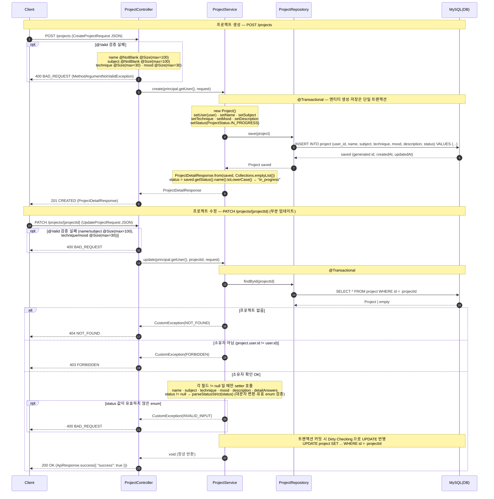
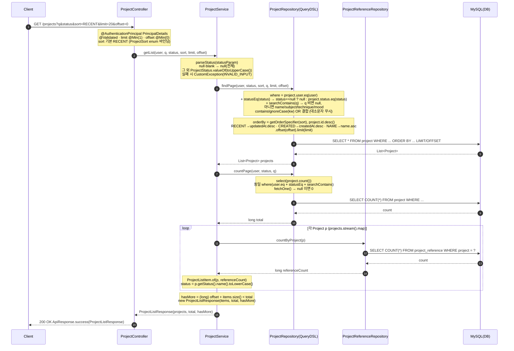
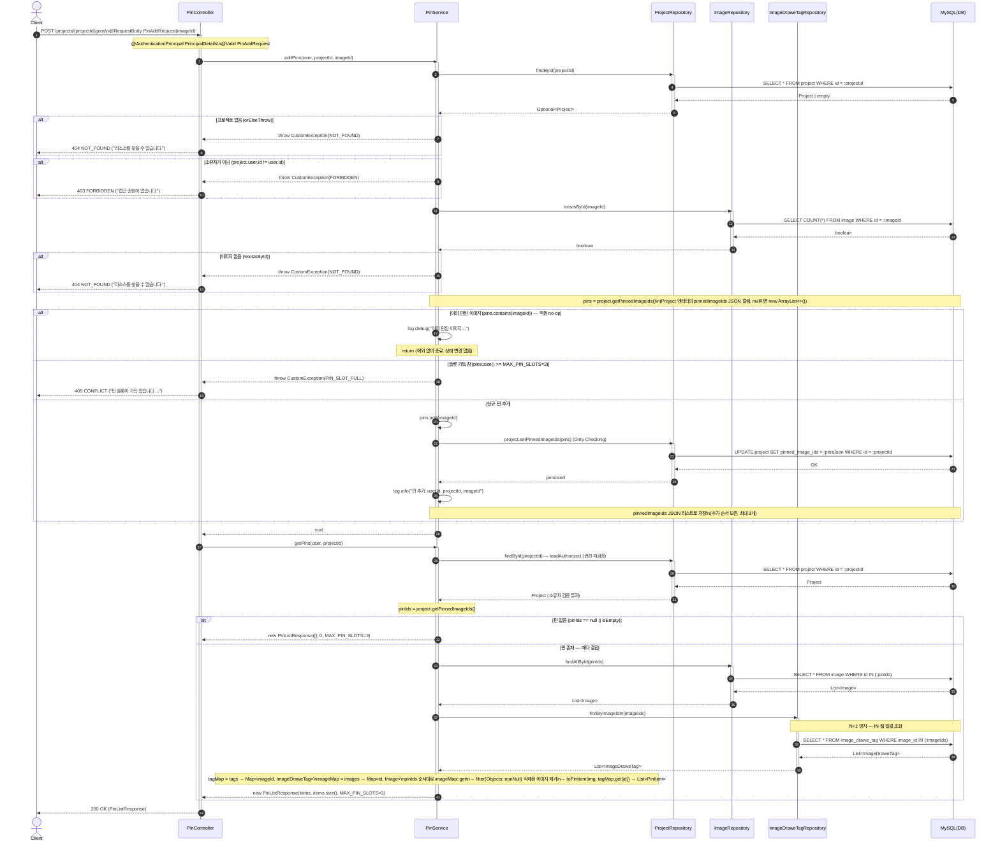
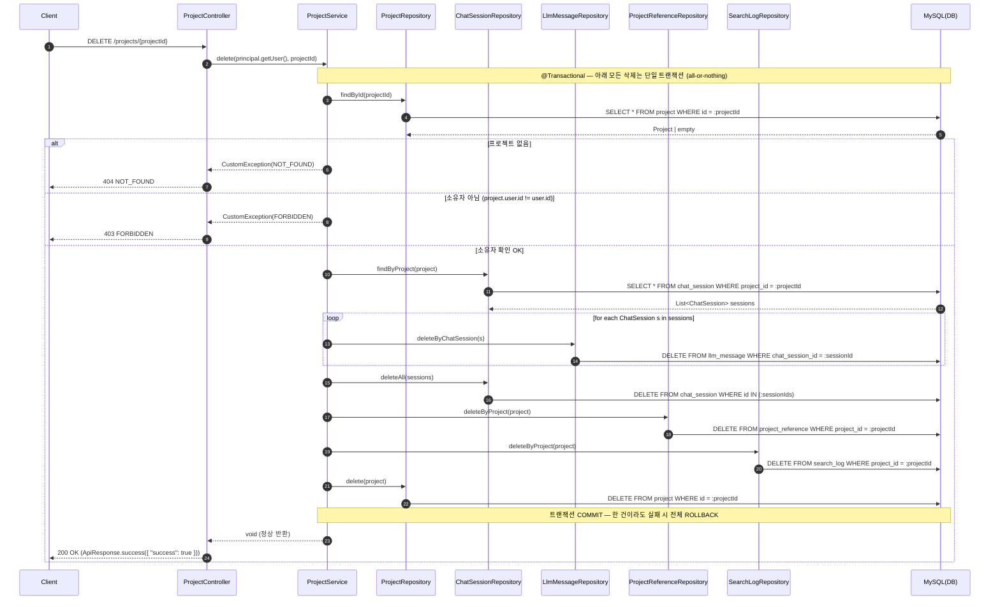

# 프로젝트 · 핀 시퀀스 다이어그램

프로젝트 CRUD(생성·목록·삭제)와 레퍼런스 핀. 목록은 QueryDSL 동적 정렬·검색·필터.

## 프로젝트 생성 (Project Create) Sequence Diagram

---

| 항목 | 흐름 요약 | 핵심 비즈니스 로직 |
| --- | --- | --- |
| 목표 | `POST /projects` 요청으로 새 프로젝트를 생성하고 상세 정보를 반환한다. | `ProjectController.create(principal, request)` → `ProjectService.create(user, request)` 단일 진입점. 반환 타입 `` `ApiResponse<ProjectDetailResponse>` ``, 상태코드 `201 CREATED`. |
| 요청 검증 | 컨트롤러 진입 시 `@Valid` 로 `CreateProjectRequest` 바디를 검증한다. | `name` `@NotBlank @Size(max=100)`, `subject` `@NotBlank @Size(max=100)`, `technique`·`mood` `@Size(max=30)`, `description` 제약 없음. 실패 시 `400 BAD_REQUEST`. |
| 엔티티 생성 (status=IN_PROGRESS) | 새 `Project` 엔티티를 만들고 요청 필드와 소유자를 채운 뒤 상태를 고정한다. | `new Project()` 에 `setUser(user)` 및 `name/subject/technique/mood/description` 세팅, `setStatus(ProjectStatus.IN_PROGRESS)` 로 항상 진행중 상태로 시작. |
| 저장 | `@Transactional` 안에서 엔티티를 영속화하여 PK·생성/수정 시각을 부여한다. | `projectRepository.save(project)` → `INSERT INTO project (...)`. 생성된 `id`, `createdAt`, `updatedAt` 가 채워진 `Project` 반환. |
| 수정 (부분 업데이트·권한) | `PATCH /projects/{projectId}` 는 모든 필드가 nullable 인 부분 업데이트이며 소유자만 수정 가능하다. | `loadAuthorized(user, projectId)` 로 존재(`NOT_FOUND`)·소유자(`FORBIDDEN`) 검증 후, `request.xxx() != null` 인 필드만 setter 적용. `status` 는 `parseStatusStrict` 로 대문자 변환·enum 검증(실패 시 `INVALID_INPUT`). Dirty Checking 으로 `UPDATE` 반영, 응답 `` `ApiResponse<Map<String, Boolean>>` `` = `{ "success": true }`. |
| 응답 | 생성 결과를 `ProjectDetailResponse` 로 매핑하여 반환한다. | `ProjectDetailResponse.from(saved, Collections.emptyList())` — `board` 는 빈 리스트, `status` 는 `name().toLowerCase()`("in_progress")로 직렬화. 최종 응답 `201 CREATED` `` `ApiResponse<ProjectDetailResponse>` `` (수정 경로는 `200 OK`). |

## 프로젝트 목록 — 정렬·검색·필터 Sequence Diagram

---

| 항목 | 흐름 요약 | 핵심 비즈니스 로직 |
| --- | --- | --- |
| 목표 | 로그인 유저 본인 프로젝트 목록을 정렬·검색·상태필터·페이지네이션으로 조회 | `GET /projects` → `ProjectService.getList(...)` → QueryDSL 동적 조회, 본인 소유(`project.user.eq(user)`)만 노출 |
| 파라미터 (q / status / sort / page) | `q`(검색어, optional), `status`(optional), `sort`(기본 RECENT), `limit`(기본 20, @Min 1), `offset`(기본 0, @Min 0) | `parseStatus`: null·blank → null(전체), 그 외 `ProjectStatus.valueOf(toUpperCase())` 실패 시 `INVALID_INPUT`. `sort`는 `ProjectSort`(RECENT/CREATED/NAME) enum 바인딩 |
| 동적 쿼리 (QueryDSL) | `findPage`/`countPage`가 동일 where 절을 조립 | `where = user.eq(user) + statusEq(status) + searchContains(q)`. `statusEq`는 null-safe(null이면 절 무시), `searchContains`는 q 비면 null·아니면 name/subject/technique/mood `containsIgnoreCase` OR 결합. `orderBy(getOrderSpecifier(sort), project.id.desc())` (RECENT=updatedAt.desc, CREATED=createdAt.desc, NAME=name.asc) |
| 페이지네이션 (count / hasMore) | 본문 조회는 `offset/limit`, 전체 건수는 별도 count 쿼리 | `findPage`로 `List<Project>`, `countPage`로 `total`. `hasMore = (long) offset + items.size() < total` |
| referenceCount | 프로젝트마다 레퍼런스 개수 집계 | `projects.stream()`에서 `projectReferenceRepository.countByProject(p)` 호출 → `ProjectListItem.of(p, referenceCount)` (project 당 1 count 쿼리) |
| 응답 | `ProjectListResponse` 래핑 후 200 OK | `new ProjectListResponse(items, total, hasMore)` → `ApiResponse.success(...)`. `ProjectListItem`: id, name, technique, status(lowercase), referenceCount, createdAt, updatedAt |

## 레퍼런스 핀 추가 (Pin Add) Sequence Diagram

---

| 항목 | 흐름 요약 | 핵심 비즈니스 로직 |
| --- | --- | --- |
| 목표 | `POST /projects/{projectId}/pins` 로 레퍼런스 이미지를 프로젝트에 핀(책갈피)하고, 갱신된 핀 목록(`PinListResponse`)을 반환 | 핀 추가(`addPins`) + 목록 조회(`getPins`)를 컨트롤러에서 순차 호출 |
| 권한·이미지 확인 | `loadAuthorized(user, projectId)`로 프로젝트를 조회하고 소유자 검증 후, `imageRepository.existsById(imageId)`로 이미지 존재 확인 | 프로젝트 없으면 `NOT_FOUND`, 소유자 불일치 시 `FORBIDDEN`, 이미지 없으면 `NOT_FOUND` |
| 검증(중복/슬롯3) | 현재 `pinnedImageIds`를 로드해 중복 여부와 슬롯 수 검사 | 이미 핀된 경우 `log.debug` 후 멱등 no-op(`return`), 3개(`MAX_PIN_SLOTS`) 이상이면 `PIN_SLOT_FULL`(409) 예외 |
| 핀 저장 | `pins.add(imageId)` 후 `project.setPinnedImageIds(pins)`로 Dirty Checking 반영 | `pinnedImageIds`를 Project 엔티티의 JSON 리스트 컬럼에 저장, 추가 순서 보존·최대 3개 유지 |
| 목록 조회(메타 결합) | `getPins`에서 `findAllById(pinIds)`로 Image, `findByImageIdIn(imageIds)`로 ImageDraweTag를 일괄 조회해 `PinItem` 구성 | `IN` 절 일괄 조회로 N+1 방지, `pinIds` 순서 유지, 삭제된 이미지(`Objects::nonNull`) 필터링, `toPinItem`으로 메타(technique/subject/mood/tags 등) 결합 |
| 응답 | `PinListResponse(pins, count, maxSlots=3)`를 `ApiResponse.success`로 래핑해 반환 | 컨트롤러는 핀 추가 직후 최신 목록을 재조회하여 일관된 응답 제공 — `200 OK (PinListResponse)` |

## 프로젝트 삭제 (Cascade Delete) Sequence Diagram

---

| 항목 | 흐름 요약 | 핵심 비즈니스 로직 |
| --- | --- | --- |
| 목표 | `DELETE /projects/{projectId}` 요청으로 프로젝트와 연관된 모든 데이터를 cascade 삭제한다. | `ProjectController.delete()` → `ProjectService.delete(user, projectId)` 단일 진입점. |
| 권한 확인 | `loadAuthorized(user, projectId)` 로 프로젝트 존재 및 소유자 일치 여부 검증. | `findById` 결과가 없으면 `NOT_FOUND`, `project.getUser().getId() != user.getId()` 이면 `FORBIDDEN` 예외. |
| 연관 데이터 cascade (세션·메시지) | 프로젝트의 모든 `ChatSession` 을 조회한 뒤, 세션별로 `LlmMessage` 를 먼저 삭제하고 세션을 일괄 삭제. | `chatSessionRepository.findByProject(project)` → 각 세션 `llmMessageRepository.deleteByChatSession(s)` → `chatSessionRepository.deleteAll(sessions)`. 메시지(자식) → 세션(부모) 순서로 FK 무결성 보장. |
| 연관 데이터 cascade (레퍼런스·검색로그) | 프로젝트에 연결된 레퍼런스와 검색 로그를 삭제. | `projectReferenceRepository.deleteByProject(project)` → `searchLogRepository.deleteByProject(project)`. |
| 프로젝트 삭제 | 모든 연관 데이터 삭제 후 프로젝트 본체 제거. | `projectRepository.delete(project)` 로 마지막에 부모 엔티티 삭제. |
| 트랜잭션 | 권한 확인부터 모든 cascade 삭제까지 하나의 `@Transactional` 메서드로 묶임 (all-or-nothing). | 한 단계라도 실패하면 전체 ROLLBACK 되어 부분 삭제로 인한 고아 데이터(orphan) 방지. |
| 응답 | 성공 시 `200 OK` 와 `{ "success": true }` 반환. | `ApiResponse.success(Map.of("success", true))`. 컨트롤러 반환 타입 `ApiResponse<Map<String, Boolean>>`. |
