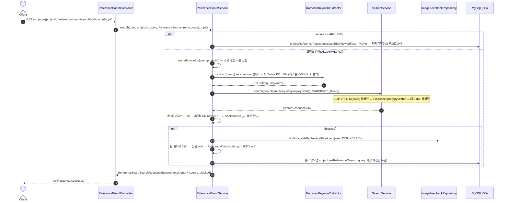
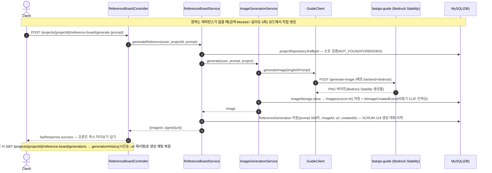
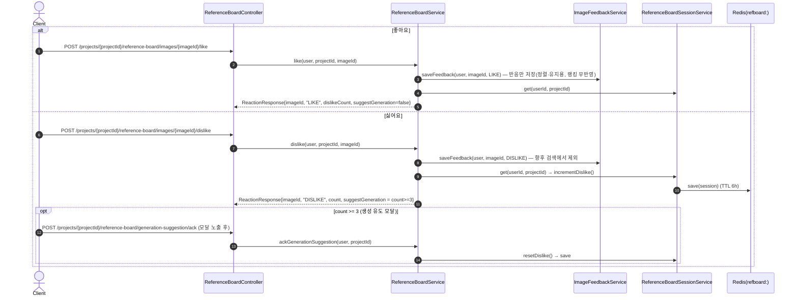

# 레퍼런스 보드 시퀀스 다이어그램

레퍼런스 보드(`/projects/{projectId}/reference-board`) — 현행 레퍼런스 탐색·생성의 1차 유저 surface. ⭐ **키워드 검색**, **AI 생성(보드 통합)**, **좋아요/싫어요 피드백**의 세 흐름.

## ⭐ 1) 키워드 검색 (GET /search) Sequence Diagram

## ⭐ 2) AI 생성 (POST /generate) Sequence Diagram

## ⭐ 3) 좋아요/싫어요 피드백 (POST /images/{id}/like·dislike) Sequence Diagram

---

| 항목 | 흐름 요약 | 핵심 비즈니스 로직 |
| --- | --- | --- |
| 검색 (⭐) | `search` → `searchCorpus`: Komoran+ArtTerms 키워드 → `SearchService`(CLIP→Pinecone) → 관련성 게이트 → 핀·싫어요 제외 → `ReferenceCard[]` | 의도 라우팅 없음(순수 키워드). `blocked`(태그 미매칭 or `max<0.18`)면 결과 비우고 생성 유도. 결과 있으면 `lastReferenceQuery` 저장(재진입 복원). ARCHIVE는 저장 레퍼런스 텍스트검색(별도 경로) |
| AI 생성 (⭐) | `generateReference` → `imageGenerationService.generate`(→ `GuideClient` → **Bedrock Stability**) → `ReferenceGeneration` 이력 저장 → `{imageId, signed(url)}` | `@Transactional`, 소유 검증(NOT_FOUND/FORBIDDEN). 생성 대화(프롬프트 500자→이미지)를 저장해 보드 재진입 시 `GET /projects/{projectId}/reference-board/generations`로 채팅 복원(SCRUM-118) |
| 피드백 (⭐) | `like`/`dislike`/`removeReaction` → `ImageFeedbackService` 영속 + `ReferenceBoardSession.dislikeCount` | 좋아요=반응 저장(정렬·유지용, **검색 랭킹 무반영**). 싫어요=향후 검색 제외 + `dislikeCount` 증가, **3회 도달 시 `suggestGeneration=true`**(생성 모달). 모달 노출 후 `ack`로 카운터 리셋 |
| 세션 격리 | 싫어요 카운터는 챗 세션과 분리된 `ReferenceBoardSession`(Redis `refboard:`, TTL 6h) | 순수 세션성 — MySQL 폴백 없이 best-effort. Redis 장애 시 새 세션으로 진행(검색은 항상 상위 결과라 deterministic, shown dedup 불필요) |
| 재활용 | 검색=`SearchService`, 생성=`ImageGenerationService`, 피드백=`ImageFeedbackService`를 그대로 재활용 | 보드는 소스필터·핀/싫어요 제외·세션 카운터만 얹는 오케스트레이션 레이어(검색·이미지 도메인 무변경) |
