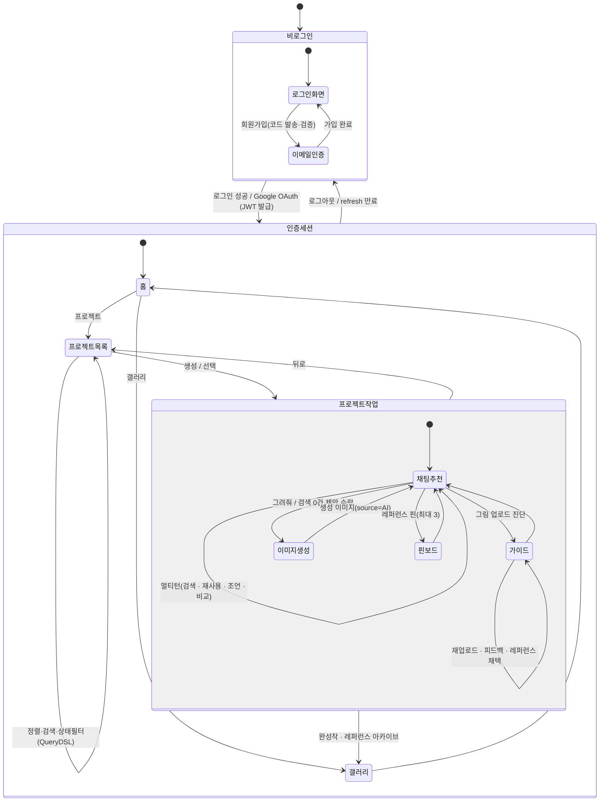
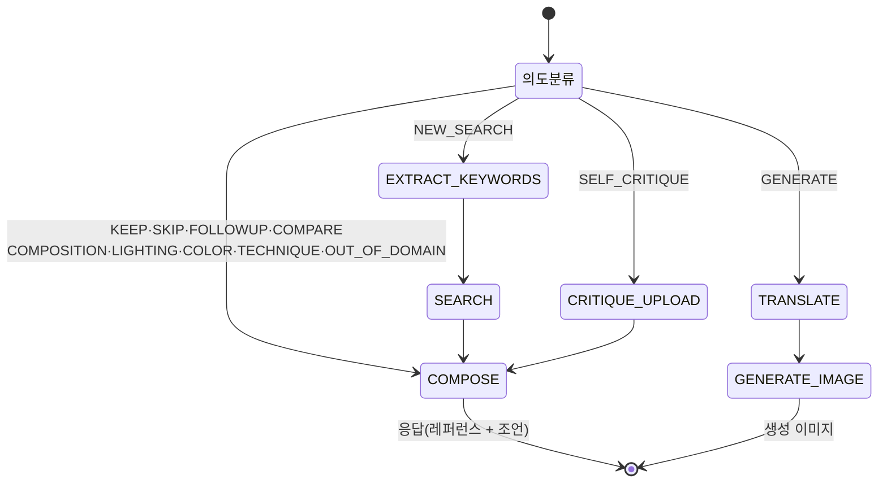
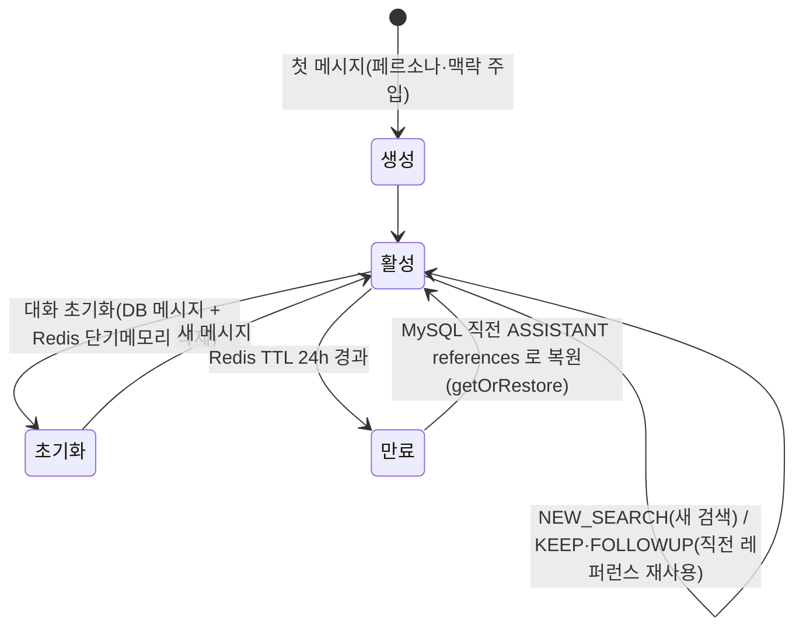
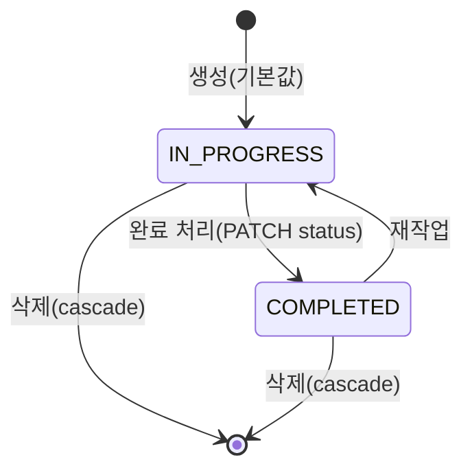
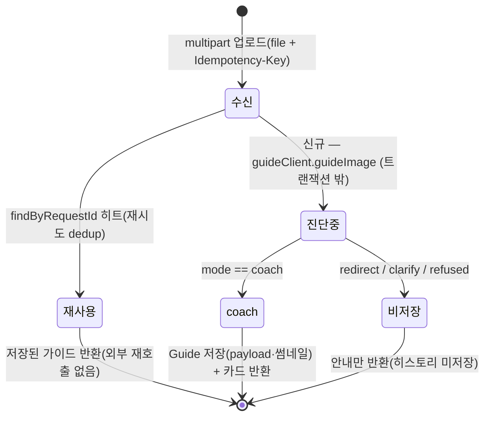
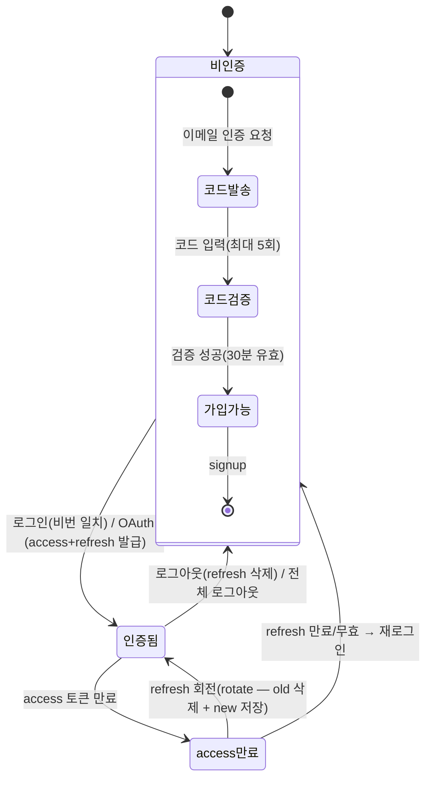
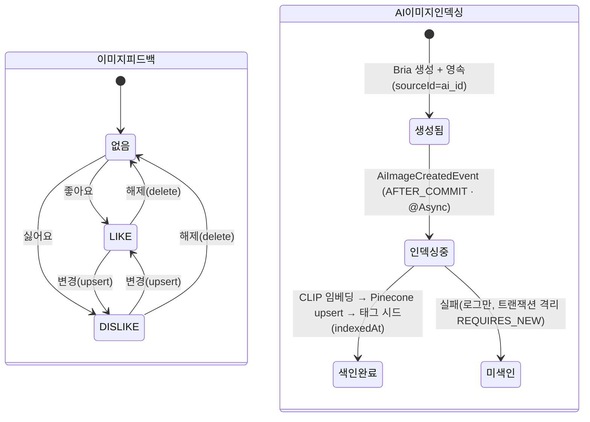

# 9. State Machine Diagram

시스템의 상태(State)와 전이(Transition)를 표현한다. **9.1 전체 시스템 상태 머신**으로 사용자 여정 전체를 조망하고, 이후 도메인별 상세 상태 머신으로 내려간다.

---

## 9.1 전체 시스템 상태 머신 ⭐

비로그인 → 인증 → 홈 → 프로젝트 작업(채팅 추천 · 이미지 생성 · 핀 · 가이드) → 갤러리 → 로그아웃으로 이어지는 전체 흐름. 각 기능은 독립된 서브 상태로 구성되며 사용자 행위(입력·클릭·업로드)에 따라 전이된다.

- **(1) 비로그인** — 초기 상태. 회원가입은 이메일 인증(코드 5분·검증 30분 TTL)을 선행하고 가입 완료 후 로그인 화면으로 복귀(§9.6).
- **(2) 인증 전이** — 이메일 로그인 또는 Google OAuth 성공 시 JWT(access·refresh) 발급과 함께 `인증세션`으로 진입. 로그아웃 또는 refresh 만료 시 비로그인으로 복귀.
- **(3) 홈 / 프로젝트 목록** — 홈은 네비게이션 허브. 프로젝트 목록은 동일 상태에서 정렬·검색·상태필터로 결과만 갱신(QueryDSL)하고, 생성/선택 시 `프로젝트작업`으로 진입.
- **(4) 프로젝트 작업(핵심)** — 채팅 추천이 작업 허브다. 멀티턴 대화로 레퍼런스를 받고(검색·재사용·조언·비교), 검색 0건이면 AI 이미지 생성으로 분기, 마음에 드는 레퍼런스는 핀(최대 3), 그림을 올리면 이미지 기반 가이드로 분기한다.
- **(5) 갤러리** — 완성작(AI 생성) 갤러리와 프로젝트별 레퍼런스 아카이브를 조회(읽기 전용).

> 굵은 흐름의 상세 상태는 아래 도메인별 머신(9.2~9.7)에서 다룬다.

---

## 9.2 워크플로 라우팅 (의도 → Step)
의도(`IntentCode`)에 따라 실행 단계(`StepType`) 경로가 결정된다. (live 경로 `IntentRouting.ROUTING` 기준)

| 의도 | Step 경로 |
|---|---|
| NEW_SEARCH | EXTRACT_KEYWORDS → SEARCH → COMPOSE |
| KEEP·SKIP·FOLLOWUP·COMPARE·COMPOSITION·LIGHTING·COLOR·TECHNIQUE·OUT_OF_DOMAIN | COMPOSE |
| SELF_CRITIQUE | CRITIQUE_UPLOAD → COMPOSE |
| GENERATE | TRANSLATE → GENERATE_IMAGE |

> live 의도는 **COMPOSE로 끝나는 것만 허용**(부팅 검증) → GENERATE는 legacy 전용(`handleGenerateNow`).

---

## 9.3 대화 세션 (멀티턴 단기메모리)

- **단기메모리**(Redis 키 `session:{userId}:{projectId}`)는 KEEP/FOLLOWUP 멀티턴의 진입점. cache miss 시 MySQL로 복원.
- **초기화**는 DB 메시지 + Redis를 **모두** 비워야 이전 맥락이 완전히 사라진다(reset 버그픽스 근거).

---

## 9.4 프로젝트 상태

- `ProjectStatus` = `IN_PROGRESS` · `COMPLETED`. 수정 API(PATCH)로 상태 전환.
- 삭제 시 연관 데이터를 한 트랜잭션에서 정리: 세션 → 메시지 → 레퍼런스 → 검색로그 → 프로젝트.

---

## 9.5 가이드 처리 상태 (mode 분기)
업로드한 그림은 `fastapi-guide` 응답의 `mode` 에 따라 영속 여부가 갈린다.

- **멱등성**: `Idempotency-Key`로 재시도를 dedup(`findByRequestId`). 이미 처리된 요청은 저장본 재사용.
- **coach 모드만 영속**: redirect/clarify/refused는 히스토리에 남기지 않는다. 실제 비전·코칭(OpenCLIP·mediapipe·Qdrant·LLM)은 외부 fastapi-guide가 수행하고, growth(=user_id) 진척이 갱신된다.

---

## 9.6 인증 · 토큰 상태

- 회원가입은 이메일 인증(코드 5분 TTL·검증 30분 TTL·시도 5회)을 선행. signup 자체는 토큰을 발급하지 않고, 토큰은 **로그인/OAuth**에서 발급된다.
- 토큰 갱신은 **회전(rotation)** — 기존 refresh를 삭제하고 새 토큰을 저장해 재사용을 차단한다.

---

## 9.7 이미지 피드백 · AI 이미지 인덱싱

- **피드백**: `(user_id, image_id)` UNIQUE 1행 — 같은 이미지에 LIKE/DISLIKE는 upsert로 토글, 해제는 삭제.
- **AI 이미지 인덱싱**: 생성·영속 커밋 후 비동기로 임베딩·색인. 실패해도 본 트랜잭션과 분리(REQUIRES_NEW)되어 생성 자체에는 영향이 없다.