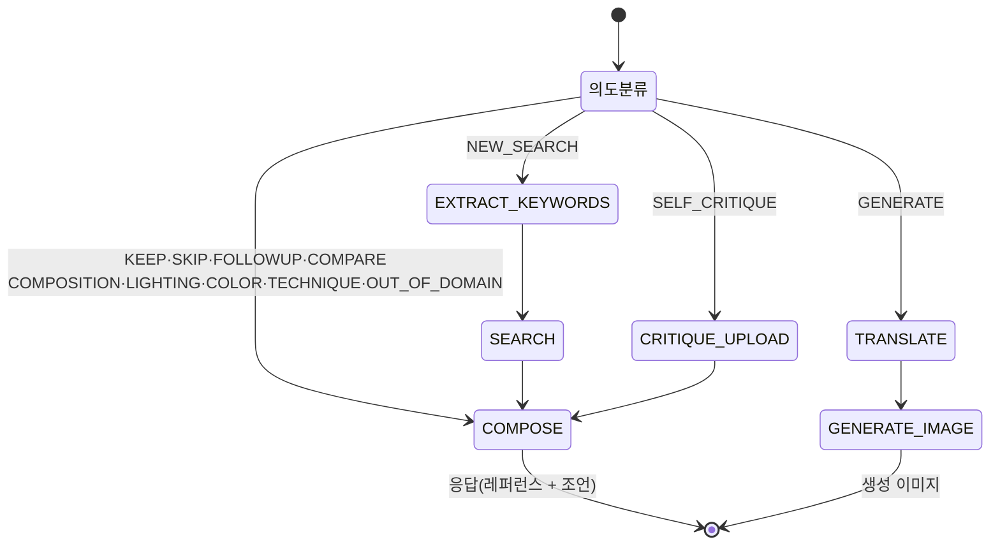
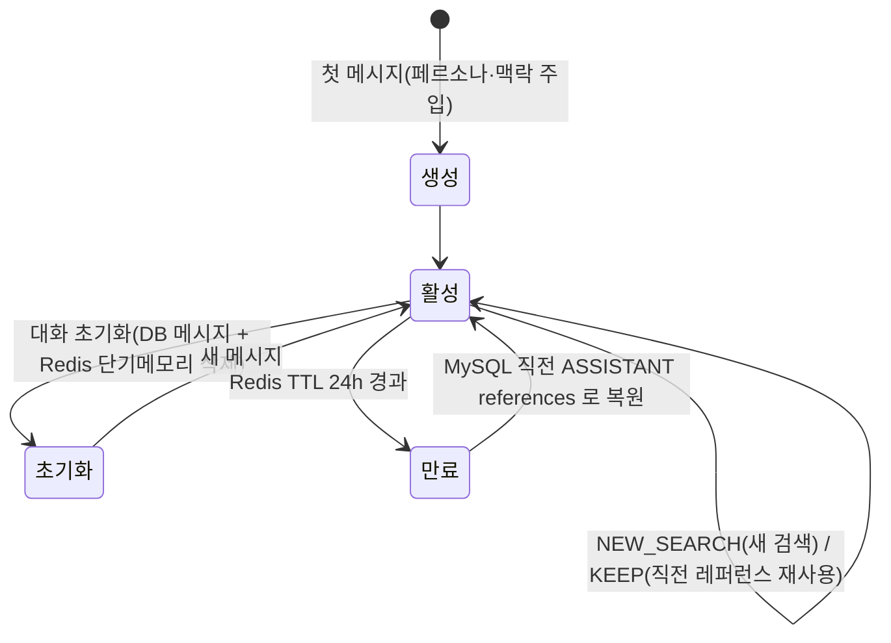
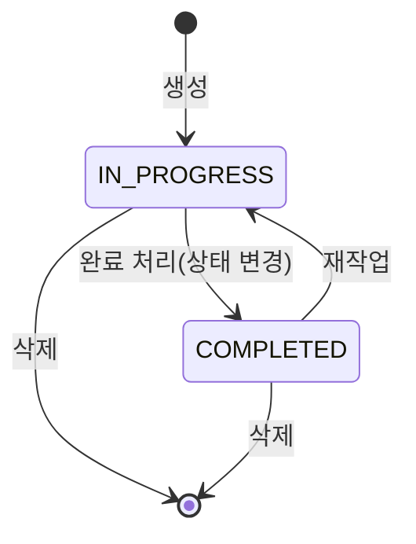

# 9. State Machine Diagram

## 9.1 워크플로 라우팅 (의도 → Step)
의도(`IntentCode`)에 따라 실행 단계(`StepType`) 경로가 결정된다. (live 경로 `IntentRouting.ROUTING` 기준)

| 의도 | Step 경로 |
|---|---|
| NEW_SEARCH | EXTRACT_KEYWORDS → SEARCH → COMPOSE |
| KEEP·SKIP·FOLLOWUP·COMPARE·COMPOSITION·LIGHTING·COLOR·TECHNIQUE·OUT_OF_DOMAIN | COMPOSE |
| SELF_CRITIQUE | CRITIQUE_UPLOAD → COMPOSE |
| GENERATE | TRANSLATE → GENERATE_IMAGE |

> live 의도는 **COMPOSE로 끝나는 것만 허용**(부팅 검증) → GENERATE는 legacy 전용.

## 9.2 대화 세션 (멀티턴)

- **단기메모리**(Redis)는 KEEP 멀티턴의 진입점. cache miss 시 MySQL로 복원.
- **초기화**는 DB·Redis를 모두 비워야 이전 맥락이 완전히 사라진다.

## 9.3 프로젝트 상태

- `ProjectStatus` = `IN_PROGRESS` · `COMPLETED`. 수정 API로 상태 전환, 삭제 시 연관 데이터(세션·메시지·레퍼런스·로그) 정리.