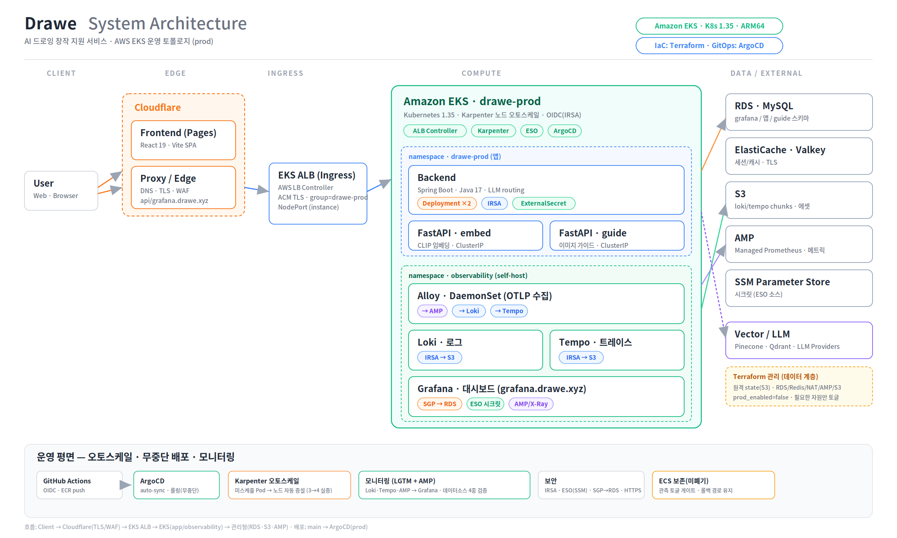

# 2. System Architecture

> **ROUND 2 기준 — EKS(Kubernetes) · GitOps 아키텍처.** dev 환경 ECS→EKS 마이그레이션 완료(검증됨), prod 동일 패턴 적용. 리전 `ap-northeast-2`, EKS `drawe-dev`(K8s 1.33, arm64).



> 정식 EKS 아키텍처 다이어그램(인프라 팀 제공, `drawe-prod`). 아래는 구성요소·통신·배포·운영 설명.

## 2.1 구성요소

| 영역 | 구성요소 | 책임 |
|---|---|---|
| **Client / Edge** | Frontend(Cloudflare Pages), Cloudflare DNS, ALB(group `drawe-dev`) | UI 서빙, HTTPS(ACM)·ssl-redirect, L7 라우팅(idle_timeout 180s) |
| **Compute**<br/>(EKS on EC2, Graviton arm64) | **Backend**(Spring Boot `:8080`) | 도메인 로직·AI 파이프라인 오케스트레이션·인증. HPA 2–6, replicas 2(세션 HA), PDB minAvailable 1 |
| | **fastapi-embed** `:8000` | CLIP 텍스트/이미지 임베딩. HPA 1–3 |
| | **fastapi-guide** `:8000` | 업로드 그림 비전 진단·코칭(growth). HPA 1–3 |
| | observability(Alloy/OTEL DaemonSet) | OTEL 수집 → Grafana Cloud |
| | Karpenter 노드(arm64) | 노드 오토스케일, consolidation 1m, Spot |
| **Data Stores** | **MySQL RDS** | 메인 메타(이미지·프로젝트·세션·메시지·로그) `publicly_accessible=false`·암호화 |
| | **drawe_guide RDS** | 가이드 서비스 전용 DB |
| | Valkey(EC2) / prod ElastiCache | Spring Session + 단기메모리·캐시 |
| | S3 `bria`(백엔드 이미지) / S3 `artref`(가이드 레퍼런스) | Block Public Access, IRSA로 개별 접근 |
| | SSM Parameter Store | 시크릿 단일 출처 |
| **Platform (GitOps)** | ArgoCD · External Secrets(ESO) · AWS LB Controller · Karpenter | `eks/dev/3-platform`(Terraform)에서 설치 |
| **External** | **Pinecone**(채팅 추천 벡터) · **Qdrant Cloud**(가이드 벡터) · LLM(Grok·Claude·Gemini) · Bedrock(Stability) · Google OAuth | 외부 HTTPS, Resilience4j로 격리 |

## 2.2 요청 흐름

1. **프론트**: 사용자 → Cloudflare Pages(정적 SPA).
2. **API**: 사용자 → `api-dev.drawe.xyz`(CF DNS) → ALB(HTTPS·ACM) → EKS `backend`/`fastapi-guide`.
3. **인증**: Google OAuth → 세션은 **Spring Session(Valkey)** 에 저장(파드 인메모리 X → 멀티 replica HA).
4. **이미지/AI**: backend →(IRSA) S3 `bria`, fastapi-guide →(IRSA) S3 `artref`. presigned URL은 프론트가 인증헤더 없이 직접 로드.
5. **시크릿**: SSM → External Secrets → K8s Secret → 파드 env.

## 2.3 배포 (CI/CD · GitOps)

```text
push(develop) → GitHub Actions
  ├─ build arm64 (buildx) → push ECR :SHA, :latest
  └─ overlay newTag := SHA → commit[skip ci] → push(develop)
                                 ↓
                  ArgoCD(=develop 추적)가 매니페스트 변경 감지 → 자동 롤아웃
```
- dev(`develop`) = **EKS GitOps**, prod(`main`) = 동일 패턴(Required reviewers 게이트).
- **IaC**: Terraform 레이어링 — `terraform-dev`(VPC·RDS·Valkey·S3·SSM·ECR·NAT·Cloudflare) → `eks/dev/2-cluster`(EKS·OIDC·addons) → `eks/dev/3-platform`(ALB-Ctrl·ArgoCD·ESO·Karpenter·IRSA). K8s 매니페스트(base+overlays)는 ArgoCD가 배포.

## 2.4 오토스케일 · 무중단

- **2단 오토스케일**: HPA(backend 2–6, fastapi 1–3 / CPU 70%) + **Karpenter** 노드 오토스케일(부하 시 수십 초 내 확보, 유휴 시 1분 내 consolidation, Spot interruption SQS 처리).
- **무중단 배포**: 롤링 업데이트 + **PDB(minAvailable 1)** + readiness 게이트 → 배포 중 가용 파드 ≥1.
- **긴 가이드 요청**: ALB `idle_timeout` 60→**180s** 로 504 제거.

## 2.5 prod 차이 (실서비스 전)

| 항목 | dev | prod |
|---|---|---|
| 세션/캐시 | Valkey EC2 | **ElastiCache(Redis)** — 상시가용·HA |
| Cloudflare | proxied=false(디버깅) | **proxied=true**(orange, Full Strict) |
| CD OIDC trust | dev role | **`refs/heads/main`** + Required reviewers |
| 가용성 | 최소 replica | multi-AZ · replica 상향 |

## 2.6 제어 / 운영 (Control Plane)

- **Secrets**: SSM Parameter Store → External Secrets → K8s Secret(키리스, git 미보관).
- **권한**: **IRSA**(OIDC) — backend→`bria`·guide→`artref` 개별 스코프(정적 키 제거).
- **Observability**: alloy-daemon(DaemonSet) → **Grafana Cloud**, OTEL 메트릭·트레이스·로그(외부 전송 전 PII redaction).
- **보안 요약**: HTTPS(ACM·ssl-redirect 443), RDS private·암호화, S3 Block Public Access, SSH(22) 차단(SSM Session Manager). 상세·증빙은 [implementationRequirements](./implementationRequirements.md).
