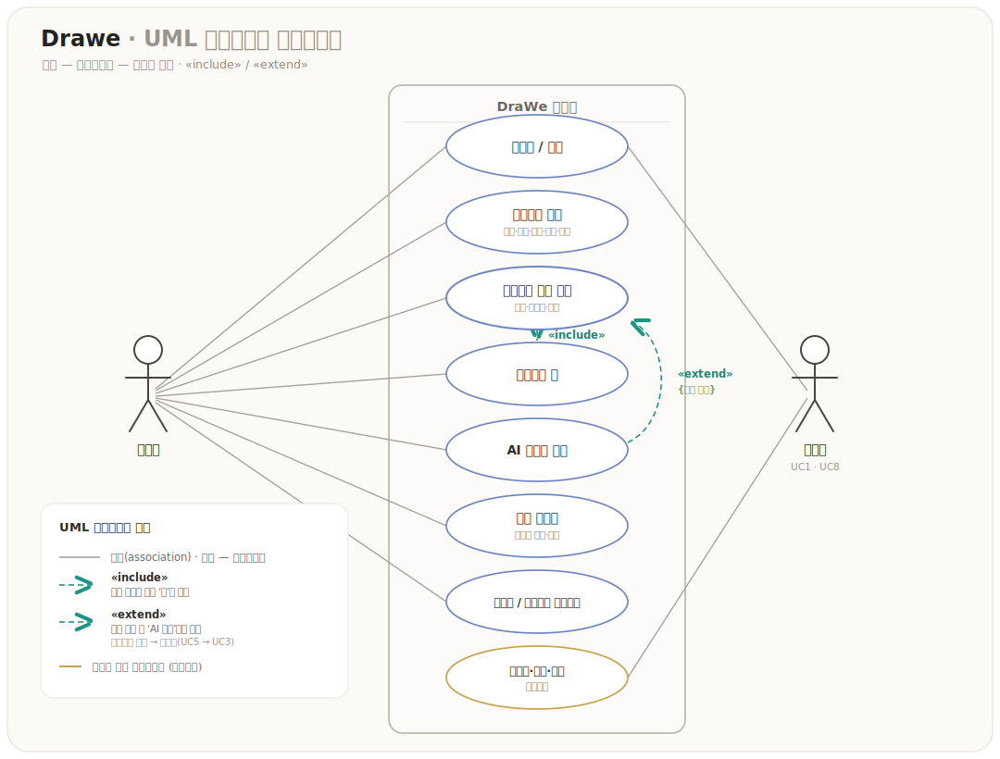

# 3. Use Case Analysis

## 3.1 액터
| 액터 | 설명 |
|---|---|
| **사용자(User)** | 그림을 그리려는 일반 사용자. 로그인·프로젝트·채팅·가이드·갤러리 이용. |
| **관리자(Admin)** | 대시보드로 사용량·비용·검색 품질 모니터링. |
| **AI 파이프라인(System)** | 의도 분류·검색·합성·비전 진단을 수행하는 내부 액터. 가이드는 코칭 에이전트 파이프라인(관찰→진단→결정→검색→코칭→피드백)이며, 의도 분류는 채팅 경로 한정. |
| **외부 서비스** | LLM(코칭=Grok · VLM 관찰(옵트인)=prod Bedrock Claude Haiku 4.5 / dev Gemini `VLM_BACKEND=aistudio` · 이미지=Bedrock Stability), Pinecone, Qdrant, Bedrock(Stability), Google OAuth, SMTP, fastapi(embed·guide). 관찰 1차는 ViTPose(fastapi-guide). |

## 3.2 유스케이스 목록

| 그룹 | 유스케이스 |
|---|---|
| **인증** | 이메일 회원가입(이메일 인증), 이메일 로그인, Google OAuth 로그인, 토큰 갱신(rotation), 로그아웃 |
| **프로젝트** | 프로젝트 생성, 목록 조회(정렬·검색·상태필터), 상세, 수정, 삭제 |
| **레퍼런스 추천(채팅)** | 레퍼런스 검색 요청, 멀티턴 이어묻기(KEEP), 비교(COMPARE), 후속질문(FOLLOWUP), 대화 초기화 |
| **핀** | 레퍼런스 핀 추가/해제, "고정 N번" 지칭 |
| **이미지 생성** | 검색 결과 없을 때 AI 이미지 생성(Bedrock Stability) |
| **가이드** | 그림 업로드 → 진단·코칭, 자기비평(채팅 내 이미지), 가이드/레퍼런스 피드백 |
| **이미지** | 이미지 업로드, 좋아요/싫어요 피드백 |
| **갤러리** | 완성작 갤러리 조회, 레퍼런스 아카이브 조회 |
| **관리** | 사용량·비용·검색품질 대시보드 |

## 3.3 핵심 유스케이스 — 레퍼런스 추천
- **주체**: 사용자
- **흐름(요약)**: 그림 주제를 채팅으로 입력 → 시스템이 의도 분류·키워드 추출·검색·합성 → 레퍼런스 `[N]` + 미술 조언 반환 → 사용자가 마음에 드는 이미지를 핀.
- **대안 흐름**: 적합한 결과가 없으면(점수 가드) → "AI 이미지로 생성해드릴까요?" 제안.
- (상세 흐름: [sequenceDiagram](./sequenceDiagram.md))

## 3.4 유스케이스 다이어그램

UML 표기(액터 — 유스케이스 — 시스템 경계, `«include»`/`«extend»`).

- **«include»**: 레퍼런스 추천 중 마음에 드는 이미지를 핀.
- **«extend»**: 적합한 검색 결과가 없을 때(점수 가드) AI 이미지 생성으로 확장(UC3 → UC5).