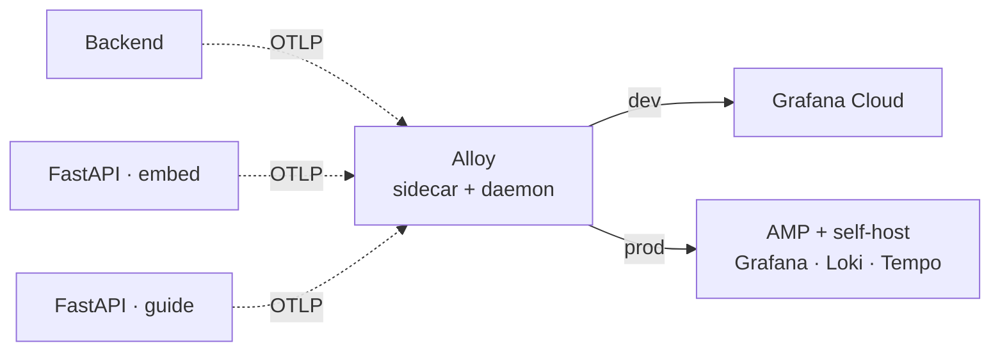

# infra — 배포 인프라

Drawe 서비스의 AWS 인프라를 Terraform 으로 관리합니다. 모노레포 `infra/` 디렉터리에 위치합니다.

> 현재 인프라 구조를 지속적으로 개선 중이며, 구성과 비용 전략은 프로젝트 진행에 따라 변경될 수 있습니다.

dev / prod 환경을 별도 AWS 계정으로 운영하며, ECS EC2 (Graviton ARM) 기반으로 애플리케이션(backend · fastapi·embed · fastapi·guide)과 observability 스택을 구성합니다.

## 핵심 설계

* dev / prod 별도 AWS 계정 운영
* ECS EC2 + Graviton (`t4g.*`) 기반 비용 최적화
* Terraform 기반 IaC 관리
* Alloy 기반 OpenTelemetry 수집 (DAEMON + sidecar 구조)
* Cloudflare + ALB 기반 HTTPS 구성 (가이드 서비스는 내부 Service Connect, ALB 미경유)
* dev 환경은 EventBridge 스케줄 기반 자동 on/off 로 비용 절감
* prod 환경은 `prod_enabled` 토글 + 수동 셧다운/재가동 사이클로 비활성 시간 절감

## 디렉토리 구조

```text
infra/
├── terraform-dev/                    # dev 환경 Terraform
│   ├── ecs.tf / ecs-guide.tf         # backend·fastapi(embed) / fastapi·guide ECS
│   ├── ssm.tf / ssm-qdrant.tf / ssm-artref-fastapi.tf   # 시크릿 파라미터(공통 / Qdrant / 가이드 DB·LLM)
│   └── alb · rds · valkey · vpc · iam-github(OIDC) · eventbridge · cloudwatch …
├── terraform-prod/                   # prod 환경 Terraform
├── configs/                          # Alloy / Grafana / Loki / Tempo config
├── scripts/                          # 운영 보조 스크립트 (seed-local.sh, upload-alloy-config.sh)
├── runbooks/                         # 운영 절차 — phase3_dev_store_backfill.md (가이드 스토어 백필)
├── local-init/                       # 로컬 artref(가이드 소스) DB 초기화 (00-init-artref.sh · artref-schema.sql)
├── docker-compose.local.yml          # 로컬 백엔드 스택 (MySQL · Valkey · backend · fastapi · guide)
├── docker-compose.observability.yml  # overlay — 로컬 LGTM 관측 스택
└── docker-compose.ga4.yml            # overlay — GA4 credentials
```

## 환경 비교

| 항목     | dev                        | prod                               |
| ------ | -------------------------- | ---------------------------------- |
| AWS 계정 | 분리 운영                      | 분리 운영                              |
| 운영 시간  | 평일 13:00~18:00 KST (EventBridge 자동) | 24/7 (수동 토글 가능)            |
| NAT    | NAT instance (`t4g.micro`) | fck-nat Multi-AZ (ASG)             |
| Redis  | EC2 Valkey                 | ElastiCache                        |
| 관측     | Grafana Cloud              | AMP + self-host Grafana/Loki/Tempo |
| 알람     | Discord webhook (SNS → Lambda)     | 동일                       |
| 컴퓨트    | ECS EC2 · Graviton (`t4g.*`, ARM64) | 동일                       |
| 벡터 저장소 | Pinecone(챗) · Qdrant Cloud(가이드) | 동일                        |

## 🧭 왜 이렇게 구성했나 (설계 의도)

> 아래는 현재 구성의 **의도·트레이드오프**를 정리한 것입니다. 일부는 일반적인 근거에 기반하므로, 실제 팀 결정과 다른 부분은 바로잡아 주세요.

### 공통 선택

| 결정 | 이유 |
| --- | --- |
| **ECS on EC2 (not Fargate)** | 상시 워크로드의 컴퓨트 단가 통제 — 예약/스팟 여지가 있는 EC2 가 Fargate 대비 저렴. 인스턴스 레벨 제어도 확보 |
| **Graviton / ARM64 (`t4g.*`)** | 동급 x86 대비 가격·전력 효율 우위. 버스터블(`t4g`)이라 변동·저부하 트래픽에 적합 |
| **가이드 서비스 = 내부 Service Connect** | 가이드 API 는 backend 만 호출 → ALB/공인 엔드포인트 불필요. `fastapi-guide.drawe-{env}.local:8000` 으로 내부 노출해 공격면·비용 축소 |
| **벡터 백엔드 분리 (Pinecone / Qdrant)** | 챗 레퍼런스와 가이드 코퍼스는 데이터·수명주기가 다름 → 분리. Qdrant 는 무료 클러스터 keep-alive(`qdrant-keepalive` 워크플로)로 유지 |
| **Terraform (IaC)** | 환경 재현성·코드 리뷰·drift 관리. dev/prod 를 같은 방식으로 일관되게 구성 |
| **Cloudflare + ALB** | 역할 분리 — Cloudflare 가 DNS·CDN·DDoS·edge TLS, ALB 가 ECS 타깃 L7 라우팅을 담당 |
| **SSM Parameter Store (SecureString)** | Secrets Manager 대비 비용 절감(표준 파라미터 무료). 시크릿 규모가 크지 않아 충분 |
| **`task_definition` `ignore_changes` + 수동 force deploy** | **배포 주체는 CD 파이프라인**(GitHub Actions). Terraform 이 TD 까지 관리하면 매 배포마다 drift·충돌이 나므로, TD 변경은 무시하고 이미지 갱신은 CD 가 force deployment 로 처리 |
| **ECS Exec 활성화** | SSH/베스천 없이 실행 중 컨테이너에 진입해 디버깅 |
| **Alloy config gzip + base64** | 파라미터/환경변수로 config 를 컴팩트하게 주입 (크기 제약 회피) |

### dev / prod 를 다르게 둔 이유

[환경 비교](#환경-비교) 표의 차이는 대부분 **dev = 비용 최소화 / prod = 가용성·운영 안정성** 라는 트레이드오프에서 나옵니다.

| 항목 | dev 가 다른 이유 (트레이드오프) |
| --- | --- |
| **AWS 계정 분리** | blast radius·IAM 권한·청구를 환경별로 격리. 실수로 prod 를 건드릴 위험 차단 |
| **NAT** | dev 는 NAT instance(`t4g.micro`)로 최저 비용. prod 는 fck-nat Multi-AZ(ASG)로 HA·자동 복구 확보 (비용 ↔ 가용성) |
| **Redis** | dev 는 EC2 Valkey 자체 운영으로 저렴. prod 는 ElastiCache 로 관리형 HA·백업·운영 부담 절감 |
| **관측성** | dev 는 Grafana Cloud 로 무운영(프리 티어로 충분). prod 는 AMP + self-host 로 대규모 시 SaaS 단가 통제·데이터 소유권 확보 |

## 트래픽 흐름

```text
User → Cloudflare → ALB → ECS
                          ├── Backend (+ alloy sidecar)
                          │     ├── FastAPI · embed  (Service Connect, 내부)
                          │     └── FastAPI · guide   (Service Connect, 내부)
                          └── alloy-daemon (DAEMON, host당 1)

FastAPI · guide → Qdrant Cloud(가이드 ref) · RDS drawe_guide(성장/로그) · S3(참고 이미지/에셋)
```

가이드 서비스는 **ALB 를 거치지 않고** backend 가 내부 DNS(`fastapi-guide.drawe-{env}.local:8000`)로 호출합니다. dev / prod 는 동일 구조이며 observability destination 만 다릅니다.

## 로컬 스택

전체 백엔드 스택(MySQL · Valkey · backend · fastapi·embed · fastapi·guide)을 docker-compose 로 띄웁니다.

```bash
docker compose -f docker-compose.local.yml up -d
```

| 포트 | 서비스 |
| --- | --- |
| 3306 | MySQL |
| 6379 | Valkey |
| 8080 | Backend (Spring Boot) |
| 8000 | FastAPI · embed |
| 8001 | FastAPI · guide (이미지 가이드) |

> 가이드 서비스는 자체 DB(`drawe_guide`)·Qdrant·S3 가 필요합니다. 로컬에서 가이드 소스(artref) 코퍼스를 다룰 때는 `local-init/` 의 초기화 스크립트를, dev 스토어로 적재할 때는 [`runbooks/dev_store_backfill.md`](runbooks/dev_store_backfill.md) 를 참고하세요.

### 로컬 관측 스택 (선택)

```bash
docker compose -f docker-compose.local.yml -f docker-compose.observability.yml up -d
```

| 포트 | 서비스 |
| --- | --- |
| 3000 | Grafana UI (anonymous Admin) |
| 4317 | OTLP gRPC (otel-lgtm) |
| 4318 | OTLP HTTP (otel-lgtm) |

`grafana/otel-lgtm` 단일 이미지로 Loki/Tempo/Prometheus/Grafana 일괄 제공.
앱은 컴포즈 환경변수로 OTLP endpoint 가 자동 주입.

### 로컬 데이터 시드 (선택)

1. 공유 스토리지에서 `reference_data.sql` 을 받아 `infra/` 에 둡니다.
   (18MB 라 git 에는 없습니다 — PII 없는 images/image_drawe_tags 만 포함)
2. 스택을 띄운 뒤 시드 스크립트 실행:
   ```bash
   bash scripts/seed-local.sh
   ```

스키마는 백엔드 Flyway 가 만들고, 이 스크립트가 reference 데이터 + 온보딩 시드를 적재합니다. onboarding 이 12 면 정상.

## 배포 (Terraform)

### Prerequisites

* Terraform >= 1.5
* AWS CLI v2
* AWS 인증 설정 (`aws configure`, SSO, IAM Identity Center 등)
* Cloudflare API Token 필요

### dev / prod

dev 는 `terraform-dev/`, prod 는 `terraform-prod/` 에서 동일한 절차로 실행합니다.

```bash
cd terraform-dev          # 또는 terraform-prod

cp terraform.tfvars.example terraform.tfvars
export CLOUDFLARE_API_TOKEN="<token>"

terraform init
terraform plan -out tfplan
terraform apply tfplan
```

### apply 후 1회 — 시크릿 placeholder 실값 주입

Terraform 으로 SSM SecureString 을 만들 때 placeholder (`CHANGE_ME_*`) 가 박혀 있고 `lifecycle.ignore_changes = [value]` 라 state 에 평문이 안 들어갑니다. apply 직후 한 번 실값을 주입합니다.

```bash
# 어드민 비밀번호 (Spring Boot 어드민 콘솔)
aws ssm put-parameter --name "/drawe/<env>/admin-password" \
  --value "$(openssl rand -base64 24)" \
  --type SecureString --overwrite

# Grafana 어드민 비밀번호 (self-host prod 만)
aws ssm put-parameter --name "/drawe/prod/grafana-admin-password" \
  --value "$(openssl rand -base64 24)" \
  --type SecureString --overwrite

# Discord 웹훅 URL (dev / prod 각각)
aws ssm put-parameter --name "/drawe/<env>/discord-webhook-url" \
  --value "https://discord.com/api/webhooks/..." \
  --type SecureString --overwrite

# 해당 서비스 force-new-deployment 로 새 secret 반영
aws ecs update-service --cluster drawe-<env>-cluster \
  --service drawe-<env>-backend --force-new-deployment
```

#### 가이드 서비스 시크릿 (fastapi·guide)

가이드 task 는 다음 SSM 파라미터를 `valueFrom` 으로 주입받습니다. 모두 placeholder 로 생성되므로 apply 후 실값을 1회 주입합니다(주입 후 새 task 가 기동 시 자동 반영).

| 컨테이너 env | SSM 파라미터 | 타입 | 값 |
| --- | --- | --- | --- |
| `DB_DSN` | `/drawe/<env>/artref-db-dsn` | SecureString | `mysql+pymysql://drawe_guide:***@<rds>:3306/drawe_guide` |
| `QDRANT_URL` | `/drawe/<env>/qdrant-url` | String | `https://<cluster>.qdrant.io:6333` (포트 명시, 끝 슬래시 없음) |
| `QDRANT_API_KEY` | `/drawe/<env>/qdrant-api-key` | SecureString | Qdrant Cloud 키 |
| `XAI_API_KEY` | `/drawe/<env>/grok-api-key` | SecureString | Grok(코칭 LLM) 키 |
| `GEMINI_API_KEY` | `/drawe/<env>/gemini-api-key` | SecureString | Gemini(손 VLM) 키 |

```bash
# 예시 — Qdrant URL (포트 6333 명시, 끝 슬래시 없음)
aws ssm put-parameter --name "/drawe/dev/qdrant-url" \
  --value "https://<cluster>.qdrant.io:6333" --type String --overwrite
```

> **Qdrant keepalive (GitHub Actions)** — `qdrant-keepalive` 워크플로는 SSM 이 아니라 **레포 시크릿** `QDRANT_URL` · `QDRANT_API_KEY` 를 사용합니다(무료 클러스터 비활성 방지 핑). 값은 위 SSM 과 동일합니다.

#### 가이드 스키마 · 스토어 백필

- `drawe_guide` 스키마는 가이드 서비스의 마이그레이션 러너가 적용합니다(`GUIDE_AUTO_MIGRATE=1` 또는 `python -m guide.stores.migrate`).
- dev 코퍼스(레퍼런스 행 + S3 에셋) 적재 절차는 [`runbooks/phase3_dev_store_backfill.md`](runbooks/phase3_dev_store_backfill.md) 참고(Qdrant 차원 768 게이트 → S3 복사 → RDS 적재 → 검증).

## 📡 관측성 (Observability)

OpenTelemetry 기반으로 trace · log · metric 을 수집합니다. **Alloy**(daemon + sidecar)가 앱의 OTLP(4317/4318)를 받아 환경별 destination 으로 전달합니다(dev → Grafana Cloud / prod → AMP + self-host).



**✅ 완료 — 인프라 + 앱 계측 + 알람**
- Alloy 수집 파이프라인 (daemon + sidecar 구조, OTLP 수신)
- 환경별 destination 분리 (dev → Grafana Cloud / prod → AMP + self-host)
- 외부 전송 전 **PII redaction** 규칙 (이메일·토큰·LLM 프롬프트 본문 등 삭제/해싱, user.id 는 1회 해시·session.id 는 opaque, 수집기 재해시 없음)
- prod self-host 스택 배포 (Loki / Tempo / Grafana + AMP) 및 종단 검증
- Grafana → AMP SigV4 query 인증 (`GF_AUTH_SIGV4_AUTH_ENABLED`)
- Daemon Alloy 의 컨테이너 stdout → Loki 수집 (`service_name=drawe/infra-daemon`)
- Spring Boot 자동 계측 (OTel Java Agent + JSON 로그 + Micrometer 커스텀 카운터)
- FastAPI(embed·guide) 자동 계측 (opentelemetry-distro + opentelemetry-instrument)
- 로컬 관측성 스택 (otel-lgtm 단일 이미지) 배선
- SNS → Lambda → Discord 알람 (4xx/5xx/RDS CPU/스토리지/NAT/ALB unhealthy target 등)

**🚧 진행 중 — 운영 폴리시**
- RED 대시보드 (Rate · Errors · Duration) — Alloy spanmetrics connector 기반
- admin 대시보드 ↔ Grafana/Loki 딥링크 (session_id/trace_id)
- Sidecar config 의 backend/fastapi 분리 (현재 공유 — actuator scrape 자리 정리)
- §C 자동 발화 부하 테스트 검증 (현재 자연 트래픽 0 으로 4xx 알람 임계치 미달)

**📋 계획 — EKS 이관**
- ECS → EKS dev cluster 시작 (Helm chart 기반)
- kube-prometheus-stack + grafana-loki + grafana-tempo

### 어드민 대시보드

내부 운영자용 Thymeleaf 대시보드 (인메모리 계정 1개).

```
URL:        https://api.drawe.xyz/admin/login   (prod)
            https://api-dev.drawe.xyz/admin/login (dev)
Username:   admin
Password:   SSM /drawe/<env>/admin-password
```

비밀번호 조회 / 재설정:
```bash
# 조회
aws ssm get-parameter --name "/drawe/prod/admin-password" \
  --with-decryption --query 'Parameter.Value' --output text

# 재설정
aws ssm put-parameter --name "/drawe/prod/admin-password" \
  --value "$(openssl rand -base64 24)" \
  --type SecureString --overwrite
aws ecs update-service --cluster drawe-prod-cluster \
  --service drawe-prod-backend --force-new-deployment
```

## 참고 사항

* ECS EC2 인스턴스는 ARM64 (`t4g.*`) 기반으로 운영
* 컨테이너 이미지도 ARM64 호환 빌드 필요 (`docker buildx --platform linux/arm64`) — 가이드 이미지(`Dockerfile.guide`)는 torch/open_clip/mediapipe 포함으로 빌드가 무겁습니다
* 주요 시크릿은 AWS SSM Parameter Store (SecureString) 로 관리, `lifecycle.ignore_changes = [value]` 로 평문이 state 에 들어가지 않음
* Alloy config 는 gzip + base64 로 압축 저장 (`scripts/upload-alloy-config.sh` 또는 terraform `base64gzip` 자동)
* ECS Exec 활성화 상태로 운영 (`aws ecs execute-command` 로 진입)
* ECS service 의 `task_definition` 은 `ignore_changes` 처리되어 있어 수동 force deployment 방식 사용
* 환경변수 (task def 내 직접 박힌 값) 변경 시 `aws ecs update-service --task-definition <family> --force-new-deployment` 로 latest revision 명시 필요

## 관련 문서

- [루트 README](../README.md) — 전체 아키텍처·CI/CD
- [`backend/README.md`](../backend/README.md) · [`fastapi/README.md`](../fastapi/README.md) · [`frontend/README.md`](../frontend/README.md)