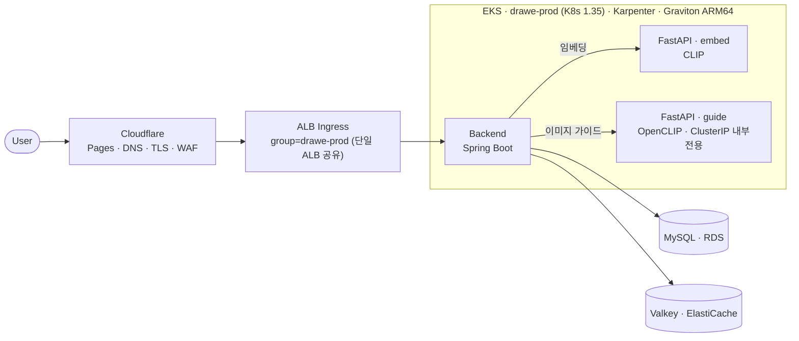
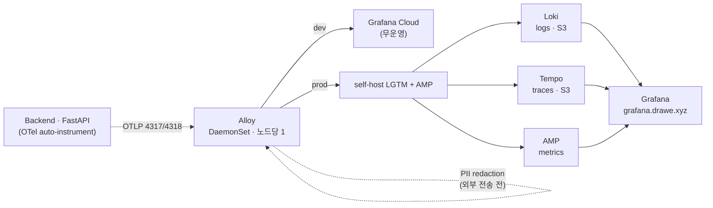
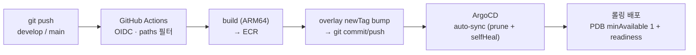

# infra — DraWe 배포 인프라

> **기존 ECS(EC2) 운영 환경을 EKS + ArgoCD GitOps로 마이그레이션** — 관측성을 유지한 채 무중단 배포·자동 스케일·비용 최적화 운영 모델로 전환한 인프라 레이어.

```
ECS(EC2) 운영  →  EKS 마이그레이션  →  관측성 유지(LGTM)  →  GitOps 도입(ArgoCD)
```

**스택**

```
EKS · Karpenter · Graviton ARM64 · spot   |   ArgoCD GitOps · GitHub OIDC · IRSA
Terraform(S3 remote state) · dev/prod 계정 분리  |   Alloy/OTel · Loki·Tempo·AMP · PII redaction
```

**한눈에 (검증 가능한 사실)**

| | |
| --- | --- |
| 운영 환경 | **dev / prod 별도 AWS 계정** — blast radius·IAM·청구 격리 |
| 컴퓨트 | EKS · **Graviton ARM64** · Karpenter(on-demand+spot 혼용, 다종 인스턴스 빈패킹) |
| 배포 | **서비스별 독립 배포** — 경로 필터 CI → overlay bump → ArgoCD GitOps |
| 관측성 | OTel 3종 신호(log·trace·metric) → **Loki·Tempo·AMP**, Alloy DaemonSet + PII redaction |
| 운영 | ECS→EKS 마이그레이션 · 재우기/깨우기 런북(재기동 ~1h) · 비용 최적화 모델 |

> 강조 순서: **관측성 → 자동화 → 운영 → 설계 결정**.

---

## 🗺 시스템 아키텍처



> 가이드 서비스는 backend만 호출하므로 **ClusterIP 내부 전용**(ALB·공인 엔드포인트 미경유) — 공격면·비용 축소.

---

## 🔄 ECS → EKS 마이그레이션 (이 프로젝트의 가장 큰 인프라 작업)

초기엔 **ECS(EC2 ASG + 서비스 오토스케일)** 로 운영하다가, 노드 스케일 반응성·인스턴스 동적 선택(비용)·무중단 배포·운영모델 통일을 위해 **EKS로 전환**했습니다. 단순 재배포가 아니라 **관측성·시크릿·트래픽을 유지한 채** 점진 전환한 게 핵심입니다.

| | Before (ECS) | After (EKS) |
| --- | --- | --- |
| 오토스케일 | 서비스 오토스케일 + EC2 ASG | **Karpenter(노드) + HPA(파드)** 2계층, spot 빈패킹 |
| 배포 | CI가 task def 갱신 → rolling | **ArgoCD GitOps**(git=상태, auto-sync, PDB+readiness) |
| 시크릿/권한 | task role + SSM | **IRSA(파드 단위) + ESO**(런타임 주입) |
| 관측성 | 그대로 **유지** → EKS에서도 동일 LGTM 파이프라인 | Alloy DaemonSet으로 재배선, 신호·대시보드 보존 |

**전환 중 직접 해결한 EKS 고유 운영 이슈** (모두 `runbooks/`에 절차로 문서화 — 재현·복구 가능):

- **SecurityGroupPolicy ↔ branch ENI 부착 순서** — SGP(파드에 보안그룹을 SecurityGroupPolicy로 부여)는 기존 파드에 소급되지 않아, 신규 파드가 pod-eni(branch ENI)를 받지 못해 **RDS 연결 타임아웃 → CrashLoop**. 파드 재생성으로 ENI를 다시 부착해 해소.
- **DNS 컷오버(blue/green 식 전환)** — 신규 EKS 경로를 먼저 dark verify한 뒤, Terraform 토글(`eks_cutover`)로 트래픽을 ALB(EKS)로 전환. 문제 시 토글 원복으로 롤백.
- **GitOps overlay bump 경합** — 동시 CD 실행 시 `origin/develop` push race를 rebase 재시도로 안정화(작업트리 정리 + rebase 진행 여부 가드).

---

## 📡 관측성 (Observability)

OpenTelemetry로 **trace · log · metric**을 한 파이프라인에서 수집합니다. 앱은 자동 계측만 하고, 수집·라우팅·가공은 **Alloy(DaemonSet, 노드당 1)** 가 전담합니다.



| 신호 | 수집·저장 | 비고 |
| --- | --- | --- |
| **Logs** | Spring Boot JSON 로그 · Alloy stdout → **Loki (S3)** | `service_name` 라벨링 |
| **Traces** | OTel auto-instrument → **Tempo (S3)** | spanmetrics로 RED 파생 |
| **Metrics** | Micrometer 커스텀 카운터 → **AMP** | Grafana는 SigV4로 AMP query 인증 |

핵심 설계 포인트 (SRE 관점):

- **계측-전송 분리** — 앱은 OTLP만 내보내고 destination은 Alloy가 환경별로 라우팅(dev → Grafana Cloud / prod → AMP + self-host). 앱 코드 변경 없이 백엔드 전환 가능.
- **PII redaction(외부 전송 전)** — 이메일·토큰·LLM 프롬프트 본문 삭제/해싱, `user.id`는 1회 해시·`session.id`는 opaque 처리. 개인정보가 관측 스토어로 새지 않도록 수집 단계에서 차단.
- **self-host로 단가·소유권 통제** — prod는 트래픽 증가 시 SaaS 단가가 부담이라 LGTM 셀프호스트(로그·트레이스는 S3 백엔드)로 비용·데이터 소유권 확보. dev는 프리 티어 Grafana Cloud로 무운영.
- **알람** — 4xx/5xx · RDS CPU/스토리지 · NAT NetworkOut(LLM 비용 폭주 감지) · ALB unhealthy target 등을 **SNS → Lambda → Discord**로 통지.

> 진행 중: RED 대시보드(Rate·Errors·Duration, spanmetrics connector), admin 대시보드 ↔ Grafana/Loki 딥링크(session_id/trace_id).

---

## ⚙️ 자동화 (IaC · GitOps · CI/CD)

배포는 **CI(이미지 빌드) → GitOps(ArgoCD가 클러스터 상태 수렴)** 로 책임을 분리합니다. **CI는 클러스터에 직접 `kubectl apply` 하지 않습니다** — overlay 이미지 태그(`newTag`)만 git에 commit하고, 실제 적용은 ArgoCD가 git 상태로 수렴시킵니다(선언형·롤백 가능).



- **IaC (Terraform)** — EKS · Karpenter · ALB Ingress · IRSA · RDS · Cloudflare를 코드로 관리. state는 **S3 원격 백엔드**(`drawe-tfstate-<account>`)라 작업 디렉터리와 무관하게 동일 state 공유, dev/prod 일관 구성·drift 관리. `terraform-dev` / `terraform-prod`로 환경 분리.
- **GitOps (ArgoCD)** — `main` = prod 배포 상태의 단일 출처. git push → **auto-sync(prune+selfHeal)** 롤링 반영. 배포 이력·롤백이 git으로 추적됨.
- **CI/CD (GitHub Actions · 경로 필터)** — 모노레포에서 변경된 서비스만 빌드(`backend/**`·`fastapi/**` 등). **GitHub OIDC**로 AWS 자격증명 비저장 assume. overlay bump push는 동시 실행 경합(race)에 대비해 rebase 재시도로 안정화.
- **시크릿** — **ESO(External Secrets) + SSM SecureString**으로 런타임 주입. 시크릿을 매니페스트·레포에 두지 않음. 파드 권한은 **IRSA**로 최소화.

| 워크플로 | 트리거 경로 | 동작 |
| --- | --- | --- |
| `backend-cd` | `backend/**` | JAR → Docker(ARM64) → ECR → overlay bump → ArgoCD 롤아웃 |
| `fastapi-cd` | `fastapi/**` (embed) | 빌드 → ECR → overlay bump → ArgoCD |
| `fastapi-guide-cd` | `fastapi/guide/**` · `fastapi/assets/**` · `Dockerfile.guide` · `requirements.guide.txt` | guide 이미지 빌드 → ECR → ArgoCD |
| `qdrant-keepalive` | cron(3일) | Qdrant Cloud 무료 클러스터 keep-alive |

> `develop` → dev 동기화, `main` → prod 배포(Required reviewers 통과 후 ArgoCD sync).

---

## 🛠 운영 (장애대응 · 런북 · 비용)

- **무중단 보장** — ArgoCD 롤링 + **PDB(minAvailable 1)** + readiness probe로 배포 중 가용성 유지.
- **런북 기반 운영** — `runbooks/`에 반복 운영 절차를 문서화. 대표적으로 **prod 재우기/깨우기(teardown/wake)** 런북은 EKS destroy + 공유 인프라(NAT/Cache) off + RDS stop으로 **비활성 시간 비용을 시간당 ~0**으로 낮추고, 역순으로 **~1시간 내 복구**(데이터·state 보존). 가이드 스토어 백필 절차도 포함.
- **비용 최적화** — Graviton(ARM64) 가격·전력 효율 + **spot/on-demand 혼용** + 다종 인스턴스(m6g/m7g/c6g/c7g/r6g) 빈패킹으로 단가↓·spot 중단 분산. dev는 **스케줄 자동 on/off**, prod는 재우기/깨우기 런북으로 비활성 시간 비용을 시간당 ~0까지 절감. NAT NetworkOut 알람으로 LLM 비용 폭주도 조기 감지.
- **권한·격리** — dev/prod **AWS 계정 분리**로 blast radius·IAM·청구 격리. IRSA 파드 단위 최소권한.

### 💰 비용 모델 (서울 리전 공시가 기준)

비용 최적화 레버의 효과를 정량적으로 따져보기 위해 **AWS 공시 단가 기준 비용 모델**을 작성했습니다. 각 레버를 **요율(rate)** 과 **가동시간(hours)** 으로 분해하면 어디서 얼마가 절감되는지 분리해 볼 수 있습니다. 기준 노드 `m6g.large`(Seoul on-demand $0.094/h)·월 730h 가정.

| 레버 | 구분 | 효과 |
| --- | --- | --- |
| **Graviton(ARM64) vs x86** | 요율 | m6g $0.094 vs m6i $0.118 → **~20%↓** |
| **spot 50% 혼용** | 요율 | OD 100% 대비 **~25%↓** (100% spot 시 ~50%↓) |
| **dev 스케줄 on/off**(평일 주간만, ~260h) | 가동시간 | **~64%↓** |
| **prod 재우기**(야간 8h) | 가동시간 | **~33%↓** (야간+주말 시 ~64%↓) |

> **종합 예시 (모델 계산)** — prod 노드 1개를 *순진하게* x86·온디맨드·24/7로 두면 ≈ **$86/월**. 동일 워크로드를 **Graviton + spot 50% 혼용 + 야간 재우기**로 운영하면 ≈ **$34/월** → **이론상 약 60% 절감**(레버 곱연산). 실측 청구액이 아니라 공시 단가·가정 기반 산정이며, 실측치로 대체 권장.

<details>
<summary>단가·가정 (산출 근거)</summary>

- **단가** — AWS EC2 On-Demand, `ap-northeast-2`(Seoul), Linux 기준. us-east-1 앵커(m6g.large OD $0.077 / Spot $0.045)로 교차검증.
- **spot** — 시점·AZ별 변동. 보수적으로 **OD 대비 50%↓** 가정(실측 통상 40~70%↓). Karpenter는 가용성을 위해 OD를 일부 유지하므로 본문은 50% 혼용 기준.
- **가동시간** — 월 730h. dev 스케줄=평일 09–21시(~260h), prod 야간 재우기=16/24h 가동.
- 실제 청구액은 노드 수(Karpenter 동적)·트래픽·EBS/NAT/데이터전송에 따라 달라짐. 위는 **컴퓨트 레버 효과**를 보이는 모델이며, 실측치로 대체 권장.

</details>

---

## 🧭 설계 결정 (왜 이렇게 구성했나)

| 결정 | 이유 |
| --- | --- |
| **Karpenter + HPA (2계층)** | 파드는 HPA, 노드는 Karpenter. NodePool에 on-demand+spot·다종 인스턴스를 열어 비용↓·spot 중단 분산 |
| **Graviton / ARM64** | 동급 x86 대비 가격·전력 효율 우위. 이미지도 ARM64 빌드 |
| **ArgoCD GitOps** | `main` = 배포 상태. push → auto-sync 롤링. 이력·롤백을 git으로 추적 |
| **IRSA + ESO/SSM** | 노드 공유 권한 대신 파드별 최소권한, AWS 키 비저장. 시크릿은 런타임 주입 |
| **벡터 백엔드 분리(Pinecone/Qdrant)** | 챗 레퍼런스와 가이드 코퍼스는 데이터·수명주기가 달라 분리 |
| **가이드 = ClusterIP 내부전용** | backend만 호출 → 공인 엔드포인트 불필요, 공격면·비용 축소 |

---

## dev / prod 환경 비교

차이는 대부분 **dev = 비용 최소화 / prod = 가용성·운영 안정성** 트레이드오프에서 나옵니다.

| 항목 | dev | prod |
| --- | --- | --- |
| AWS 계정 | 분리 운영 | 분리 운영 |
| 컴퓨트 | EKS · Karpenter · Graviton ARM64 | 동일 |
| NAT | NAT instance (`t4g.micro`) | fck-nat Multi-AZ (ASG) |
| Redis | EC2 Valkey | ElastiCache |
| 관측성 | Grafana Cloud | AMP + self-host LGTM |
| 운영 시간 | 스케줄 자동 on/off | 24/7 (노드 스케일·런북으로 절감) |
| 벡터 저장소 | Pinecone(챗) · Qdrant Cloud(가이드) | 동일 |

---

## 📁 디렉토리 구조

```text
infra/
├── terraform-dev/   terraform-prod/   # 환경별 Terraform (네트워크·EKS·RDS·Cloudflare)
├── eks/                               # EKS 플랫폼 레이어 (Karpenter NodePool · ArgoCD · ESO · IRSA)
├── k8s/                               # kustomize base/ + overlays/(dev·prod) — ArgoCD 동기화 대상
├── configs/                          # Alloy · Grafana · Loki · Tempo config
├── runbooks/                         # 운영 절차 (재우기/깨우기 · 가이드 스토어 백필)
├── scripts/  local-init/             # 운영 보조 · 로컬 데이터 초기화
└── docker-compose.*.yml              # 로컬 스택 (backend · MySQL · Valkey · LGTM 관측 overlay)
```

---

<details>
<summary><b>로컬 실행 · 시크릿 주입 · 백필 (운영 상세)</b></summary>

### 로컬 스택

```bash
cd infra
docker compose -f docker-compose.local.yml up -d                 # backend · MySQL · Valkey · fastapi · guide
docker compose -f docker-compose.local.yml \
  -f docker-compose.observability.yml up -d                      # + 로컬 LGTM 관측 스택(선택)
```

### Terraform (dev/prod)

```bash
cd terraform-prod
terraform init && terraform plan -out tfplan && terraform apply tfplan
```
> state는 S3 원격 백엔드 공유. prod 자격증명 + Cloudflare API 토큰 필요.

### apply 후 1회 — 시크릿 placeholder 실값 주입 (ESO가 SSM에서 동기화)

```bash
aws ssm put-parameter --name "/drawe/prod/<key>" --value "<secret>" \
  --type SecureString --overwrite
# 반영: 해당 서비스 롤링 재시작 (ESO 동기화 후)
```

가이드 스키마·스토어 백필은 `runbooks/`의 백필 런북을 참고.

</details>

---

## 📚 관련 문서

- [`../README.md`](../README.md) — 모노레포 전체 그림
- [`../docs/SDS/`](../docs/SDS/README.md) — 시스템 설계 문서(아키텍처·AI 파이프라인·다이어그램)
- `runbooks/` — 운영 런북(재우기/깨우기 · 백필)